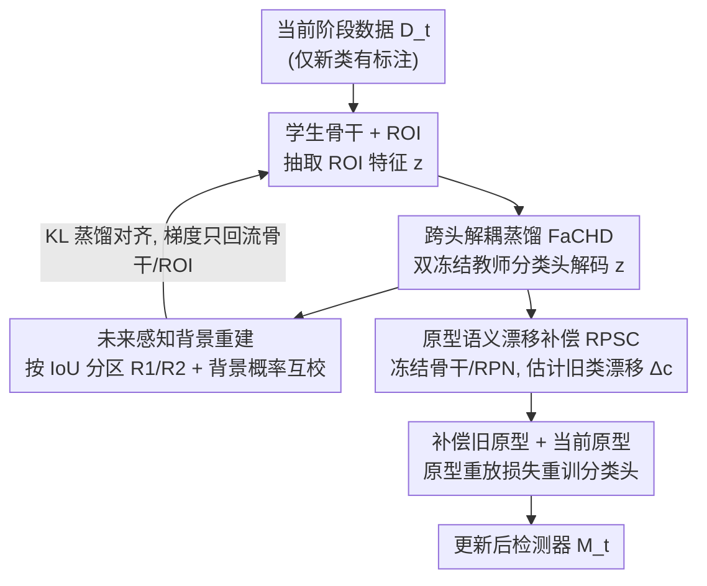

# Incremental Object Detection via Future-Aware Decoupled Cross-Head Distillation

**会议**: CVPR 2026  
**论文**: [CVF Open Access](https://openaccess.thecvf.com/content/CVPR2026/html/Yin_Incremental_Object_Detection_via_Future-Aware_Decoupled_Cross-Head_Distillation_CVPR_2026_paper.html)  
**代码**: 未公布  
**领域**: 目标检测 / 增量学习  
**关键词**: 增量目标检测, 知识蒸馏, 跨头解耦, 语义漂移补偿, 灾难性遗忘

## 一句话总结
针对增量目标检测中"检测头偏置污染骨干特征导致蒸馏失效"的问题，本文提出 FaCHD——用历史教师与中间教师两个冻结教师跨头解码学生 ROI 特征做特征蒸馏，把分类头从骨干解耦开，再配合 RPSC 多粒度原型语义漂移补偿重训分类头，在 VOC 与 COCO 两个增量基准上刷新了无样本回放方法的 SOTA。

## 研究背景与动机

**领域现状**：增量目标检测（IOD）要求检测器在不断引入新类别的同时保住旧类别能力，主流做法沿用类增量学习（CIL）的范式，分成基于正则/蒸馏与基于回放两条路，其中知识蒸馏（KD）是缓解灾难性遗忘的主力。

**现有痛点**：IOD 比纯分类增量更棘手，因为同一张训练图里多任务类别共存——旧任务的前景物体在当前阶段没有标注，容易被当成背景；当前阶段的背景里又可能藏着未来任务的物体，可能被误当成前景。这种前景-背景混淆放大了跨任务干扰。更关键的是，现有 KD 方法直接在输出 logits 上做蒸馏，会和学生模型 assigner 给出的真值目标冲突；同时它们把检测头和骨干**紧耦合**训练，使得检测头偏向新类的偏置被"印"进骨干特征里，反而加速了遗忘。

**核心矛盾**：检测头的梯度（受新类监督驱动）与蒸馏梯度（保旧类）在共享分类器上彼此竞争，让优化方向被新类带偏；而这个被污染的骨干又是蒸馏的载体，于是"蒸馏越用力、骨干越偏、蒸馏越没用"形成恶性循环。

**本文目标**：把骨干的几何表示塑形与检测头的决策边界重置这两件事解耦开，各自单独处理，从机制上切断检测头偏置回流骨干的路径。

**切入角度**：作者观察到——如果不让蒸馏梯度经过学生自己的检测头，而是让两个**冻结**教师的检测头去"解码"学生骨干输出的 ROI 特征，那么梯度就只能流经骨干和 ROI，骨干特征的几何一致性就不会被头偏置干扰。

**核心 idea**：用"双冻结教师跨头解码 + 未来感知背景重建"做特征蒸馏来稳住骨干，再用"多粒度原型语义漂移补偿"单独重训分类头，把稳定性（保旧）和可塑性（学新）分到两个互不污染的阶段。

## 方法详解

### 整体框架
方法基于两阶段 Faster R-CNN（ResNet-50 骨干、RPN、ROI 头）。第一阶段 **FaCHD** 做特征蒸馏正则化骨干：学生骨干产出的 ROI 特征被两个冻结教师（旧类专家教师 $M_{t-1}$ 和只用当前数据 $D_t$ 训出的中间教师 $M_t^{im}$）的分类头分别解码，产生跨头预测，再与教师侧重建后的"未来感知目标"对齐，从而把学生检测头从骨干解耦、让梯度只流经骨干和 ROI。第二阶段 **RPSC** 冻住骨干和 RPN，只在分类头层面动手：维护多粒度 ROI 原型库，估计旧类原型相对当前特征空间的语义漂移并补偿，再用补偿后的旧原型 + 当前原型重训分类头，重置决策边界。

### 关键设计

**1. 跨头解耦蒸馏 FaCHD：让蒸馏梯度绕开学生自己的检测头**

这一设计直接针对"检测头偏置印进骨干"这个根因。常规 KD 把蒸馏加在学生检测头的输出 logits 上，梯度自然要经过学生检测头，于是新类监督的偏置就被带进骨干。FaCHD 反其道而行：把学生骨干输出的 ROI 特征 $z$ **送进两个冻结教师的分类头**去解码，得到跨头预测 $p^{ch,t-1}=\text{softmax}(H_{t-1}(z))$ 和 $p^{ch,im}=\text{softmax}(H_t^{im}(z))$。由于教师头是冻结的，蒸馏的 KL 损失 $L_{FaCHD}=\frac{1}{|R|}\sum_{r\in R}\text{KL}(\bar p_r \| \bar p_r^{ch})$ 反传时，梯度只能流经骨干和 ROI 抽取器，无法经过学生检测头——这就实现了"头-骨干解耦"，保证骨干学到的是头无关、几何一致的稳定表示。其中蒸馏区域 $R$ 取旧教师 $M_{t-1}$ 的候选区域，把知识迁移集中到可靠的旧类区域上。双教师互补：$M_{t-1}$ 守旧类知识，$M_t^{im}$ 提供贴合新类学习的自适应监督。

**2. 未来感知的背景概率重建：化解"旧前景被当背景、未来前景被当前景"**

光有解耦还不够，IOD 里前景-背景的语义会随阶段漂移，直接拼教师概率会把旧前景/未来前景错配。本设计借鉴区域划分与背景标签重建策略，按候选与新类框的 IoU 把蒸馏区域 $R$ 切成两块：$R_1=\{d_j \mid \forall y_i\in Y_t, \text{IoU}(d_j,y_i)\le\lambda_2\}$（更可能属旧类）和 $R_2$（更可能含新类）。然后做**背景概率互校**——对 $R_1$ 用中间教师细化旧教师的背景概率 $\hat p^{c,im}_r=p^{c,im}_r\cdot p^{b,t-1}_r$，对 $R_2$ 用旧教师纠正中间教师的背景估计 $\hat p^{c,t-1}_r=p^{c,t-1}_r\cdot p^{b,im}_r$；再把重建背景分布与原前景类概率拼接（$\text{concat}$）成教师侧目标 $\bar p_r$。学生侧的跨头预测也做同样的背景重建得到 $\bar p_r^{ch}$。这样构造出的目标"既看历史又看未来"，从而隐式缓解了检测头偏置引发的预测冲突。

**3. 区域原型语义漂移补偿 RPSC：在冻结骨干上单独重置分类头决策边界**

FaCHD 稳住了骨干几何，但分类头的旧类决策边界仍会因增量训练而漂移。RPSC 在蒸馏阶段后**冻结骨干和 RPN**，单独重训分类头。它为每个类维护多粒度原型：全局原型取该类所有 ROI 特征的均值 $\mu^g_c=\frac{1}{n_c}\sum_i z^c_i$，局部原型则在特征空间按余弦相似度邻域贪心选 top-K 超球、取球内特征均值 $\mu^\ell_c$，以捕捉全局原型忽略的类内结构差异。漂移量按 SDC 思路用新旧模型 ROI 特征之差 $\delta=z^t-z^{t-1}$ 估计，再以相对旧原型的高斯亲和度加权聚合 $\hat\Delta_c=\frac{\sum\alpha_{i,c}\delta}{\sum\alpha_{i,c}}$，其中 $\alpha_{i,c}=\exp(-\|z^{t-1}-\mu^{t-1}_c\|^2/2\sigma_c^2)$。旧类原型加上漂移补偿 $\hat\mu_c=\mu^{(t-1)}_c+\hat\Delta_c$，新类原型直接取当前模型不补偿。最后把补偿旧原型与当前原型喂进分类头，用原型重放损失 $L_{re}=-\sum_{c\in C_{1:t-1}}y_c\log \hat p^{t-1}_c - \lambda\sum_{c\in C_t}y_c\log \hat p^t_c$ 只更新分类头参数，无需旧类标注即可自动纠正漂移、重置决策边界。

### 损失函数 / 训练策略
第一阶段总损失为标准检测损失加 FaCHD 蒸馏项：$L_{total}=L_{cls}+L_{box}+\alpha L_{FaCHD}$。第二阶段冻结骨干与 RPN，仅用原型重放损失 $L_{re}$ 更新分类头。VOC(10-10) 设置下 $\alpha=20$、$\lambda=0.4$；基于 ImageNet 预训练 ResNet-50，单张 RTX 3090、batch 16、SGD 优化器；全程**不使用样本回放**，保证与近期方法公平对比。

## 实验关键数据

### 主实验
在 PASCAL VOC 2007（mAP@0.5）单步增量设置下，本文在多种划分上领先：

| 设置 | 指标 | 本文 | 之前 SOTA | 说明 |
|------|------|------|-----------|------|
| 10-10 | All | **75.9** | GDA-IOD 74.9 | 旧类 76.0 / 新类 75.9，稳定性不牺牲可塑性 |
| 15-5 | All | **75.1** | GDA-IOD 73.6 | |
| 19-1 | All | **75.9** | GMDP-ILOD 73.9 | 比 GMDP-ILOD 高约 2% |
| 5-15 | All | **76.0** | GDA-IOD 74.1 | |

在更长序列的多步增量（VOC，mAP@0.5）与 MS COCO 上同样领先：

| 基准 | 设置 | 指标 | 本文 | 对比 |
|------|------|------|------|------|
| VOC 5-5 | 1-20 | mAP@0.5 | **66.9** | 比 BPF +4.4、比 GMDP-ABR +5.8 |
| VOC 10-5 | 1-20 | mAP@0.5 | **71.5** | 领先 GDA-IOD(69.3) |
| COCO 40+40 | — | AP / AP50 / AP75 | **35.5** / 55.7 / 38.9 | 无回放方法中最高 AP |
| COCO 70+10 | — | AP / AP50 / AP75 | **36.9** / 57.1 / 40.1 | 同上 |

> ⚠️ 缓存表格存在 OCR 错位，个别行列对位（尤其 VOC 多步表里 GMDP-ILOD 19-1 的 "1-20=75.6" 等数值）可能串列，具体数字以原文为准。

### 消融实验
在 VOC 10-10 / 10-5 / 5-5 上逐个叠加组件（mAP@0.5，取 1-20/1-20/1-20 全类）：

| 配置 | FaCHD | RPSC | 10-10 (1-20) | 10-5 (1-20) | 5-5 (1-20) |
|------|:----:|:----:|:----:|:----:|:----:|
| (a) baseline | – | – | 74.6 | 68.9 | 61.0 |
| (b) | ✓ | – | 75.4 | 70.7 | 65.5 |
| (c) | – | ✓ | 74.9 | 70.0 | 61.4 |
| (d) Full | ✓ | ✓ | **75.9** | **71.5** | **66.9** |

### 关键发现
- **FaCHD 是主力**：单加 FaCHD（b vs a）在 10-10/10-5/5-5 上分别 +0.8 / +1.8 / +4.5，序列越长、越难，跨头解耦带来的收益越大，说明骨干几何一致性正是长程增量的瓶颈。
- **RPSC 单用收益有限但与 FaCHD 互补**：单加 RPSC（c vs a）提升较小（如 5-5 仅 +0.4），但叠在 FaCHD 之上（d vs b）能进一步提升（5-5 +1.4），说明只有骨干被稳住后，原型补偿重训分类头才真正发挥作用——这印证了"先塑骨干几何、再重置头边界"的解耦次序设计。
- **新旧两端兼顾**：10-10 下相比 GDA-IOD，旧类 +0.9、新类 +1.3，稳定性与可塑性同时改善而非此消彼长。

## 亮点与洞察
- **"冻结教师头当解码器"是个巧妙的梯度路由技巧**：把蒸馏目标的解码权交给冻结教师头，等价于在不改学生头的前提下给骨干施加约束，天然切断了头偏置回流骨干的路径，比"直接对齐 feature map / logits"更对症。
- **未来感知背景重建把 IOD 特有的"未标注前景"难题正面化解**：用双教师互校背景概率，而不是粗暴地把无标注区域当背景，思路可迁移到任何前景-背景语义随时间漂移的连续学习任务。
- **多粒度原型 + 高斯亲和加权漂移估计**：全局原型保类间、局部超球原型保类内结构，漂移用新旧特征差加权聚合，这套无标注自校正机制可复用于其他原型回放式增量方法。

## 局限与展望
- 方法绑定两阶段 Faster R-CNN，是否能迁移到 DETR 类一阶段/查询式检测器（没有显式 ROI 头）尚不清楚。
- 需要同时维护旧教师与中间教师两个冻结模型，外加多粒度原型库，训练阶段的显存与计算开销高于单教师 KD，论文未给出开销对比。
- ⚠️ 中间教师 $M_t^{im}$ 仅用当前数据训练，其质量直接决定"未来感知目标"的可靠性；当新类样本稀少时该教师可能不稳，论文未深入讨论。
- 改进方向：把跨头解耦蒸馏推广到无候选区域的检测范式，或引入更轻量的单教师近似来降低双教师开销。

## 相关工作与启发
- **vs ILOD / Faster ILOD**：他们首次把 KD 引入 IOD 并在 RPN/ROI/头上做蒸馏，但仍把头与骨干耦合训练；本文用冻结教师头解码学生 ROI 特征，从机制上解耦，避免头偏置污染骨干。
- **vs 双教师框架（BPF 等）**：同样用双教师缓解新旧类非共现，但他们多在输出概率层融合；本文创新在"跨头解码 + 未来感知背景重建"，把蒸馏放在特征层并显式分区互校背景。
- **vs GMDP / GDA-IOD 等原型方法**：他们用高斯混合/分布对齐建模原型缓解头部语义漂移；本文 RPSC 用多粒度原型 + 高斯亲和加权漂移补偿，并且把它放在冻结骨干后单独重训头，与 FaCHD 形成"骨干-头"分工，VOC/COCO 上均超过这些方法。

## 评分
- 新颖性: ⭐⭐⭐⭐⭐ "冻结教师头跨头解码做特征蒸馏"切中头偏置回流骨干的根因，思路新颖且可迁移
- 实验充分度: ⭐⭐⭐⭐ VOC 多种划分 + COCO 两设置 + 组件消融较完整，但缺训练开销与对 DETR 类检测器的验证
- 写作质量: ⭐⭐⭐⭐ 动机推导清晰、公式完整；个别记号（$M_t$ vs $M_t^{im}$、表格列对位）易混淆
- 价值: ⭐⭐⭐⭐ 无回放即达 SOTA，解耦思想对连续学习社区有借鉴意义

<!-- RELATED:START -->

## 相关论文

- [\[CVPR 2026\] Parameterized Prompt for Incremental Object Detection](parameterized_prompt_for_incremental_object_detection.md)
- [\[CVPR 2026\] Beyond Prompt Degradation: Prototype-Guided Dual-Pool Prompting for Incremental Object Detection](beyond_prompt_degradation_prototype-guided_dual-pool_prompting_for_incremental_o.md)
- [\[CVPR 2026\] DyFCLT: Dynamic Frequency-Decoupled Cross-Modal Learning Transformer for Multimodal Tiny Object Detection](dyfclt_dynamic_frequency-decoupled_cross-modal_learning_transformer_for_multimod.md)
- [\[CVPR 2026\] Thermal-Det: Language-Guided Cross-Modal Distillation for Open-Vocabulary Thermal Object Detection](thermal-det_language-guided_cross-modal_distillation_for_open-vocabulary_thermal.md)
- [\[AAAI 2026\] YOLO-IOD: Towards Real Time Incremental Object Detection](../../AAAI2026/object_detection/yolo-iod_towards_real_time_incremental_object_detection.md)

<!-- RELATED:END -->
