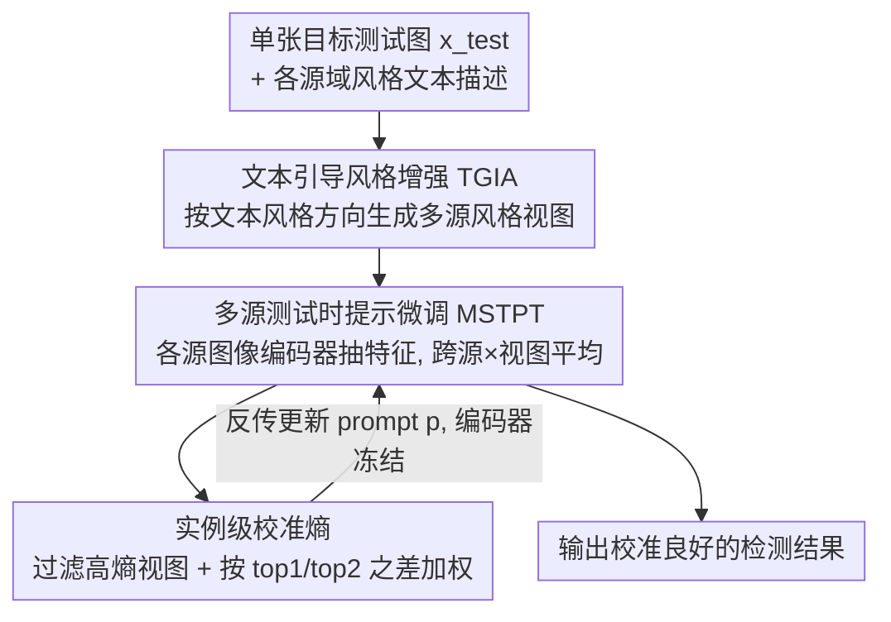

# InsCal: Calibrated Multi-Source Fully Test-Time Prompt Tuning for Object Detection

**会议**: CVPR 2026  
**论文**: [CVF Open Access](https://openaccess.thecvf.com/content/CVPR2026/html/Que_InsCal_Calibrated_Multi-Source_Fully_Test-Time_Prompt_Tuning_for_Object_Detection_CVPR_2026_paper.html)  
**代码**: 未公布  
**领域**: 目标检测 / 测试时自适应  
**关键词**: 测试时提示微调, 跨域目标检测, 模型校准, 熵最小化, 视觉语言模型

## 一句话总结
本文把测试时提示微调（TPT）从分类扩展到文本驱动的目标检测，并指出熵最小化会导致过自信/校准失准，于是提出 InsCal——用多源提示微调聚合多域知识、文本引导风格增强缩小域差、实例级校准熵抑制过自信，在跨域检测基准上把检测校准误差 D-ECE 从约 20% 压到约 10%，同时提升 mAP。

## 研究背景与动机

**领域现状**：文本驱动的开放词表检测器（如 GDINO）把检测看成图文匹配，靠大规模图文预训练实现零样本迁移。要让这类预训练 VLM 适应新分布，测试时自适应（TTA）是一条路，其中测试时提示微调（TPT）只用单张测试图、在线优化 prompt、靠最小化多个增强视图的预测熵来无监督适配，无需任何目标域标注。

**现有痛点**：作者用预训练 GDINO 在 Diverse Weather Dataset 上跨域测试，发现零样本迁移和微调之间存在明显差距，尤其 NightRainy、DuskRainy 这种恶劣域几乎给不出像样预测。而直接把 TPT 搬到跨域检测上又带来新麻烦：熵最小化会逼模型对所有增强视图都给高置信度——哪怕预测是错的，于是产生"过自信"。作者在 DayClear→NightClear 上实测，TPT 输出置信度与真实精度之间裂开一道大口子（D-ECE 高达 19.5%），即严重校准失准。

**核心矛盾**：熵最小化的目标（压低预测熵 = 提高置信度）与校准的目标（置信度应当如实反映正确率）天然冲突——域偏移下错误预测本就多，再硬压熵只会让错误预测更自信，校准越做越差。而目标域无标注，无法直接监督校准。

**本文目标**：在完全测试时自适应（FTTA，单样本在线、无源数据、无目标标注）约束下，为文本驱动检测器同时解决三件事：知识来源单一、源-目标域差大、熵最小化过自信。

**切入角度**：作者注意到 UPT 等 TPT 方法只用单一源域单一源模型，难以覆盖多样未知目标域；而过自信本质上来自"对最高类概率无差别地拔高"，如果能根据每个实例的置信结构动态调权，就能区别对待"真自信"和"假自信"。

**核心 idea**：把 TPT 扩成多源（多个源模型聚合知识）+ 文本引导风格增强（无参考图地把目标图拉向源域风格）+ 实例级校准熵（用最高与次高 logits 之差给每个视图的熵加权），三者合一抑制过自信、缩小域差。

## 方法详解

### 整体框架
给定一批源模型 $\{f^s_\theta\}_{s=1}^S$（在各源域上微调 GDINO 得到的不同图像编码器，共享同一文本编码器）以及每个源域的风格文本描述。对每张到来的目标测试图 $x_{test}$：先用 **TGIA** 按"目标风格→各源风格"的文本方向把图增强成多个源域风格视图；再用 **MSTPT** 让各源图像编码器抽取对应风格视图的特征，与可学习 prompt 的文本特征算相似度得到预测概率，跨所有源 × 视图平均；最后用 **实例级校准熵** 过滤高熵视图并给每个视图按置信结构加权，得到 InsCal 熵损失，反传只更新 prompt（文本/图像编码器全程冻结）。

### 关键设计

**1. 文本引导风格增强 TGIA：不用源图、只靠风格文本把目标图拉向源域**

FTTA 不允许访问源域图像，所以传统"参考图风格迁移"行不通。TGIA 改用风格文本：给目标风格文本 $tgt_{sty}$、源风格文本 $src_{sty}$，把测试图随机裁块的嵌入 $z=\text{ENC}_I(x^{crop}_{test})$，优化一个有向对比损失 $\varepsilon^*=\min_\theta \sum_z (1-\frac{|\Delta I_z|}{|\Delta T|}\cdot\frac{\Delta I_z\cdot\Delta T}{|\Delta I_z||\Delta T|}) + \rho\|A_\theta(z)-z\|_2^2$。其中 $\Delta I_z=\text{ENC}_I(A_\theta(z))-\text{ENC}_I(z)$ 是增强带来的图像嵌入变化方向，$\Delta T=\text{ENC}_T(tgt_{sty})-\text{ENC}_T(src_{sty})$ 是文本里"目标→源"的风格转换方向。第一项让图像变化方向对齐文本风格方向（并用幅度比 $\frac{|\Delta I_z|}{|\Delta T|}$ 让变换强度也匹配），第二项 L2 正则让增强图在内容上贴近原图——即只改风格不改内容。例如对 Watercolor2k，风格文本就是"a drawing in watercolor style"。整个过程只需一句源域风格的高层文本描述，不碰任何源图，完全满足 FTTA。

**2. 多源测试时提示微调 MSTPT：聚合多个源模型知识覆盖多样目标域**

UPT 等只用单源单模型，面对未知目标域很脆。MSTPT 微调 GDINO 得到 $S$ 个源图像编码器 $\{\text{ENC}^s_I\}$（文本语义域无关，故共享同一文本编码器）。对测试图用 TGIA 在每个源风格下各生成 $N$ 个增强视图，让对应源编码器抽特征，与 prompt 文本特征算余弦相似度 $\text{SIM}_i=\cos(\text{ENC}^s_I(A^s_j(x_{test})), \text{ENC}_T(p_i))$ 经温度 softmax 得类概率。prompt $p\in\mathbb{R}^{L\times D}$ 在文本嵌入空间优化，目标是最小化跨所有 $S\times N$ 视图**平均预测分布**的熵 $\tilde p_p(y_i|x_{test})=\frac{1}{SN}\sum_s\sum_j p_p(y_i|A^s_j(x_{test}))$。同时设一个置信阈值，用指示函数 $\mathbb{1}[H(p_i)\le\tau]$ 过滤掉高熵（不可靠）视图，只让低熵视图参与平均，既聚合多源知识又抑制噪声视图。

**3. 实例级校准熵：用 top1/top2 之差给每个视图动态调权，抑制过自信**

直接最小化平均熵会把所有增强（包括错的）都推向高置信，这正是过自信之源。本设计把熵改写为带校准因子的形式：$\tilde H[\tilde p_p]=-(1+(p_{1st}-p_{2nd})^\phi)\,p_i\log p_i$，其中 $p_{1st}$、$p_{2nd}$ 是该视图最高与次高类概率。校准因子 $1+(p_{1st}-p_{2nd})^\phi$ 随实例置信结构自适应：当 $p_{1st}\gg p_{2nd}$（top1 一骑绝尘、真自信）因子变大，放大这条可靠预测的权重；当 $p_{1st}$ 与 $p_{2nd}$ 接近（模型其实拿不准、假自信）因子变小，压低这条预测的权重，从而避免把"模棱两可却被熵最小化硬拔高"的错误预测当成自信样本。超参 $\phi$ 控制对 top1-top2 差值的敏感度：$\phi$ 越大调整越剧烈，越小越平缓。这一项把"该自信的更自信、该犹豫的别瞎自信"显式编码进损失，直接对症过自信导致的校准失准。

### 损失函数 / 训练策略
最终优化目标是校准多源 TPT 熵：$p^*=\min_p \frac{1}{SN}\sum_i\sum_s\sum_j \tilde H[\tilde p_p(y_i|x_{test})]$。适配在 FTTA 模式下进行——单张测试图在线优化 prompt，文本与图像编码器全程冻结，仅 prompt 可学习。评测用 mAP@0.5 衡量精度、用检测校准误差 D-ECE 衡量校准。

> **D-ECE（Detection Expected Calibration Error）**：把置信度与框属性空间等分成 $M$ 个 bin，按各 bin 内"平均精度 prec(m)"与"平均置信度 conf(m)"之差加权求和 $\text{D-ECE}=\sum_m \frac{|I(m)|}{|D|}|prec(m)-conf(m)|$，越低表示置信度越如实反映正确率（校准越好）。

## 实验关键数据

### 主实验
跨域数据集：Diverse Weather Dataset（DWD，5 个天气/时段域，7 类）与 Art Image（Clipart1k / Comic2k / Watercolor2k 三种艺术风格）。指标为 mAP@0.5 与 D-ECE。Art Image 上每个域用其余两个作源域：

| 域 | 指标 | InsCal | FTTA 基线(GDINO) | UDA 最佳(CODE) | 说明 |
|------|------|------|------|------|------|
| Comic | mAP / D-ECE | 见正文⚠️ | 25.9 / 17.2 | 33.8 / 17.5 | InsCal 超过可访问源数据的 UDA |
| Clipart | mAP / D-ECE | 见正文⚠️ | 30.5 / 16.9 | 39.4 / 17.1 | |
| Watercolor | mAP / D-ECE | 见正文⚠️ | 52.8 / 17.0 | 55.8 / 17.3 | |

> ⚠️ 缓存表格被 OCR 截断，InsCal 在 Art Image 各域的精确 mAP/D-ECE 数值未完整保留；论文文字明确称 InsCal 在多源聚合下超过可访问源数据的 UDA 方法、并显著降低 D-ECE，具体数字以原文 Table 1 为准。

DWD 上的核心结论（mAP@0.5 / D-ECE）：

| 维度 | InsCal 表现 | 对比 |
|------|------|------|
| D-ECE | 各类别/子域均最低，约从 20% 降到 10% | UDA/SFDA/FTTA 普遍校准失准 |
| mAP | 在 Dusk Rainy / Night Rainy / Night Clear 三个恶劣域领先 | Day Foggy 仅略逊于两个能全访问源+目标数据的 UDA |

### 消融实验
在 DWD 上逐步叠加组件（相对前一行的 mAP 增益，⚠️ 缓存仅给出文字描述未给完整数值表）：

| 配置 | 关键贡献 | 效果 |
|------|---------|------|
| EM（纯熵最小化） | 基线 | 对差异极大的目标域几乎无迁移能力 |
| + TPT（增强视图 + 低熵约束） | 视图一致性 | 比 EM 提升约 **1.6** mAP |
| + MS（多源模型） | 跨域知识聚合 | 在 TPT 上进一步提升 |
| + TGIA（文本风格增强） | 缩小域差 | 继续提升 |
| + 校准损失（Full InsCal） | 抑制过自信 | 再提升，且 D-ECE 大幅下降 |

### 关键发现
- **校准与精度可以同时改善**：实例级校准熵不仅把 D-ECE 从约 20% 压到约 10%，还配合多源/TGIA 提了 mAP，说明抑制"假自信"反过来也帮助了正确预测的可靠输出。
- **多源是恶劣域的关键**：单源 TPT 在 NightRainy 等极端域几乎失效，叠加多源模型后明显回血，印证"单源覆盖不了多样未知目标域"的判断。
- **定性上逐级纠错**：EM 把 car/bus/rider/person 多类错判，TPT 修对部分但仍把 truck/bus 搞错，MS 能多认出 car 却误判一些为 truck，完整 InsCal 才把目标全部识别正确。
- **可扩展到开放词表检测**：在 DWD Day Foggy 的 OVOD 设置里，InsCal 对新类别 Traffic Light 取得最高 mAP，而精度最高的 FR 在该新类上反而最差，且 InsCal 的 D-ECE 最低。

## 亮点与洞察
- **把"过自信"量化成可优化项很巧妙**：用 top1-top2 概率差作为校准因子，等于把"模型有没有真正想清楚"显式写进损失，比事后温度缩放等离线校准更贴合在线 FTTA 场景。
- **文本方向对比损失实现无参考图风格迁移**：让图像嵌入的变化方向去对齐文本里的"目标→源"风格方向，绕开了 FTTA 不能用源图的限制，这套 CLIP 空间方向对齐的思路可迁移到任何需要无源风格对齐的任务。
- **首次把模型校准问题引入测试时检测**：作者指出域偏移叠加无标注让检测校准成为此前未被处理的新挑战，把 ECE 思想扩展成 D-ECE 并据此设计损失，问题定义本身有开拓性。

## 局限与展望
- 需要预先准备 $S$ 个在不同源域上微调好的源模型，源域数量与质量直接影响效果，准备成本不低；论文未讨论源模型很少或风格描述不准时的退化。
- 每张测试图要在 $S\times N$ 个增强视图上跑多源前向再优化 prompt，在线推理开销随源数与视图数线性增长，对实时检测可能偏重。
- ⚠️ TGIA 依赖一句"高层风格文本描述"，当源域风格难以用一句话概括（如混合天气）时，文本方向是否仍准确缺乏分析。
- 改进方向：自动从测试流估计风格文本、或用更轻量的源知识蒸馏替代多源前向以降低在线开销。

## 相关工作与启发
- **vs TPT / DiffTPT / DART**：它们都基于熵最小化做单源 FTTA（DiffTPT 用扩散生成增强、DART 加图像 prompt），但都没处理熵最小化引入的过自信；InsCal 用实例级校准熵正面修这个校准失准。
- **vs UPT**：UPT 用 mean-teacher 为检测做零样本文本 prompt 学习，但只用单源单模型、难应付多样目标域；InsCal 扩成多源聚合并加文本风格增强。
- **vs 检测 TTA（STFAR / CTAOD / IOUFilter）**：它们针对常规检测器做自训练/对比/伪标签式 TTA；本文聚焦文本驱动检测器，强调 prompt 微调 + 校准，是更贴合 VLM 检测器的 FTTA 路线。

## 评分
- 新颖性: ⭐⭐⭐⭐⭐ 首次把模型校准引入测试时检测，并用 top1-top2 校准因子把过自信变成可优化项，角度新
- 实验充分度: ⭐⭐⭐⭐ 覆盖 DWD/Art Image 两类跨域 + 组件消融 + OVOD 扩展，但缓存中部分主表数值缺失、未报在线开销
- 写作质量: ⭐⭐⭐⭐ 动机（过自信→校准失准）层层递进、公式完整；部分符号经 OCR 后较难辨认
- 价值: ⭐⭐⭐⭐ 把校准良好的检测带到 FTTA 场景，对自动驾驶等高可靠性需求领域有实际意义

<!-- RELATED:START -->

## 相关论文

- [\[CVPR 2026\] CD-Buffer: Complementary Dual-Buffer Framework for Test-Time Adaptation in Adverse Weather Object Detection](cd-buffer_complementary_dual-buffer_framework_for_test-time_adaptation_in_advers.md)
- [\[CVPR 2026\] Parameterized Prompt for Incremental Object Detection](parameterized_prompt_for_incremental_object_detection.md)
- [\[CVPR 2025\] Test-Time Backdoor Detection for Object Detection Models](../../CVPR2025/object_detection/test-time_backdoor_detection_for_object_detection_models.md)
- [\[CVPR 2026\] Bidirectional Multimodal Prompt Learning with Scale-Aware Training for Few-Shot Multi-Class Anomaly Detection](bidirectional_multimodal_prompt_learning_with_scale-aware_training_for_few-shot_.md)
- [\[NeurIPS 2025\] Test-Time Adaptive Object Detection with Foundation Model](../../NeurIPS2025/object_detection/test-time_adaptive_object_detection_with_foundation_model.md)

<!-- RELATED:END -->
