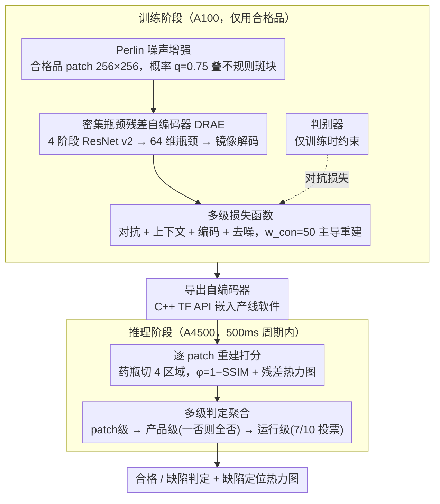

# Integration of Deep Generative Anomaly Detection Algorithm in High-Speed Industrial Line

**会议**: CVPR 2026  
**arXiv**: [2603.07577](https://arxiv.org/abs/2603.07577)  
**代码**: 无  
**领域**:目标检测
**关键词**: 异常检测, 工业视觉检测, 生成对抗网络, 残差自编码器, 在线部署

## 一句话总结
本文提出一个基于 GAN + 残差自编码器（DRAE）的半监督异常检测框架，专门设计用于制药行业 Blow-Fill-Seal（BFS）产线的高速在线质量检测，仅用合格品训练即可实现 96.4% 的准确率，单 patch 推理仅 0.17ms，满足 500ms 检测周期的严格工业约束。

## 研究背景与动机
制药行业的在线视觉检测要求极高的检测精度（直接关系患者安全）、严格的时间约束（产线不能停）、以及受限的硬件预算。目前许多产线仍然依赖**人工目检**，存在操作员注意力波动、检测一致性差、吞吐量受限等问题。

工业异常检测面临的核心矛盾：(1) **类别严重不平衡**——合格品远多于缺陷品，监督学习难以训练；(2) 经典规则-based 算法需要大量手工调参，且对产品变化敏感，难以迁移；(3) 嵌入相似性方法（PaDiM、PatchCore）虽然轻量但内存占用随数据量增长，且可解释性差。

本文的切入角度是**重建-based 半监督学习**：仅用合格品训练生成模型，异常区域因无法被正确重建而暴露。作者基于前序工作 GRD-Net 进行优化，重点解决以下工程挑战：(1) BFS 药瓶内液体流动导致正常样本方差极大；(2) 产线间隔仅 500ms；(3) 推理硬件（NVIDIA A4500）远弱于训练服务器（A100）。

## 方法详解

### 整体框架
系统要解决的是：BFS 制药产线上只有合格品容易拿到、缺陷品稀少，且检测必须在 500ms 周期内、用比训练服务器弱得多的 GPU 完成。整体思路是把"找缺陷"转成"重建合格品"——只用合格品训练一个生成模型，遇到异常区域时模型重建不出来，重建残差就暴露了缺陷位置。

整套流程分两阶段。训练阶段在 A100 服务器上用 GAN 框架训练一个残差自编码器：输入一张 $256 \times 256$ 灰度 patch，编码到 64 维潜在空间再重建回去，判别器只在训练时帮助约束重建质量。推理阶段则用 C++ TensorFlow API 把训练好的自编码器嵌进产线控制软件，每个药瓶被切成 4 个逻辑区域的 patch（flag、top body、liquid body、bottom），逐 patch 独立过一遍自编码器，再把 patch 级判定逐层聚合成产品级、运行级结论。

### 关键设计

**1. 密集瓶颈残差自编码器（DRAE）：用 64 维瓶颈逼网络只记住"正常长什么样"**

重建式异常检测最怕自编码器学会"恒等复制"——连缺陷都原样搬过去，那残差就抓不到异常。DRAE 的对策是把瓶颈压到极窄：编码器是 4 阶段 ResNet v2，每阶段 3 个残差块（A-B-C），最后一块负责下采样（$H_i \times W_i \to H_i/2 \times W_i/2$），最终汇聚到一个维度仅 64 的全连接瓶颈层；解码器是编码器的镜像，用转置卷积逐级上采样回 $256 \times 256 \times 1$。残差连接保证这么深的网络仍能训得动（缓解梯度消失），而全连接瓶颈比纯卷积瓶颈压缩得更狠，信息通道窄到只够放下"正常模式的本质结构"，缺陷这种偶发、局部的模式挤不进去，重建时自然被过滤掉。

**2. Perlin 噪声增强：把"重建"任务升级成"去噪+重建"，堵死恒等复制的捷径**

光靠窄瓶颈还不够，训练时若输入输出完全一致，网络仍可能偷懒。这里在训练时以概率 $q=0.75$ 往正常图上叠 Perlin 噪声：扰动输入为 $X^* = (1-M)\cdot X + (1-\beta)M\cdot X + \beta N$，其中 $M$ 是二值掩码、$N$ 是 Perlin 噪声、$\beta \sim \mathcal{U}(0.5, 1.0)$ 控制掩码区域的污染强度。网络看到的是被污染的图，却要重建出干净的正常图，于是被迫学会"识别并去掉不属于正常模式的东西"。选 Perlin 而非高斯噪声是关键——它生成的是非高斯、非矩形的不规则斑块，形态比高斯噪声更接近真实工业缺陷，让网络在训练时就见过"像缺陷的扰动"并学会抹除它，推理时面对真缺陷才不会照单全收。

**3. 多级损失函数：让重建质量压倒一切，同时稳住对抗训练**

Generator 的总损失是四项加权和 $\mathcal{L}_{gen} = w_1\mathcal{L}_{adv} + w_2\mathcal{L}_{con} + w_3\mathcal{L}_{enc} + w_4\mathcal{L}_{nse}$。其中对抗损失 $\mathcal{L}_{adv}$ 取判别器特征空间的 $\ell_2$ 距离（而非直接判真假，更稳）；上下文损失 $\mathcal{L}_{con} = 2.0\cdot\mathcal{L}_{Huber} + 1.0\cdot\mathcal{L}_{SSIM}$ 是重建质量的主力；编码器一致性损失 $\mathcal{L}_{enc}$ 约束原图与重建图的潜在表示对齐；噪声损失 $\mathcal{L}_{nse}$ 专门引导网络在被污染区域正确去噪。权重上 $w_2 = 50.0$ 远大于其余三项，等于明确告诉网络"重建像不像"是第一优先级。而 $\mathcal{L}_{con}$ 内部用 Huber loss 替掉常见的 $\ell_1$、并给到 $w_a=2.0$ 的权重，是因为 SSIM 虽然对重建质量贡献最大，但在液面这类高熵图像上数值不稳定，Huber 项能把训练拉稳。

**4. 多级判定聚合：把逐 patch 的重建残差，三级投票汇成产线可信的接受/拒绝**

这一步接住框架的最后一段——前三个设计训出的自编码器只给出 patch 级的重建残差，怎么把它变成产线能用的整瓶结论才是落地的关键。推理时每个 patch 过完自编码器，先算异常分数 $\phi = 1 - \text{SSIM}(X, \hat{X})$、并生成归一化到 $[0,1]$ 的残差热力图 $H = |X - \hat{X}|$ 用于缺陷定位，每个区域单独设阈值得到 patch 级判定。但单 patch 判定会累积误差，于是逐层聚合：先到**产品级**——一条 strip 上任一 patch 判异常就整条判缺陷（"一否则全否"），这一保守策略把假接受（漏检缺陷、直接关乎患者安全）压到最低，代价是假拒绝率升高；再到**运行级**——对连续帧做 7/10 多数投票，把单帧抖动造成的过度拒绝拉回来。实验印证了这套聚合的净收益：准确率从 patch 级 99.19% 经产品级聚合降到 95.93%（假拒绝增多所致），再经 7/10 投票回升到 96.41%。整条级联始终在 500ms 周期约束内完成（60 个 patch 总推理约 10ms）。

### 损失函数 / 训练策略
训练只跑 10 个 epoch（数据量极大，共 2,815,200 个 patch，跑多了既不必要也耗时），用 Adam 优化器，初始学习率 $1.5 \times 10^{-4}$ 配 cosine-decay 重启，batch size=32。异常分数与缺陷热力图的定义见上文关键设计 4。

## 实验关键数据

### 主实验

| 评估级别 | 准确率 | TPR | TNR | 平衡准确率 | 推理时间 |
|---------|--------|-----|-----|-----------|---------|
| Patch级(R0/flag) | 99.19% | 99.66% | 90.93% | 95.30% | 0.17ms/patch |
| Patch级(R2/liquid) | 99.57% | 99.86% | 97.79% | 98.83% | 0.17ms/patch |
| 产品级(整条strip) | 95.93% | 96.94% | 94.67% | 95.81% | 0.49ms/strip |
| 运行级(7/10投票) | 96.41% | 96.76% | 95.99% | 96.38% | — |

### 消融实验

| 配置 | 关键指标 | 说明 |
|------|---------|------|
| 各区域精度差异 | R3(bottom): 99.84% bal.acc vs R1(top body): 95.15% bal.acc | 液面区域方差大，检测最难 |
| Patch→产品聚合 | 准确率 99.19%→95.93% | "一否则全否"策略降低假接受但增加假拒绝 |
| 产品→运行聚合(7/10) | 准确率 95.93%→96.41% | 多帧投票进一步稳定结果 |
| 推理时间约束 | 0.17ms/patch × 60 patches = 10.1ms ≪ 500ms | 远在工业约束之内 |

### 关键发现
- 单 patch 推理仅需 0.17ms（NVIDIA A4500），60 个 patch 总共约 10ms，远低于 500ms 周期
- liquid body 区域（R2）的平衡准确率最高（98.83%），但 flag/top body 区域（R0/R1）TNR 较低，可能与液面气泡干扰有关
- 7/10 投票策略有效提升最终判定的稳定性（95.93% → 96.41%）
- Perlin 噪声增强可防止自编码器的"恒等复制"陷阱，对小缺陷检测至关重要

## 亮点与洞察
- **工程落地导向**：不追求公开 benchmark 上的 SOTA，而是在严格工业约束（500ms周期、受限GPU、GMP合规）下实现可靠部署
- 训练数据规模惊人（280万+ patch），充分利用了产线获取合格品容易的优势
- 热力图可视化为操作员提供直观的缺陷定位解释，满足 GMP 要求的可追溯性
- 区域分级阈值策略和多帧投票机制是实际部署中的重要工程经验

## 局限与展望
- 缺少与 PaDiM、PatchCore、EfficientAD 等公开方法在公开数据集上的对比（作者以 NDA 为由推迟）
- 仅报告了点估计指标，缺少置信区间（作者也承认将在扩展分析中补充）
- flag/top body 区域的 TNR 较低（90-91%），假拒绝率可能影响产线效率
- 没有讨论模型随生产条件漂移（如新批次产品）的在线适应能力

## 相关工作与启发
- 架构源自 GRD-Net → DRÆM → GANomaly 的演进链，每一步都针对工业场景做了简化和优化
- Perlin 噪声在异常检测中的作用类似于 Masked Autoencoder 中的 masking，都是通过制造信息缺失来促进本质特征学习
- 重建-based 方法的一个核心优势是热力图的直接可解释性，这在工业 GMP 审计中是硬性要求

## 评分
- 新颖性: ⭐⭐⭐ 技术组件均非原创（GAN、ResNet AE、Perlin噪声），创新主要在工程整合层面
- 实验充分度: ⭐⭐⭐ 真实工业数据验证有说服力，但缺少公开benchmark和基线方法对比
- 写作质量: ⭐⭐⭐ 工程细节详尽，但论文结构略显冗长，数学符号有时不够简洁
- 价值: ⭐⭐⭐⭐ 对工业部署异常检测有很好的实践参考价值，展示了从研究到产线的完整路径

<!-- RELATED:START -->

## 相关论文

- [\[CVPR 2026\] InvAD: Inversion-based Reconstruction-Free Anomaly Detection with Diffusion Models](invad_inversion-based_reconstruction-free_anomaly_detection_with_diffusion_model.md)
- [\[CVPR 2026\] Novel Anomaly Detection Scenarios and Evaluation Metrics to Address the Ambiguity in the Definition of Normal Samples](novel_anomaly_detection_scenarios_and_evaluation_metrics_to_address_the_ambiguit.md)
- [\[CVPR 2026\] MMR-AD: A Large-Scale Multimodal Dataset for Benchmarking General Anomaly Detection with MLLMs](mmrad_multimodal_anomaly_detection.md)
- [\[CVPR 2026\] Toward Generalizable Whole Brain Representations with High-Resolution Light-Sheet Data](toward_generalizable_whole_brain_representations_with_high-resolution_light-shee.md)
- [\[CVPR 2026\] MoECLIP: Patch-Specialized Experts for Zero-shot Anomaly Detection](moeclip_patch-specialized_experts_for_zero-shot_anomaly_detection.md)

<!-- RELATED:END -->
