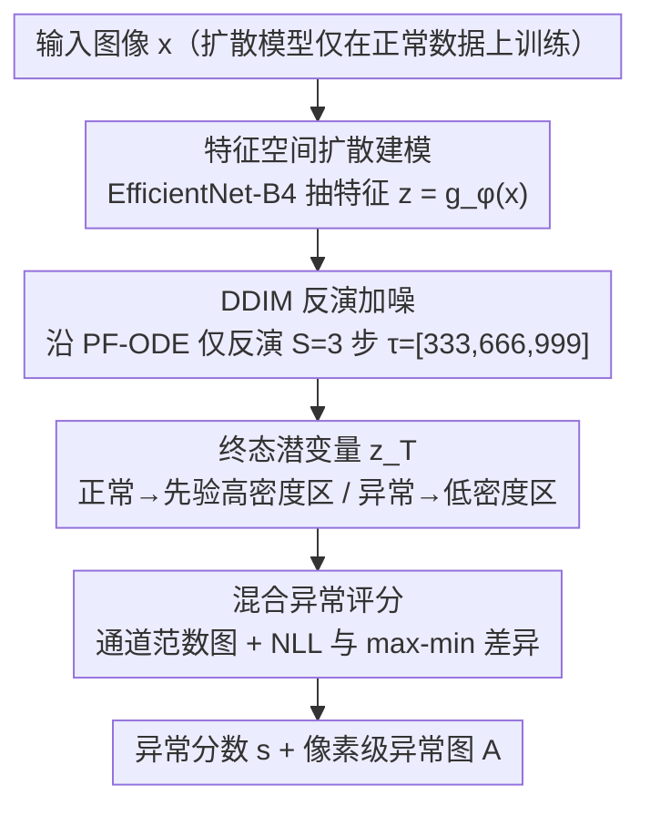

# InvAD: Inversion-based Reconstruction-Free Anomaly Detection with Diffusion Models

**会议**: CVPR 2026  
**arXiv**: [2504.05662](https://arxiv.org/abs/2504.05662)  
**代码**: [项目页面](https://invad-project.com)  
**领域**:目标检测
**关键词**: 异常检测, 扩散模型, DDIM反演, 无重建范式, 工业/医疗缺陷检测

## 一句话总结

提出 InvAD，将扩散模型异常检测从"RGB 空间去噪重建"范式转变为"潜空间加噪反演"范式，通过 DDIM 反演直接推断最终潜变量并在先验分布下度量偏差来检测异常，仅需 3 步反演即达 SOTA 性能且推理速度提升约 2 倍。

## 研究背景与动机

基于扩散模型的异常检测（AD）方法虽然成功，但存在根本性的效率-精度矛盾：(1) **噪声强度敏感**——过强的噪声破坏正常区域增加假阳性，过弱则异常区域被完美重建导致漏检；(2) **多步去噪计算昂贵**——满意的重建需迭代去噪，大多数方法仅约 1 FPS（如 DiAD 0.1 FPS、GLAD 0.2 FPS）。

核心洞察：既然扩散模型仅学习了正常数据分布，不必通过重建来检测异常，可以利用反演（inversion）直接将图像映射到潜空间，正常图像会映射到先验分布的高密度区域，异常图像则映射到低密度区域。这完全绕过了重建过程，天然免除了噪声强度调参问题。

## 方法详解

### 整体框架

这篇论文要解决的是扩散模型异常检测里一个绕不开的矛盾：靠"去噪重建"来找异常，既要小心调噪声强度，又要跑很多步去噪，慢且难调。InvAD 换了个方向——既然扩散模型只学过正常数据的分布，那就不重建，直接把图像"加噪反演"到潜空间，看它落在先验分布的什么位置。具体地，输入图像先经骨干网络抽成特征 $\mathbf{z} = g_\phi(\mathbf{x})$（**特征空间扩散建模**），再用 DDIM 沿确定性轨迹只反演 3 步得到终态潜变量 $\mathbf{z}_T$（**DDIM 反演加噪**）；正常图像会被推到先验分布的高密度区，异常则落到低密度区，于是异常分数就由 $\mathbf{z}_T$ 偏离典型分布的程度算出（**混合异常评分**）。整条管线没有解码器、不做任何重建。

### 关键设计

**1. 特征空间扩散建模：在骨干特征而非原始像素上做扩散**

反演得到的终态 $\mathbf{z}_T$ 服从标准高斯先验、而非数据分布，所以要先选好"在哪个空间做扩散"。直接在像素空间做，既受低级噪声/光照干扰，分辨率又高、推理慢。InvAD 改用预训练 EfficientNet-B4 抽出的特征 $\mathbf{z} = g_\phi(\mathbf{x}) \in \mathbb{R}^{C \times h \times w}$ 作为扩散模型的输入空间，扩散主干用 DiT。这样做有两重好处：骨干特征对低级变化天然具有不变性，反演结果更稳定；特征图分辨率更低，反演单步更省算力。消融里"像素空间 + 单步"只有 44.9 mAD、换到特征空间立刻跳到 71.0，说明换空间这一步对极少步数下的稳定性是关键。

**2. DDIM 反演加噪：把"检测"从去噪重建挪到加噪反演**

旧范式的痛点在于噪声强度难调（太强毁正常区、太弱漏异常区）且重建要迭代很多步。InvAD 沿 PF-ODE 轨迹正向推进，用 Euler 近似从 $\mathbf{x}_0$ 直接推断终态 $\mathbf{x}_T$，离散更新为

$$\mathbf{x}_{\tau_{i+1}} = \sqrt{\alpha_{\tau_{i+1}}}\, f_\theta(\mathbf{x}_{\tau_i}) + \sqrt{1-\alpha_{\tau_{i+1}}}\, \epsilon_\theta^{(\tau_i)}(\mathbf{x}_{\tau_i})$$

关键在于只用极少步数就够——取 $S=3$、均匀子集 $\tau_3 = [333, 666, 999]$。之所以能这么粗（即使 Euler 近似精度不高）仍然有效，是因为 PF-ODE 的确定性保证了正常图像与先验分布之间的一一映射，异常像素无论如何都会被推到低密度区；检测要的只是"偏离典型分布"这件事，而不是精确还原图像，所以不必像重建那样把步数堆上去。这也天然免除了噪声强度这个超参。

**3. 混合异常评分：用终态潜变量的范数加 max-min 差异度量偏差**

有了反演终态 $\mathbf{z}_T$ 还需要把"偏离先验"翻译成分数。像素级异常图取通道维度的欧氏范数 $\mathbf{z}_T^{\text{normed}}[i,j] = \|\mathbf{z}_T[:,i,j]\|_2$，范数越大说明该位置越偏离典型分布，再双线性插值放大到原图分辨率即得异常图 $A$。图像级分数不直接用对数似然（NLL）——它有已知的反向评分（reverse-scoring）问题、抓不住小异常；本文改取归一化范数图上最大值与最小值之差（max-min Diff），$s = \max_{i,j}\mathbf{z}_T^{\text{normed}}[i,j] - \min_{i,j}\mathbf{z}_T^{\text{normed}}[i,j]$。动机是异常通常局部稀疏、大部分区域仍正常，看极值差能突出局部尖锐偏离、又压住全局离群点，从而缓解反向评分。消融（表 9）显示 NLL 与 Diff 结合后的评分对反演步数 $S$ 鲁棒，单用任一项都会随步数波动。

### 损失函数 / 训练策略

- 训练阶段：标准 DDPM $\epsilon$-prediction 损失，仅在正常数据上训练
- AdamW 优化器，300 epochs，$T=1000$，线性噪声调度
- 推理阶段：$S=3$ 步反演，均匀子集 $\tau_3 = [333, 666, 999]$
- 即插即用设计：仅修改推理阶段，可直接替换现有扩散 AD 方法的推理过程

## 实验关键数据

### 主实验

| 数据集 | 指标 | 本文 InvAD | OmiAD (ICML'25) | DiAD (AAAI'24) | FPS |
|--------|------|-----------|-----------------|----------------|-----|
| MVTecAD | I-AUROC | **99.0** | 98.8 | 97.2 | **88.1** vs 39.4 vs 0.1 |
| VisA | I-AUROC | **96.9** | 95.3 | 86.8 | **74.1** vs 35.3 |
| MPDD | I-AUROC | **96.5** | 93.7 | 74.6 | **120** vs 49.8 |
| BMAD (医疗) | mAD | **87.2** | - | - | **88** vs 20 |

### 消融实验

| 配置 | MVTecAD mAD | 说明 |
|------|------------|------|
| 仅 FDM (无反演) | 57.3 | 反演是核心组件 |
| 单步反演 (像素空间) | 44.9 | 像素空间扩散 + 单步不足 |
| FDM + 单步反演 | 71.0 | 特征空间 + 单步 |
| **FDM + 多步反演 (完整)** | **83.7** | 最优配置 |

| 反演步数 $S$ | 重建方法 (最优 $r$) | 反演方法 (本文) |
|-------------|-------------------|----------------|
| 3 | 64.9 | **99.0** |
| 5 | 75.0 | **98.9** |
| 10 | 97.9 | 98.4 |
| 50 | 98.0 | 96.0 |
| 1000 | 98.2 | 95.4 |

### 关键发现

- 反演方法在极少步数（$S=3,5$）时大幅优于重建方法，重建方法需 $S \geq 50$ 才能达到类似性能
- 反演方法不需要调节扰动时间步（tuning-free），重建方法对 $r$ 和 $S$ 高度敏感
- 即插即用：DiAD + InvAD 提升 +1.0 I-AUROC 和 +88 FPS；MDM + InvAD 提升 +6.3 I-AUROC 和 +60.8 FPS
- NLL + Diff 混合评分对步数 $S$ 鲁棒，单独使用 NLL 或 Diff 则不鲁棒
- 在 BMAD 医疗基准的 6 个数据集上也达到 SOTA（mAD=87.2），证明方法的跨领域通用性

## 亮点与洞察

- **范式创新**：从"去噪检测"到"加噪检测"的思维转换是核心贡献，简洁而深刻
- 反演天然免除噪声强度调参和多步重建的计算瓶颈
- $S=3$ 就能达到 SOTA 的原因在于不需要精确重建，只需区分正常/异常的分布典型性
- 即插即用设计使其可作为现有扩散 AD 方法的通用推理加速器
- 特征空间扩散建模是提升效率和效果的重要设计选择

## 局限与展望

- 仍需多于 1 次函数求值（NFE=3），可通过扩散蒸馏压缩到 1 步
- 像素级定位性能（AP、F1_max）不如部分重建方法，反演方法在精确边界定位上有天然劣势
- 评分方案中 min-max 差异的设计偏经验性，缺乏理论支撑
- DiT-gigant 参数量较大（1223M），MLP 可达相近检测精度但定位更差
- 未探索任务特定的反演机制优化

## 相关工作与启发

- DDIM (Song et al. 2020) 的确定性采样和 PF-ODE 是反演的理论基础
- Heng et al. (2024) 用 score function norm 度量 OOD 典型性的思路启发了本文的评分设计
- OmiAD (Feng et al. 2025) 通过对抗蒸馏实现 1-step 扩散，但训练复杂度高
- 与 EfficientAD (Batzner et al. 2023) 等非扩散方法相比，扩散方法在精度上仍有优势

## 评分

- 新颖性: ⭐⭐⭐⭐⭐ "加噪检测"范式是概念性创新，简洁优雅且效果显著
- 实验充分度: ⭐⭐⭐⭐⭐ 4 个工业 + 6 个医疗数据集，全面的消融（组件/骨干/评分/步数/泛化性）
- 写作质量: ⭐⭐⭐⭐ 问题分析清晰，范式对比图直观，表格设计合理
- 价值: ⭐⭐⭐⭐⭐ 实用性极强，即插即用加速现有方法，对工业和医疗 AD 都有重要意义

<!-- RELATED:START -->

## 相关论文

- [\[CVPR 2026\] Geometry-Aligned and Anomaly-Aware Reconstruction for 3D Anomaly Detection](geometry-aligned_and_anomaly-aware_reconstruction_for_3d_anomaly_detection.md)
- [\[ICCV 2025\] DISTIL: Data-Free Inversion of Suspicious Trojan Inputs via Latent Diffusion](../../ICCV2025/object_detection/distil_data-free_inversion_of_suspicious_trojan_inputs_via_latent_diffusion.md)
- [\[AAAI 2026\] CountSteer: Steering Attention for Object Counting in Diffusion Models](../../AAAI2026/object_detection/countsteer_steering_attention_for_object_counting_in_diffusion_models.md)
- [\[CVPR 2026\] SubspaceAD: Training-Free Few-Shot Anomaly Detection via Subspace Modeling](subspacead_training-free_few-shot_anomaly_detection_via_subspace_modeling.md)
- [\[CVPR 2026\] VisualAD: Language-Free Zero-Shot Anomaly Detection via Vision Transformer](visualad_language-free_zero-shot_anomaly_detection_via_vision_transformer.md)

<!-- RELATED:END -->
