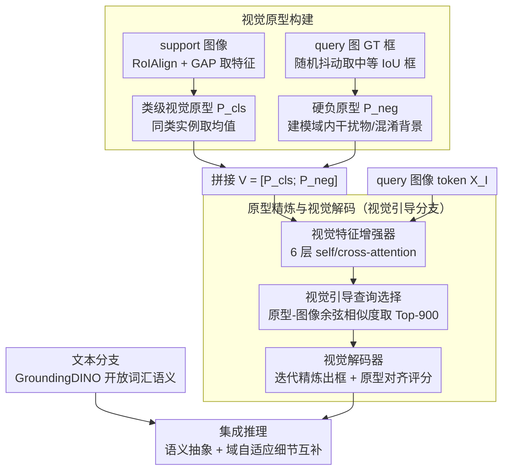

# Learning Multi-Modal Prototypes for Cross-Domain Few-Shot Object Detection

**会议**: CVPR 2026 Findings  
**arXiv**: [2602.18811](https://arxiv.org/abs/2602.18811)  
**代码**: 无  
**领域**: 目标检测  
**关键词**: 跨域少样本检测, 视觉原型, 多模态, GroundingDINO, 硬负样本

## 一句话总结
提出双分支框架 LMP，在 GroundingDINO 基础上引入视觉原型分支（正类原型+硬负原型），与文本分支联合训练并集成推理，在跨域少样本目标检测中取得 SOTA。

## 研究背景与动机
跨域少样本目标检测（CD-FSOD）要求在仅有少量标注的新域中检测新类别。基于 VLM 的开放词汇检测器（如 GroundingDINO）虽然迁移能力强，但完全依赖文本提示，存在两大系统性失败模式：

**语义-外观不匹配**：文本原型捕获类别语义但忽略目标域线索（如风格、纹理、光照），导致定位能力弱

**可混淆上下文**：少样本场景下，视觉相似的背景或近物体区域主导训练，产生大量误检

简单地将 support image 作为视觉提示并无帮助——非结构化特征混合了类别证据和偶然上下文，也未显式建模硬负样本。因此需要结构化的视觉原型来提供域自适应信息。

## 方法详解

### 整体框架

LMP 想解决的是：GroundingDINO 这类开放词汇检测器完全靠文本提示，跨域少样本时既抓不住目标域的风格纹理，又容易被视觉相似的背景骗到。它的做法是在原有文本分支旁边再挂一条**视觉引导分支**，把少量 support 图像里的视觉证据结构化成「原型」注入检测流程。整体流转是：文本分支照旧维持开放词汇语义；视觉分支先从 support 图构建正类原型和硬负原型，经特征增强器精炼后，用原型相似度选 query、再经视觉解码器输出框；两条分支联合训练，推理时把各自预测集成起来，让语义抽象和域自适应细节互补。

### 关键设计

**1. 类级视觉原型：给每个新类一个域内的视觉锚点**

文本提示只能描述类别语义，对「鞘翅目」这种粗粒度标签几乎给不出视觉引导。LMP 从 $C$-way $K$-shot 的 support 图像出发，对每个标注实例用 RoIAlign + GAP 提取特征，再对同类实例取均值得到类原型 $\mathbf{p}_c \in \mathbb{R}^{D_I}$，堆叠成 $\mathbf{P}_{\mathrm{cls}} \in \mathbb{R}^{C \times D_I}$。这些原型直接编码了目标域里每个类别长什么样，把缺失的视觉线索补回检测器。

**2. 硬负原型：把最常见的误检来源显式建模进训练**

CD-FSOD 的误检大多来自域特定的干扰物和视觉混淆背景，而单纯把 support 图当视觉提示并不会显式建模这些负样本。LMP 对 query 图里每个 GT box $b_j$ 做随机抖动采样 $N$ 个扰动框，只保留 $\mathrm{IoU} \in [0.1, 0.5]$ 的框，用 RoIAlign + GAP 提取负原型 $\mathbf{p}_{\mathrm{neg},j}^{(n)}$。这些原型刚好落在「像目标但不是目标」的区域。正负原型拼成 $\mathbf{V} = [\mathbf{P}_{\mathrm{cls}}; \mathbf{P}_{\mathrm{neg}}] \in \mathbb{R}^{N_V \times D_I}$，让模型在训练里就见过决策边界附近的难例，从而压住误检。

**3. 原型精炼与视觉解码：让原型和图像特征充分交互再出框**

有了原型还需要让它和当前 query 的图像特征对齐，否则原型是孤立的。视觉特征增强器用 6 层 self-attention + cross-attention 让图像 token $\mathbf{X}_I$ 与视觉原型 $\mathbf{V}$ 双向交互，输出精炼后的原型 $\mathbf{V}'$ 和图像 token $\mathbf{X}'_I$；视觉引导查询选择计算图像 token 与原型的余弦相似度矩阵，取 Top-900 初始化查询；视觉解码器镜像文本分支的跨模态解码器，迭代精炼输出类别 logits 和框回归，分类用原型对齐评分（余弦相似度）。这条链路让视觉分支与文本分支结构对称，集成时自然融合。

### 损失函数 / 训练策略
两分支均使用 focal 分类损失 + $L_1$ 框回归损失 + GIoU 损失：

$$\mathcal{L}_{\text{total}} = \mathcal{L}_{\text{text}} + \alpha \mathcal{L}_{\text{visual}}$$

其中 $\alpha = 1.0$。采用两阶段训练：第一阶段仅训练视觉分支，第二阶段联合训练。使用 Hungarian 匹配做一对一监督。硬负原型通过 attention 机制自然融入训练，无需额外对比损失。

## 实验关键数据

### 主实验

| 数据集 | Shot | LMP (Ours) | Domain-RAG (之前SOTA) | 提升 |
|--------|------|-----------|----------------------|------|
| Average (6域) | 1-shot | **34.3** | 33.6 | +0.7 |
| Average (6域) | 5-shot | **44.0** | 42.7 | +1.3 |
| Average (6域) | 10-shot | **46.6** | 45.4 | +1.2 |
| ArTaxOr | 1-shot | **58.5** | 57.2 | +1.3 |
| ArTaxOr | 5-shot | **75.0** | 70.0 | +5.0 |

相较 GroundingDINO 基线，LMP 在 1/5/10-shot 分别提升 8.0/3.6/2.1 mAP。

### 消融实验

| 配置 | 平均 mAP (5-shot) | 说明 |
|------|-------------------|------|
| 仅文本原型 (GD baseline) | 40.4 | 基线 |
| + 类级视觉原型 | 42.8 | 所有域均有提升 |
| + 硬负原型 | **44.0** | 所有域达到最优 |

超参数：硬负原型数 $N=3$ 最优（$N=5$ 略有下降），$\alpha=1.0$ 在所有 shot 设置下最优。

### 关键发现
- 在粗粒度标签数据集（ArTaxOr，昆虫分类名如"鞘翅目"）上提升最大——文本提示对这类类别提供的视觉引导极弱
- 1-shot 下提升最大（+8.0 mAP），说明多模态原型在极端数据稀缺场景最有效
- t-SNE 可视化显示硬负样本聚集在类别决策边界处，验证了负原型的作用
- 定性分析：Clipart 场景减少背景误检，NEU-DET 工业纹理分辨更准确，DeepFish 水下小鱼召回率提升

## 亮点与洞察
1. **双分支设计巧妙**：文本分支保持开放词汇能力，视觉分支提供域自适应，二者互补而非替代
2. **硬负原型设计直觉清晰**：通过 GT box 抖动生成负样本，直接建模检测中最常见的误检来源（背景干扰和部分重叠物体）
3. **视觉分支从文本分支初始化权重**：利用已有知识加速收敛，避免从头训练的不稳定性
4. **无需额外对比损失**：硬负原型通过 attention 机制自然融入训练，简洁高效
5. **在单张 RTX 3090 上即可训练**：计算资源需求合理，便于复现

## 局限与展望
- 双分支推理开销翻倍，实际部署时可考虑蒸馏到单分支（作者也提及此方向）
- 对非典型 support 样本敏感，极端异常的 support 图像会导致原型质量下降
- 硬负原型仅考虑 GT box 附近区域，可扩展到 ring/context 区域和 proposal 级别干扰物
- 可探索自适应原型构建（动态选择原型数量/权重）而非固定策略
- 文本/视觉分支的集成权重目前固定为 1:1，可考虑学习自适应融合

## 相关工作与启发
- 与 MQ-Det（在文本编码器中用 cross-attention 融合视觉样例）、VisTex-OVLM（将视觉样例投影为文本化 token）不同，LMP 设计独立的视觉分支，保持结构清晰
- CD-FSOD 领域：CD-ViTO 是首个正式基准，ETS 用网格搜索子域，Domain-RAG 用检索增强生成——LMP 是首个双分支多模态原型方案
- 硬负样本挖掘思路可推广到其他少样本任务（分割、实例检索、Re-ID）
- 双分支集成策略启发：可用类似思路将深度、热力图等其他模态信息注入检测管线

## 评分
- 新颖性: ⭐⭐⭐⭐ 双分支+硬负原型设计新颖，问题定义清晰
- 实验充分度: ⭐⭐⭐⭐ 6个跨域数据集×3种 shot 设置，消融完整
- 写作质量: ⭐⭐⭐⭐ 逻辑清晰，图示说明到位
- 价值: ⭐⭐⭐⭐ 对 CD-FSOD 领域有实际推动作用
<!-- END -->

<!-- RELATED:START -->

## 相关论文

- [\[CVPR 2026\] Remedying Target-Domain Astigmatism for Cross-Domain Few-Shot Object Detection](remedying_target-domain_astigmatism_for_cross-domain_few-shot_object_detection.md)
- [\[CVPR 2026\] A Closer Look at Cross-Domain Few-Shot Object Detection: Fine-Tuning Matters and Parallel Decoder Helps](a_closer_look_at_cross-domain_few-shot_object_detection_fine-tuning_matters_and_.md)
- [\[CVPR 2026\] DyFCLT: Dynamic Frequency-Decoupled Cross-Modal Learning Transformer for Multimodal Tiny Object Detection](dyfclt_dynamic_frequency-decoupled_cross-modal_learning_transformer_for_multimod.md)
- [\[CVPR 2026\] Bidirectional Multimodal Prompt Learning with Scale-Aware Training for Few-Shot Multi-Class Anomaly Detection](bidirectional_multimodal_prompt_learning_with_scale-aware_training_for_few-shot_.md)
- [\[CVPR 2026\] Evaluating Few-Shot Pill Recognition Under Visual Domain Shift](evaluating_few-shot_pill_recognition_under_visual_domain_shift.md)

<!-- RELATED:END -->
