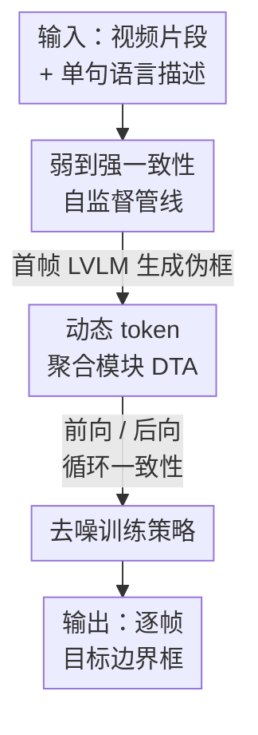

# Learning to Track Instance from Single Nature Language Description

**会议**: CVPR 2026  
**arXiv**: [2605.07064](https://arxiv.org/abs/2605.07064)  
**代码**: 无  
**领域**: 视觉-语言跟踪 / 自监督学习 / 多模态融合  
**关键词**: 自监督 VL 跟踪, 动态 token 聚合, 伪标签, 弱到强一致性, 语言引导

## 一句话总结
SVLTrack 提出了一种**完全不依赖任何边界框标注**的自监督视觉-语言跟踪框架：用大型视觉-语言模型（LVLM）为视频首帧生成伪框，在弱到强一致性下做前向/后向跟踪自监督，并设计动态 token 聚合模块（DTA）把语言 token 与少数关键视觉 token 紧密对齐，最终仅凭一句自然语言描述就能跟踪任意目标，在四个 VL 跟踪基准上超越现有自监督方法。

## 研究背景与动机
**领域现状**：视觉-语言（VL）跟踪希望用一句自然语言描述（而非繁琐的逐帧框）来指定并持续跟踪目标，是更直观、更省成本的人机交互方式。当前主流如 JointNLT、UVLTrack、DUTrack 都走全监督路线——在 LaSOT、TNL2K、OTB99 这些含百万级框标注的数据集上微调多模态融合模块。

**现有痛点**：①全监督方法严重依赖成千上万的边界框标注，标注耗时耗力（JointNLT 用到 LaSOT 的 352 万框、TNL2K 的 124 万框）；②它们把**所有**视觉 token 和语言 token 平等地丢进多头注意力做融合，带来大量冗余计算，也阻碍了视觉与语言表示之间的精确对齐——因为画面里大部分 token 是背景噪声，与语言描述无关。

**核心矛盾**：想摆脱框标注，就没有监督信号训练跟踪器；而平等融合所有 token 又让语言这个本应精准的语义信号被海量无关视觉 token 稀释。即"如何在无框标注前提下，让一句话精确地对齐到画面里真正的目标 token"。

**本文目标**：把 VL 跟踪从全监督推进到**自监督**——丢弃所有框标注，仅用单句隐式语言描述训练，并量化自然语言对跟踪的语义引导贡献。

**切入角度**：作者观察到 LVLM（如 APE、LISA）富含世界知识、能根据语言定位实例，于是只用它给**首帧**生成一个伪框作为起点（因为语言描述通常只与首帧语义对齐，随时间会失配，所以只信首帧）；再借时间循环一致性把无标注视频自身变成监督来源。

**核心 idea**：用"LVLM 伪标签 + 弱到强一致性自监督 + 不平等对待视觉 token 的动态聚合"取代"人工框标注 + 平等多模态融合"，让跟踪器从无标注视频里自主学会语言引导的实例跟踪。

## 方法详解

### 整体框架
SVLTrack 解决的是"只给一句话、没有任何框标注，如何训练出能跟踪任意目标的跟踪器"。整体分三步转起来：先用 LVLM 仅为视频首帧 $I_0$ 生成伪框 $\mathcal{B}_0 = LVLM(I_0, Q_{\text{text}})$ 作为起点；然后把每个无标注帧做弱增强 $A^w$（如中心抖动）和强增强 $A^s$（如颜色抖动）两份，进入"模板帧 + 搜索片段 + 语言描述"的跟踪网络，核心是动态 token 聚合模块（DTA）把语言与关键视觉 token 融合后送入预测头定位目标；最后约束"强增强帧的预测要尽量和弱增强帧一致"，并通过去噪策略剔除伪标签带来的脏样本。

网络含四个部件：视觉编码器 $\mathcal{E}_v$（ViT-Base + DropMAE 预训练）、语言编码器 $\mathcal{E}_l$（BERT）、动态 token 聚合模块 $\mathcal{M}$、预测头 $\mathcal{H}$。前向跟踪过程为：

$$\mathcal{F}_{vl} = \mathcal{M}(\mathcal{E}_v(\mathcal{V}), \mathcal{E}_l(Q_{\text{text}})), \quad \mathcal{B} = \mathcal{H}(\mathcal{F}_{vl} + \mathcal{E}_v(\mathcal{V}))$$

后向跟踪则把模板帧与搜索帧的角色互换、再跑一遍整个网络，形成时间循环一致性的双向闭环。总损失 $\mathcal{L}_{total} = \mathcal{L}_s + \mathcal{L}_u$，其中监督损失 $\mathcal{L}_s$ 只在带伪标签的首帧上算，无监督损失 $\mathcal{L}_u$ 在无标注视频帧上算。

### 关键设计

**1. 弱到强一致性自监督管线：把无标注视频自身变成监督来源**

没有框标注就无法像全监督那样训练，这是自监督跟踪的根本障碍。SVLTrack 先用 LVLM 仅给首帧 $I_0$ 生成伪框 $\mathcal{B}_0$（只信首帧是因为语言描述随目标外观/运动变化会逐渐失配），把首帧当作带（弱）标签的模板。然后对每个无标注帧做两种增强：弱增强 $A^w$（中心抖动，几何上轻微扰动）和强增强 $A^s$（颜色抖动，外观上大幅扰动）。训练目标是让**强增强帧的预测尽量逼近弱增强帧的预测**——弱增强结果更可靠、充当临时"教师"，强增强结果充当"学生"，从而把无标注视频里目标的外观与运动线索榨取出来。配合时间循环一致性，前向跟踪（模板→搜索）和后向跟踪（搜索→模板，角色互换再跑一遍）构成双向约束，进一步增加样本多样性、让模型自主学到更丰富的表示。消融显示去掉弱到强框架 AUC 掉 0.9%

**2. 动态 token 聚合模块（DTA）：不平等对待视觉 token，让语言只对齐到真正的目标**

传统融合把全部视觉 token 平等送进多头自注意力（MHSA），背景 token 占多数却被一视同仁，既冗余又稀释了语言的语义。DTA 插在 MHSA 层与 MLP 层之间，分三步只挑最有判别力的视觉 token 与语言对齐。**Step 1 选目标 token**：引入一个初始化为零的 anchor token 来学习目标外观表示，把 anchor、语言、模板、搜索 token 沿空间维拼接送入多头注意力得到注意力分数；用 anchor 与模板帧的交叉注意力 $Attn_{az}$ 衡量每个模板 token 的重要性，取 TopK 选出目标 token $T_z = TopK(\mathcal{F}_z, Attn_{az})$，且其数量动态调整到与语言 token 数对齐以平衡模态。**Step 2 聚合进语言 token**：先按注意力分数把选出的 $T_z$ 合并以保留最具判别力的视觉信息，再聚合进语言 token 得到融合特征 $\mathcal{F}_{vl} = Merging(T_z, \mathcal{F}_l)$，在视觉与语言之间建立更紧的语义连接、同时削减冗余计算。**Step 3 净化搜索 token 做时间关联**：融合后的语言 token 充当引导信号，从搜索帧里挑出潜在目标 token $T_s = TopK(\mathcal{F}_s, Attn_{ls})$（$Attn_{ls}$ 是语言 token 与搜索帧的交叉注意力），过滤掉无关噪声 token，并把净化后的目标 token 传播到后续帧、强化时间提示。这三步让模型在弱目标线索下也能自主学到实例级跟踪，是全文性能的主贡献——去掉 DTA AUC 掉 1.1%（消融里掉点最多）

**3. 去噪训练策略：剔除 LVLM 伪标签引入的脏样本**

LVLM 生成的伪框难免粗糙或不准，直接拿来训练会让自监督学习不稳定。作者借跟踪器训练时产出的分类得分图 $\mathcal{P}_c$ 和回归得分图 $\mathcal{P}_r$，计算**强增强帧分类得分图**与**由弱增强帧预测框生成的伪高斯图** $\mathcal{G}$ 之间的欧氏距离 $\mathcal{D}(\mathcal{P}_c, \mathcal{G}) = \|\mathcal{P}_c - \mathcal{G}\|_2^2$，按距离排序，把距离最大的 top-K%（实测取 20%）判为噪声样本、从损失计算中丢弃。消融对比表明欧氏距离比交叉熵更能刻画样本整体差异（AUC 52.5% vs 47.9%），去掉去噪 AUC 掉 0.5%。对保留的正常样本，用 Focal 分类损失 $\mathcal{L}_{cls}$、GIoU 损失和 $\mathcal{L}_1$ 损失联合优化

### 损失函数 / 训练策略
单帧/单样本损失为 $\mathcal{L} = \mathcal{L}_{cls} + \lambda_1 \mathcal{L}_1 + \lambda_2 \mathcal{L}_{GIoU}$（同时用于 $\mathcal{L}_s$ 与 $\mathcal{L}_u$）。训练数据为 LaSOT + TNL2K + OTB99；AdamW 优化，backbone 学习率 $2.5\times10^{-5}$、其余 $2.5\times10^{-4}$，weight decay $10^{-4}$，150 epochs（120 epoch 后学习率 ×0.1），每 epoch 随机采 1 万对图像，4×80GB A800、batch 16。视觉编码器 ViT-Base（DropMAE 预训练）、语言编码器 BERT；每个视频片段含 3 个无标注帧 + 1 个带伪标签的初始帧。SVLTrack-384 在 A100 上跑 56 FPS。

## 实验关键数据

### 主实验
四个 VL 跟踪基准（LaSOT / LaSOText / TNL2K / OTB99）。SVLTrack-L 为"仅语言初始化"的自监督 VL 跟踪变体，SVLTrack-V 为"仅初始框"的自监督视觉跟踪变体。AUC 为成功率，P 为精度。

| 基准 | 指标 | SVLTrack-L384(仅语言) | ATTracker(NL+BBox) | 提升 |
|--------|------|------|----------|------|
| TNL2K | AUC | 43.9 | 40.6 | +3.3 |
| LaSOT | AUC | 53.9 | 48.9 | +5.0 |
| OTB99 | AUC | 66.7 | 55.5 | +11.2 |
| LaSOext | AUC | 35.2 | — | — |

> 注：正文称 SVLTrack-L256 相比 ATTracker 在 TNL2K/LaSOT/OTB99 的 AUC 各提升 1.9% / 3.6% / 9.9%；上表用 L384 变体口径，数字略大于 L256。

| 基准 | 指标 | SVLTrack-V256(仅框,自监督) | Diff-Tracker(无监督) | 提升 |
|--------|------|------|----------|------|
| LaSOT | AUC | 65.1 | 48.6 | +16.5 |
| OTB99 | AUC | 67.9 | 66.1 | +1.8 |

视觉变体 SVLTrack-V 全面超越所有无监督跟踪器，并在 LaSOext 上把与全监督方法的差距大幅缩小（V384 AUC 49.7%，逼近全监督 ARTrack 的 51.9%、ODTrack 的 52.4%）。

### 消融实验
（LaSOT 基准，SVLTrack 完整模型 AUC 52.5%）

| 配置 | AUC | PNorm | P | 说明 |
|------|------|------|------|------|
| Full model | 52.5 | 60.0 | 52.3 | 完整模型 |
| − 弱到强一致性 | 51.6 | 59.1 | 51.1 | 掉 0.9% |
| − DTA | 51.4 | 59.0 | 50.8 | 掉 1.1%（最关键） |
| − 去噪 | 52.0 | 59.7 | 51.4 | 掉 0.5% |

| 分析项 | 配置 | AUC | 结论 |
|------|------|------|------|
| 搜索 token 数 | 4 / 8 / 16 | 51.9 / 52.5 / 52.1 | 8 个最优，过多引入背景噪声 |
| 噪声度量 | 交叉熵 / 欧氏距离 | 47.9 / 52.5 | 欧氏距离更鲁棒 |
| LVLM 选型 | LISA / APE | 48.4 / 52.5 | APE 的实例级感知生成更好伪框 |

### 关键发现
- **DTA 贡献最大**：去掉后 AUC 掉 1.1%，证明"不平等对待视觉 token、动态选关键 token 与语言对齐"是核心增益来源。
- **搜索 token 数有最优解**：4→8 提升 0.6%，再加到 16 反而下降——token 过多会引入非目标区域噪声，破坏稳定性。
- **伪标签质量是上限**：APE（实例级感知）比 LISA（推理分割）生成的伪框更贴合语言描述，AUC 高 4.1%，说明跨模态理解编码器的鲁棒性直接决定自监督上限。
- **去噪比例 20% 最佳**：欧氏距离 + 20% 丢弃比例给出跨场景最鲁棒的自监督跟踪器。

## 亮点与洞察
- **首次把 VL 跟踪推到纯自监督（仅一句话）**：丢掉所有框标注，仅凭单句语言描述训练，并显式量化语言对跟踪的语义引导贡献，是任务设定上的实质推进。
- **"只信首帧伪标签"是个朴素却关键的判断**：作者意识到语言描述随时间会与目标外观/运动失配，所以只让 LVLM 标首帧、后续靠视频自身的循环一致性，避免了被错误伪标签持续污染——这点比"全程生成伪标签再多阶段训练"（如 ATTracker）更干净。
- **anchor token + TopK 的"不平等融合"思路可迁移**：用一个可学的零初始化 anchor 当"重要性探针"去 TopK 选 token，把模态对齐从"全量平等"变成"少而精"，这套机制对任何需要语言精确定位到视觉局部的任务（指代分割、grounding）都有借鉴价值。
- **欧氏距离优于交叉熵做噪声筛选**（52.5 vs 47.9）是个实用 trick：在伪标签训练里，得分图整体差异比逐点分布差异更能识别脏样本。

## 局限与展望
- **作者承认**：伪标签生成受限于 LVLM 的能力，伪框质量直接影响跟踪结果；提升目标身份信息的质量是进一步增益的关键。
- **自监督与全监督仍有差距**：SVLTrack-L384 在 TNL2K 仅 43.9% AUC，远低于全监督 DUTrack 的 64.9%；语言-only 自监督在 LaSOext 这类长尾/外观变化大的场景上掉得更明显（L384 仅 35.2%），说明纯语言线索在复杂场景下仍不够。
- **依赖外部大模型**：整套管线把"理解语言并定位"的重活外包给了 APE/LISA，本质上是在 LVLM 已具备 grounding 能力的前提下做下游跟踪自适应；若换到 LVLM 不熟悉的开放词表目标，伪框可能直接失效。
- **改进思路**：可探索多帧/在线伪标签自纠正（而非只信首帧）、用跟踪置信度反过来给 LVLM 提供时序反馈，或引入更轻量的 grounding 模型降低对重型 LVLM 的依赖。

## 相关工作与启发
- **vs JointNLT / UVLTrack / DUTrack（全监督 VL 跟踪）**：它们在百万级框标注上微调多模态融合，且平等融合所有 token；本文丢掉全部框标注、只用一句话自监督，并用 DTA 不平等地挑关键 token。优势是零框标注成本，劣势是绝对精度仍落后（TNL2K AUC 43.9 vs DUTrack 64.9）。
- **vs ATTracker（半监督 VL 跟踪）**：ATTracker 微调大模型生成冗余伪标签再做复杂多阶段训练，易受噪声伪标签拖累；本文只用首帧伪框 + 弱到强一致性 + 去噪策略，更简洁，自监督设定下 AUC 反超 ATTracker（如 OTB99 +9.9%）。
- **vs Diff-Tracker / SSTrack（无监督/自监督视觉跟踪）**：它们靠光流/扩散/循环一致性生成视觉伪标签，不引入语言；本文把语言作为目标参考信号引入自监督，视觉变体 SVLTrack-V 仍全面超越（LaSOT 比 Diff-Tracker +16.5%）。
- **启发**：当下游任务缺标注时，"用富含世界知识的基础模型生成稀疏可靠的种子标签（只标最可信的首帧）+ 数据自身的一致性约束做自监督 + 主动剔除脏样本"是一条通用且低成本的范式。

## 评分
- 新颖性: ⭐⭐⭐⭐ 首次实现仅靠单句语言、零框标注的自监督 VL 跟踪，任务设定与 DTA 机制都新。
- 实验充分度: ⭐⭐⭐⭐ 覆盖四基准 + 全监督/无监督多类对比 + 五组消融（模块/token 数/噪声度量/LVLM/去噪比例）。
- 写作质量: ⭐⭐⭐⭐ 方法三步清晰、动机推导扎实；伪标签质量瓶颈坦诚交代。
- 价值: ⭐⭐⭐⭐ 大幅降低 VL 跟踪标注成本，伪标签+一致性+去噪范式对其他自监督任务有迁移价值。

<!-- RELATED:START -->

## 相关论文

- [\[CVPR 2026\] Mining Instance-Centric Vision-Language Contexts for Human-Object Interaction Detection](mining_instance-centric_vision-language_contexts_for_human-object_interaction_de.md)
- [\[CVPR 2026\] Object-Generalized Re-Identification: A Step Towards Universal Instance Perception](object-generalized_re-identification_a_step_towards_universal_instance_perceptio.md)
- [\[CVPR 2026\] Expert-Teacher-Student Collaborative Learning for Domain Adaptive Object Detection](expert-teacher-student_collaborative_learning_for_domain_adaptive_object_detecti.md)
- [\[CVPR 2026\] LocateAnything3D: Vision-Language 3D Detection with Chain-of-Sight](locateanything3d_vision-language_3d_detection_with_chain-of-sight.md)
- [\[CVPR 2026\] VisualAD: Language-Free Zero-Shot Anomaly Detection via Vision Transformer](visualad_language-free_zero-shot_anomaly_detection_via_vision_transformer.md)

<!-- RELATED:END -->
