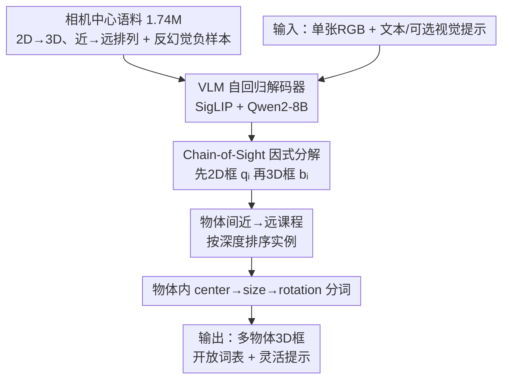

# LocateAnything3D: Vision-Language 3D Detection with Chain-of-Sight

**会议**: CVPR 2026  
**论文**: [CVF Open Access](https://openaccess.thecvf.com/content/CVPR2026/html/Man_LocateAnything3D_Vision-Language_3D_Detection_with_Chain-of-Sight_CVPR_2026_paper.html)  
**代码**: 无（⚠️ 论文正文未给出地址）  
**领域**: 目标检测（开放词表单目 3D 检测 / 视觉语言模型）  
**关键词**: 单目 3D 检测、视觉语言模型、Chain-of-Sight、自回归解码、开放词表

## 一句话总结
LocateAnything3D 把单目多物体 3D 检测改写成 VLM 的 next-token 预测——先让解码器吐 2D 框当「视觉思维链」，再按近→远、center→size→rotation 的课程解 3D 框，无需任何专用 3D 头就在 Omni3D 上把 AP3D 从 24.92 拉到 38.90。

## 研究背景与动机
**领域现状**：VLM 在 2D 开放世界感知（定位、描述、推理）上已经很强，一个模型一个解码接口就能跨域处理任意图像内容；而单目 3D 检测仍是 VLM 工具箱里缺失的一块。

**现有痛点**：传统单目 3D 检测器在窄域内表现好，但依赖任务专用头、封闭标签空间和精标定相机，丢掉了 VLM 的通用性、组合性和指令跟随能力。近期尝试要么给开放词表 2D 检测器外挂一个专用 3D 头（OVMono3D、DetAny3D），要么用辅助几何输入 prompt 基础模型，但大多只解决单物体 grounding，或引入破坏 VLM 简洁性的定制模块。

**核心矛盾**：3D 框需要同时预测中心、尺寸、朝转三组强耦合参数，单目线索本就模糊；若让自回归解码器一上来直接吐 3D，早期 token 既难又信息量低，远处模糊物体会污染整个序列前缀，导致后续解码崩坏。

**本文目标**：找到「最 VLM-native 的配方」，让多物体单目 3D 检测在不加专用头、不破坏 text/visual prompt 接口的前提下直接 work。

**切入角度**：人类看图常常是「先认出 2D 里是什么、在哪」，再推断距离、大小、姿态。作者把这套先 2D 后 3D 的视觉推理顺序搬进自回归解码——早期 token 应当简单、信息量大、可归因。

**核心 idea**：用 Chain-of-Sight（CoS）——把每个实例的 2D 框当作高置信度的「视觉思维链」先吐出来，锚住像素证据，再解 3D 框；并配合近→远的物体间课程和 center→size→rotation 的物体内分词，把开放世界单目 3D 检测变成一个「简单、可学、好解码」的 next-token 问题。

## 方法详解

### 整体框架
输入是单张 RGB 图加自由文本查询（可选视觉提示：拖框/点击），驱动一个自回归 VLM 解码器吐出一段结构化序列：每个实例先 2D 框 $q_i$、紧跟 3D 框 $b_i$，直到 `<eos>`。整套设计有三层课程——物体间按近→远排序、物体内用 2D 当 CoS 引出 3D、3D 内部按 center→size→rotation 分词；训练语料则被构造成「正好按解码顺序（先 2D 后 3D、先近后远）呈现」的相机中心格式。

### 关键设计

**1. Chain-of-Sight 因式分解：用 2D 框当视觉思维链锚住 3D**

针对「直接解 3D 早期 token 又难又易幻觉」的痛点，CoS 把 2D 与 3D 在 token 序列里交错：解码器吐 $S=(q_1,b_1,q_2,b_2,\dots,\langle eos\rangle)$，每个 2D 框 $q_i$ 紧跟其 3D 框 $b_i$。条件概率分解为 $P(S\mid I,c)=\prod_i \underbrace{P(q_i\mid I,c,S_{<i})}_{\text{2D 定位}}\underbrace{P(b_i\mid I,c,S_{<i},q_i)}_{\text{3D 估计}}\cdot P(\langle eos\rangle\mid\cdot)$。相比直接对 3D 框做自回归（式 $P(B\mid I,c)=\prod_i P(b_i\mid I,c,b_{<i})$），这个中间的 $q_i$ 做了三件事：把搜索聚焦到正确像素、把 3D token 绑到可见证据上以减少幻觉、契合「早 token 应简单且信息量大」的自回归特性。这和文本 CoT 稳定难推理是同一道理——先 commit 到图像空间，再解 3D。它还天然支持视觉提示：用户给个框/点，解码器可直接续写该实例的 3D token，不切换头也不换损失。

**2. 物体间近→远课程：按深度排序，让高证据实例先解**

传统 2D 检测器序列化时常用扫描线/从左到右顺序，但它与 3D 几何无关——2D 相邻的两个框可能深度差很大，模糊的远处实例若排在序列前面会带偏后续解码。本文改为按 3D 中心深度近→远排序。近物体先解有三重好处：① 效用（近物体对交互/安全最重要）；② 证据质量（近物体单目线索更强、早期 token 更可信）；③ 上下文（近处几何一旦确定，可通过相对尺度和遮挡关系约束远处物体的尺寸与深度）。把模糊的远处实例放到序列尾部，避免它们污染前缀。消融显示随机序最差（17.5）、扫描线次之（30.6）、近→远最好（33.1）。

**3. 物体内 center→size→rotation 分词：按可观测性排序参数，稳住学习**

一个 3D 框 $b_i=(t_i,d_i,R_i)$（相机系中心 $t\in\mathbb{R}^3$、米制尺寸 $d\in\mathbb{R}_+^3$、旋转 $R\in SO(3)$）有多种表示。基于角点的编码列 8 个顶点，对自回归解码器是歧义的（哪个角先来？）且放大早期 token 误差。本文改用语义有序的三元组并固定解码顺序 center→size→rotation，对应「在哪→多大→怎么转」的可观测性递减：位置先定，可约束后面的尺度；尺度定了再解朝转更稳。框预测在相机系而非世界系，避免模型估计随数据集/相机变化的场景级坐标，提升跨域泛化；旋转支持完整 $SO(3)$ 或在直立假设（如驾驶场景）下的 yaw 主导参数化。消融显示 CSR（33.1）优于 CRS（32.9）优于 RSC（28.8），证明「先定位、再尺度、最后朝转」最易学。

**4. 相机中心大规模语料 + 反幻觉负样本：把监督摆成模型将要解码的顺序**

CoS 要端到端训练，就得让监督「正好按解码顺序呈现」。作者把 ARKitScenes、SUN-RGBD、Hypersim、Objectron、KITTI、nuScenes 六个数据集统一成共享 JSONL，保留相机内参、采用相机坐标系。Stage I 做规范化多框归一：每张图每类一行、按深度排序所有实例，按可见度>0.16、截断<0.84 过滤模糊监督，约 480K 条多物体条目；又用强 VLM 自动标注约 1.0M 单物体 grounding 描述（含对比 A/B 重渲染等唯一性校验）。Stage II 把语料打包成两轮对话（human prompt + model response，response 内按 CoS 把 2D 框紧跟 3D 框、多物体保持近→远序）。还显式监督「无匹配」行为：采样缺席类别（含语义相近的 hard negative 如 car/van），让模型对不存在的查询吐 `<no object/>` 哨兵 token，负样本上限 10%（每图至多 2 个）。最终约 1.74M 训练对话，覆盖室内外、多相机装置。

### 损失函数 / 训练策略
先做一个 2D 检测与 grounding 预训练阶段，专练从文本/视觉提示预测 2D 框，建立强 2D 定位基础；再对完整 CoS 序列（2D→3D）端到端训练，目标是 token 序列上的标准交叉熵。实现基于 SigLIP 视觉编码器 + Qwen2-8B 主干 + 轻量 MLP projector，图像切成至多 12 个自适应 tile 加一张全局缩略图（每张 448 像素），bfloat16 + FlashAttention 2、动态在线打包填满 16384-token 上下文，AdamW（lr 1e-5、weight decay 0.05、余弦调度、3% warm-up）、ZeRO-3 + 梯度检查点，64 张 H100 训 46 小时、共 37K 步。

## 实验关键数据

**关键指标说明**：AP3D 为 3D 平均精度，在体积式 3D IoU 阈值 $\tau\in\{0.05,0.10,\dots,0.50\}$ 上扫描求平均；评测采用 target-aware 协议（每图只用其标注中实际出现的类别做 prompt），聚焦 3D 定位质量而非类名对齐。

### 主实验
Omni3D 完整基准（室内外统一）3D 检测，AP3D：

| 方法 | 是否需外部/真值 2D | AP3D ↑ |
|------|------------------|--------|
| OVMono3D | 需外部 2D 检测器 | 22.98 |
| Cube R-CNN | 闭词表 | 23.26 |
| DetAny3D | 可提示 3D | 24.92 |
| DetAny3D w/ 真值 2D 框 | 给定真值 2D | 34.38 |
| **LocateAnything3D（本文）** | 单图端到端、无外部 2D | **38.90** |

要点：本文 38.90 AP3D 比之前最好（DetAny3D 24.92）绝对涨 +13.98；即便对手拿到真值 2D 框（34.38），本文端到端仍高出 +4.52——说明「在单一自回归接口里联合学 2D 和 3D」比「给外部 2D proposal 外挂 3D 头」更有效。室外-only 赛道（Omni3D OUT）本文 36.1 AP3D，也超过 DetAny3D（32.2）及其拿真值 2D 框的版本（35.9）。

零样本新类（训练未见，target-aware）AP3D：

| 方法 | KITTI 新类 | SUN-RGBD | ARKitScenes |
|------|-----------|----------|-------------|
| OVMono3D + Grounding-DINO 2D | 4.71 | 16.78 | 13.21 |
| DetAny3D + Grounding-DINO 2D | 25.73 | 21.07 | 24.56 |
| **LocateAnything3D（单图、无外部 2D）** | **25.87** | **26.33** | **29.06** |

本文在所有三个基准上零样本最强，相对 DetAny3D+2D 分别 +0.14/+5.26/+4.50；且对手都依赖外部 2D 检测器供 proposal，本文单图端到端联合预测 2D+3D，支持「先 2D 后 3D」迁移到未见类别。

### 消融实验
Omni3D OUT 上三层设计逐项消融（APout3D）：

| 设计层 | 变体 | APout3D ↑ |
|--------|------|-----------|
| 物体间课程 | 随机序 | 17.5 |
| 物体间课程 | 从左到右 | 30.6 |
| 物体间课程 | **近→远** | **33.1** |
| 物体内因式分解 | 无 2D（直接 3D） | 22.7 |
| 物体内因式分解 | 先 3D 后 2D | 26.2 |
| 物体内因式分解 | **先 2D 后 3D（CoS）** | **33.1** |
| 3D 内分词 | Rotation-Size-Center | 28.8 |
| 3D 内分词 | Center-Rotation-Size | 32.9 |
| 3D 内分词 | **Center-Size-Rotation** | **33.1** |

### 关键发现
- 去掉 2D 思维链最伤：直接解 3D 暴跌到 22.7，先 3D 后 2D 也只 26.2，远不如 CoS（33.1）——证明先 commit 像素证据让 3D token 更易学、更校准。
- 序列位置携带语义：随机序最差（17.5），说明在自回归解码里 token 顺序本身是信息；近→远课程比扫描线（30.6）更稳。
- 分词顺序有讲究：先定位再尺度最后朝转（CSR 33.1）最优，把旋转推迟到尺度之后能稳住姿态估计。
- 端到端 > 外挂头：即使对手获得真值/外部 2D 框仍落后，凸显联合学 2D-3D 的接口优势。

## 亮点与洞察
- 把「文本 CoT 稳定推理」类比到「2D 作为视觉 CoT 稳定 3D」，是个很漂亮的跨模态迁移——任何「先易后难、早 token 应可归因」的结构化预测都能借鉴这种显式中间证据的思路。
- 「按自回归课程对齐监督」是核心工程洞察：不仅设计模型，还把数据按解码顺序（近→远、2D→3D）排好，让训练分布和解码分布一致，这种「数据-解码协同设计」值得迁移到其他序列化结构预测任务。
- 用 center→size→rotation 的可观测性排序替代角点编码，简单却把早期误差放大问题直接解决，体现了对自回归误差累积的理解。
- 不加任何专用 3D 头就拿 SOTA，保住了开放词表 + 视觉提示的统一接口，对「VLM 当具身智能感知底座」是很有说服力的一步。

## 局限与展望
- 训练成本高：64 张 H100 × 46 小时、1.74M 对话语料，复现门槛不低；模型基于 8B Qwen2，推理也不轻。⚠️
- 仍是单目单图：未利用视频/多视角时序，远处物体的固有歧义只能靠课程缓解而非真正消除；作者也把视频、多视角推理列为未来方向。
- 依赖相机内参（已知或估计）做投影，内参不准时的鲁棒性正文未充分讨论。⚠️
- 论文未在正文给出失败案例细节（放在补充材料），对遮挡/截断的极端情形定量分析有限。
- 可改进：把 CoS 扩展到时序一致的 4D 检测，或引入强化学习进一步优化解码课程。

## 相关工作与启发
- **vs OVMono3D / DetAny3D**：二者把开放词表 2D 检测「抬升」到 3D，或给基础模型外挂可提示 3D 头，需外部 2D 检测器供 proposal；本文在同一解码器里联合预测 2D 和 3D，端到端、无外挂，AP3D 与零样本迁移都明显更高。
- **vs Cube R-CNN（Omni3D 基线）**：闭词表专用检测器，跨域鲁棒性受限；本文 VLM-native 解码保留开放词表与指令跟随，38.90 vs 23.26。
- **vs 角点式 3D 编码**：角点编码对自回归解码歧义且放大早期误差；本文 center→size→rotation 语义有序分词更可学、更校准。
- **vs 文本 CoT**：把语言里的思维链思想迁到视觉——2D 框即「视觉 CoS」，为「VLM 做结构化几何预测」提供了通用范式。

## 评分
- 新颖性: ⭐⭐⭐⭐⭐ 首次把多物体单目 3D 检测改写成纯 next-token 问题，CoS + 双层课程的框架既简洁又新。
- 实验充分度: ⭐⭐⭐⭐ Omni3D 主榜 + 零样本新类 + 三层完整消融，证据扎实；失败案例与内参鲁棒性分析放补充、正文略简。
- 写作质量: ⭐⭐⭐⭐⭐ 动机推导层层递进，把「为什么先 2D、为什么近→远、为什么 CSR」讲得非常清楚。
- 价值: ⭐⭐⭐⭐⭐ 把开放词表识别与米制 3D 理解打通，且保留统一 VLM 接口，对具身感知是重要一步。

<!-- RELATED:START -->

## 相关论文

- [\[CVPR 2026\] Mining Instance-Centric Vision-Language Contexts for Human-Object Interaction Detection](mining_instance-centric_vision-language_contexts_for_human-object_interaction_de.md)
- [\[CVPR 2026\] CrossVL: Complexity-Aware Feature Routing and Paired Curriculum for Cross-View Vision-Language Detection](crossvl_complexity-aware_feature_routing_and_paired_curriculum_for_cross-view_vi.md)
- [\[CVPR 2026\] VisualAD: Language-Free Zero-Shot Anomaly Detection via Vision Transformer](visualad_language-free_zero-shot_anomaly_detection_via_vision_transformer.md)
- [\[CVPR 2026\] Saliency-R1: Enforcing Interpretable and Faithful Vision-language Reasoning via Saliency-map Alignment Reward](saliency-r1_enforcing_interpretable_and_faithful_vision-language_reasoning_via_s.md)
- [\[CVPR 2026\] Back to Point: Exploring Point-Language Models for Zero-Shot 3D Anomaly Detection](back_to_point_exploring_point-language_models_for_zero-shot_3d_anomaly_detection.md)

<!-- RELATED:END -->
