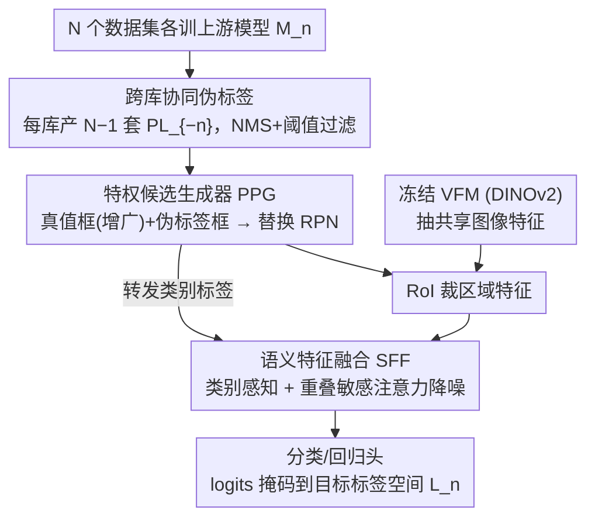

# Mind the Gap: Transferring Labels to Align Object Detection Datasets

**会议**: CVPR 2026  
**论文**: [CVF Open Access](https://openaccess.thecvf.com/content/CVPR2026/html/Kennerley_Mind_the_Gap_Transferring_Labels_to_Align_Object_Detection_Datasets_CVPR_2026_paper.html)  
**代码**: 待确认  
**领域**: 目标检测 / 多数据集训练  
**关键词**: 多数据集目标检测、标签对齐、伪标签、特权信息、类别感知注意力

## 一句话总结
本文提出 Label-Aligned Transfer（LAT）框架，把多个标注口径各异的检测数据集的标注，**多对一**地投影进某个固定目标数据集的标签空间——通过特权候选生成器 PPG（用真值+跨库伪标签替换 RPN）与语义特征融合 SFF（类别感知注意力降噪），同时解决类别语义不一致与边框风格不一致，在多个基准上最高 +8.4 AP。

## 研究背景与动机

**领域现状**：合并多个检测数据集是提升泛化、扩充类别覆盖的常见手段，尤其在标注稀缺/昂贵的领域。现有做法分两派：模型中心法（model-centric）靠视觉-语言对齐或本体图构建一个共享标签空间；数据中心法（data-centric）把源数据集标注投影到目标标签空间。

**现有痛点**：把标签空间不同的数据集**朴素合并**，会引入类别语义、标注粒度、背景定义、边框风格四重不一致（如图 1：Cityscapes 把骑车人和自行车分开标，Waymo/nuImages 当成一个实体却给不同类名；nuImages 粒度最细，Waymo 最粗）。模型中心法虽利于"平均泛化"，却不保真到某个特定目标标签空间；数据中心法又往往依赖人工重映射、只支持一对一迁移、或只对齐边框而不管语义错配。人工重标在规模化时不可行，标签定义差异大时几乎等于从头标。

**核心矛盾**：缺乏配对监督——同一张图的真值**从不会**同时以源、目标两种标签空间出现，因此无法直接学到类别定义或边框约定之间的映射；再加上类别稀疏、语义重叠、命名不一致，跨库标签迁移格外难。

**本文目标**：在**不统一标签空间、不依赖人工映射**的前提下，把所有源数据集的标注（含类别 + 边框）迁移进一个固定目标数据集 $n$ 的标签空间 $L_n$，即实现 $L_{-n} \to L_n$ 的多对一迁移，同时修正语义（类别）与空间（边框）两类不一致。

**切入角度**：作者不去强行统一标签，而是让**每个数据集各训一个检测器**，互相在对方标签空间里产伪标签——这些跨库伪标签充当数据集之间的"隐式桥梁"；再以真值为锚，把伪标签当成有噪声的对齐提示，靠多源训练学语义+空间对应关系。

**核心 idea**：用"跨库协同伪标签 + 特权信息（真值+伪标签）直接在候选/特征层对齐"代替"本体统一/嵌入统一"，在区域级和特征级直接迁移标签，避免语义漂移、保住各库细粒度。

## 方法详解

### 整体框架
LAT 扩展标准两阶段检测器（特征提取器 + RPN + RoI）来注入"特权信息"。第一步：为每个数据集 $D_n$ 各训一个上游模型 $M_n$（在其原生标签空间 $L_n$ 上专门化），再用每个 $M_m$（$m\neq n$）去跑 $D_n$ 的图，得到 $N-1$ 套跨标签空间的伪标签 $PL_{-n}$，经 NMS 与置信度阈值过滤。第二步训练下游模型：把特征提取器换成**冻结的视觉基础模型 VFM（DINOv2）**抽共享特征；用**特权候选生成器 PPG** 替换 RPN——它不预测、只把真值框（经轻微抖动/随机删除增广）与伪标签框一起当候选喂给 RoI，并把对应类别标签转发给 SFF；RoI 裁出区域特征后，**语义特征融合 SFF** 用类别感知、重叠敏感的注意力精炼特征、压制噪声伪标签；最后分类 logits 被掩码到当前 batch（训练）或目标标签空间（推理）所含类别，再算损失。

### 关键设计

**1. 跨库协同伪标签：用各库专属检测器互相搭"隐式桥梁"**

没有配对监督，就没法直接学标签映射。LAT 绕开它：每个数据集 $D_n$ 训一个上游模型 $M_n$ 专门拟合自己原生标签空间 $L_n$，然后让每个 $M_m$（$m\neq n$）去标注 $D_n$ 的图，于是每个数据集得到 $N-1$ 套伪标签 $PL_{-n}$、全局共 $N(N-1)$ 套投影。形式上框架在三元组 $\{I_n, \{PL^{(m\to n)}\}_{m\neq n}, GT_n\}$ 上操作。这些跨空间预测充当数据集之间的隐式桥梁——因为不同库的标注常在同一物体上重叠（如 Cityscapes 的 car 对应 Waymo 的 vehicle），多套伪标签彼此印证、再以真值为锚，就能用多源、类集成的协同训练学出类别+边框对应，同时稀释单套伪标签的噪声。关键约定：为保持标签离散性，**把所有库的标签集拼接（concatenate）而非按同名合并**，防止文本同名但语义不同的类被误并。

**2. 特权候选生成器 PPG：用真值+伪标签替换 RPN，制造跨库重叠监督**

标准 RPN 产类无关候选，但它丢掉了"这块区域在别的库里被标成什么"这一宝贵信号。PPG 完全**非预测**——既不生成候选也不估类别，只接收真值框（施加随机抖动、选择性删框等轻增广）与伪标签框，连同其类别标签一起转发给 RoI 层裁特征、并送进 SFF。因为这些标注来自多个标签空间，即便文本类名不同，也常在同一物体上产生**重叠区域**（car↔vehicle），这种重叠正是 SFF 学跨库对应的核心监督来源。换言之，PPG 把"特权信息"（当前图的真值类别+边框、以及其它标签空间的伪标签）显式注入检测管线，让模型见识多样的标注风格。

**3. 语义特征融合 SFF：类别感知注意力 + 行级阈值压制噪声伪标签**

伪标签有噪声，直接用会污染特征。SFF 在 $M$ 个 RoI 候选上做缩放点积注意力 $A=\frac{QK^\top}{\sqrt{d}}$（$Q,K\in\mathbb{R}^{M\times d}$ 是 RoI 特征的投影），并引入两路 value：$V_c$ 来自分类分数线性投影、$V_r$ 来自区域特征投影。再定义置信向量 $S_c\in\mathbb{R}^M$，真值候选取 1、伪标签候选取 $\max(C_m)$（该候选分类分向量的最大值），用它给特征分支注意力加权、优先可信伪标签。为压制噪声，对**分类分支**的注意力矩阵做**行级缩放**：每行最大值被截断在阈值 $T=1/\sqrt{N}$（$N$ 为数据集数）——这鼓励聚合多个库重叠印证的伪标签、压制只在单库孤立出现（更可能错）的预测。最终融合特征为

$$SA = \text{clamp}(\text{softmax}(A))\,V_c + \text{softmax}(S_c \circ A)\,V_r$$

其中 $\circ$ 为逐元素乘，softmax 按行做，clamp 保证每行最大值不超 $T$。训练时分类 logits 在算损失前被掩码到当前 batch 所含类别，保证库内监督占主导、同时受益于库间关系；推理时掩码到指定目标标签空间。

## 实验关键数据

### 主实验
两个基准。**类别分歧基准**（Cityscapes↔nuImages↔Waymo）测标签粒度差异：三库分别有 8、24、3 个标注类，Waymo 的 vehicle 一类涵盖 Cityscapes 五类、nuImages 九类；为隔离类别变量，从 nuImages/Waymo 各采样 3000 图匹配 Cityscapes 规模。**规模分歧基准**（Cityscapes↔ACDC↔BDD100K↔SHIFT）测大小数据集落差：Cityscapes(2965)、ACDC(1571) 是小库，BDD100K(69852)、SHIFT(141052，合成) 是大库。实现基于 Detectron2 的 FRCNN，DINOv2 冻结特征，下游用 FRCNN 与 RT-DETR，4×RTX 3090 训练。AP 为标准 COCO 平均精度。

| 基准 | 下游模型 | 方法 | Cityscapes | nuImages | Waymo |
|------|---------|------|-----------|----------|-------|
| 类别分歧 | FRCNN | Baseline（仅目标库） | 55.2 | 39.2 | 44.6 |
| 类别分歧 | FRCNN | Student-Teacher（半监督） | 55.1 | 40.1 | 44.2 |
| 类别分歧 | FRCNN | Pseudo-Label（标签迁移） | 56.9 | 40.6 | 45.6 |
| 类别分歧 | FRCNN | **LAT** | **60.1** | **41.7** | **48.5** |
| 类别分歧 | RT-DETR | Baseline | 56.8 | 37.0 | 45.3 |
| 类别分歧 | Def-DETR | Plain-DET（标签统一） | 52.2 | 22.0 | 43.6 |
| 类别分歧 | RT-DETR | **LAT** | **60.6** | **39.5** | **49.6** |

在类别分歧基准上，LAT(FRCNN) 把 Cityscapes 从 55.2 提到 60.1（+4.9 AP），三库全面超过半监督与标签迁移基线；值得注意的是标签统一法 Plain-DET 在 nuImages 上崩到 22.0（强行统一细粒度标签反而有害），反衬 LAT "保留各库标签空间、只做投影"的优势。

### 规模分歧 / 消融实验

| 下游模型 | 方法 | Cityscapes | ACDC | BDD100K | SHIFT |
|---------|------|-----------|------|---------|-------|
| FRCNN | Baseline | 55.2 | 45.0 | 57.2 | 69.9 |
| FRCNN | Student-Teacher | 55.4 | 48.2 | 56.2 | 68.6 |
| FRCNN | Pseudo-Label | 58.5 | 50.7 | 56.1 | 68.9 |
| FRCNN | **LAT** | **60.0** | **53.4** | 56.1 | 69.3 |
| FRCNN | LAT（Long Train） | 60.2 | 53.3 | 57.8 | 71.4 |
| RT-DETR | LAT | 61.2 | 49.0 | 53.1 | 65.7 |
| RT-DETR | LAT（Long Train） | 59.8 | 47.9 | 58.1 | 69.9 |

| 配置 | 关键结果 | 说明 |
|------|---------|------|
| LAT | Waymo 60.6 / nuImages 39.5 / 49.6 | 仅 LAT |
| SAM3 | 60.1 / 32.6 / 49.2 | VLM 式标签迁移基线 |
| LAT + SAM3 | 61.0 / 39.6 / 49.9 | 把 SAM3 预测并入 LAT，全库最佳 |

### 关键发现
- **小库收益最大、大库需更长训练**：LAT 在小数据集 ACDC 上 +8.4 AP（45.0→53.4）、Cityscapes +4.8 AP；BDD100K/SHIFT 这类大库在标准训练下会有小幅掉点（被小库标签空间约束），但 **Long Train 能恢复甚至反超**（SHIFT 69.9→71.4）。
- **"保留+对齐"胜过"统一"**：标签统一法 Plain-DET 在细粒度库 nuImages 上灾难性下降（39.2→22.0），而 LAT 拼接标签集、掩码 logits、靠 SFF 学跨库语义对应，避免了语义漂移。
- **与 VLM 互补**：把 SAM3 的 VLM 式预测并入 LAT（LAT+SAM3）在三库全部取得最佳，说明 LAT 的特权信息框架与基础模型预测正交、可叠加。
- **定性纠错**：图 4 显示 LAT 能把被 Waymo 混标的 cyclist 与 bicycle 在 Cityscapes 标签空间里正确分离，并靠真值锚定找回伪标签漏掉的小物体。

## 亮点与洞察
- **"特权信息"视角很巧**：把"其它库的真值+伪标签"当成训练时可见、推理时不必有的特权信号注入候选与特征层，PPG 直接替掉 RPN——这是一个干净的工程切口，几乎不改检测器主体就能吃到跨库监督。
- **行级阈值 $T=1/\sqrt{N}$ 是个可复用降噪 trick**：用"被多少个库重叠印证"作为伪标签可信度的代理，跨库共识高的留、孤立出现的压，思路简单却直击伪标签噪声。
- **多对一、固定目标空间的定位务实**：不追求"平均最优的统一空间"，而是面向真实部署——保住目标库标注的语义保真度，这对有严格标注规范的落地场景价值很高。
- **可迁移性**："各域专家互产伪标签 + 共识加权融合"的范式可迁移到分割、关键点等同样苦于跨库标注口径不一的任务。

## 局限与展望
- **上游模型数随库数线性增长**：$N$ 个库要训 $N$ 个上游检测器、产 $N(N-1)$ 套伪标签，库多时训练/存储成本上升。
- **大库可能被小目标空间拖累**：标准训练下 BDD100K/SHIFT 掉点，需 Long Train 才恢复，说明固定目标标签空间对"源远大于目标"的场景不总是免费午餐。
- **依赖上游伪标签质量与重叠假设**：方法核心靠"不同库在同一物体上重叠"，若两库物体定义几乎不重叠（如一库只标车、另一库只标文字），桥梁信号会很弱。
- **本笔记基于 OCR 缓存**：部分公式符号（$S_c$、clamp 细节）与超参在缓存中可能有识别误差，⚠️ 以原文为准。

## 相关工作与启发
- **vs 标签统一法（Plain-DET / 本体构建 / VLM 嵌入对齐）**：它们建一个共享/泛化标签空间，利于平均泛化但不保真到特定目标空间，且常在细粒度库上崩（nuImages 22.0）；LAT 不统一、只投影，保住各库粒度。
- **vs 数据中心标签迁移（如 [16]）**：以往多依赖人工重映射、只支持一对一、或只对齐边框不管语义；LAT 支持多对一、同时修正类别+边框、无需人工映射。
- **vs 半监督/伪标签（Student-Teacher、Pseudo-Label）**：它们常丢弃源库特有语义；LAT 保留并把源标签信息对齐到目标约定，三库 AP 均更高。

## 评分
- 新颖性: ⭐⭐⭐⭐ 首个在多源、固定目标设定下同时解语义+空间不一致、且不需统一标签/人工重标的框架；PPG/SFF 设计有新意
- 实验充分度: ⭐⭐⭐⭐ 两个基准、两类下游检测器、多基线对比 + SAM3 互补实验，最高 +8.4 AP，但部分消融（PPG/SFF 单独贡献量化）在缓存中未完整呈现
- 写作质量: ⭐⭐⭐⭐ 问题定义与术语（label space/特权信息）交代清楚，图示直观
- 价值: ⭐⭐⭐⭐ 直击"合并检测数据集"的实际痛点，对自动驾驶等多源标注场景落地价值高

<!-- RELATED:START -->

## 相关论文

- [\[CVPR 2025\] Large Self-Supervised Models Bridge the Gap in Domain Adaptive Object Detection](../../CVPR2025/object_detection/large_self-supervised_models_bridge_the_gap_in_domain_adaptive_object_detection.md)
- [\[CVPR 2026\] Expert-Teacher-Student Collaborative Learning for Domain Adaptive Object Detection](expert-teacher-student_collaborative_learning_for_domain_adaptive_object_detecti.md)
- [\[CVPR 2026\] From Detection to Association: Learning Discriminative Object Embeddings for Multi-Object Tracking](from_detection_to_association_learning_discriminative_object_embeddings_for_mult.md)
- [\[CVPR 2026\] Parameterized Prompt for Incremental Object Detection](parameterized_prompt_for_incremental_object_detection.md)
- [\[CVPR 2026\] Partial Weakly-Supervised Oriented Object Detection](partial_weakly-supervised_oriented_object_detection.md)

<!-- RELATED:END -->
