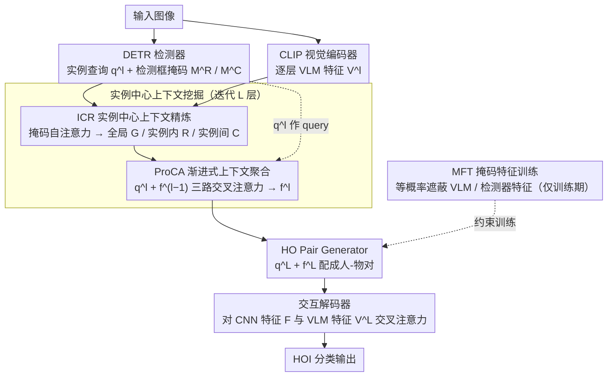

# Mining Instance-Centric Vision-Language Contexts for Human-Object Interaction Detection

**会议**: CVPR 2026  
**arXiv**: [2604.02071](https://arxiv.org/abs/2604.02071)  
**代码**: [https://github.com/nowuss/InCoM-Net](https://github.com/nowuss/InCoM-Net)  
**领域**: 目标检测 / 人物交互检测  
**关键词**: 人物交互检测, 视觉语言模型, 实例级上下文, 多上下文特征, 注意力机制

## 一句话总结

提出 InCoM-Net，通过从 VLM 特征中为每个实例分别提取实例内、实例间和全局三层上下文特征，并通过渐进式上下文聚合与检测器特征融合，在 HICO-DET 和 V-COCO 上取得 HOI 检测 SOTA（HICO-DET Full mAP 43.96，V-COCO AP_role^S1 73.6）。

## 研究背景与动机

1. **领域现状**：HOI 检测旨在定位图像中的人-物对并分类其交互关系，是视觉理解的基础任务。近年来基于 Transformer 和 VLM（如 CLIP、BLIP）的方法显著提升了性能。
2. **现有痛点**：现有 VLM 集成方法要么仅使用场景级 VLM 特征作为全局语义先验（如 HOICLIP、UniHOI），要么通过 RoI 对齐将 VLM 特征局限在物体边界框内（如 ADA-CM、BCOM），无法充分挖掘场景中分布在不同层次的上下文线索。
3. **核心矛盾**：HOI 推理需要同时理解目标实例自身的视觉线索、与周围实例的关系、以及全局场景语境，但现有方法对所有实例统一施加上下文信息，缺乏实例特异性的上下文建模。
4. **本文目标** 如何从 VLM 特征中为每个实例提取多层次的上下文信息，并有效融合到检测器的实例特征中。
5. **切入角度**：作者观察到人类对 HOI 的判断依赖三类线索——目标实例内部视觉特征、与其他实例的关系、以及周围场景信息——因此设计了实例中心的多上下文挖掘方案。
6. **核心 idea**：通过掩码自注意力从 VLM 特征中分别提取实例内/实例间/全局三类上下文，再渐进式融合到检测器查询中。

## 方法详解

### 整体框架

InCoM-Net 想解决的核心问题是：人在判断"这个人和那个物体在干什么"时，靠的是三类不同层次的线索（目标自身外观、它和周围物体的关系、整张图的场景语境），但现有方法要么只取 VLM 的全局特征当先验、要么把 VLM 特征裁进物体框内，对所有实例一视同仁，没法为每个实例量身提取上下文。

为此 InCoM-Net 走双分支：DETR 检测器分支输出实例级查询特征 $q^l$，CLIP 视觉编码器输出逐 patch 的 VLM 特征 $V^l$。两者送进核心模块 Instance-centric Context Mining，它由 ICR（实例中心上下文精炼）和 ProCA（渐进式上下文聚合）串联组成，跨 $L$ 层迭代——第 $l$ 层用 CLIP 第 $l$ 层的特征，ICR 先从 $V^l$ 里为每个实例切出三类上下文，ProCA 再把它们渐进式融进该实例的查询。$L$ 层走完后，HO Pair Generator 把精炼过的实例特征两两配成人-物对，送入交互解码器输出 HOI 分类。此外训练期用 MFT（掩码特征训练）随机遮蔽 VLM 或检测器特征，逼模型均衡利用两种异构来源。

### 关键设计

**1. 实例中心上下文精炼 ICR：从一份共享 VLM 特征里为每个实例切出三种语义**

现有方法的症结在于对所有实例施加同一份上下文，丢掉了实例特异性。ICR 的做法是在 VLM 特征 $V^l$ 上做带掩码的自注意力，用不同掩码"框出"不同范围。对第 $i$ 个实例，先根据检测框构建两张掩码：实例掩码 $M_i^R$ 标出该实例自己占的区域，周围掩码 $M_i^C$ 标出其它所有实例区域的并集。于是同一份 $V^l$ 经三种注意力得到三股互补的上下文——不加掩码的自注意力给出全局上下文 $G^l$（场景语境，全实例共享），$M_i^R$ 约束的注意力给出实例内上下文 $R_i^l$（目标自身外观），$M_i^C$ 约束的注意力给出实例间上下文 $C_i^l$（与周围物体的关系）。三股各自再过一个 FFN 单独编码，刻意不让它们提前混在一起，从而保住"外观 / 关系 / 场景"这三种语义的多样性，等到后面再有选择地融合。

**2. 渐进式上下文聚合 ProCA：把三股上下文逐层、逐类地灌进检测器查询**

光有三股上下文还不够，得让它们和检测器的实例特征对齐。ProCA 在每一层把检测器查询 $q_i^l$ 与上一层的聚合结果 $f_i^{l-1}$ 相加当作 query，分别对 $G^l$、$R_i^l$、$C_i^l$ 做三路交叉注意力，三个输出拼接后过 FFN 得到本层聚合特征 $f_i^l$：

$$f_i^l = \mathrm{FFN}\big(\mathrm{Concat}[\,\mathrm{CA}(q_i^l{+}f_i^{l-1},\,G^l),\ \mathrm{CA}(q_i^l{+}f_i^{l-1},\,R_i^l),\ \mathrm{CA}(q_i^l{+}f_i^{l-1},\,C_i^l)\,]\big)$$

关键在"渐进"二字：$f_i^{l-1}$ 被带进下一层 query，使浅层（CLIP 低层、偏外观纹理）积累的信息顺势传给深层（CLIP 高层、偏语义场景），实例外观与上下文在层间逐步对齐，而不是一次性硬塞。消融里 ProCA 在 $L=3$ 层时最优、再加层增益饱和，正说明这种逐层整合很快就吃透了 VLM 各层语义。

**3. 掩码特征训练 MFT：用随机遮蔽逼模型别偏食某一种特征源**

VLM 特征和检测器特征是两种异构来源，直接喂给模型容易让它过度依赖好学的那一边，弱化另一边。MFT 借鉴 dropout 的思路把这点搬到多模态融合上：训练时等概率（各 1/3）抽取三种输入配置——完整（VLM+检测器）、仅检测器、仅 VLM；被遮蔽的那一支特征置零、对应的交叉注意力直接停用。三种配置各算一份 focal loss 相加作为总损失，于是模型被迫在"只剩一边"的极端条件下也能把交互判对，学到的是两种特征真正互补的部分而非走捷径。这一招在消融里单独带来 +1.11 mAP、对 Rare 类更是 +2.07，是三个模块里增益最大的。

### 损失函数 / 训练策略

交互分类用 focal loss，MFT 的三种掩码配置（full / detector-only / VLM-only）各产生一份 focal loss，三者相加为总损失。DETR 与 CLIP 全程冻结，只训练 ICR、ProCA、HO Pair Generator 和交互解码器。优化器为 AdamW，初始学习率 $10^{-4}$，每 10 epoch 衰减 5 倍，共训练 30 epoch。

## 实验关键数据

### 主实验

| 数据集 | 指标 | InCoM-Net (ViT-L) | NMSR (prev SOTA) | 提升 |
|--------|------|------|----------|------|
| HICO-DET | Full mAP | **43.96** | 42.93 | +1.03 |
| HICO-DET | Rare mAP | **45.61** | 42.41 | +3.20 |
| HICO-DET | Non-rare mAP | **43.46** | 43.11 | +0.35 |
| V-COCO | AP_role^S1 | **73.6** | 69.8 | +3.8 |
| V-COCO | AP_role^S2 | **75.4** | 72.1 | +3.3 |

ViT-B 版本：HICO-DET Full 39.53（超 HORP +0.92），V-COCO S1 72.2（超 SCTC +5.1）。

### 消融实验

| 配置 | Full mAP | Rare mAP | 说明 |
|------|---------|----------|------|
| Baseline（无 ICR/ProCA） | 36.17 | 33.11 | 仅检测器特征 |
| + ICR | 37.42 | 34.47 | +1.25，多上下文有效 |
| + ProCA | 38.42 | 36.80 | +1.00，渐进聚合有效 |
| + MFT | **39.53** | **38.87** | +1.11，平衡异构特征 |

多上下文类型消融（在 ICR+ProCA 上）：

| 上下文配置 | Full mAP | Rare mAP |
|-----------|---------|----------|
| 仅 V（原始 VLM） | 38.30 | 37.31 |
| + G（全局） | 38.65 | 36.76 |
| + R（实例内） | 39.19 | 38.78 |
| + C（实例间） | **39.53** | **38.87** |

### 关键发现

- MFT 贡献最大（+1.11 mAP），尤其在 Rare 类上提升 +2.07，说明平衡异构特征对低频交互至关重要
- 实例内上下文 $R$ 对 Rare 类贡献最显著（+2.02），表明细粒度实例信息对罕见交互推理尤为关键
- 零样本设置下 InCoM-Net 同样 SOTA，RF-UC 和 NF-UC 的 Unseen 分别达到 37.69/39.45（ViT-L），显示出强泛化能力
- ProCA 层数在 3 层时性能最优，更多层的增益趋于饱和

## 亮点与洞察

- **实例级多上下文分解**：通过掩码机制从共享 VLM 特征中自适应提取三类上下文，既简洁又有效。将上下文按语义角色分离后再融合，比直接使用全局 VLM 特征更能捕捉细粒度关系。
- **MFT 策略**：随机遮蔽异构特征源的训练策略令人惊喜——类似 dropout 的思想被创造性地应用到多模态特征融合中，有效防止模型过度依赖单一来源。
- **迁移潜力**：这种实例中心的多上下文挖掘思路可迁移到场景图生成、关系推理等需要实例间关系建模的任务中。

## 局限与展望

- DETR 和 CLIP 均冻结，限制了端到端优化的潜力；可探索部分微调 VLM 编码器
- 掩码来源依赖检测器的检测质量，漏检或错检会影响上下文的准确性
- 仅考虑静态图像上下文，未利用动作的时序线索（如视频 HOI）
- 三种掩码配置等概率训练，可探索自适应采样策略

## 相关工作与启发

- **vs BCOM (CVPR24)**: BCOM 用双分支分别编码 RoI 特征和 VLM 特征，但缺乏实例间上下文建模。InCoM-Net 通过 ICR 统一提取多层次上下文，性能超 BCOM +4.62 mAP（ViT-L）。
- **vs ADA-CM (ICCV23)**: ADA-CM 通过 adapter 注入检测信号并做 RoI 池化，但对所有实例使用统一上下文。InCoM-Net 的实例特异性上下文建模是关键差异。
- **vs NMSR (ICCV25)**: 前 SOTA，InCoM-Net 在 HICO-DET 上超 +1.03，在 V-COCO 上超 +3.8，优势主要来自多上下文精炼和渐进聚合。

## 评分

- 新颖性: ⭐⭐⭐⭐ 实例级多上下文分解思路新颖，MFT 策略有创意，但基本框架仍是 DETR+CLIP 双分支
- 实验充分度: ⭐⭐⭐⭐⭐ 两个数据集、regular+zero-shot、详细消融、可视化，非常充分
- 写作质量: ⭐⭐⭐⭐ 结构清晰，图示直观，动机推导连贯
- 价值: ⭐⭐⭐⭐ HOI 检测 SOTA，方法设计可迁移到其他关系推理任务

<!-- RELATED:START -->

## 相关论文

- [\[CVPR 2026\] Saliency-R1: Enforcing Interpretable and Faithful Vision-language Reasoning via Saliency-map Alignment Reward](saliency-r1_enforcing_interpretable_and_faithful_vision-language_reasoning_via_s.md)
- [\[ICML 2025\] UI-Vision: A Desktop-centric GUI Benchmark for Visual Perception and Interaction](../../ICML2025/object_detection/ui-vision_a_desktop-centric_gui_benchmark_for_visual_perception_and_interaction.md)
- [\[CVPR 2026\] VisualAD: Language-Free Zero-Shot Anomaly Detection via Vision Transformer](visualad_language-free_zero-shot_anomaly_detection_via_vision_transformer.md)
- [\[CVPR 2026\] SteelDefectX: A Coarse-to-Fine Vision-Language Dataset and Benchmark for Generalizable Steel Surface Defect Detection](steeldefectx_a_coarse-to-fine_vision-language_dataset_and_benchmark_for_generali.md)
- [\[CVPR 2026\] Random Wins All: Rethinking Grouping Strategies for Vision Tokens](random_wins_all_rethinking_grouping_strategies_for_vision_tokens.md)

<!-- RELATED:END -->
