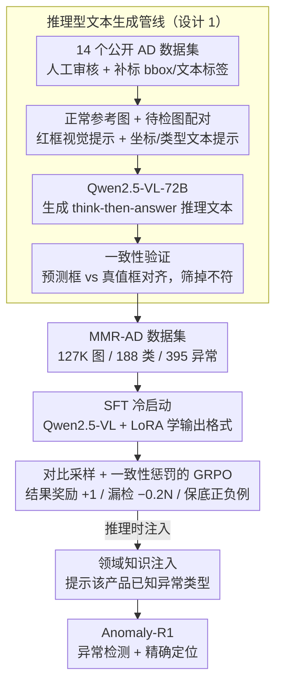

# MMR-AD: A Large-Scale Multimodal Dataset for Benchmarking General Anomaly Detection with MLLMs

**会议**: CVPR 2026  
**arXiv**: [2604.10971](https://arxiv.org/abs/2604.10971)  
**代码**: [https://xcyao00.github.io/MMR-AD](https://xcyao00.github.io/MMR-AD)  
**领域**:目标检测
**关键词**: 异常检测, 多模态大语言模型, 推理数据集, 强化学习, 通用异常检测

## 一句话总结
MMR-AD 构建了当前最大规模的多模态推理型工业异常检测数据集（127K 图像、188 类产品、395 种异常），并提出基于 GRPO 强化学习的 Anomaly-R1 基线模型，显著优于通用 MLLM。

## 研究背景与动机

**领域现状**：工业异常检测从单类→多类→跨类不断发展，通用异常检测（GAD）是终极目标：训练一个通用模型直接检测新类别的异常而无需重训练。MLLM 因强大的视觉理解和语言推理能力，被视为实现 GAD 的有力工具。

**现有痛点**：(1) MLLM 预训练数据与工业 AD 场景有显著差距；(2) 现有 AD 数据集是图像格式，不适合 MLLM 后训练；(3) 现有多模态 AD 数据集（MMAD、Anomaly-Instruct-125K）要么只有选择题无推理、要么包含大量非工业场景 Web 数据。

**核心矛盾**：通用 MLLM 在工业 AD 上的精度远未达实际需求，尤其是精确的异常定位，而解决此问题需要大规模的高质量多模态 AD 训练数据。

**本文目标**：构建训练+评估兼用的大规模推理型多模态 AD 数据集，并验证基于强化学习的 AD 基线模型。

**核心 idea**：从 14 个公开 AD 数据集中人工审核筛选+标注边界框，自动生成推理型文本，并用 GRPO 强化学习训练推理型 AD 模型。

## 方法详解

### 整体框架
这篇工作要解决两件事：先造出一个能直接拿来后训练 MLLM 的大规模工业异常检测数据集，再用它训出一个真正会"看出异常在哪"的基线模型。数据侧，作者从 14 个公开 AD 数据集出发，先人工审核剔除低质量样本，再补标边界框和文本标签，然后让 Qwen2.5-VL-72B 同时看到正常参考图和待检图、配合视觉与文本提示自动生成"先推理后回答"的长文本，最后做一致性验证，得到 127K 图、188 类产品、395 种异常的 MMR-AD。模型侧，以 Qwen2.5-VL + LoRA 为底座，先用这批推理文本做 SFT 冷启动，再用带对比采样和一致性惩罚的 GRPO 强化学习把定位精度顶上去，推理时还可注入领域知识进一步提分。

### 关键设计

**1. 推理型文本生成管线：把"是否异常"的标签升级成"为什么是异常"的推理过程**

现有 AD 数据集大多只有图像或选择题答案，无法教会 MLLM 逐步比较、定位的能力。这里的关键是给生成模型一对图——正常参考图和待检图——因为异常的本质就是相对正常的偏差，有参考图模型才知道"正常长什么样"。在此基础上叠加两类提示：视觉上用红色边界框圈出异常区域，文本上给出异常类型和坐标，逼 Qwen2.5-VL-72B 产出"先描述对比、再下结论"格式的标注，而不是一句干巴巴的 Yes/No。生成完还要做一致性验证——把文本里预测的区域和真实标注框对齐，不一致的样本被筛掉。这样产出的文本既带推理链又和图像空间对齐，比简单答案文本更能驱动模型学到通用 AD 能力。

**2. 对比采样 + 一致性惩罚的 GRPO：让强化学习奖励"真的定位对了"而不是"猜对了 Yes"**

SFT 之后模型会答题但定位往往很糊，若强化学习只按答案正误给奖励，模型很快学会无脑答 Yes 来刷分。作者把奖励拆成两部分：答案正确给结果奖励 $+1$，同时引入一致性惩罚——每漏检一个真实异常框扣 $0.2$，迫使模型把"答对"和"框准"绑在一起。另一个隐患是 GRPO 在一个 query 的所有采样响应都相同时会出现零梯度、训练停滞，这在 AD 这种答案高度集中的任务里很常见。对比采样专门解决它：用 MMR-AD 里的正确文本作为保底正例，再对那些"全是正响应"的 query 用对抗提示主动构造负例，保证每个 query 同时有正负样本、组内有奖励差异，梯度才不会消失。

**3. 领域知识注入：在推理时告诉模型"这类产品该警惕哪些异常"**

工业场景里正常变异和真异常的边界是模糊的，纯靠视觉模型容易把无害的差异也当成异常。这一项是推理期的轻量增强：在提示里直接写明"该产品可能出现以下异常类型：broken, deformation…"，把模型的注意力收敛到已知异常类型上，让它去核对这些具体缺陷，而不是把图上一切差异都报成异常。实验里它带来稳定的额外增益（检测/定位各 +3~5 个点）。

### 损失函数 / 训练策略
两阶段训练：先用推理型文本做 SFT 冷启动（消融显示直接上 RL 而不冷启动效果很差），再做 GRPO 强化学习，目标函数沿用 PPO 的 clip 加 KL 惩罚，奖励由前述结果奖励与一致性惩罚组合而成。

## 实验关键数据

### 主实验

| 模型 | MVTecAD 检测Acc | MVTecAD 定位Acc | VisA 检测Acc |
|------|----------------|----------------|-------------|
| GPT-4o | ~70% | ~30% | ~65% |
| Gemini-2.5 | ~72% | ~35% | ~68% |
| Anomaly-R1-7B | ~85% | ~60% | ~80% |
| Anomaly-R1-7B† (+ 领域知识) | ~88% | ~65% | ~83% |

### 消融实验

| 配置 | 检测 | 定位 | 说明 |
|------|------|------|------|
| Full (SFT+RL) | 最优 | 最优 | 完整模型 |
| SFT only | 次优 | 中等 | RL 提升定位显著 |
| Direct RL (无 SFT) | 差 | 差 | 冷启动必要 |
| w/o 一致性惩罚 | 检测好 | 定位差 | 模型学会瞎猜 Yes |

### 关键发现
- 当前最强通用 MLLM（GPT-4o、Gemini-2.5）的工业 AD 精度远未达实际标准，尤其精确定位很差
- 推理型文本比简单答案文本更有助于模型学习通用 AD 能力
- 强化学习相比纯 SFT 在定位精度上提升最为显著
- 领域知识注入进一步提升了性能

## 亮点与洞察
- **数据集的可改进性**：提供原始边界框，未来可用更强 MLLM 重新生成文本，这种前瞻性设计值得借鉴
- **一致性惩罚**：巧妙地将定位精度引入奖励函数，避免了"正确但不精确"的强化学习陷阱

## 局限与展望
- 文本由 Qwen2.5-VL-72B 生成，存在模型偏差
- 127K 图像虽然规模大但部分类别数据仍不均衡
- 未来可探索更多 RL 算法和更大规模模型

## 相关工作与启发
- **vs MMAD**: MMAD 只有选择题格式，不能训练；MMR-AD 有推理文本可训练
- **vs AnomalyGPT**: AnomalyGPT 直接 SFT 无推理过程，泛化性差

## 评分
- 新颖性: ⭐⭐⭐⭐ 首个大规模推理型 AD 数据集，RL 基线有实用价值
- 实验充分度: ⭐⭐⭐⭐⭐ 多模型对比、消融、RL 技巧分析都很充分
- 写作质量: ⭐⭐⭐⭐ 数据集构建和方法描述清晰
- 价值: ⭐⭐⭐⭐⭐ 数据集对 AD 社区贡献很大

<!-- RELATED:START -->

## 相关论文

- [\[CVPR 2026\] Omni-AD: A Large-scale and Versatile Benchmark for Industrial Anomaly Detection](omni-ad_a_large-scale_and_versatile_benchmark_for_industrial_anomaly_detection.md)
- [\[ICCV 2025\] Kaputt: A Large-Scale Dataset for Visual Defect Detection](../../ICCV2025/object_detection/kaputt_a_large-scale_dataset_for_visual_defect_detection.md)
- [\[CVPR 2026\] Bidirectional Multimodal Prompt Learning with Scale-Aware Training for Few-Shot Multi-Class Anomaly Detection](bidirectional_multimodal_prompt_learning_with_scale-aware_training_for_few-shot_.md)
- [\[ICLR 2026\] ForestPersons: A Large-Scale Dataset for Under-Canopy Missing Person Detection](../../ICLR2026/object_detection/forestpersons_a_large-scale_dataset_for_under-canopy_missing_person_detection.md)
- [\[CVPR 2026\] Towards an Incremental Unified Multimodal Anomaly Detection: Augmenting Multimodal Denoising From an Information Bottleneck Perspective](towards_an_incremental_unified_multimodal_anomaly_detection_augmenting_multimoda.md)

<!-- RELATED:END -->
