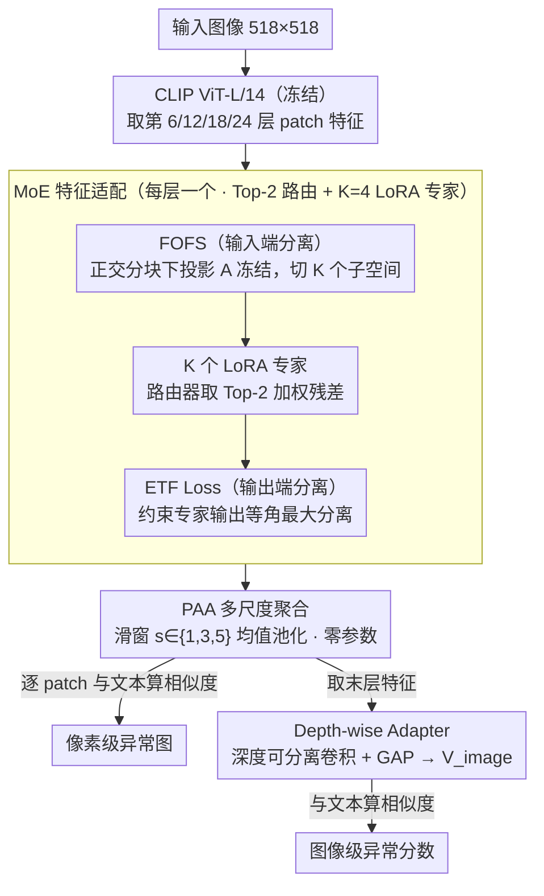

# MoECLIP: Patch-Specialized Experts for Zero-shot Anomaly Detection

**会议**: CVPR 2026  
**arXiv**: [2603.03101](https://arxiv.org/abs/2603.03101)  
**代码**: [有](https://github.com/CoCoRessa/MoECLIP)  
**领域**:目标检测
**关键词**: 零样本异常检测, 混合专家, CLIP, LoRA, 专家特化

## 一句话总结

提出 MoECLIP，将 Mixture-of-Experts 引入零样本异常检测（ZSAD），通过冻结正交特征分离（FOFS）和等角紧框架（ETF）损失实现 patch 级别的动态专家路由与特化，在14个工业/医学基准上达到 SOTA。

## 研究背景与动机

### 1. 领域现状
视觉异常检测（AD）用于识别偏离正常模式的区域，在工业缺陷检测和医学图像诊断中至关重要。传统无监督异常检测（UAD）仅从正常数据学习，但仍需要大量正常样本。零样本异常检测（ZSAD）利用 CLIP 等视觉-语言模型的强大泛化能力，无需目标类别的训练数据即可检测异常，成为新兴范式。

### 2. 痛点
CLIP 预训练目标是全局语义理解，不擅长检测局部异常。现有 ZSAD 方法（PromptAD、AnomalyCLIP、AdaCLIP、AA-CLIP）虽然通过提示学习、适配器等方式增强 patch 表示，但都采用**patch-agnostic 设计**：对所有 patch 施加相同的统一变换，忽略不同图像区域（物体部件、背景、异常区域）的独特特性。

### 3. 核心矛盾
需要对 CLIP 做异常检测特化，但又要保留其泛化能力；需要对不同 patch 差异化处理，但简单的多专家组合会产生**功能冗余**（experts 学到相似功能）。

### 4. 要解决什么
(1) 打破 patch-agnostic 的设计局限，实现 patch 级别的动态适配；(2) 解决 MoE 的专家功能冗余问题，确保每个专家真正特化。

### 5. 切入角度
将 MoE 架构与 LoRA 结合引入 ZSAD，在输入端和输出端同时施加约束来分离专家功能。

### 6. 核心 idea
用 MoE 架构动态路由每个 patch 到合适的 LoRA 专家；用 FOFS 在输入端正交分割特征空间，用 ETF loss 在输出端强制最大等角分离，双管齐下消除专家冗余。

## 方法详解

### 整体框架

MoECLIP 想解决的核心问题是：CLIP 的 patch 特征对所有区域一视同仁，而异常检测恰恰需要区分物体、背景和缺陷这些性质迥异的 patch。它的做法是给冻结的 CLIP Vision Encoder（ViT-L/14-336）装上一组「按 patch 分流」的专家。具体来说，在编码器第 6、12、18、24 层的输出端各插入一个 MoE 模块，每个模块由 K=4 个 LoRA 专家和一个线性路由器组成，路由器为每个 patch 算出专家分数并取 Top-2 加权。

一张图进来后，CLIP ViT 先抽出多层 patch 特征，每一层的 MoE 模块根据 patch 内容把它路由给合适的专家做残差适配；适配后的特征经 PAA 在多个尺度上聚合，再分两路出口——逐 patch 与文本特征算相似度得到像素级异常图，全局特征经 Depth-wise Adapter 与文本算相似度得到图像级异常分数。训练只在辅助数据集（VisA）上做监督，测试时面对的是完全没见过的类别。整条链路里真正可学习的只有 LoRA 的上投影、路由器和两个轻量适配头，CLIP 主干始终冻结。

### 关键设计

**1. MoE 特征适配：让每个 patch 走自己的专家通道**

这一项直接对应「patch-agnostic」的痛点——既然不同区域性质不同，就不该用同一个变换去改它们。每层的 MoE 模块拿到 patch 特征 $F_i^l \in \mathbb{R}^d$ 后，路由器算出各专家的分数，挑 Top-2 专家加权得到残差输出 $F_{i,\text{expert}}^l$。这里有个容易被忽略却很关键的细节：MoE 的原始输出范数和 CLIP 特征对不上，直接相加会把表示空间搅乱、训练不稳还伤泛化，所以先把残差做 $\ell_2$ 范数归一化对齐到原特征量级，再以很小的权重（$\lambda_{\text{MoE}}=0.1$）做残差混合。用 LoRA（rank=8）当专家而不是全连接层，本身参数量就少、过拟合风险低，这对「无目标类训练数据」的零样本场景尤其重要。

**2. FOFS（冻结正交特征分离）：从输入端就把专家的「视野」掰开**

多专家最怕的是大家学成一个样（功能冗余），FOFS 的思路是在输入端就物理隔离——把 $d$ 维特征空间切成 $K$ 个互不重叠的子空间 $c_1, \dots, c_K$，让第 $n$ 个专家只能「看见」第 $n$ 块。落到实现上，专家的 LoRA 下投影矩阵 $A_n \in \mathbb{R}^{r \times d}$ 被构造成分块形式：只有第 $n$ 个子空间对应的那些列填上 QR 分解得到的正交矩阵 $Q_n$，其余列全置零。这样任意两个专家满足

$$A_n A_m^\top = 0 \quad (n \neq m),$$

输入子空间天然正交、从初始化就杜绝了重叠。更巧的是 $A_n$ 全程冻结、只让 $B_n$ 学习——这既保住了 CLIP 的泛化能力、压低过拟合，又呼应了近期 LoRA 研究的发现：随机初始化的正交下投影矩阵，效果可以媲美费劲学出来的。

**3. ETF Loss（等角紧框架损失）：在输出端再补一刀分化**

FOFS 只管住了输入端，可学习的 $B_n$ 仍可能把不同专家的输出又拉回到相似的方向，所以还需要一个输出端的约束。ETF loss 对每层每个 patch，把 $K$ 个专家输出做 $\ell_2$ 归一化后算 Gram 矩阵，再用 Frobenius 范数惩罚它和「理想 ETF 结构」的差距——理想结构要求对角线为 1（单位范数）、非对角线统一为 $-1/(K-1)$，也就是让专家向量在超球面上达到最大等角分离。它和 FOFS 是一对互补搭子：一个在入口切空间、一个在出口拉角度，合起来才能把专家相似度真正压到接近 0（消融里从原始 MoE 的 0.45 一路降到 0.02）。

**4. PAA（Patch 平均聚合）：把多尺度感知提前到训练阶段**

ViT 的 patch 尺寸是固定的，一块小缺陷和一片大病灶用同一粒度去看很难都照顾到；而以往方法的 patch 聚合只在测试时临时拼一下，训练阶段根本没有多尺度信号。PAA 把 patch 嵌入重排成 2D 空间网格，对滑窗尺度 $s \in \{1, 3, 5\}$ 分别做均值池化，独立产出多组 patch 特征，整个操作零额外参数。这个改动对医学数据集尤其管用——病灶大小跨度大，提前在训练里见过多尺度上下文，检测时才不至于漏掉。

**5. Depth-wise Adapter：给图像级分数一个语义对齐的全局表示**

像素级异常图之外，还需要一个干净的全局向量来算整图异常分数。这里借鉴 MobileNet 的轻量结构，用 1D 深度可分离卷积（Depthwise + Pointwise）处理最后一层的 PAA 特征，再全局平均池化得到图像级向量 $V_{\text{image}}$，与文本特征算余弦相似度即为图像级异常分数。深度可分离卷积参数少，不会给冻结主干增加多少负担，又能把局部特征整合成一个语义对齐的表示。

> 路由确实学到了内容相关的分工：Grad-CAM 可视化里 Expert 1 聚焦异常区、Expert 2 聚焦物体主体、Expert 3 聚焦背景，说明同一张图里不同性质的 patch 被分流到了不同专家。

### 损失函数 / 训练策略

总损失：$\mathcal{L}_{\text{total}} = \mathcal{L}_{\text{seg}} + \mathcal{L}_{\text{ac}} + \lambda_{\text{etf}}\mathcal{L}_{\text{etf}} + \lambda_{\text{bal}}\mathcal{L}_{\text{bal}}$

- **分割损失** $\mathcal{L}_{\text{seg}}$：Focal + Dice Loss，作用于多层多尺度异常图
- **分类损失** $\mathcal{L}_{\text{ac}}$：BCE Loss，作用于图像级异常分数
- **ETF 损失**：$\lambda_{\text{etf}}=0.01$，约束专家输出等角
- **Balance 损失**：$\lambda_{\text{bal}}=0.01$，用路由概率的变异系数平方防止专家坍塌

训练配置：OpenCLIP ViT-L/14-336，图像 518×518，Adam $\text{lr}=5 \times 10^{-4}$，20 epoch，2×V100 16GB。

## 实验关键数据

### 主实验

在14个数据集（5工业+9医学）上与6个 SOTA 方法对比，训练集均为 VisA（评估 VisA 时用 MVTec-AD 训练）。

**表1：图像级异常分类（AUROC, AP）**

| 方法 | MVTec-AD | VisA | BTAD | RSDD | DTD-Syn | BrainMRI | HeadCT | LiverCT | RetinaOCT | **平均** |
|------|----------|------|------|------|---------|----------|--------|---------|-----------|----------|
| WinCLIP | (91.8,95.1) | (78.1,77.5) | (83.3,84.1) | (85.3,65.3) | (95.0,97.9) | (45.1,80.3) | (83.7,81.6) | (66.5,56.1) | (53.7,44.3) | (75.8,75.8) |
| AnomalyCLIP | (91.9,96.2) | (82.1,85.4) | (92.5,94.2) | (74.0,73.2) | (93.3,97.7) | (70.8,90.6) | (95.1,95.3) | (68.2,63.4) | (74.7,73.9) | (82.5,85.5) |
| AA-CLIP | (90.9,96.0) | (79.2,83.7) | (94.8,97.5) | (94.9,94.2) | (92.5,97.7) | (79.6,94.4) | (95.4,94.3) | (58.4,49.7) | (83.4,83.8) | (85.5,87.9) |
| Bayes-PFL | (92.2,96.1) | (86.8,89.3) | (93.0,96.7) | (91.3,89.7) | (93.5,97.7) | (81.9,94.5) | (95.4,93.2) | (61.7,55.2) | (83.7,81.8) | (86.6,88.2) |
| **MoECLIP** | **(93.9,96.8)** | **(83.6,86.2)** | **(93.1,98.0)** | **(95.3,95.1)** | **(95.5,98.6)** | **(88.5,97.1)** | **(96.6,94.5)** | **(74.0,64.6)** | **(85.5,84.9)** | **(89.6,90.6)** |

MoECLIP 图像级平均 AUROC 89.6%（+3.0%），AP 90.6%（+2.4%）。

**表2：像素级异常分割（AUROC, AP）- 部分数据**

| 方法 | MVTec-AD | BTAD | BrainMRI | ColonDB | ClinicDB | Kvasir | **平均** |
|------|----------|------|----------|---------|----------|--------|----------|
| AA-CLIP | (91.6,45.4) | (95.6,49.4) | (96.7,55.1) | (82.8,31.5) | (89.2,49.8) | (86.0,52.9) | (93.2,45.8) |
| Bayes-PFL | (91.9,48.4) | (95.6,48.6) | (95.7,42.9) | (82.9,30.7) | (88.2,49.1) | (85.6,53.4) | (93.2,44.3) |
| **MoECLIP** | **(92.5,45.7)** | **(96.8,50.4)** | **(97.3,61.3)** | **(85.4,34.8)** | **(89.7,49.9)** | **(88.1,57.6)** | **(94.3,47.5)** |

像素级平均 AUROC 94.3%（+1.1%），AP 47.5%（+1.7%）。医学数据集提升尤为显著（BrainMRI AP +6.2%，Kvasir AP +4.2%）。

### 消融实验

**表3：组件消融（Pixel AUROC, Image AUROC）**

| 配置 | MVTec-AD | DTD-Syn | HeadCT | ColonDB | 平均 |
|------|----------|---------|--------|---------|------|
| Vanilla CLIP | (38.4,74.1) | (33.9,71.6) | (-,56.5) | (49.5,-) | (40.6,67.4) |
| w/o FOFS & ETF | (91.6,91.7) | (97.8,93.1) | (-,94.4) | (84.1,-) | (91.2,93.1) |
| w/o FOFS | (92.0,92.8) | (98.3,93.9) | (-,95.0) | (85.3,-) | (91.9,93.9) |
| w/o ETF Loss | (92.2,92.7) | (98.2,93.4) | (-,96.1) | (84.6,-) | (91.7,94.1) |
| w/o Depth Adapter | (92.0,92.5) | (98.1,93.8) | (-,94.5) | (85.0,-) | (91.7,93.6) |
| w/o PAA | (92.1,92.8) | (98.1,94.7) | (-,93.1) | (81.9,-) | (90.7,93.5) |
| **MoECLIP (full)** | **(92.5,93.9)** | **(98.8,95.5)** | **(-,96.6)** | **(85.4,-)** | **(92.2,95.3)** |

### 关键发现

1. **FOFS 和 ETF 是互补的**：单独移除任一组件均导致性能下降，两者共同移除下降更大，证明输入端+输出端双重约束的必要性
2. **功能冗余量化**：专家间余弦相似度从原始 MoE 的 0.45 → +FOFS 后 0.24 → +ETF 后 0.02，近乎完全消除冗余
3. **PAA 对医学域至关重要**：移除 PAA 后 HeadCT 下降 3.5%、ColonDB 下降 3.5%，多尺度感知对医学异常检测影响大
4. **专家数量不是越多越好**：K=4 最优，K>4 反而因功能冗余导致性能下降
5. **跨域泛化**：仅在工业数据训练，MoE 专家依然能在医学数据上有效特化路由

## 亮点与洞察

1. **首次将 MoE 引入 ZSAD**：开创性地从 patch-agnostic 到 patch-specialized 的范式转变
2. **双端约束设计优雅**：FOFS 在输入端物理隔离子空间（冻结、零额外参数），ETF loss 在输出端用几何最优结构约束，两者正交互补
3. **可视化验证直观**：Grad-CAM 清晰展示 Expert 1 聚焦异常区、Expert 2 聚焦物体主体、Expert 3 聚焦背景，证明路由确实基于内容特性
4. **FOFS 冻结 A 矩阵**的巧妙之处：利用近期 LoRA 研究发现（随机正交 A ≈ 学习 A），同时获得正交分离+参数节省+过拟合抑制三重收益

## 局限与展望

1. **专家数量手动设定**：K=4 是经验值，缺乏自适应确定专家数量的机制
2. **FOFS 等分子空间**：将特征维度均匀分给各专家，未考虑不同专家可能需要不同维度
3. **仅在 ViT-L/14 验证**：未探索不同 backbone 规模（如 ViT-B、ViT-H）的效果
4. **训练数据单一**：始终用 VisA 做辅助训练集，未探索不同训练集对泛化的影响
5. **PAA 窗口尺度固定**：$s \in \{1,3,5\}$ 是手动设定，可考虑自适应或可学习的尺度选择

## 相关工作与启发

- **ZSAD 系列方法演进**：WinCLIP → April-GAN → AnomalyCLIP → AdaCLIP → AA-CLIP → Bayes-PFL → MoECLIP，从手工prompt到学习prompt，再到适配器，最终到 MoE 动态路由
- **MoE 功能冗余解决方案**：现有方法（对比损失、正交正则化）仅作用于输出端，本文同时约束输入端和输出端，思路可推广到其他 MoE 场景
- **LoRA 冻结 A 矩阵**的启发：VeRA 等工作已验证共享/冻结下投影矩阵的可行性，本文将其与正交分离结合，值得在其他 PEFT+MoE 场景探索

## 评分

- 新颖性: ⭐⭐⭐⭐ 将 MoE 引入 ZSAD 开创 patch-specialized 新范式，FOFS+ETF 双端约束思路独到
- 实验充分度: ⭐⭐⭐⭐⭐ 14个数据集（工业+医学）全面对比+消融+可视化+专家相似度量化，非常扎实
- 写作质量: ⭐⭐⭐⭐ 动机清晰、方法描述系统、可视化丰富
- 价值: ⭐⭐⭐⭐ 对 ZSAD 和 MoE 功能冗余两个问题同时给出了优雅解法，可推广到其他 PEFT+MoE 场景

<!-- RELATED:START -->

## 相关论文

- [\[AAAI 2026\] PromptMoE: Generalizable Zero-Shot Anomaly Detection via Visually-Guided Prompt Mixing of Experts](../../AAAI2026/object_detection/promptmoe_generalizable_zero-shot_anomaly_detection_via_visually-guided_prompt_m.md)
- [\[CVPR 2026\] From Attraction to Equilibrium: Physics-Inspired Semantic Gravitons for Zero-Shot Anomaly Detection](from_attraction_to_equilibrium_physics-inspired_semantic_gravitons_for_zero-shot.md)
- [\[CVPR 2026\] AnomalyVFM -- Transforming Vision Foundation Models into Zero-Shot Anomaly Detectors](anomalyvfm_--_transforming_vision_foundation_models_into_zero-shot_anomaly_detec.md)
- [\[CVPR 2026\] FB-CLIP: Fine-Grained Zero-Shot Anomaly Detection with Foreground-Background Disentanglement](fb-clip_fine-grained_zero-shot_anomaly_detection_with_foreground-background_dise.md)
- [\[CVPR 2026\] CoPS: Conditional Prompt Synthesis for Zero-Shot Anomaly Detection](cops_conditional_prompt_synthesis_for_zero-shot_anomaly_detection.md)

<!-- RELATED:END -->
