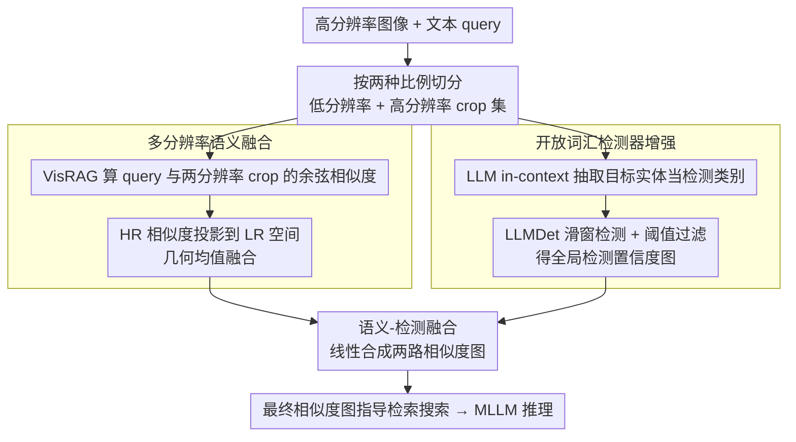

# MRD: Multi-resolution Retrieval-Detection Fusion for High-Resolution Image Understanding

**会议**: CVPR2026  
**arXiv**: [2512.02906](https://arxiv.org/abs/2512.02906)  
**代码**: [yf0412/MRD](https://github.com/yf0412/MRD)  
**领域**: 目标检测 / 高分辨率图像理解  
**关键词**: 高分辨率图像理解, 多模态大模型, 检索增强感知, 开放词汇检测, 多分辨率融合, training-free

## 一句话总结

提出 MRD，一个 training-free 的多分辨率检索-检测融合框架，通过多分辨率语义融合缓解目标碎片化，结合开放词汇检测器抑制背景干扰，显著提升 MLLM 对高分辨率图像的理解能力。

## 背景与动机

1. **MLLM 高分辨率瓶颈**：主流多模态大模型受限于固定低分辨率输入，无法有效处理高分辨率图像中的小目标、精细纹理和文字等细节信息
2. **训练方法成本高**：基于 SFT/RL 的 localize-and-zoom-in 方法存在训练成本大、收敛周期长、跨架构迁移差等问题，限制了实际部署
3. **目标碎片化问题（FRAG）**：基于检索的方法使用固定网格切分高分辨率图像，大目标被切割到多个 patch 中，导致嵌入语义偏差和不完整检索，影响 65.2% 的失败样本
4. **背景干扰问题（BG）**：复杂背景区域与 query 产生虚假高相似度，引入假阳性 patch 误导后续推理，影响 54.3% 的失败样本
5. **尺度敏感性**：crop 分辨率是难以调优的超参数——过大引入背景噪声稀释目标语义，过小加剧碎片化
6. **多目标场景缺陷**：现有 top-down 方法在初始粗粒度搜索阶段容易遗漏非主要目标，在多目标任务上表现不佳

## 方法详解

### 整体框架

MRD 要解决的是 MLLM 处理高分辨率图像时的两类系统性失败：检索式方法用固定网格切图，大目标被切碎导致语义偏差（FRAG），复杂背景又会和 query 产生虚假高相似度引入假阳性（BG）。它是一个 **training-free** 的统一多尺度框架，不训练就能挂到任意 MLLM 上：给定高分辨率图像和文本 query，先按两种比例切出低/高分辨率两套 crop，然后兵分两路——一路在局部尺度做多分辨率语义融合校正碎片化，一路在全局尺度用开放词汇检测器做显式定位和背景抑制；两路输出再线性融合成一张最终相似度图，指导后续检索搜索并交给 MLLM 推理。

### 关键设计

**1. 多分辨率语义融合：用跨分辨率一致性抹平目标碎片化**

固定网格切图会把一个大目标拆到多个 patch，每个 patch 的嵌入都只看到局部，语义偏了、检索也不完整（影响 65.2% 的失败样本）。MRD 把高分辨率图按两种比例切分：低分辨率 crop 集 $P$（分辨率 $l$）和高分辨率 crop 集 $\hat{P}$（分辨率 $\hat{l}=k \cdot l$），两者有空间对应（每个 HR crop 对应 $k^2$ 个 LR crop）；用 VisRAG 的视觉-语言模型分别算 query 与两种分辨率 crop 的余弦相似度，再把 HR 相似度投影到 LR 空间，通过几何均值融合 $s_t^m = \sqrt{\tilde{s}_t \cdot s_t}$，最后重塑成 2D 语义相似度图。用几何均值而非求和，是因为它会自然惩罚单一分辨率下的语义偏差——只有两种分辨率都觉得相关的区域才会得高分。

**2. 开放词汇检测器增强：给检索补上显式空间定位与背景抑制**

光靠语义相似度还压不住背景干扰（影响 54.3% 的失败样本），需要一个显式知道「目标在哪」的信号。MRD 先用 LLM 的 in-context learning 从自由文本 query 里抽出目标实体当检测类别；再用 LLMDet 在 HR 图上以滑窗方式逐区域做开放词汇检测，滑窗网格与语义融合模块严格空间对齐；最后对检测框做阈值过滤，把置信度映射到对应 crop 位置、跨窗口取均值得到全局检测置信度图 $c^g(i,j)$。检测器只在真有目标的地方给高响应，等于把背景里那些「语义碰巧相似」的区域按下去。

**3. 语义-检测融合：两路互补线性合成最终相似度图**

两路各管一头——语义图给细粒度匹配，检测图给空间定位和背景抑制——需要合在一起才覆盖完整失败模式。MRD 用一个平衡权重 $w$ 线性融合：

$$s^f(i,j) = (1-w) \cdot s^m(i,j) + w \cdot c^g(i,j)$$

融合后的相似度图同时具备语义完整性和空间准确性，指导检索时既不会因碎片化漏掉大目标，也不会被背景误导。

## 实验关键数据

### 主实验（V* Bench）

| 方法 | Attribute | Spatial | Overall |
|------|-----------|---------|---------|
| LLaVA-v1.5-7B（baseline） | 43.5 | 56.6 | 48.7 |
| LLaVA-v1.5-7B-RAP | 90.4 | 96.1 | 91.1 |
| **LLaVA-v1.5-7B-MRD** | **97.4** | **96.1** | **95.6** |
| LLaVA-ov-0.5B-RAP | 80.0 | 84.2 | 83.6 |
| **LLaVA-ov-0.5B-MRD** | **89.6** | **85.6** | **88.9** |

- 基于 LLaVA-v1.5-7B，MRD 在 V* Bench 上整体提升 46.9%（几乎翻倍），超过 GPT-4o（66.0）
- 在 HR-Bench 4K/8K 上同样一致超越 RAP，平均整体提升 2.8%

### 消融实验

| 模块组合 | Overall | BG 错误率 | FRAG 错误率 |
|----------|---------|-----------|-------------|
| RAP（baseline） | 83.6 | 10.7% | 8.9% |
| OVD only | 85.3 (+1.7) | 5.7% (-46.7%) | 6.2% (-30.3%) |
| RAP + Multi-Res | 85.8 (+2.2) | 6.7% (-37.4%) | 5.3% (-40.4%) |
| RAP + OVD | 86.7 (+3.1) | 4.9% (-54.2%) | 5.8% (-34.8%) |
| **MRD (All)** | **88.9 (+5.3)** | **4.0% (-62.6%)** | **4.4% (-50.6%)** |

两个模块互补：Multi-Res 主要缓解碎片化（FRAG ↓40.4%），OVD 主要抑制背景（BG ↓54.2%），完整 MRD 同时大幅降低两类错误。

### 效率对比

| 方法 | 搜索时间 | 总时间 | 最大显存 |
|------|---------|--------|---------|
| RAP (v1.5-7B) | 52.8s | 63.4s | 21.2 GB |
| MRD (v1.5-7B) | 15.2s (-71.2%) | 53.4s (-26.2%) | 23.4 GB (+10.4%) |

MRD 虽增加 RAG 和检测开销，但因更精准的定位使搜索步数大幅减少，总耗时反而降低 26.2%。

## 亮点

- **Training-free**：无需额外训练，可即插即用地增强任意 MLLM 的高分辨率理解能力
- **互补双路设计**：语义融合解决碎片化 + 检测增强解决背景干扰，覆盖 89.6% 的失败模式
- **跨分辨率一致性融合**：通过几何均值而非简单求和，自然惩罚单一分辨率下的语义偏差
- **效率提升**：更精准的初始定位使搜索阶段耗时降低 71%，总时间反而更短
- **强泛化性**：在多个 MLLM backbone（LLaVA-v1.5、LLaVA-ov）和多个 benchmark 上一致有效

## 局限与展望

1. **依赖外部检测器**：需要额外的 OVD 模型（LLMDet），增加系统复杂度和显存开销（+10-12%）
2. **滑窗检测效率**：滑窗策略引入额外 15-16 秒检测时间，对超大尺寸图像可能更慢
3. **多目标 OVD 受限**：消融显示 OVD 单独使用在多目标任务上不如 RAP，复杂多目标场景可能遗漏
4. **固定线性融合权重**：语义-检测融合权重 $w$ 为固定超参数，未针对不同场景自适应调整
5. **评估范围有限**：仅在 V* Bench 和 HR-Bench 上评估，缺乏对文档理解、遥感等更多场景的验证

## 与相关工作的对比

| 方法 | 类型 | 是否需训练 | 多目标 | 碎片化处理 | 背景抑制 |
|------|------|-----------|--------|-----------|---------|
| ZoomEye | localize-zoom | ✗ | 弱 | ✗ | ✗ |
| RAP | 检索增强 | ✗ | 中 | ✗ | ✗ |
| SFT 方法 | localize-zoom | ✓ | 中 | ✗ | 部分 |
| **MRD** | **检索-检测融合** | **✗** | **强** | **✓** | **✓** |

MRD 是首个在检索增强感知框架中联合建模局部语义完整性与全局空间定位的方法，在 training-free 条件下超越所有训练方法。

## 评分

- 新颖性: ⭐⭐⭐⭐ — 多分辨率融合 + OVD 增强的双路互补设计有新意，对检索增强感知的失败模式分析深入
- 实验充分度: ⭐⭐⭐⭐ — 多 benchmark、多 backbone 验证，消融完整，有效率和可视化分析
- 写作质量: ⭐⭐⭐⭐ — 问题定义清晰，失败模式量化分析有说服力，方法描述严谨
- 价值: ⭐⭐⭐⭐ — 提供了 training-free 高分辨率理解的有效方案，对实际部署友好

<!-- RELATED:START -->

## 相关论文

- [\[CVPR 2026\] Toward Generalizable Whole Brain Representations with High-Resolution Light-Sheet Data](toward_generalizable_whole_brain_representations_with_high-resolution_light-shee.md)
- [\[CVPR 2026\] Beyond Semantic Search: Towards Referential Anchoring in Composed Image Retrieval](beyond_semantic_search_towards_referential_anchoring_in_composed_image_retrieval.md)
- [\[CVPR 2026\] UniMMAD: Unified Multi-Modal and Multi-Class Anomaly Detection via MoE-Driven Feature Decompression](unimmad_unified_multi-modal_and_multi-class_anomaly_detection_via_moe-driven_fea.md)
- [\[CVPR 2026\] Integration of Deep Generative Anomaly Detection Algorithm in High-Speed Industrial Line](integration_of_deep_generative_anomaly_detection_algorithm_in_high-speed_industr.md)
- [\[CVPR 2025\] Search and Detect: Training-Free Long Tail Object Detection via Web-Image Retrieval](../../CVPR2025/object_detection/search_and_detect_training-free_long_tail_object_detection_via_web-image_retriev.md)

<!-- RELATED:END -->
