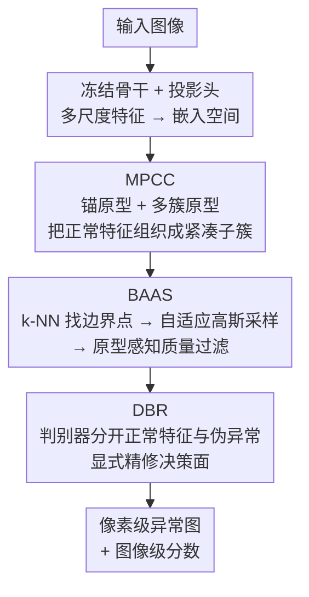

# Multi-Prototype Compactness and Boundary-Aware Synthesis for Unsupervised Anomaly Detection

**会议**: CVPR 2026  
**论文**: [CVF Open Access](https://openaccess.thecvf.com/content/CVPR2026/html/Liao_Multi-Prototype_Compactness_and_Boundary-Aware_Synthesis_for_Unsupervised_Anomaly_Detection_CVPR_2026_paper.html)  
**代码**: 待确认  
**领域**: 异常检测 / 目标检测  
**关键词**: 无监督异常检测、多原型、边界感知合成、特征级伪异常、工业质检

## 一句话总结
针对单原型假设在类内方差大时决策边界过松的问题，本文提出 PGBL 框架：用多原型紧凑约束（MPCC）把正常特征结构化为多个紧凑子簇，再在子簇拓扑边界处合成伪异常（BAAS），最后用判别器（DBR）精修决策面，在 MVTec-AD / VisA / Real-IAD 上的检测与定位均超越此前方法。

## 研究背景与动机
**领域现状**：无监督异常检测（UAD）只能用正常图像训练、推理时识别分布外样本，是工业质检的核心需求。其中嵌入式（embedding-based）方法把正常样本映射到紧凑特征空间，假设异常会落在空间之外，性能领先。不少方法采用**单原型假设**——学一个最小体积超球面把所有正常点框进去。

**现有痛点**：真实正常数据常因光照、姿态、纹理变化而呈**多模态分布、类内方差很大**。把这些多样样本硬塞进一个全局流形会带来两个问题：一是决策边界被迫变得过于宽松，把簇间空隙也包了进来，导致弱缺陷漏检；二是只用单一全局约束，潜空间内部缺乏结构，存在特征混淆、表示坍塌的风险。记忆库（memory bank）方法虽然靠存储大量特征保留了方差，却缺少显式几何边界且推理开销高。

**核心矛盾**：现有嵌入式方法陷在一个 trade-off 里——要么把多样特征塞进过度泛化的全局流形、抓不住类内多样性，要么过拟合正常数据、得到僵硬的决策边界，于是在罕见变化或域偏移的正常样本上频繁误报。

**本文目标**：既要保留类内子结构、学出局部紧凑的表示，又要画出一条紧致、非线性的决策边界，让微弱异常也能被检出。

**切入角度**：与其用一个全局原型，不如用"一个锚原型 + 多个簇原型"的混合原型把正常特征组织成多个语义子簇；簇与簇之间的拓扑边界恰恰是异常最该出现的地方，于是在那里**定向合成**伪异常来校准边界，而不是盲目加噪。

**核心 idea**：用多原型紧凑建模替代单原型超球面，并在子簇边界处合成"打在痛点上"的伪异常来精修决策面（PGBL = Prototype-Guided Boundary Learning）。

## 方法详解

### 整体框架
PGBL 的输入是一张工业图像，输出是像素级异常图与图像级异常分数。它由三个串行模块组成：**MPCC** 先用冻结骨干提特征、可训练投影头把特征压进一个结构化嵌入空间，并通过双层原型系统把特征组织成多个紧凑子簇；**BAAS** 利用 MPCC 给出的簇分配找到子簇边界点，在边界处合成挑战性伪异常，并用原型感知的质量过滤剔除无效样本；**DBR** 是一个轻量判别器，被训练去把正常特征和合成伪异常分开，从而把 MPCC 隐式的决策边界显式校准出来。整个框架联合训练，总损失 $L_{total} = L_{MPCC} + \gamma L_{DBR}$，训练时只更新投影头 $G$ 与判别器 $D$，骨干 $F_\phi$ 始终冻结。

### 关键设计

**1. MPCC 多原型紧凑约束：用混合原型抓住类内方差、防止表示坍塌**

单原型方法把所有正常特征对齐到一个原型，类内方差一大就崩。MPCC 改成"双层原型系统"：一个锚原型 $a$ 维持整体类内凝聚、防止特征空间碎裂，外加 $M$ 个簇原型 $P=\{p_m\}_{m=1}^M$ 学不同子模式的判别表示。投影头 $G$（带残差的 MLP，输入输出同维）把特征图映射到嵌入 $Z_i=G(f_i)$，每个特征向量按欧氏距离分到最近簇原型 $\hat m_i^{h,w}=\arg\min_m \|z_i^{h,w}-p_m\|_2$；原型用指数滑动平均按 batch 动态更新（锚动量 $\alpha=0.98$，簇动量 $\beta=0.94$）。损失由三项组成：锚紧凑损失 $L_{anc}$ 把所有特征拉向全局锚（保凝聚），簇紧凑损失 $L_{clu}$ 把特征拉向各自最近的簇原型（保局部紧凑），原型多样性损失 $L_{div}=-\frac{1}{M}\sum_m \log(\min_{m'\neq m} \mathrm{dist}(p_m,p_{m'}))$ 惩罚任意两原型靠太近、防止原型坍塌成一个。三者加权得 $L_{MPCC}=\lambda_{anc}L_{anc}+\lambda_{clu}L_{clu}+\lambda_{div}L_{div}$（取 $0.8/1.0/0.1$）。这样既保留了多模态结构，又不像记忆库那样要存海量特征。

**2. BAAS 边界感知异常合成：只在子簇拓扑边界处合成"难"伪异常**

MPCC 把特征空间组织好了，但簇与簇之间的空隙仍是"未定义为异常"的模糊地带；像 SimpleNet 那样用固定方差高斯噪声盲目加噪，合成样本要么离决策边界太远、要么直接落进正常簇里，效率低。BAAS 分三步定向合成。第一步**边界点识别**：用 k-NN 距离当非参数密度代理，对簇 $C_m$ 内每个特征算到第 $k$ 近邻的距离 $S_k(z_i^{h,w})=\|z_i^{h,w}-\eta_k(z_i^{h,w},C_m)\|_2$，取每簇中 $S_k$ 最大的前 $P\%$（$P=25$）作为边界点 $B_m$，汇成全局边界集 $B$。第二步**合成**：在每个边界点 $z_b$ 上加局部高斯噪声 $\tilde v = z_b + \epsilon,\ \epsilon\sim N(0,\sigma^2 I)$（$\sigma^2=0.5$），不对整体分布做任何参数假设。第三步**原型感知质量过滤**：只保留比原边界点离任意原型更远的候选 $V=\{\tilde v \mid d(\tilde v, P) > \|z_b - p_m\|_2\}$，其中 $d(x,P)=\min_p \|x-p\|_2$，确保合成异常严格落在簇外或簇间的低密度区。整套逻辑在 Algorithm 1 里给出。这样伪异常恰好打在最容易误判的边界上，逼网络学出紧致非线性边界。

**3. DBR 判别式边界精修：把隐式边界显式校准成精确间隔**

MPCC 结构化了特征空间，但它的决策边界仍是隐式、模糊的。DBR 用一个轻量 MLP 判别器 $D$（4 层）专门把正常特征 $z$ 和合成伪异常 $\tilde v$ 分开，目标是标准二元交叉熵 $L_{DBR}=\sum_z \mathrm{BCE}(D(z),1)+\sum_{\tilde v}\mathrm{BCE}(D(\tilde v),0)$。关键在于梯度同时回传到判别器 $D$ 和投影头 $G$——这形成协同优化，把"如何分开异常"的信号反馈给 MPCC，促使它产出更可分的特征空间。推理时只用骨干 $F_\phi$、投影头 $G$ 与判别器 $D$：像素分数 $s^{h,w}=1-D(z^{h,w})$ 组成异常图（双线性上采样到原图做定位），图像级分数取 $s_{img}=\max_{h,w}S^{h,w}$。三个模块由此把"内部紧凑、外部可分"的特征空间和精确边界一起学出来。

### 损失函数 / 训练策略
联合优化 $L_{total}=L_{MPCC}+\gamma L_{DBR}$（$\gamma=1.0$），骨干冻结、只训 $G$ 和 $D$。骨干用 ImageNet 预训练的 WideResNet50，拼接第 2、3 层特征（维度 1536），输入 resize+center-crop 到 $256\times256$。用 StableAdamW 优化，$G/D$ 学习率分别 $10^{-4}/2\times10^{-4}$，权重衰减 $10^{-5}$，训练 200 epoch、batch size 8，簇原型数 $M=10$。⚠️ 部分超参（动量、$\lambda$、$P/k/\sigma^2$）以原文为准。

## 实验关键数据

### 主实验
在 MVTec-AD（15 类工业产品）、VisA（12 类，含小尺寸异常）、Real-IAD（30 类、15 万+ 图，更真实多样）三个单类设定数据集上评估。指标含图像/像素级 AUROC、AP（I-/P- 前缀）以及对小异常更敏感的 P-AUPRO（Average Per-Region Overlap，逐区域重叠均值）。

| 数据集 | 指标 | PGBL | 此前最佳(对比) | 说明 |
|--------|------|------|----------------|------|
| MVTec-AD | I-AUROC | **99.8** | 99.6 (SimpleNet) | 图像级检测 |
| MVTec-AD | I-AP | **99.9** | 99.8 | 图像级精度 |
| MVTec-AD | P-AP | 65.1 | 76.1 (DeSTSeg) | ⚠️ DeSTSeg 此项更高，PGBL 非全项最佳 |
| MVTec-AD | P-AUPRO | **95.0** | 94.1 (NoCoAD) | 定位 |
| VisA | I-AUROC | **98.0** | 95.4 (SimpleNet) | 图像级检测 |
| VisA | P-AP | **50.4** | 41.1 (DeSTSeg) | 像素级精度大幅领先 |
| Real-IAD | I-AUROC | **91.5** | 90.2 (MVAD) | 比次优高 1.3% |
| Real-IAD | P-AUPRO | 92.3 | 93.8 (RD) | ⚠️ 与顶尖持平但非第一 |

注：MVTec-AD 上 P-AUROC 98.1% 与 SimpleNet/DeSTSeg/PatchCore 并列最佳。PGBL 在图像级检测和多数定位指标上领先，但 P-AP（MVTec-AD）不及专攻分割的 DeSTSeg。

### 消融实验
MVTec-AD 上逐模块叠加（baseline 类似 CFA，单原型 + 最近邻距离）：

| 配置 | I-AUROC | P-AUROC | P-AUPRO | 说明 |
|------|---------|---------|---------|------|
| Baseline (单原型) | 96.3 | 95.1 | 90.3 | CFA 式单原型最近邻 |
| + MPCC | 97.0 | 97.4 | 93.1 | 多原型结构化特征空间 |
| + MPCC + DBR | 99.2 | 98.0 | 94.3 | DBR 用高斯噪声伪异常训判别器 |
| + MPCC + DBR + BAAS | **99.8** | **98.1** | **95.0** | 完整模型，BAAS 替换高斯合成 |

### 关键发现
- **DBR 带来的跃升最大**：在 MPCC 之上加 DBR，I-AUROC 从 97.0 → 99.2（+2.2），说明把隐式边界显式判别化是性能主力；BAAS 再把高斯合成换成边界感知合成，进一步 +0.6 到 99.8，证明伪异常"质量"确实有用。
- **原型数 $M$ 有甜点**：从 1 扫到 30，太少抓不住数据复杂度、太多冗余且过拟合正常分布，$M=10$ 时 MVTec-AD/VisA 同时达峰。
- **BAAS 超参鲁棒**：k-NN 邻域 $k\in[20,120]$ 几乎不影响结果，无需精细调；噪声方差 $\sigma^2$ 在中等值稳定，过大（如 100）会让噪声侵入正常簇、模糊边界而掉点。
- **骨干依赖小**：ResNet50/101、WideResNet50、ViT-B/L 五种骨干性能都高，WideResNet50 的 P-AUROC 最佳、I-AUROC 仅落后 ViT-L/16 0.1%，因效率被选作默认。

## 亮点与洞察
- **"先结构化、再在边界处造异常"是个干净的闭环**：MPCC 给出簇结构 → 簇间空隙天然是异常该在的地方 → BAAS 精准合成 → DBR 反过来逼 MPCC 学更可分的空间，三者协同而非各自为战，比"盲目加噪 + 单原型"自洽得多。
- **用 k-NN 距离当非参数密度代理找边界**很轻量：不假设正常分布形态，避开了参数化方法的脆弱性，且实验显示对 $k$ 不敏感，可迁移到其他需要"找低密度边界"的任务。
- **质量过滤这一步很关键**：只保留"比原边界点离原型更远"的合成样本，一句简单约束就保证伪异常落在真正的低密度区，避免无效负样本污染判别器训练。

## 局限与展望
- **并非全项 SOTA**：MVTec-AD 的 P-AP 明显不及 DeSTSeg、Real-IAD 的 P-AUPRO 也未夺冠，说明在像素级精细分割上仍有差距，方法的优势更偏图像级检测。
- **原型数需按数据集调**：$M=10$ 是 MVTec-AD/VisA 的甜点，换到类内方差差异更大的数据集可能需要重选，缺少自适应确定 $M$ 的机制。
- ⚠️ **OCR 噪声**：缓存中部分公式下标/符号、超参表数字（动量、$\lambda$、$P/k/\sigma^2$）可能有识别误差，引用前建议核对原文。
- 改进方向：让簇原型数随数据自适应（如 DP-means/层次聚类），或把 BAAS 的合成尺度也做成按局部密度自适应，进一步提升小缺陷定位。

## 相关工作与启发
- **vs 单原型/One-class（CFA、PatchSVDD 类）**：它们用一个超球面框所有正常点，类内方差大时边界过松；PGBL 用多簇原型保留子结构、边界更紧。
- **vs 记忆库（PatchCore、PaDiM）**：记忆库靠存海量特征保留方差，但缺显式几何边界、推理慢；MPCC 用少量原型 + EMA 更新得到显式紧凑边界，更轻。
- **vs 特征级合成（SimpleNet）**：SimpleNet 用固定方差随机方向高斯噪声盲合成，样本常无效；BAAS 只在拓扑边界处定向合成并做质量过滤，伪异常更"难"更有用。
- **vs 重建式（RD4AD、UniAD、MambaAD）**：重建式受"恒等捷径"困扰、大异常区与速度吃亏；PGBL 走嵌入 + 合成路线，避开重建并在多数检测指标上领先。

## 评分
- 新颖性: ⭐⭐⭐⭐ "多原型结构化 + 边界感知合成"的组合自洽且针对性强，但各组件多为已有思路的精致整合
- 实验充分度: ⭐⭐⭐⭐⭐ 三大数据集 + 逐模块消融 + 原型数/k/σ²/骨干四组敏感性分析，相当完整
- 写作质量: ⭐⭐⭐⭐ 动机与方法叙述清晰、图示到位，部分指标非最佳但如实呈现
- 价值: ⭐⭐⭐⭐ 在工业 UAD 上稳定领先且方法轻量可复现，对边界建模思路有迁移价值

<!-- RELATED:START -->

## 相关论文

- [\[CVPR 2026\] Dual-Prototype-Guided Multi-task Learning for Unsupervised Anomaly Detection and Classification](dual-prototype-guided_multi-task_learning_for_unsupervised_anomaly_detection_and.md)
- [\[CVPR 2026\] GPFlow: Gaussian Prototype Probability Flow for Unsupervised Multi-Modal Anomaly Detection](gpflow_gaussian_prototype_probability_flow_for_unsupervised_multi-modal_anomaly_.md)
- [\[CVPR 2026\] Bidirectional Multimodal Prompt Learning with Scale-Aware Training for Few-Shot Multi-Class Anomaly Detection](bidirectional_multimodal_prompt_learning_with_scale-aware_training_for_few-shot_.md)
- [\[CVPR 2026\] Complementary Prototype Mapping for Efficient Multimodal Anomaly Detection](complementary_prototype_mapping_for_efficient_multimodal_anomaly_detection.md)
- [\[CVPR 2026\] Geometry-Aligned and Anomaly-Aware Reconstruction for 3D Anomaly Detection](geometry-aligned_and_anomaly-aware_reconstruction_for_3d_anomaly_detection.md)

<!-- RELATED:END -->
