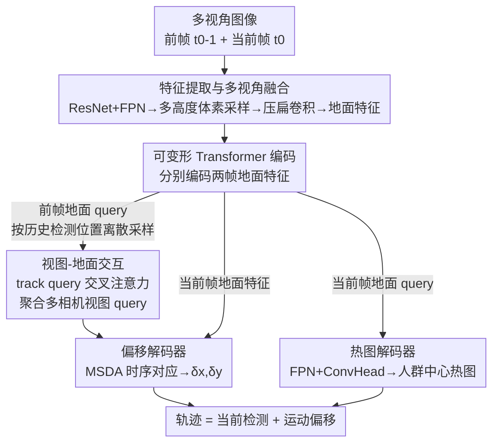

# Multi-view Crowd Tracking Transformer with View-Ground Interactions Under Large Real-World Scenes

**会议**: CVPR 2026  
**arXiv**: [2604.19318](https://arxiv.org/abs/2604.19318)  
**代码**: https://github.com/zqyq/MVTrackTrans  
**领域**: 多视角跟踪 / 目标检测  
**关键词**: 多视角人群跟踪、Transformer、视图-地面交互、BEV、大场景数据集

## 一句话总结
首次把多视角人群跟踪从 Wildtrack/MultiviewX 这类几十帧小场景推进到上百米的大规模真实场景，提出一个完全基于 Transformer 的模型 MVTrackTrans（在地面 BEV 空间做跟踪 + 视图-地面交叉注意力补全外观信息），并配套发布两个大场景长序列数据集 MVCrowdTrack 与 CityTrack，在大数据集上 MOTA/IDF1 全面领先 CNN 方法。

## 研究背景与动机
**领域现状**：多视角人群跟踪（multi-view crowd tracking）的目标是融合多路同步标定相机的信息，在场景地面平面上估计每个人随时间的运动轨迹，应用于人群管理、公共交通、自动驾驶等。当前主流（EarlyBird、TrackTacular、MVFlow 等）几乎都是 CNN 架构：先把各视角特征投影到 BEV/地面平面做多视角检测，再叠加相邻帧的世界表示回归运动偏移、配合 ReID 和卡尔曼滤波做时序关联。

**现有痛点**：这些方法几乎都只在 Wildtrack 和 MultiviewX 上评测。这两个数据集场景小（36×12 m、25×16 m）、评测序列只有几百帧、人数仅三百多、平均轨迹长度只有 30~44 帧。在这种"袖珍"benchmark 上调出来的方法，一旦搬到真实的大场景（更大的覆盖范围、更密的人群、更严重的遮挡、更长的时间跨度）就难以适用——既缺合适的数据集来暴露问题，方法本身的容量也跟不上。

**核心矛盾**：一方面是评测层面的——小数据集无法反映真实应用的难度；另一方面是模型层面的——CNN 架构的感受野和时空关联建模能力，在大场景密集人群下不足以支撑稳定的长时跟踪。而 Transformer 在单视角 MOT 里已被证明擅长全局时空关联，却几乎没人在多视角人群跟踪上探索过。

**本文目标**：(1) 提供能反映真实复杂度的大场景长序列评测基准；(2) 设计一个 Transformer 架构的多视角跟踪模型，把多视角检测的"视图特征"和"地面特征"更充分地融合起来。

**切入角度**：作者观察到，纯在地面 BEV 平面上离散采样得到的 track query，丢失了每个人在原始相机视角里的外观细节（投影后特征被拉伸、模糊）；而单看各相机视角又缺乏跨视角一致的地面定位。两者互补，于是用注意力把"地面侧 track query"和"多相机视图 query"显式交互。

**核心 idea**：在 BEV 地面平面上用 Transformer 做跟踪，并用一个 **View-Ground Interaction** 模块，让地面 track query 通过交叉注意力从所有相机视图 query 中聚合外观特征，补全离散采样丢失的视觉信息。

## 方法详解

### 整体框架
MVTrackTrans 接收连续两帧（前一帧 $t_0\!-\!1$ 与当前帧 $t_0$）的多视角图像，输出当前帧每个人在地面平面上的位置（检测热图）和相对前一帧的运动偏移，二者结合得到轨迹。整个流程分三个阶段：**特征提取与多视角融合** → **多视角跟踪编码（含视图-地面交互）** → **多视角跟踪解码（双分支）**。

直观地说：先用共享 ResNet 把每个相机的图像特征经多高度体素采样投影、压扁、卷积融合成地面特征；再用可变形 Transformer 编码器分别编码前/当前帧的地面特征，从前一帧的地面 query 上按历史检测位置离散采样出 track query，并让它和多相机视图 query 做交叉注意力补全外观；最后偏移解码器用可变形注意力把前一帧的 track query 跟当前帧地面特征做时序对应回归 $[\delta x,\delta y]$，热图解码器从当前帧地面特征回归人群中心热图，两者合成轨迹。

### 关键设计

**1. 多高度体素采样的多视角地面融合：在投影时不丢失高度信息**

多视角融合的老问题是：把图像特征投到固定高度的单一地面平面，人体不同高度（脚、躯干、头）的信息会被压到同一平面而错位。作者改用多高度的双线性体素采样：对地面上空的一个体素 $(x_n,y_n,z_n)$，用相机投影矩阵 $K[R|T]$ 把它的八个顶点投影到所有相机图像平面 $(u_n,v_n,1)^T = K[R|T](x_n,y_n,z_n,1)^T$，从各视角特征图 $\hat{F}_{\mathrm{view}_i}^{t_0}$ 上采样并跨视角聚合。这样每个体素都能从多个相机拉到有效特征，再沿高度轴塌缩、用卷积跨视角融合，得到多尺度地面特征 $\{F_l^{t_0}\}_{l=1}^L$。多高度采样让远距离、密集遮挡场景下的地面表示更鲁棒——这是适配大场景的几何基础。

**2. 可变形编码 + 地面离散采样得到 track query：把"被跟踪的人"显式表示在地面空间**

前/当前帧地面特征各自送入同一个基于多尺度可变形注意力的 Transformer 编码器（公式 2、3），聚合跨尺度信息得到 $\hat{Q}^{t_0-1}$、$\hat{Q}^{t_0}$。关键一步是从前一帧编码后的地面 query 上、在历史检测位置 $(x,y)$ 处做**离散采样**构造 track query：$Q_{\mathrm{track}}^{t_0-1} = \mathrm{SampleQueries}(\hat{Q}^{t_0-1},(x,y))$。这把"上一帧已经跟踪到的每个实体"变成一组显式的、可在地面空间寻址的 query，作为后续时序传播的载体。相比把整张 BEV 当稠密回归，这种稀疏 query 让跟踪关联落到"每个个体"上。

**3. View-Ground Interaction：用交叉注意力补回离散采样丢掉的视觉外观**

这是本文性能增量的核心。离散从地面 query 采样虽然定位准，但投影后地面特征被拉伸，单个人的外观表征不充分，长时跟踪容易掉。作者为每个相机从其视图检测特征上采样一组视图 query，跨相机拼接成 $Q_{\mathrm{view}}^{t_0-1} = \mathrm{Concat}(Q_{\mathrm{view},0}^{t_0-1},\dots,Q_{\mathrm{view},n-1}^{t_0-1})$（公式 4）。然后 track query 与 view query 各过独立 FFN 后做交叉注意力——**track query 当 Q，多相机 view query 当 K/V**：$Q_{\mathrm{track}}^{t_0-1} = \mathrm{CrossAttn}(\mathrm{FFN}(Q_{\mathrm{track}}^{t_0-1}), \mathrm{FFN}(Q_{\mathrm{view}}^{t_0-1}))$（公式 5）。这让每个 track query 主动从对应同一个人的所有相机视角聚合视觉特征，把"地面定位"和"视图外观"两套互补信息合到一起。消融显示，单纯加一个 2D 视图分支反而掉点（2D 与地面任务训练竞争），只有加上这个交互模块才真正涨点；且交叉注意力优于自注意力（融合更彻底）。

**4. 双分支解码：偏移解码器管时序、热图解码器管检测**

解码阶段两路并行。偏移解码器用标准多尺度可变形注意力（MSDA）建模相邻帧地面特征的时序对应：以前一帧 track query $Q_{\mathrm{track}}^{t_0-1}$ 为查询、当前帧地面特征 $\hat{Q}^{t_0}$ 为参考，并以前一帧检测位置 $(x^{t_0-1},y^{t_0-1})$ 作为可变形采样的参考点 $\hat{Q}_{\mathrm{track}}^{t_0} = \mathrm{MSDA}(Q_{\mathrm{track}}^{t_0-1},\hat{Q}^{t_0},(x^{t_0-1},y^{t_0-1}))$（公式 6），再过轻量 MLP 头回归地面运动偏移 $O^{t_0} = [\delta x,\delta y]^T$（公式 7）。热图解码器则把当前帧多尺度地面特征用 FPN 上采样融合到最高分辨率，过卷积回归头输出人群中心热图 $H^{t_0} = \mathrm{ConvHead}(\mathrm{FPN}(\hat{Q}^{t_0}))$。检测热图给"人在哪"，偏移给"往哪动"，二者合成连续轨迹。

### 损失函数 / 训练策略
联合优化地面/图像两域的热图分类损失与地面运动偏移的回归损失，并用不确定性加权自适应平衡两支。
- **热图损失**：在每个目标中心放高斯响应构造 GT 热图 $H^*$，对预测热图用 focal loss $\mathcal{L}_{\mathrm{ground}} = \mathrm{FocalLoss}(H,H^*)$；另加同形式的图像级监督项 $\mathcal{L}_{\mathrm{img}}$ 预测各视角的人体中心热图。
- **偏移回归损失**：仅对有效中心位置（$C^*_{xy}=1$）施加 $\ell_1$ 损失 $\mathcal{L}_{\mathrm{track}} = \frac{1}{K}\sum_{x,y}\|O_{xy}-O^*_{xy}\|_1$，保证对活跃轨迹的稀疏监督。
- **总损失（不确定性加权）**：$\mathcal{L}_{\mathrm{all}} = 10e^{-\sigma_c}\mathcal{L}_{\mathrm{ground}} + e^{-\sigma_t}\mathcal{L}_{\mathrm{track}} + \mathcal{L}_{\mathrm{img}} + \sigma_c + \sigma_t$，其中 $\sigma_c$、$\sigma_t$ 是中心支与跟踪支的可学习不确定性参数，让网络自动校准两支相对贡献。

训练设置：ResNet18 特征提取 + Deformable DETR 风格编解码器；图像 resize 到 1280×720；50 epoch，初始学习率 0.01；4 张 RTX 4090，batch size = 1。

## 实验关键数据

### 主实验
在两个新提出的大数据集上对比 SOTA（MOTA、IDF1 为主指标）：

| 数据集 | 方法 | MOTA↑ | MOTP↑ | IDF1↑ | MT↑ | ML↓ |
|--------|------|-------|-------|-------|-----|-----|
| MVCrowdTrack | EarlyBird | 54.56 | 30.46 | 53.84 | 24.48 | 14.22 |
| MVCrowdTrack | MVFlow | 49.82 | 46.79 | 44.06 | 22.22 | 37.04 |
| MVCrowdTrack | TrackTacular | 62.86 | 29.23 | 58.71 | 40.81 | 10.20 |
| MVCrowdTrack | **MVTrackTrans** | **63.87** | 40.59 | **59.06** | **42.85** | **8.16** |
| CityTrack | EarlyBird | 48.85 | 21.83 | 32.15 | 17.33 | 13.9 |
| CityTrack | MVFlow | 38.19 | 6.94 | 27.89 | 8.92 | 24.88 |
| CityTrack | TrackTacular | 43.37 | 23.23 | 32.49 | 20.43 | 12.38 |
| CityTrack | **MVTrackTrans** | **55.39** | 22.71 | **34.41** | **25.07** | 12.69 |

在大数据集上本文 MOTA/IDF1/MT 全面第一：CityTrack 上 MOTA 较次优的 EarlyBird 高 +6.5、较 TrackTacular 高 +12。指标说明：MT/ML 是"成功跟踪 >80% / <20% 生命周期"的轨迹占比；正样本关联距离阈值大数据集设 $r=2$ m、小数据集 $r=1$ m。

数据集对比（说明新基准的"大"）：

| 数据集 | 分辨率 | 视角数 | 人数 | 帧数 | FPS | 场景(m²) | 平均轨迹长 |
|--------|--------|-------|------|------|-----|---------|-----------|
| MultiviewX | 1920×1080 | 6 | 360 | 400 | 2 | 25×16 | 44 |
| Wildtrack | 1920×1080 | 7 | 313 | 400 | 2 | 36×12 | 30 |
| CityTrack | 2704×1520 | 3 | 950 | 2588 | 4 | 64×76 | 228 |
| MVCrowdTrack | 5312×2988 | 7 | 342 | 4122 | 4 | 120×80 | 176 |

在小数据集上则只是"comparable"：Wildtrack 上 MVTrackTrans 91.2 MOTA（加两帧融合+卡尔曼的变体† 93.6），优于 ReST/MCBLT/EarlyBird/REMP，但低于 MVTrajecter（94.3）；MultiviewX 上甚至 IDF1 偏低（72.1，†版 86.3）。作者坦言模型优势集中在大场景。

### 消融实验（均在 CityTrack）
| 配置 | MOTA↑ | IDF1↑ | 说明 |
|------|-------|-------|------|
| Baseline（无 2D 视图分支） | 54.92 | 34.11 | 仅地面分支 |
| + View Prediction Branch | 53.17 | 32.65 | 仅加 2D 热图分支，反而掉点 |
| ++ View Interaction (Ours) | **55.39** | **34.41** | 再加视图-地面交互模块 |
| 交互用 SelfAtt | 55.38 | 33.64 | 视图/地面 query 自注意力融合 |
| 交互用 CrossAtt (Ours) | 55.39 | **34.41** | 交叉注意力，IDF1 更高 |
| Coordinate regression 监督 | 40.71 | 31.45 | 稀疏 query + 直接坐标回归 |
| Heatmap regression (Ours) | **55.39** | **34.41** | 稠密热图监督 |

### 关键发现
- **单加 2D 视图分支会掉点**（MOTA 54.92→53.17）：2D 检测任务与地面平面任务在训练时相互竞争；必须配上 View-Ground Interaction 才能把视图信息有效用起来（→55.39）。这是"交互模块"而非"多分支"本身在涨点的直接证据。
- **交叉注意力 > 自注意力**：CrossAtt 让 track query 主动从 view query 取信息、融合更彻底，IDF1 34.41 vs 33.64。
- **热图监督 >> 坐标回归**：MOTA 55.39 vs 40.71，差距巨大。作者解释多视角投影会把地面特征拉伸、引入噪声，稠密热图监督比稀疏坐标回归更能引导模型抵抗这种噪声。
- **Transformer 在大场景优势明显、小场景不明显**：大数据集上对 CNN 方法全面领先，小数据集仅 comparable，说明该架构的收益来自大场景复杂时空关联。

## 亮点与洞察
- **"地面定位 + 视图外观"的显式互补很巧**：作者点破了 BEV 离散采样丢外观、单视图缺定位这对矛盾，用交叉注意力（track query 为 Q、多相机 view query 为 K/V）让二者直接对话，比堆 ReID 模块更轻、更端到端。
- **消融把"分支 vs 交互"拆得很干净**：通过"加分支反而掉点、加交互才涨点"这组对照，明确证明性能来自跨域融合机制本身，而不是单纯多了一路监督——这种诚实的负结果对照很有说服力。
- **数据集贡献含金量高**：把场景从几十米推到 120×80 m、序列从几百帧到 4000+ 帧、轨迹长度从 ~30 到 176~228，直接暴露了 CNN 方法在长时跟踪上的脆弱（MVFlow 在大数据集崩到 38 MOTA），为这个任务建了更接近真实的标尺。
- **可迁移思路**：把"稀疏跟踪 query × 多相机稠密视图特征"做交叉注意力补全外观，可迁移到任意 BEV 检测/跟踪（如自动驾驶多相机感知）中外观信息退化的场景。

## 局限与展望
- **小场景上不占优**：Wildtrack/MultiviewX 上低于 MVTrajecter，MultiviewX 的 IDF1 还明显偏低（72.1），说明方法的优势强依赖大场景，普适性有待加强。
- **依赖精确标定与同步**：多高度体素采样和投影融合都建立在已知内外参与帧同步之上，标定误差在大场景下的影响未讨论。
- **只用相邻两帧的短时序**：核心模型只看 $t_0\!-\!1$ 与 $t_0$ 两帧，长时遮挡恢复需靠 †变体外挂卡尔曼滤波，端到端的长程关联（如 MCBLT 的多尺度时序、MeMOT 的记忆）尚未纳入。
- **batch size = 1、ResNet18 backbone**：受高分辨率多视角输入显存限制，训练规模和 backbone 容量都较小，可能未充分发挥 Transformer 潜力。
- 改进方向：把视图-地面交互扩展到多帧记忆、引入更强的长时关联策略，并验证对标定噪声的鲁棒性。

## 相关工作与启发
- **vs EarlyBird / TrackTacular（CNN BEV 跟踪）**：它们在 BEV 上做检测 + ReID/卡尔曼或叠加相邻帧世界表示回归偏移；本文换成 Transformer 在地面做跟踪，并显式做视图-地面交互。大场景下本文 MOTA 全面更高，但小场景上 TrackTacular 仍具竞争力。
- **vs MVFlow**：MVFlow 用弱监督地面运动流、且把人限制在单个离散格子，长时连续运动建模差，在大数据集上崩得最厉害（MVCrowdTrack 49.8、CityTrack 38.2 MOTA）；本文用稠密热图 + 偏移回归，长时跟踪稳得多。
- **vs MCTR（Transformer 多视角跟踪）**：MCTR 在原始相机视角里迭代更新全局跟踪嵌入 + 概率关联；本文直接在 BEV 地面空间跟踪并加视图-地面交互模块，定位与外观融合更直接。
- **vs 单视角 Transformer MOT（TransCenter / P3AFormer / MeMOT 等）**：借鉴了稠密热图表示与 track query 思想（TransCenter 风格的热图监督在本文消融中被证明关键），但把它扩展到多相机标定融合的多视角地面设定——这正是此前 Transformer 几乎未触及的空白。

## 评分
- 新颖性: ⭐⭐⭐⭐ 首个 Transformer 多视角人群跟踪模型 + 视图-地面交叉注意力，模块组合新颖但都基于成熟构件。
- 实验充分度: ⭐⭐⭐⭐ 两个新大数据集 + 4 项消融把"分支/交互/注意力类型/监督方式"拆得清楚；但小数据集上不占优略削弱说服力。
- 写作质量: ⭐⭐⭐⭐ 结构清晰、公式完整、消融对照诚实，含负结果。
- 价值: ⭐⭐⭐⭐ 大场景数据集 + 代码开源，把任务推向真实场景，对社区有较强基础设施价值。

<!-- RELATED:START -->

## 相关论文

- [\[CVPR 2026\] Wavelet-Driven 3D Anomaly Detection under Pose-Agnostic and Sparse-View](wavelet-driven_3d_anomaly_detection_under_pose-agnostic_and_sparse-view.md)
- [\[CVPR 2026\] GMT: Effective Global Framework for Multi-Camera Multi-Target Tracking](gmt_effective_global_framework_for_multi-camera_multi-target_tracking.md)
- [\[CVPR 2026\] CrossVL: Complexity-Aware Feature Routing and Paired Curriculum for Cross-View Vision-Language Detection](crossvl_complexity-aware_feature_routing_and_paired_curriculum_for_cross-view_vi.md)
- [\[CVPR 2026\] AR²-4FV: Anchored Referring and Re-identification for Long-Term Grounding in Fixed-View Videos](ar2-4fv_anchored_referring_and_re-identification_for_long-term_grounding_in_fixe.md)
- [\[CVPR 2026\] From Detection to Association: Learning Discriminative Object Embeddings for Multi-Object Tracking](from_detection_to_association_learning_discriminative_object_embeddings_for_mult.md)

<!-- RELATED:END -->
