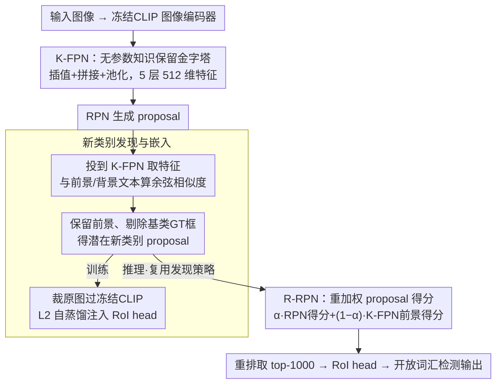

# NoOVD: Novel Category Discovery and Embedding for Open-Vocabulary Object Detection

**会议**: CVPR 2026  
**arXiv**: [2603.21069](https://arxiv.org/abs/2603.21069)  
**代码**: 无  
**领域**: 目标检测  
**关键词**: 开放词汇目标检测、新类别发现、自蒸馏、K-FPN、冻结VLM

## 一句话总结
提出NoOVD框架，在基于冻结VLM的OVD训练中通过无参数K-FPN保留CLIP知识来发现潜在新类别目标、通过自蒸馏将新类别知识嵌入检测器、通过R-RPN在推理时提升新类别召回率，在OV-LVIS/OV-COCO/Objects365上取得SOTA。

## 研究背景与动机

1. **领域现状**：开放词汇目标检测（OVD）旨在让检测器识别训练时未见过的新类别。主流方法构建在冻结VLM（如CLIP）之上，只训练检测模块（FPN、RPN、RoI head），通过VLM的零样本迁移能力实现对新类别的识别。
2. **现有痛点**：训练和测试之间存在显著gap——训练时只有基类标注，所有未标注的新类别目标被强制视为背景。RPN阶段新类别proposal得分低被过滤掉，RoI阶段新类别特征被强制对齐到背景文本嵌入。测试时这些proposal同样得分低，在后处理时被移除，导致新类别召回率大幅下降。
3. **核心矛盾**：训练时没有新类别标注，模型被迫将新类别当背景学习；但测试时又要求模型识别这些类别。已有解决思路要么依赖大规模额外数据（成本高），要么使用伪标签（引入噪声）。
4. **本文目标** (1) 在不引入额外数据和伪标签噪声的前提下发现潜在新类别目标；(2) 将新类别知识嵌入检测器；(3) 提升推理时新类别的召回率。
5. **切入角度**：利用冻结CLIP自身的零样本识别能力来发现前景目标，用类别无关的通用前景/背景文本描述代替具体类别名称，无需知道新类别的名字就能区分前景和背景。
6. **核心 idea**：用冻结CLIP的零样本能力做类别无关的前景发现，然后通过自蒸馏把新类别知识注入检测器，避免新类别特征被错误对齐到背景。

## 方法详解

### 整体框架
NoOVD要解决的核心是开放词汇检测里的"训练-测试鸿沟"：训练时只有基类标注，所有未标注的新类别目标被当成背景压低分数，到测试时这些 proposal 仍然得分低、在后处理里被滤掉，于是新类别召回崩盘。整个框架建在冻结CLIP的两阶段检测器之上，思路是把CLIP自身的零样本前景识别能力贯穿到训练和推理两端。训练时，先用无参数的 K-FPN 从冻结CLIP的多层特征搭出特征金字塔，避免基类训练污染CLIP原有的新类别知识；再借类别无关的"前景/背景"文本描述把潜在新类别 proposal 从背景里捞出来，并通过自蒸馏把CLIP的区域特征灌进RoI head，让检测器在训练阶段就见过新类别而非把它们学成背景。推理时，R-RPN 复用同一套前景发现策略，给那些被RPN压低的新类别 proposal 重新加分，把它们救回 top-1000 送进RoI head。

### 关键设计

**1. K-FPN：用完全无参数的金字塔守住CLIP的新类别知识**

标准FPN带可学习参数，而训练只有基类数据，梯度会把CLIP特征往基类方向拽、经过FPN后发生漂移，新类别的表示随之丢失——这正是后续发现新类别的地基若塌就全盘皆输的环节。K-FPN干脆去掉所有可学习参数：以CLIP ViT-B/16为例，取第 [5,7,11] 层特征图作为 $\{P_2,P_3,P_4\}$，按FPN自顶向下融合后，用CLIPSelf的冻结降维头把768维压到512维以对齐文本嵌入维度，得到 $\{C_2,C_3,C_4\}$；再把高层 $C_4$ 上采样后与 $C_3$、$C_2$ 拼接成高分辨率的 $\{F_2,F_3,F_4\}$，对 $C_4$ 做两次 max pooling 补出 $\{F_5,F_6\}$。整条路径只有插值、拼接、池化，没有一个可训练权重，因此基类训练再怎么更新检测头也动不了CLIP的原始表示，金字塔输出的特征始终保留着对新类别的零样本判别力。

**2. 新类别发现与嵌入：不靠类名、只靠"前景 vs 背景"把新类别从背景里捞回来并蒸馏进检测器**

既然训练时拿不到新类别名字，关键就在于绕开"具体类别"这一层，只问"这块区域是不是前景"。作者用 ChatGPT-o1 生成30条类别无关的前景描述（如 "This is an object, specifically a plant"）和30条背景描述（如 "This is a background area"），提取其冻结CLIP文本嵌入作为锚点。把RPN proposal 投到 K-FPN 上做 RoI Align 取特征，计算它与前景/背景嵌入的余弦相似度，保留前景得分高于背景的 proposal，再剔除与GT Bbox 高度重叠的基类框，剩下的就被判为潜在新类别目标。对这批 proposal，从原图裁出对应区域送回冻结CLIP取图像特征，与RoI head 输出做 L2 自蒸馏：

$$\mathcal{L}_{kd} = \|F_{proposals+}^{RoI} - F_{proposals+}^{Image}\|_2^2$$

这一步让检测器在训练阶段就把新类别"学进去"而非学成背景，且全程不引入任何额外数据、不构造图文伪标签，从源头避开了伪标签噪声。

**3. R-RPN：推理时用CLIP前景知识把被RPN压低的新类别 proposal 救回来**

即使训练时已注入新类别知识，RPN 的得分仍偏向基类，新类别 proposal 经过 NMS 与置信度排序后容易被甩出 top-K，这是检测失败的直接出口。R-RPN 在RPN后处理前复用训练同款的前景发现策略，对 NMS 后的 proposal 重新做前景分类，把 K-FPN 前景得分与原始RPN得分加权融合：

$$S_{R-RPN} = \alpha \cdot S_{RPN} + (1-\alpha) \cdot S_{K-FPN}, \quad \alpha=0.5$$

用融合得分重排后取 top-1000 送进RoI head。由于打分依据从"只看RPN学到的基类倾向"变成"叠加CLIP的通用前景判别"，那些原本沉底的新类别框被抬上来，召回率随之回升；又因为它和训练阶段共用一套发现逻辑，训练与推理在"什么算前景"上保持一致。

### 损失函数 / 训练策略
- 总损失 $\mathcal{L}_{total} = \mathcal{L}_{cls-RPN} + \mathcal{L}_{reg-RPN} + \mathcal{L}_{reg-RoI} + \mathcal{L}_{cons} + \mathcal{L}_{kd}$
- $\mathcal{L}_{cons}$为RoI head的对比损失，$\mathcal{L}_{kd}$为新类别自蒸馏L2损失（权重=1）
- 冻结CLIP image/text encoder，只训练FPN、RPN、RoI head
- OV-COCO训练5 epochs，OV-LVIS训练50 epochs
- 16个NVIDIA 3090，batch size 10/GPU，AdamW lr=$10^{-4}$

## 实验关键数据

### 主实验 - OV-LVIS

| 方法 | Backbone | AP_r (rare/新) | AP (总) |
|------|----------|---------------|---------|
| CLIPSelf + F-ViT | ViT-L/14 | 34.9 | 35.1 |
| DeCLIP + F-ViT | ViT-L/14 | 37.2 | 36.0 |
| **DeCLIP + NoOVD** | **ViT-L/14** | **39.2 (+2.0)** | **37.7 (+1.7)** |
| CLIPSelf + NoOVD | ViT-B/16 | 28.3 (+2.9) | 26.7 (+1.3) |
| YOLOE | YOLOv11-L | 29.1 | 35.2 |
| RO-ViT | ViT-H/16 | 34.1 | 35.1 |

### 主实验 - OV-COCO

| 方法 | Backbone | AP_novel^50 | AP^50 |
|------|----------|-------------|-------|
| DeCLIP + F-ViT | ViT-L/14 | 46.2 | 60.3 |
| **DeCLIP + NoOVD** | **ViT-L/14** | **47.5 (+1.3)** | **61.0 (+0.7)** |
| CORA+ | RN50x4 | 43.1 | 56.2 |

### 消融实验

| 配置 | AP_r | AP |
|------|------|-----|
| Baseline (F-ViT) | 25.4 | 25.4 |
| + CLIP-top (简单顶层特征) | 26.4 | 26.1 |
| + K-FPN | 27.5 | 26.4 |
| + R-RPN | 26.7 | 25.9 |
| + K-FPN + R-RPN (完整) | **28.3** | **26.7** |

### 跨数据集迁移 (LVIS→Objects365)

| 方法 | Backbone | AP_r | AP50 |
|------|----------|------|------|
| CLIPSelf + F-ViT | ViT-L/14 | 21.7 | 39.2 |
| CLIPSelf + NoOVD | ViT-L/14 | **22.8 (+1.1)** | **40.2 (+1.0)** |

### 关键发现
- **K-FPN vs 简单CLIP顶层特征**：K-FPN多尺度特征金字塔比单层特征在新类别检测上多提升1.1%，说明多尺度对不同大小新类别目标的发现至关重要。
- **K-FPN和R-RPN互补**：K-FPN解决训练时的知识保留和注入问题，R-RPN解决推理时的召回问题，两者组合效果最佳。
- **OV-LVIS比OV-COCO更稳定**：OV-COCO标注不完整，训练时被NoOVD正确检出的新类别目标在测试时反而被计为误检（false positive），导致增益被低估。
- **融合权重W=0.3最优**：K-FPN特征融合中高层语义和底层细节的平衡很重要，比例过大或过小都会掉点。

## 亮点与洞察
- **无额外数据、无伪标签的新类别发现**：利用通用前景/背景文本描述和冻结CLIP的零样本能力就能发现新类别，无需知道具体类别名称，也无需图文匹配构造伪标签。这种"类别无关但前景感知"的策略非常巧妙精简。
- **K-FPN完全无参数设计**：通过纯插值、拼接、池化从冻结CLIP特征构建特征金字塔，最大程度避免了基类训练对新类别知识的破坏。这个设计虽然简单但直击问题本质。
- **训练-推理一致的发现策略**：训练时用前景发现做自蒸馏，推理时同样的策略给R-RPN做分数重加权，逻辑自洽。

## 局限与展望
- 前景/背景文本描述是用ChatGPT生成的固定30+30条，可能无法覆盖所有场景语义，自动化/自适应prompt设计可能更好
- 自蒸馏的新类别proposal选择依赖阈值，可能漏掉与背景视觉相似的新类别目标（如road上的manhole cover）
- R-RPN的 $\alpha=0.5$ 是固定值，对不同数据集/不同新基类比例可能不是最优
- 当前框架是two-stage detector，与one-stage/DETR-based检测器的结合未探索

## 相关工作与启发
- **vs Detic**: Detic用ImageNet图像级标签扩展类别，依赖额外大规模数据；NoOVD完全不需要额外数据，只利用CLIP自身能力
- **vs CLIPSelf/DeCLIP**: 这些方法优化了CLIP的区域级表示但仍在训练中将新类别当背景；NoOVD从训练流程本身修正了这个问题
- **vs F-VLM**: 同样基于冻结VLM但F-VLM没有主动发现新类别的机制；NoOVD通过K-FPN+自蒸馏主动挖掘和学习新类别知识

## 评分
- 新颖性: ⭐⭐⭐⭐ 类别无关的新类别发现+K-FPN无参数设计思路新颖
- 实验充分度: ⭐⭐⭐⭐⭐ OV-LVIS/OV-COCO/Objects365三个数据集、多backbone、跨数据集验证、详细消融
- 写作质量: ⭐⭐⭐⭐ 问题定义清晰，方法描述详尽，图示丰富
- 价值: ⭐⭐⭐⭐ 提供了一种无需额外数据的OVD新范式，对开放词汇检测社区有参考价值

<!-- RELATED:START -->

## 相关论文

- [\[CVPR 2026\] SRA-Det: Learning Omni-Grained Open-Vocabulary Detection Beyond Category Names](sra-det_learning_omni-grained_open-vocabulary_detection_beyond_category_names.md)
- [\[CVPR 2026\] Parameter-Efficient Semantic Augmentation for Enhancing Open-Vocabulary Object Detection](parameter-efficient_semantic_augmentation_for_enhancing_open-vocabulary_object_d.md)
- [\[CVPR 2026\] WeDetect: Fast Open-Vocabulary Object Detection as Retrieval](wedetect_fast_open-vocabulary_object_detection_as_retrieval.md)
- [\[CVPR 2026\] Thermal-Det: Language-Guided Cross-Modal Distillation for Open-Vocabulary Thermal Object Detection](thermal-det_language-guided_cross-modal_distillation_for_open-vocabulary_thermal.md)
- [\[CVPR 2026\] Consistency Beyond Contrast: Enhancing Open-Vocabulary Object Detection Robustness via Contextual Consistency Learning](consistency_beyond_contrast_enhancing_open-vocabulary_object_detection_robustnes.md)

<!-- RELATED:END -->
