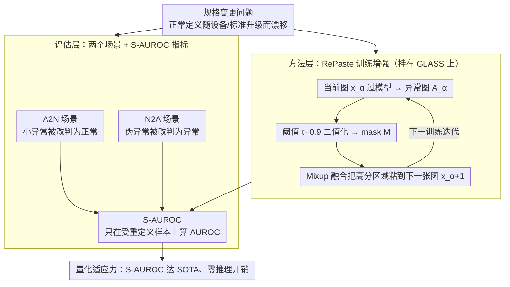

# Novel Anomaly Detection Scenarios and Evaluation Metrics to Address the Ambiguity in the Definition of Normal Samples

**会议**: CVPR 2026  
**arXiv**: [2604.07097](https://arxiv.org/abs/2604.07097)  
**代码**: [https://github.com/ReijiSoftmaxSaito/Scenario](https://github.com/ReijiSoftmaxSaito/Scenario)  
**领域**:目标检测
**关键词**: 异常检测, 规格变更, 正常样本定义模糊, 伪异常, 工业缺陷检测

## 一句话总结

针对工业异常检测中"正常"定义随规格变更而变化的实际问题，提出了两种新场景（A2N/N2A）、一个新评价指标（S-AUROC）和一种训练增强方法 RePaste，通过将高异常分数区域重新粘贴到训练图片中来增加其出现频率，使模型灵活适应正常样本定义的变化。

## 研究背景与动机

1. **领域现状**：传统异常检测方法假设训练数据仅由无缺陷的正常样本组成，模型在推理时区分正常和异常样本。近年来，基于记忆、知识蒸馏、流模型、重建和伪异常的方法不断涌现，GLASS 达到了 SOTA 水平。

2. **现有痛点**：在实际工业环境中，"正常"的定义往往是模糊的。例如，某些微小划痕或灰尘在当前规格下可接受，但升级设备后可能被视为异常；反之亦然。这种规格变更在工业场景中频繁发生，但现有方法完全没有考虑。

3. **核心矛盾**：概念漂移、领域自适应和持续学习虽然处理数据分布变化，但它们针对的是分布偏移，而非正常与异常语义定义的显式重定义。现有评价指标（AUROC、F1等）也假设标签定义不变，无法量化模型对定义变更的适应能力。

4. **本文目标**（1）如何定义和评估模型在正常/异常定义变化下的表现？（2）如何让模型灵活适应这种语义重定义？

5. **切入角度**：作者观察到训练图片中持续出现高异常分数的区域往往对应微小缺陷（如灰尘、小划痕），而这些恰恰是规格变更最容易影响的区域。通过增加这些区域的训练频率，可以压低其异常分数。

6. **核心 idea**：将高异常分数区域从当前训练图片重新粘贴到下一张训练图片上，让模型学会将这些"边界模糊"区域视为正常。

## 方法详解

### 整体框架

这篇论文要解决的是"正常"定义会随规格变更而漂移、但现有异常检测既不评估也不适应这种漂移的问题。它的贡献分两层：评估层给出两个新场景（A2N、N2A）和一个专门指标 S-AUROC，把"模型能不能跟着规格走"变成可量化的协议；方法层给出 RePaste，一个零推理开销的训练增强，让模型主动把那些边界模糊的区域吸收进正常分布。整套东西都搭在 GLASS 这个 SOTA 基线上，输入是工业产品图片，输出是像素级异常分数图。

这里先把贯穿全篇的度量讲清楚：标准 AUROC 在全部测试样本上算，无法看出模型在"被重定义的那一小撮样本"上表现如何。**S-AUROC（Specification-AUROC）就是只在受规格变更影响的那部分样本上计算的 AUROC**——A2N 里是被改判为正常的小异常，N2A 里是被改判为异常的伪异常样本。把评估范围收窄到这些边界样本，S-AUROC 才能真正反映模型对定义切换的适应力，而不被大量没争议的样本稀释掉。

下图把这套"两层贡献"画出来：评估层用 A2N、N2A 两个场景模拟规格变更的两个方向，统一汇到 S-AUROC 上度量；方法层用 RePaste 在训练时迭代地把高分区域粘回，逼模型把这些边界区域吸收进正常分布。两层最终都落在"模型对定义切换的适应力"这一指标上。

### 关键设计

**1. Anomaly-to-Normal 场景（A2N）：模拟"规格放宽、原来的异常现在算合格"**

这一场景针对的是工业里"升级设备后小划痕不再算缺陷"这类宽松化调整。它用一对子场景做对照来量化适应力：$A2N_{A2N}$ 把某类异常（如 "Broken"）的一半样本当作正常塞进训练集、另一半留在测试集里当正常样本评估，逼模型在见过这类"新正常"后还能不能正确接纳它们；$A2N_S$ 则是不做任何重定义的标准设置，作为基准线。两者的 S-AUROC 之差就量化了模型吸收"异常转正常"的能力。值得注意的是，作者只挑平均 mask 面积 < 1% 的小异常作为重定义目标，因为现实中没人会把一道贯穿的大裂缝重新判成合格——这个面积约束让场景贴合真实的规格松动方式。

**2. Normal-to-Anomaly 场景（N2A）：模拟"规格收紧、原来的正常现在算缺陷"**

与 A2N 方向相反，N2A 对应质量标准提高后原本可接受的样品变成不合格的情形。难点在于真实的"刚被判废"的样本难以收集，作者改用 AnomalyAny 和 MemSeg 合成伪异常来代理：$N2A_{N2A}$ 把这些伪异常只放进测试集当异常评估，$N2A_S$ 则把其中一半放进训练集当正常样本，再比较两个子场景的 S-AUROC 来读出模型对"正常转异常"重定义的敏感度。A2N 和 N2A 合在一起，就把规格变更的两个方向都纳入了可比较的评估框架。

**3. RePaste：把高异常分数区域反复粘回训练图，逼模型把它吸收进正常分布**

前面两个场景暴露的痛点是——模型对那些"持续被打高分但其实处在合格边界"的小区域过于敏感，规格一松就误检。RePaste 的机制很直接：训练时把当前图像 $x_\alpha$ 过一遍模型得到异常图 $A_\alpha$，用阈值 $\tau$ 二值化出 mask $M$ 框住高分区域，再把这块区域贴到下一张训练图 $x_{\alpha+1}$ 上。关键是贴的方式不是硬覆盖，而是 Mixup 风格的融合

$$x'_{\alpha+1} = M \odot \frac{x_\alpha + x_{\alpha+1}}{2} + (1-M) \odot x_{\alpha+1}$$

用平均混合抹平粘贴边界的像素突变。之所以有效，是因为这些高分区域原本在训练集里出现得稀，模型才把它们当异常；人为提高其出现频率后，模型逐渐学会把这类边界模糊的纹理当成正常特征，从而压低误报。消融也印证了边界处理的必要性——去掉 Mixup 直接硬贴，N2A 的 S-AUROC 会暴跌 5.49%，因为生硬的粘贴边界本身就成了新的伪异常信号。整个策略只在训练期生效，推理时完全不需要，零额外开销。

### 损失函数 / 训练策略

RePaste 纯粹是训练时的数据增强，不改模型架构也不改损失函数，可以直接挂到 GLASS 的训练流程上。阈值取 $\tau = 0.9$，只对异常分数非常高的区域做重粘贴，其余训练设置与 GLASS 完全一致。

## 实验关键数据

### 主实验

在 MVTec AD 数据集上评估，使用 S-AUROC 衡量规格变更适应性：

| 方法 | A2N S-AUROC | N2A S-AUROC |
|------|------------|------------|
| PatchCore | 50.75 | 50.23 |
| SimpleNet | 84.25 | 75.70 |
| Dinomaly | 84.70 | 81.88 |
| GLASS | 86.29 | 83.25 |
| **RePaste** | **86.88** | **83.75** |

### 消融实验

| 配置 | A2N S-AUROC | N2A S-AUROC |
|------|------------|------------|
| GLASS (baseline) | 86.29 | 83.25 |
| RePaste w/o Mixup | 87.48 | 78.26 |
| RePaste w/ Mixup | 86.88 | 83.75 |

### 关键发现

- PatchCore 在规格变更场景下几乎等同于随机猜测（~50% S-AUROC），因为 coreset sampling 会移除稀有特征
- GLASS 在所有对比方法中最优，因为其梯度上升式伪异常生成具有灵活性
- RePaste 在 A2N 和 N2A 上分别提升了 0.59% 和 0.50% 的 S-AUROC
- 不使用 Mixup 的 RePaste 在 N2A 上急剧下降 5.49%，证明边界平滑对 N2A 场景至关重要
- RePaste 在标准 I-AUROC、P-AUROC 和 PRO 上也保持了与 GLASS 相当甚至更优的表现（Mean PRO 97.02% vs 96.83%）

## 亮点与洞察

- **问题定义新颖**：首次系统性地讨论异常检测中"正常"定义的模糊性和动态变化，提出 A2N/N2A 两种场景和 S-AUROC 指标，具有很强的实践意义
- **方法极其简洁**：RePaste 仅是训练时数据增强，不修改模型架构、不增加推理开销，却能有效改善规格变更适应性
- **Mixup 边界平滑的必要性**：消融实验清楚地展示了粘贴边界不连续性对 N2A 场景的严重影响，这一发现可以迁移到任何涉及区域粘贴的数据增强方法

## 局限与展望

- 仅在 MVTec AD 上评估，未在其他异常检测数据集（如 VisA、BTAD）上验证
- 阈值 $\tau$ 固定为 0.9，未探索自适应阈值策略
- RePaste 的提升幅度较小（<1% S-AUROC），说明这个问题可能需要更根本性的方法变革
- A2N 场景中仅考虑小异常的重定义，大缺陷的规格变更未被涉及
- N2A 使用合成伪异常代替真实的规格变更样本，可能存在分布差异

## 相关工作与启发

- **vs GLASS**: RePaste 建立在 GLASS 之上，保留了其伪异常生成的灵活性，同时通过区域重粘贴增加了"正常→异常"和"异常→正常"双向转换的能力
- **vs 概念漂移/域适应**: 本文指出规格变更与分布偏移本质不同——前者是决策边界的重构，后者是特征分布的偏移
- 该场景设定可以启发持续学习领域的异常检测方法设计

## 评分

- 新颖性: ⭐⭐⭐⭐ 场景定义和评价指标很新颖，但方法本身（区域重粘贴）相对简单
- 实验充分度: ⭐⭐⭐ 仅在 MVTec AD 一个数据集上评估，对比了较多方法但消融不够深入
- 写作质量: ⭐⭐⭐⭐ 问题定义清晰，场景描述详尽，但公式符号略显冗余
- 价值: ⭐⭐⭐⭐ 提出了一个重要且被忽视的实际问题，对工业异常检测有直接参考价值

<!-- RELATED:START -->

## 相关论文

- [\[CVPR 2025\] AnomalyNCD: Towards Novel Anomaly Class Discovery in Industrial Scenarios](../../CVPR2025/object_detection/anomalyncd_towards_novel_anomaly_class_discovery_in_industrial_scenarios.md)
- [\[CVPR 2026\] NoOVD: Novel Category Discovery and Embedding for Open-Vocabulary Object Detection](noovd_novel_category_discovery_and_embedding_for_open-vocabulary_object_detectio.md)
- [\[CVPR 2026\] Show, Don't Tell: Detecting Novel Objects by Watching Human Videos](show_dont_tell_detecting_novel_objects_by_watching.md)
- [\[CVPR 2026\] InvAD: Inversion-based Reconstruction-Free Anomaly Detection with Diffusion Models](invad_inversion-based_reconstruction-free_anomaly_detection_with_diffusion_model.md)
- [\[CVPR 2026\] Integration of Deep Generative Anomaly Detection Algorithm in High-Speed Industrial Line](integration_of_deep_generative_anomaly_detection_algorithm_in_high-speed_industr.md)

<!-- RELATED:END -->
