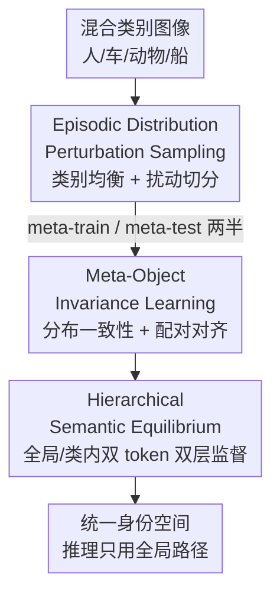

# Object-Generalized Re-Identification: A Step Towards Universal Instance Perception

**会议**: CVPR 2026  
**论文**: [CVF Open Access](https://openaccess.thecvf.com/content/CVPR2026/html/Chen_Object-Generalized_Re-Identification_A_Step_Towards_Universal_Instance_Perception_CVPR_2026_paper.html)  
**代码**: https://github.com/whucsy/OG-ReID  
**领域**: 目标检测 / 实例感知 / 重识别  
**关键词**: 物体重识别, 跨类别泛化, 元学习, 语义不变性, 通用实例感知

## 一句话总结
提出 Object-Generalized ReID（OG-ReID）新范式——用一个统一模型识别人、车、动物、船舶、建筑等异构物体的"同一实例"，并设计 MGOR 框架把元学习重新诠释为"语义分布正则化"，在 100+ 个未见类别上无需目标域适配就超过现有 ReID 方法。

## 研究背景与动机

**领域现状**：物体重识别（ReID）的任务是在不同视角、不同传感器下认出"同一个个体"。过去十年里行人 ReID 和车辆 ReID 都做得很好，深度特征 + 度量学习在各自类别内能达到很高的实例级精度。

**现有痛点**：几乎所有方法都建立在一个"类别一致假设"上——训练数据和测试数据来自同一类物体。这意味着每出现一种新物体（人、车、船、动物……）就要训练一个独立模型，标注昂贵、算力浪费、难以扩展。而现实场景（智慧城市、生态监测）里，视觉系统必须同时处理几十种异构物体，逐类建模根本撑不住。

**核心矛盾**：能不能像 DG-ReID（域泛化 ReID）那样直接拿来用？不行。DG-ReID 处理的是**域偏移**（同一类物体的视角、光照变化），它默认所有样本共享同一套语义结构。但 OG-ReID 面对的是**类别偏移**（category shift）：人靠身体部件识别、车靠几何轮廓、动物靠纹理花纹——身份线索的"定义方式"本身就不同。这种异构性直接破坏了共享特征假设，所以现有 DG 方法在混合类别上泛化很差，甚至不如普通监督模型。

**本文目标**：学一个类别无关（category-agnostic）的身份表示，从混合类别数据中训练，能直接迁移到完全没见过的物体类别上做实例匹配。

**切入角度**：作者重新审视了元学习。以往元学习被用来"模拟域偏移、反复适配合成域划分"，本质还是停在外观层面的适配。作者的观察是：如果**不把元学习当成"适配新任务"，而是当成"在不断变化的语义分布下保持身份判别力"**，它就能变成一个学语义不变表示的工具。

**核心 idea**：把元学习重新诠释为**语义分布正则化**——主动制造受控的类别分布扰动，让模型在"语义多样性"和"身份判别力"的拉扯中达到平衡，使不变性作为一种**均衡态**自然涌现，而不是靠显式对齐或对抗损失硬压出来。

## 方法详解

### 整体框架
MGOR（Meta-Generalized Object Re-Identification）的输入是混合多类别（人/车/动物/船…）的图像 + 身份标签 + 类别标签，输出是一个共享编码器 $f_\theta$，把任意类别的物体图像映射到统一身份空间，推理时只用全局表示做检索。整条流水线围绕"在受控语义扰动下学不变性"展开，三个组件层层递进：先用 **EDPS** 把每个 mini-batch 造成一次受控的类别分布扰动并切成 meta-train / meta-test 两半；再用 **MOIL** 把每个 episode 当成"分布一致性测试"，要求同一组参数在扰动前后都保持身份判别力；最后用 **HSE** 通过双 token、双层监督，让类别不变与类内判别这两个目标在表示空间里达到均衡。

### 关键设计

**1. Episodic Distribution Perturbation Sampling（EDPS）：把每个 mini-batch 造成一次受控的类别扰动**

传统 ReID 用 $P{\times}K$ 采样能保证一个 batch 里身份足够多样，但它对**语义构成**（这个 batch 里人占多少、车占多少、动物占多少）完全不加约束，于是训练过程几乎遇不到它将来要泛化的那种"类别比例变化"。EDPS 的做法是：先从类别集合 $S$ 里采子集 $S_b$，每个类别至少选两个身份、每个身份取 $K$ 张图，构造一个**类别均衡、身份成对**的 batch $B$；然后把 $B$ 均匀切成两个不相交的等大半边 $B^{\text{train}}, B^{\text{test}}$，满足 $|B^{\text{train}}| = |B^{\text{test}}| = \tfrac{1}{2}|B|$。这样每个 batch 都变成一次"类别分布的受控扰动"——meta-train 和 meta-test 的类别比例被人为打乱，反复地测试并正则化模型在演变语义下的身份稳定性。关键在"受控"二字：参数分析显示，调高 meta-train/meta-test 的类别不相交概率会牺牲已见类别（MSMT17）精度，但提升多类别泛化，给了一个可调的旋钮。

**2. Meta-Object Invariance Learning（MOIL）：用一组参数硬扛分布扰动，而不是重新适配**

EDPS 造出扰动后，MOIL 决定"怎么从扰动里学"。它和适配型元学习（学完 meta-train 再去 meta-test 上更新一步）最大的区别是——**坚决不让模型重新适配新的类别混合**。具体地：在 meta-train 上优化身份分类损失 $L^{\text{train}}_{\text{id}}$ 和度量损失 $L^{\text{train}}_{\text{met}}$（如 batch-hard triplet）；然后**冻住 $\theta$**，直接在 meta-test 上算 $L^{\text{test}}_{\text{id}}$ 来检验同一套参数在新语义构成下还稳不稳。这就把"语义级不变性"变成了对同一组参数 $\theta$ 的显式稳定性要求。

为了进一步拉住扰动前后的判别几何，MOIL 引入 **Conditional Pairwise Alignment**：把每个表示拆成身份原型加残差 $z_i = \mu_{y_i} + r_i$，其中 $\mu_y = \tfrac{1}{|X(y)|}\sum_{x_j \in X(y)} f_\theta(x_j)$ 是该身份的原型、$r_i$ 是保身份的细粒度变化。在两个 split 上分别收集同身份/异身份的距离集合 $D^+, D^-$，再用一维切片 Wasserstein 距离 $S(\cdot,\cdot)$ 对齐它们的分布形状：

$$L_{\text{pair}} = S\big(D^+_{\text{train}}, D^+_{\text{test}}\big) + S\big(D^-_{\text{train}}, D^-_{\text{test}}\big)$$

这一步只在"语义可比的配对单元"（默认身份原型，或最近邻 mini-cluster）内施加轻量约束，既保住了全局语义多样性，又把支撑身份识别的局部判别几何稳住，等于在条件维度上要求"扰动前后正负样本距离分布长得一样"。

**3. Hierarchical Semantic Equilibrium（HSE）：双 token 双层监督，让"跨类别不变"和"类内判别"在表示里达成均衡**

OG-ReID 内在有一对矛盾目标：既要类别无关（不同物体的身份都映到统一空间），又要类内判别（同类里把每个个体分开）。HSE 把标签空间分解成两个互补层次：全局身份空间是各类别身份集合的不交并 $Y = \bigsqcup_{s \in S} Y_s$，并定义投影 $\pi: Y \to S$ 给每个身份打上类别标签；于是同一个表示 $z$ 同时受两种监督——**全局视图**把所有身份当作互斥类（抹掉类别信息），**类内视图**只在 $Y_s$ 内做细粒度区分（强化类内分离）。

实现上用一个带两个 class token 的 ViT：全局 token $c_G$ 负责类别无关的身份证据，局部 token $c_L$ 负责类别特定细节，二者共享 backbone、attend 同一批 patch，输出 $z_G, z_L$ 分别喂给全局分类器 $g$ 和一组类别条件分类器 $\{g^{(s)}\}$。两路损失为：

$$\ell_{\text{glob}}(x, y) = -\log g(z_G)_y, \qquad \ell_{\text{spec}}(x, \tilde{y}, s) = -\log g^{(s)}(z_L)_{\tilde{y}}$$

其中 $\tilde{y}$ 是身份在自己类别里的局部索引。监督是**非对称**施加的：meta-train 同时用全局 + 类内信号雕刻表示，meta-test 只验证全局路径在语义扰动下的稳定性。这样几乎不增加架构开销就把"类别无关"和"类别敏感"两类因子分配到互补子空间，推理时只用全局路径 $z_G$。整段 episode 损失把 meta-train 判别、meta-test 稳定性和 HSE 双层监督合在一起，每个 episode 只反传一次。

### 损失函数 / 训练策略
backbone 为 ImageNet-1K 预训练的 ViT-B/16，输入 resize 到 $256{\times}256$、padding 10 像素、0.5 概率水平翻转。每次迭代构造一个 episode：类别均衡的 meta-train batch（$P{\times}K$，$K=4$）+ 类别比例被扰动的 meta-test batch，总 batch size 64。SGD 优化，初始学习率 $10^{-3}$、权重衰减 $10^{-4}$，每个 episode 只反传一次，训练 60 epoch。

## 实验关键数据

训练用 5 个单类别数据集覆盖 5 个域（行人 Market-1501、车辆 VeRi、海事 VesselReID、两个动物域 iPanda-50 / ATRW），共 2,092 身份、72,317 图。测试用 9 个高度多样的数据集，既含已见类别的新设定（MSMT17 行人、UAV-VeID 无人机视角车辆），也含 69+ 种野生动物、CUTE（50 类实验室物体）、University-1652（卫星→无人机建筑地理定位）、PetFace（细粒度宠物人脸）等未见类别/未见任务。除 VICP（需 128 张目标域图适配）外所有对比方法都在同设定下复现。

### 主实验

单类别 + 多类别九数据集平均（mAP / mINP / R1）：

| 方法 | 类型 | 单类别 Avg mAP | 多类别 Avg mAP | 九数据集 Avg mINP | Avg R1 |
|------|------|------|------|------|------|
| TransReID (ICCV'21) | 域特定 | — | — | 14.9 | 45.9 |
| CLIP-ReID (AAAI'23) | 域特定 | — | — | 12.4 | 45.9 |
| PAT (ICCV'23) | 域泛化 | — | — | 15.3 | 47.6 |
| VICP† (ICCV'25) | 通用物体 | — | — | 6.8 | 43.5 |
| **MGOR (本文)** | OG-ReID | — | **32.9 (CUTE)** | **17.5** | **51.1** |

> 表里 mINP/Avg 是九数据集综合后的均值。MGOR 把平均 mINP 从 PAT 的 15.3 提到 17.5、平均 R1 从 47.6 提到 51.1；在多类别场景（PetFace、Wildlife71、CUTE）优势更明显，例如 PetFace mAP 41.4 vs PAT 35.8、Wildlife71 mINP 54.5 vs PAT 46.8。

关键观察：很多 DG-ReID 方法（ReNorm、BAU、ADSR）一旦在多类别上联合训练就因"语义纠缠"严重退化，甚至不如普通监督模型；而依赖目标域适配的 VICP 在单类别强、混合类别骤降——印证了"无需适配的统一表示"才是 OG-ReID 的正确解法。

### 消融实验

六数据集逐步叠加组件（mAP）：

| 配置 | CUTE | MSMT17 | PetFace | Univ-1652 | Wildlife71 | ELPephants |
|------|------|--------|---------|-----------|------------|------------|
| Baseline (ViT/TransReID) | 23.3 | 14.2 | 31.5 | 13.5 | 83.3 | 11.8 |
| + EDPS & MOIL | 31.6 | 16.2 | 40.5 | 18.2 | 85.3 | 13.6 |
| + EDPS & MOIL & HSE (Full) | **32.9** | **18.1** | **41.4** | **19.5** | **86.0** | **14.0** |

### 关键发现
- **EDPS + MOIL 是涨点主力**：仅加这两个组件，CUTE mAP 就从 23.3 跳到 31.6（+8.3）、PetFace 从 31.5 到 40.5（+9.0），说明"受控语义扰动 + 不重新适配的不变性学习"确实有效正则化了特征空间。
- **HSE 锦上添花并稳住跨类别**：再加 HSE 后六个数据集全面再升，MSMT17 +1.9、Univ-1652 +1.3，双层监督在不牺牲类内判别的前提下进一步稳定了跨类别表示。
- **EDPS 的"不相交概率"是可调旋钮**：提高 meta-train/meta-test 的类别不相交度会损单类别（MSMT17）、利多类别泛化，说明扰动强度需按部署场景权衡；相比随机的 PK 采样，EDPS 给了可控的类别分配。
- **可视化佐证**：t-SNE 上本文表示让不同域（颜色）在每个簇内混得更均匀、域边界更弱，直观说明学到了更跨域不变的身份表示。

## 亮点与洞察
- **重新定义了 ReID 的泛化轴**：以往泛化讲的是"域偏移"（同类物体的外观变化），本文第一次把"类别偏移"（人/车/动物身份线索的定义方式根本不同）当成核心问题，并配套了跨 100+ 类别的评测协议，这个问题设定本身就很有价值。
- **元学习的"换框"很巧**：不把元学习当作"适配新任务"，而是当作"语义分布正则化"——meta-test 阶段冻参数、只检验稳定性，把不变性从"显式对齐/对抗"变成"均衡态涌现"。这个视角可迁移到任何需要"在分布扰动下保持某种判别力"的表示学习任务。
- **双 token 解耦几乎零成本**：用一个全局 token + 一个局部 token 就把"类别无关身份"和"类别特定细节"分到互补子空间，推理只走全局路径，工程上很省，这套"双 token 双层监督"思路可直接搬到细粒度分类、人脸/物体统一检索等场景。
- **切片 Wasserstein 对齐距离分布**：不直接对齐特征，而是对齐正/负样本对的**距离分布形状**，是一种更稳、更轻量的条件正则方式，值得在度量学习里复用。

## 局限与展望
- **受限于现有标注数据**：作者承认训练只能用现有标注数据集，其规模和类别覆盖有限，能制造的语义扰动多样性也就受限——本质上是"用 5 个域去泛化到 100+ 类别"，扰动空间天花板明显。
- **扰动强度需手调**：EDPS 的类别不相交概率对"已见类别 vs 未见类别"是此消彼长，没有自适应机制，部署到新场景需要重新调参。
- **缺与视觉语言基础模型的深度结合**：作者把"借助 VLM 做更强语义迁移"列为未来方向；当前框架未利用大规模图文预训练的开放词汇语义，面对真正长尾、未定义的新物体类别时泛化上限存疑。
- **改进思路**：可引入自监督/持续元学习降低对标注的依赖，或用更大规模开放基准扩充语义扰动空间，把 EDPS 的扰动概率做成随训练自适应。

## 相关工作与启发
- **vs DG-ReID（QAConv / PAT / ReNorm / DACS 等）**：它们学的是"域不变"表示，默认所有样本共享语义结构、只对抗外观变化；本文处理的是类别偏移，多数 DG 方法在混合类别上因语义纠缠退化（如 ReNorm Avg mINP 仅 7.5），本文用语义分布正则化正面解决，平均全面领先。
- **vs 适配型元学习 ReID（模拟 episodic 域偏移）**：它们假设"反复适配合成域划分"就够泛化，停在外观层；本文 meta-test 阶段**不重新适配、只检验稳定性**，把元学习从"任务适配"重解为"语义不变表示学习"。
- **vs VICP（ICCV'25，通用物体 ReID）**：VICP 需要一批目标域样本做 prompt 适配，单类别强但多类别骤降（Wildlife71 mINP 仅 1.2）；本文**完全无需目标域适配**，多类别上更稳，更贴近开放世界的即插即用需求。
- **vs CLIP-ReID**：CLIP-ReID 靠 CLIP 的跨类别先验在 MSMT17 上略高，但本文在九个差异巨大的域上整体更一致，泛化性更强；二者结合（把 CLIP 语义注入 MGOR）是个自然的后续方向。

## 评分
- 新颖性: ⭐⭐⭐⭐⭐ 首次提出 OG-ReID 的类别偏移问题，并把元学习重诠释为语义分布正则化，问题设定和方法视角都新。
- 实验充分度: ⭐⭐⭐⭐ 9 个跨域数据集 + 100+ 未见类别 + 跨任务（地理定位/宠物人脸）评测全面，消融清晰；但训练域只有 5 个、扰动多样性受限。
- 写作质量: ⭐⭐⭐⭐ 问题动机和三组件递进讲得清楚，公式完整；个别符号（episode 损失合成）需对照原文。
- 价值: ⭐⭐⭐⭐⭐ 把 ReID 推向"统一实例感知"，对智慧城市、生态监测等多类别开放场景有直接落地意义，是迈向通用身份感知的扎实一步。

<!-- RELATED:START -->

## 相关论文

- [\[CVPR 2026\] AR²-4FV: Anchored Referring and Re-identification for Long-Term Grounding in Fixed-View Videos](ar2-4fv_anchored_referring_and_re-identification_for_long-term_grounding_in_fixe.md)
- [\[CVPR 2026\] FSLoRA: Harmonizing Detection and Re-Identification via Freq-Spatial Low-Rank Adapter for One-Stage Person Search](fslora_harmonizing_detection_and_re-identification_via_freq-spatial_low-rank_ada.md)
- [\[CVPR 2026\] Mining Instance-Centric Vision-Language Contexts for Human-Object Interaction Detection](mining_instance-centric_vision-language_contexts_for_human-object_interaction_de.md)
- [\[CVPR 2026\] Prompt-Free Universal Region Proposal Network](prompt-free_universal_region_proposal_network.md)
- [\[CVPR 2026\] Learning to Track Instance from Single Nature Language Description](learning_to_track_instance_from_single_nature_language_description.md)

<!-- RELATED:END -->
