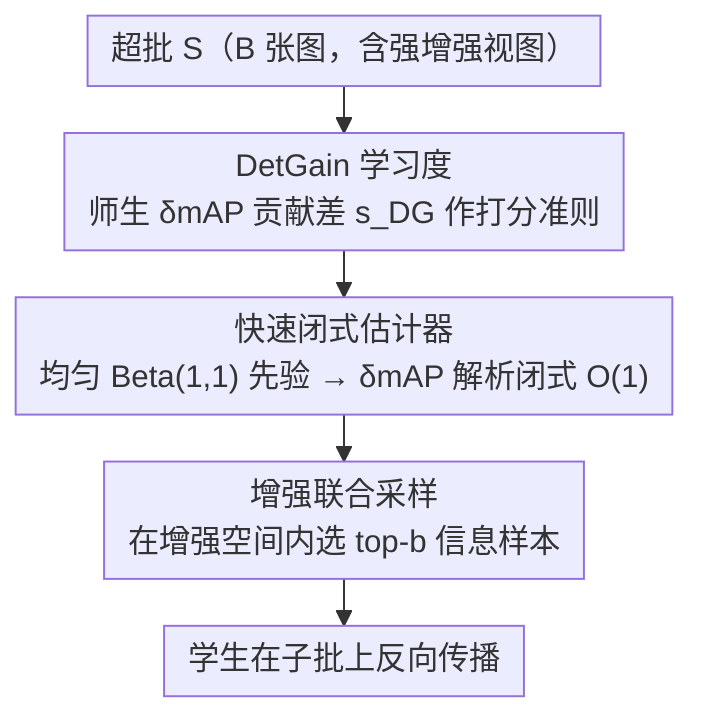

# Online Data Curation for Object Detection via Marginal Contributions to Dataset-level Average Precision

**会议**: CVPR 2026  
**论文**: [CVF Open Access](https://openaccess.thecvf.com/content/CVPR2026/html/Sun_Online_Data_Curation_for_Object_Detection_via_Marginal_Contributions_to_CVPR_2026_paper.html)  
**代码**: 待确认  
**领域**: 目标检测 / 在线数据筛选 / 数据高效学习  
**关键词**: 在线数据筛选, 目标检测, 边际 mAP 贡献, 师生学习度, 即插即用采样

## 一句话总结
DetGain 是首个对目标检测真正有效的在线数据筛选方法：它不看不稳定的训练 loss，而是估计每张图对「数据集级 mAP」的边际扰动（marginal contribution），用师生（teacher–student）贡献差作为学习度信号在每个迭代里挑选信息量最大的样本，架构无关、即插即用，在 COCO 上为多种检测器带来最高 +2.7 mAP、在低质量数据下最高 +6.9 mAP 的稳定提升。

## 研究背景与动机

**领域现状**：在 scale-law 时代，高质量数据是性能的首要驱动力，精挑细选的数据集常以更低算力匹配甚至超过更大的未筛选数据集。**在线数据筛选（online data curation）**把这一思路推进一步——在训练时根据模型当前状态动态决定「接下来学哪些样本」。在分类与多模态对比学习里，主流做法是用「学习度（learnability）」打分：取**预训练教师**与**当前学生**的 loss 差，教师学得好（低 loss）但学生还学不好（高 loss）的样本被认为含有待学的残差知识，优先训练。

**现有痛点**：这套在线筛选几乎没能在目标检测上做出可量化的提升，原因有二。其一，**检测里「一张图的得分」本身难定义**：一张图可能没有实例，也可能有多个实例，有的有信息、有的是噪声或歧义。其二，**检测的 loss 天生不稳定**：它由分类、定位、centerness 等异构项拼成，又被 RPN 采样、匈牙利匹配等随机的 proposal 采样/分配规则左右，导致 loss 在迭代之间、架构之间、甚至同一张图内剧烈波动和漂移。于是基于 loss 的「学习度」在检测里不可靠，直接照搬通用筛选指标会出现严重的 domain gap。

**核心矛盾**：在线筛选需要一个对每张图**稳定、可比、且与评测目标对齐**的打分；而检测的 loss 既不稳定也不直接对齐 mAP，proposal/anchor 级的已有采样（如 ATSS、Focal Loss）又与架构强耦合、只给 per-RoI 梯度而非 image-level 选样信号。

**本文目标**：给目标检测设计一个 image-level、架构无关、与数据集级 mAP 对齐、又能实时计算的在线筛选打分。

**切入角度**：既然最终评测的是 mAP，就**直接用「这张图对全局 mAP 的边际贡献」**当学习度信号，绕开不稳定的 loss——把「优化 mAP 这件难事」从梯度阶段挪到数据选样阶段。

**核心 idea**：用师生在「数据集级 mAP 的边际贡献差」$s_{DG}=\delta mAP(x;f_t,D)-\delta mAP(x;f_s,D)$ 给每张图打学习度分，并用一个均匀先验下的解析闭式让它达到 $O(1)$ 实时计算。

## 方法详解

### 整体框架
DetGain 是一个**只改数据管线、不动模型架构/loss/优化器/训练计划**的即插即用在线采样器。每个迭代先载入一个「超批（super-batch）」$S$（$B$ 张图），目标是从中选出更小、更有信息量的子批 $B=\{x_i\}_{i=1}^b\subset S$ 来做梯度更新，选择比 $k=b/B$。对超批里每张图，分别用**固定的预训练教师** $f_t$ 和**当前学生** $f_s$ 前向，得到带置信度、类别、与 GT 的 IoU 的预测框；据此估计每张图对全局 mAP 的边际扰动 $\delta mAP$，取师生之差作为学习度，选 top-$b$ 反向传播。为避免「只挑高学习度样本导致坍缩到狭窄子空间、训练涨验证不涨」，再叠加一层**强在线增强**，先把样本送进增强空间再做子采样。三个关键设计依次是：定义对齐 mAP 的 DetGain 学习度、把它做成实时可算的闭式估计器、用增强联合采样防过拟合。

### 关键设计

**1. DetGain 学习度：用「对数据集级 mAP 的边际贡献」替代不稳定的 loss**

针对「检测 loss 不稳、与 mAP 不对齐」的痛点，作者把学习度重定义为 metric 驱动的信号。对数据集 $D$ 与检测器 $f$，COCO 式 mAP 在类别 $C$ 和 IoU 阈值集合 $T$（如 $\{0.50,0.55,\dots,0.95\}$）上平均：$mAP(f;D)=\frac{1}{|C||T|}\sum_{c}\sum_{\tau}AP_{c,\tau}(f;D)$。一张候选图 $x$ 的 **DetGain** 定义为把它并入数据集后 mAP 的边际扰动 $\delta mAP(x;f,D)\triangleq mAP(f;D\cup\{x\})-mAP(f;D)$——它衡量 $x$ 的真/假正例（TP/FP）及其排名如何让全局 precision–recall 曲线变形。学习度则取师生之差 $s_{DG}(x)=\delta mAP(x;f_t,D)-\delta mAP(x;f_s,D)$：值大意味着教师对全局 mAP 的贡献超过学生，即学生在「数据集级效用」上仍落后、这张图还有残差知识可学。给定超批对每张图打分选 top-$b$；用可加近似 $\delta mAP(B;f,D)\approx\sum_{x\in B}\delta mAP(x;f,D)$（在 $b\ll|D|$ 时成立）实现逐图在线打分。这样既保留 mAP 这个目标、又把它从「难以优化的非光滑梯度」搬到了选样步。

**2. 快速闭式 DetGain 估计器：用均匀先验把边际 mAP 变成 O(1) 解析解**

直接逐迭代精确算 mAP 的边际更新昂贵且噪声大（AP 是基于排名、非连续的指标）。作者把单张图的每个检测看作对全局已累积的 TP/FP 计数 $(T,F)$ 的一次小扰动，在「置信度阈值域」对 TP/FP 的得分分布做连续建模：设阈值 $u\in(0,1)$ 从高往低扫，阈值以上的 TP/FP 计数为 $C_{TP}(u)=T(1-F_{TP}(u))$、$C_{FP}(u)=F(1-F_{FP}(u))$，由此写出插入一个得分为 $s$ 的 TP / FP 时 AP 的边际变化 $\delta^{TP}_{AP}(s)$、$\delta^{FP}_{AP}(s)$（前者含自身贡献项 + 对所有得分≥s 的已有 TP 的精度修正，后者只降精度不改召回）。再按 COCO 在类别与 IoU 阈值上做 image-level 聚合 $\delta mAP(x)\approx\frac{1}{|C||T|}\sum_c\sum_\tau\sum_j[\,y_{j,\tau}\delta^{TP}_{AP}(s_j)+(1-y_{j,\tau})\delta^{FP}_{AP}(s_j)\,]$。关键的工程化简化是：把所有 TP/FP 得分都设为 **均匀分布 $Beta(1,1)$**（即 $f_{TP}\equiv f_{FP}\equiv 1$），从而免去逐模型拟合分布、并让上式有**紧凑闭式解**——

$$\delta^{TP}_{AP}(s)=\frac{1}{T^{GT}_c}\!\left[\frac{T(1-s)+1}{A(1-s)+1}+\frac{TF}{A^2}\ln\frac{A+1}{A(1-s)+1}\right],\quad \delta^{FP}_{AP}(s)=-\frac{T^2}{T^{GT}_c A^2}\ln\frac{A+1}{A(1-s)+1}$$

其中 $A=T+F$，$T^{GT}_c$ 为类别 $c$ 的 GT 总数（⚠️ 缓存为 OCR 文本，上式按原文重排，符号细节以原论文为准）。两个函数对 $s$ 单调（TP 递增、FP 递减），每个检测 $O(1)$、每张图 $O(m)$。均匀先验等价于「最大熵/随机猜」基线，DetGain 量化的是当前检测器相对这个朴素预测的改进；由于最终是按师生 DetGain 差排序、两者都对同一中性基线比较，绝对值虽近似但**诱导出的排序稳定**（实测与按 Faster R-CNN 拟合的 Beta 先验排序 Spearman $\rho\approx0.94$）。

**3. 增强联合采样：用强增强扩大采样空间，防止纯采样坍缩**

纯在线采样容易过拟合：反复挑高学习度样本会把训练坍缩到训练集内的狭窄子空间，于是训练 mAP 飙升、验证 mAP 几乎不动。已有做法靠 hold-out 教师或为学生扩充数据集来缓解，都需要额外数据或划分。作者提出更简单的替代：在 DetGain 打分前对每个样本施加一个**强在线增强**算子 $A(\cdot)\sim\lambda$（颜色抖动、仿射、噪声、copy-paste 等），把数据空间先扩大再做子采样。这一配对设计简化了 RHO 式设置——**教师在干净（无增强）数据上训练，学生从增强视图学习，无需 hold-out 划分**；二者结合显著扩大采样空间，让采样器既能滤掉低质量增强、又聚焦信息区域。直观上，有效采样区域从「训练集 ∩ 信息数据」的小重叠扩展到「增强数据空间 ∩ 信息数据」的更大重叠，从而恢复多样性、改善泛化。

### 损失函数 / 训练策略
方法不引入新 loss——它只在数据管线层面工作。训练沿用各检测器默认配置（MMDetection），有效 batch size 16；在线采样时每迭代组一个 80 图的超批，按师生 DetGain 差取 top 20%（即 16 张）反向传播。CNN 检测器用 1× 计划（≈90,000 iters，SGD），Deformable DETR 用默认 50-epoch 计划（≈3.7×10⁵ iters，AdamW）。学生默认 ResNet-50 backbone，教师默认用同架构更大 backbone（Res101/Res152）在同一训练集上预训练。

## 实验关键数据

> 指标说明：**AP** 为 COCO 标准 AP@[50:95]（在 10 个 IoU 阈值上平均），**AP@50** 为 IoU=0.5 下的 AP；**$\delta mAP$（DetGain）** 为一张图对数据集级 mAP 的边际贡献；学习度 $s_{DG}$ 为师生 DetGain 之差；选择比 $k=b/B$；Spearman $\rho$ 衡量两种先验下逐图打分排序的一致性。

### 主结果（COCO val2017，学生 ResNet-50；+DetGain 子采样比 20% + 强增强）
| 检测器 | 类型 | Baseline AP | +Data Aug. AP | +DetGain AP |
|--------|------|-------------|---------------|-------------|
| Faster R-CNN | 两阶段·anchor | 37.5 | 37.5 (+0.1) | **40.0 (+2.5)** |
| ATSS | 一阶段·anchor | 39.2 | 38.6 (−0.8) | 41.5 (+2.3) |
| FCOS | 一阶段·anchor-free | 38.2 | 38.2 (+0.0) | **41.0 (+2.8)** |
| GFL | 一阶段·anchor | 40.2 | 40.3 (+0.1) | 42.0 (+1.8) |
| VFNet | 一阶段·anchor | 40.7 | 40.3 (−0.4) | 42.9 (+2.2) |
| Deform. DETR | DETR·anchor-free | 46.6 | 47.5 (+0.9) | 48.9 (+2.3) |

六种检测器平均约 +2.0 mAP，且**仅改采样策略、不动架构/loss/计划**；单纯强增强经常无益甚至掉点（如 ATSS −0.8），但叠加 DetGain 后能过滤低质增强、稳定提升。

### 与其他在线采样指标对比（COCO val2017，AP）
| 采样指标 | Faster R-CNN | FCOS | ATSS |
|----------|-------------|------|------|
| Uniform（基线） | 37.3 | 38.2 | 39.4 |
| Loss（hard mining） | 36.3 | 34.5 | 37.7 |
| GradNorm | 37.4 | 38.4 | 39.3 |
| Image-AP | 38.3 | 39.4 | 40.0 |
| Loss-learnability | 38.9 | 38.1 | 40.4 |
| **DetGain（ours）** | **40.0** | **40.9** | **41.6** |

loss/梯度类指标随检测器内部 loss 缩放与动态而大幅波动（hard mining 甚至低于基线），DetGain 因直接对齐数据集级 mAP，跨架构一致且最高。

### 消融：增强与在线采样的互补性（Faster R-CNN，COCO）
| 强增强 | 在线采样 | Train AP | Val AP |
|--------|----------|----------|--------|
| ✗ | ✗ | 44.6 | 37.4 |
| ✗ | ✓ | 50.3 (+5.7) | 37.3 (−0.1) |
| ✓ | ✗ | 40.4 (−4.2) | 37.5 (+0.1) |
| ✓ | ✓ | 45.3 (+0.7) | **39.9 (+2.5)** |

### 关键发现
- **采样和增强缺一不可**：只采样 → 训练 +5.7、验证 −0.1（典型坍缩过拟合）；只增强 → 缺乏聚焦无提升；两者结合才把验证拉到 +2.5。
- **对标注噪声鲁棒**：注入假框/删框/扰动/换标签后，DetGain 比 loss-learnability 与均匀基线更稳，低质数据下最高 +6.9 mAP；因为它按「对全局 mAP 的贡献」打分，天然偏好干净、有信息的样本。
- **教师越强学生越好**：教师 backbone 从 Res50→Res101→Res152，Faster R-CNN 提升从 +2.2→+2.5→+2.6，印证「师生筛选 ≈ 隐式知识蒸馏」。
- **与 KD 互补**：DetGain 单独即可媲美 PKD/CrossKD，且对教师强度不敏感（即使师生同为 Res50 仍有效）；与 CrossKD 叠加在 FCOS-Res101 上达 42.2 (+3.7)——KD 传特征级知识，DetGain 提样本级质量。
- **均匀先验代价极小**：用 $Beta(1,1)$ 闭式与按模型拟合的 Beta 先验，逐图排序 Spearman $\rho\approx0.94$，下游性能近乎一致，但前者免拟合、$O(1)$。

## 亮点与洞察
- **把「优化 mAP」从梯度阶段挪到选样阶段**：AP 非光滑、不可分解、难直接当训练目标，DetGain 巧在保留 mAP 这个 target 却只用它来选数据，绕开梯度难题——这个「metric-as-selector」思路可迁移到任何「评测指标难直接做 loss」的任务。
- **均匀先验闭式解**是全文最实用的一招：用最大熵分布换来 $O(1)$ 解析计算 + 免逐模型拟合 + 架构无关，且因为最终比的是师生差、绝对值近似无所谓——典型的「只要排序对、就大胆近似」。
- **教师只在干净数据上训、学生学增强视图**这个配对，省掉了 RHO-LOSS 需要的 hold-out 划分，工程上更省。
- 纯数据管线、零侵入（不改架构/loss/优化器/推理），让它能与 ATSS/Focal Loss 这类 proposal 级采样、以及 PKD/CrossKD 这类 KD 正交叠加。

## 局限与展望
- **额外训练开销**：预采样阶段需要对超批多跑教师/学生前向，作者明确承认增加了训练时间。
- **增强较朴素**：当前用的强增强算子比较基础，作者指出可进一步设计更优的增强策略。
- **均匀先验是近似**：绝对 DetGain 值不准（仅排序可靠），在需要绝对边际贡献数值的场景（而非排序）可能不适用；闭式公式中固定 TP:FP 比例（如排序实验用 1:9）与「均匀」之间的设定细节需对照原文确认（⚠️ 缓存为 OCR，比例与符号以原文为准）。
- **可改进方向**：自适应/可学习的增强、降低预采样的前向开销、在更长计划与更多骨干上验证。

## 相关工作与启发
- **vs RHO-LOSS / JEST / ACED（loss-learnability）**：它们用师生 loss 差定义学习度，在分类/对比学习有效，但 loss 在检测里不稳定；DetGain 把信号换成与数据集级 mAP 对齐的师生 DetGain 差，检测上才真正涨点且更稳。
- **vs 主动学习 / 离线 coreset（CDAL、MI-AOD、PPAL 等）**：它们多为离线/半离线、目标是「用最少标注逼近全监督」，无法直接用于已全标注数据；DetGain 在全标注数据上做在线实时选样，关注「每张图对全局 AP 的边际贡献」。
- **vs Image-AP（按图局部 AP 的师生差）**：它是离散、局部的 per-image AP；DetGain 估计的是每张图对**全局 mAP** 的连续边际贡献，排序更稳、跨架构更一致，实验中也更高。
- **vs ATSS / Focal Loss（proposal/anchor 级采样）**：那些与架构耦合、操作 per-RoI 梯度，给不出 image-level 选样信号；DetGain 解耦数据流与模型内部，可跨检测器家族迁移，并与它们叠加获得额外增益。

## 评分
- 新颖性: ⭐⭐⭐⭐⭐ 首个对检测真正有效的 image-level 在线筛选，「边际 mAP 贡献 + 均匀先验闭式」是新颖且自洽的切入
- 实验充分度: ⭐⭐⭐⭐⭐ 覆盖 6 种检测器、与多种采样指标对比、噪声鲁棒性、KD 互补、先验排序一致性，论证完整
- 写作质量: ⭐⭐⭐⭐ 动机与推导清晰，但闭式公式推导较密、对读者门槛偏高
- 价值: ⭐⭐⭐⭐⭐ 即插即用、架构无关、可与 KD 叠加，对数据高效检测训练有很强的通用价值

<!-- RELATED:START -->

## 相关论文

- [\[CVPR 2025\] Interpreting Object-level Foundation Models via Visual Precision Search](../../CVPR2025/object_detection/interpreting_object-level_foundation_models_via_visual_precision_search.md)
- [\[CVPR 2026\] Reasoning-Driven Anomaly Detection and Localization with Image-Level Supervision](reasoning-driven_anomaly_detection_and_localization_with_image-level_supervision.md)
- [\[CVPR 2026\] Heuristic-inspired Reasoning Priors Facilitate Data-Efficient Referring Object Detection](heuristic-inspired_reasoning_priors_facilitate_data-efficient_referring_object_d.md)
- [\[CVPR 2026\] HeROD: Heuristic-inspired Reasoning Priors Facilitate Data-Efficient Referring Object Detection](herod_heuristic_inspired_reasoning_data_efficient_rod.md)
- [\[CVPR 2026\] Toward Generalizable Whole Brain Representations with High-Resolution Light-Sheet Data](toward_generalizable_whole_brain_representations_with_high-resolution_light-shee.md)

<!-- RELATED:END -->
