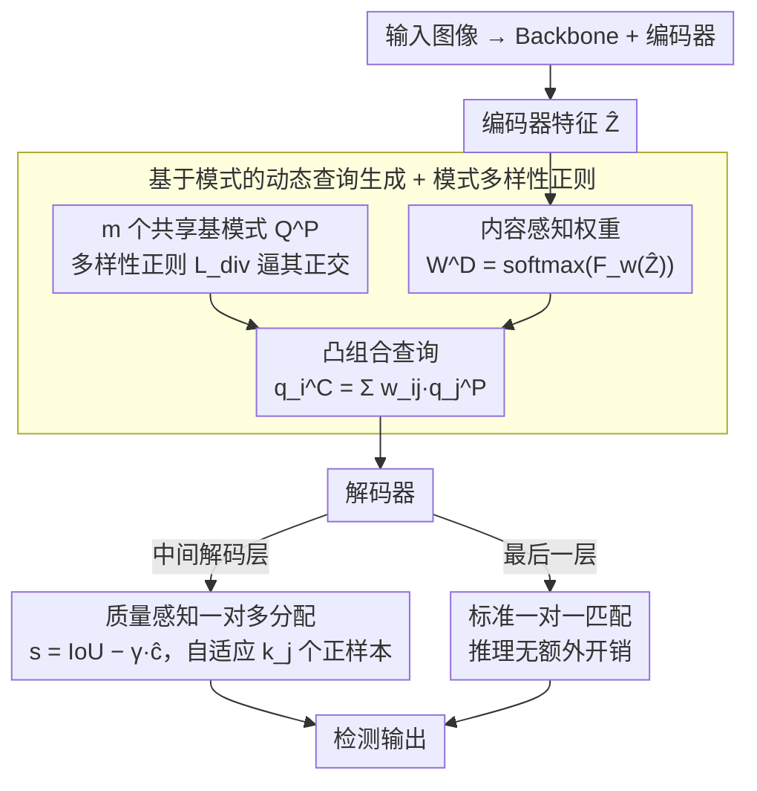

# PaQ-DETR: Learning Pattern and Quality-Aware Dynamic Queries for Object Detection

**会议**: CVPR 2026  
**arXiv**: [2603.06917](https://arxiv.org/abs/2603.06917)  
**代码**: 无  
**领域**: 目标检测  
**关键词**: DETR, 动态查询, 模式学习, 质量感知分配, 目标检测

## 一句话总结
PaQ-DETR 提出基于共享模式的动态查询生成（内容感知权重组合共享基模式）+ 质量感知一对多分配（基于定位-分类一致性自适应选择正样本），统一解决DETR中的查询表示和监督不均衡问题，在多个backbone上稳定提升1.5%-4.2% mAP。

## 研究背景与动机
1. **领域现状**：DETR将目标检测重新定义为集合预测任务，但仍依赖固定可学习查询，且存在严重的查询利用不均衡。
2. **现有痛点**：（i）静态查询缺乏对输入图像的适应性；（ii）内容依赖的动态查询提高灵活性但引入语义不稳定性；（iii）一对一匹配导致极度稀疏的监督——仅少数"获胜"查询持续获得强梯度。
3. **核心矛盾**：查询表示不均衡和监督不均衡是同一问题的两面——少数查询获得大部分梯度（Gini系数高达0.97），多数查询弱优化或闲置。
4. **本文目标**：设计统一框架，同时改善查询自适应性和监督均衡性。
5. **切入角度**：将查询表示为共享模式的凸组合（通过编码器特征调节），同时用质量感知分配增加正样本。
6. **核心idea**：共享模式基 + 内容感知权重 → 梯度共享缓解不均衡；质量感知一对多分配 → 丰富监督信号。

## 方法详解

### 整体框架
PaQ-DETR 想同时治好 DETR 的两个老毛病：查询表示不自适应、监督信号太稀疏。它把这两件事看成一对一匹配带来的同一个结构性问题——少数查询垄断梯度（Gini 系数高达 0.97），其余查询几乎闲置。围绕这个判断，它在标准 DETR 编码器-解码器之上挂两个模块：编码器吐出图像特征后，先由「基于模式的动态查询生成」模块用一组共享语义基模式、按图像内容加权组合出当前图的查询，并用一个多样性正则逼这组基模式彼此正交、不退化；这些查询进解码器后，再由「质量感知一对多分配」按预测质量动态决定每个 GT 该匹配几个正样本，且只作用于中间解码层、最后一层仍走标准一对一匹配。两个模块一个管查询怎么生成、一个管监督怎么分配，恰好对应前面那两个毛病的两面。

### 关键设计

**1. 基于模式的动态查询生成：用共享基模式打破「赢家通吃」**

传统 DETR 让每个查询独立学习，结果匹配上的查询拿走全部梯度、没匹配上的几乎不更新，查询利用极度不均。PaQ 的做法是不再独立学查询，而是学 $m$ 个**共享**基模式 $\mathbf{Q}^P = \{q_1^P, \dots, q_m^P\}$，每个实际查询都写成这组基模式的凸组合 $q_i^C = \sum_{j=1}^m w_{ij}^D q_j^P$。权重不是固定的，而是随图像内容生成——编码器特征 $\hat{\mathbf{Z}}$ 经过特征提取、多尺度融合、MLP，再过 softmax 得到 $\mathbf{W}^D = \text{softmax}(F_w(\hat{\mathbf{Z}}))$，softmax 保证每个查询都是一组有效的凸组合权重。这样设计的好处在于梯度路径：任何一个查询被匹配上，它的梯度会顺着共享的基模式参数回流，间接更新到所有查询，因此优化天然更均匀；同时权重依图像而变，又给了查询输入自适应性，避免了纯静态查询的僵硬。

**2. 质量感知一对多分配：按预测质量决定给几个正样本**

一对一匹配每个 GT 只配一个正样本，监督太稀疏；而固定 $k$ 的一对多分配又一刀切，无视预测之间的质量差。PaQ 让正样本的数量和选择都跟着预测质量走。它先为每个预测-GT 对算一个质量分数 $s_{i,j} = \text{IoU}(\hat{b}_i, g_j) - \gamma \hat{c}_i$，把定位精度和分类置信度放在一起权衡（这里 IoU 衡量框准不准，$\hat{c}_i$ 是分类置信度，$\gamma$ 控制二者的权重）；再据此自适应地确定每个 GT 的正样本数 $k_j = \max(\lceil \sum_{i \in \text{top-k}} s_{i,j} \rceil, l)$——某个 GT 周围高质量预测越多，分到的正样本就越多，$l$ 是兜底下界保证至少有监督。正样本最终用 IoU 感知的 Varifocal Loss 加权。它实际上倾向于把那些 IoU 高、置信度却暂时偏低的预测拉成正样本，等于主动引导模型去啃这些「有信息但有难度」的样本，而不是只奖励已经很自信的那批。

**3. 模式多样性正则化：逼基模式彼此正交**

共享基模式这套机制有个隐患：如果几个基模式学得越来越像，凸组合就退化成「换汤不换药」，动态组合也就失去意义。为此 PaQ 直接惩罚归一化基模式之间的余弦相似度，$\mathcal{L}_{div} = \frac{1}{m(m-1)}\sum_{i \neq j}|\cos(\hat{q}_i^P, \hat{q}_j^P)|$，鼓励基模式互相正交，从而覆盖尽量不同的语义方向，保证组合空间足够丰富。

### 损失函数 / 训练策略
总损失 $\mathcal{L}_{total} = \mathcal{L}_{1:m} + \mathcal{L}_{aux} + \beta \mathcal{L}_{div}$：$\mathcal{L}_{1:m}$ 是一对多分配下的主损失，$\mathcal{L}_{aux}$ 为辅助层损失，$\beta \mathcal{L}_{div}$ 加权前面的多样性正则。分类用 Varifocal Loss，回归用 L1 + GIoU。关键的训练-推理拆分是：质量感知一对多分配只用在中间解码层来富集监督，最后一层仍保留标准的一对一匹配，因此推理阶段不引入任何额外开销。

## 实验关键数据

### 主实验

| 方法 | Backbone | Epochs | mAP | 说明 |
|------|----------|--------|-----|------|
| PaQ-Deformable-DETR | ResNet-50 | 12 | +1.5-2% | 一致提升 |
| PaQ-DN-DETR | ResNet-50 | 12 | +1.5-2% | 一致提升 |
| PaQ-DINO | ResNet-50 | 12 | +1.5-2% | 一致提升 |
| PaQ-DINO | Swin-L | 12 | +提升 | 大backbone也有效 |

### 消融实验

| 配置 | mAP变化 | 说明 |
|------|--------|------|
| + 模式动态查询 | +提升 | 查询自适应性增强 |
| + 质量感知分配 | +提升 | 监督更充分 |
| + 两者结合 | 最优 | 协同效应 |
| Gini系数对比 | 从0.97降至更低 | 查询利用更均衡 |

### 关键发现
- PaQ-DETR在多个DETR变体上一致提升1.5-4.2% mAP，证明了通用性。
- 可视化显示动态模式在不同物体类别间语义聚类，验证了模式的可解释性。
- 质量感知分配比固定k的一对多分配更有效，因为它适应预测质量的分布。
- Gini系数的降低直接证实了查询利用不均衡的缓解。

## 亮点与洞察
- **将查询表示和监督均衡视为同一问题**的统一视角很深刻——两者都源于一对一匹配的结构性限制。
- **共享模式实现梯度共享**是一个简洁有力的机制——匹配查询的梯度通过基模式流向所有查询。
- 方法完全轻量级，不需要额外解码器或推理开销。

## 局限与展望
- 基模式数量 $m$ 需要调参（实验中用48-64个效果较好）。
- 质量感知分配增加了少量训练时间（匹配计算），但推理无开销。
- 在CityScapes等小数据集上提升更大，大数据集上边际收益递减。

## 相关工作与启发
- **vs DDQ-DETR**: 用静态基组合构建查询，但不依赖图像内容。PaQ用编码器特征动态生成权重。
- **vs Co-DETR**: 引入辅助分支增加正样本，但需要额外解码器。PaQ的质量感知分配无额外推理开销。
- **vs DINO**: DINO回归纯可学习查询+去噪训练，PaQ从查询表示和监督两方面改进。

## 评分
- 新颖性: ⭐⭐⭐⭐ 统一视角新颖，但各组件有前作铺垫
- 实验充分度: ⭐⭐⭐⭐⭐ 多backbone+多DETR变体+多数据集+Gini分析
- 写作质量: ⭐⭐⭐⭐ 问题分析透彻，实验设计严谨
- 价值: ⭐⭐⭐⭐ DETR优化的实用贡献，即插即用设计便于采用

<!-- RELATED:START -->

## 相关论文

- [\[CVPR 2026\] Beyond Caption-Based Queries for Video Moment Retrieval](beyond_caption-based_queries_for_video_moment_retrieval.md)
- [\[CVPR 2026\] Bidirectional Multimodal Prompt Learning with Scale-Aware Training for Few-Shot Multi-Class Anomaly Detection](bidirectional_multimodal_prompt_learning_with_scale-aware_training_for_few-shot_.md)
- [\[CVPR 2026\] GS-CLIP: Zero-shot 3D Anomaly Detection by Geometry-Aware Prompt and Synergistic View Representation Learning](gs-clip_zero-shot_3d_anomaly_detection_by_geometry-aware_prompt_and_synergistic_.md)
- [\[CVPR 2026\] EW-DETR: Evolving World Object Detection via Incremental Low-Rank DEtection TRansformer](ew-detr_evolving_world_object_detection_via_incremental_low-rank_detection_trans.md)
- [\[CVPR 2026\] DA-Mamba: Learning Domain-Aware State Space Model for Global-Local Alignment in Domain Adaptive Object Detection](da-mamba_learning_domain-aware_state_space_model_for_global-local_alignment_in_d.md)

<!-- RELATED:END -->
