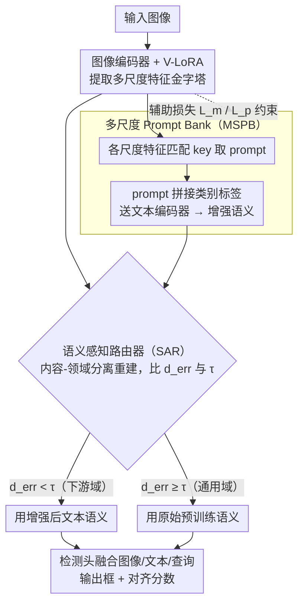

# Parameter-Efficient Semantic Augmentation for Enhancing Open-Vocabulary Object Detection

**会议**: CVPR 2026  
**arXiv**: [2604.04444](https://arxiv.org/abs/2604.04444)  
**代码**: 无  
**领域**: 目标检测 / 开放词汇  
**关键词**: 开放词汇目标检测, 参数高效微调, 语义增强, prompt bank, 领域适配

## 一句话总结

HSA-DINO 提出多尺度 prompt bank 从图像特征金字塔中学习层次化语义 prompt 增强文本表示，并通过语义感知路由器在推理时动态决定是否使用领域特定增强，实现了领域适配与开放词汇泛化的优越平衡（H 值在三个垂直领域数据集上均为最优）。

## 研究背景与动机

1. **领域现状**：开放词汇目标检测（OVOD）已在通用场景（如 OV-COCO）上取得出色的零样本检测性能，得益于大规模预训练（GLIP、Grounding DINO、OV-DINO 等）。

2. **现有痛点**：(a) 预训练 OVOD 模型在垂直领域（如昆虫分类 ArTaxOr、遥感 DIOR、水下 UODD）性能骤降，因为细粒度类别在预训练数据中稀缺且语义薄弱；(b) 全量微调虽提升目标域性能，但严重损害通用域泛化（如 OV-DINO 在 ArTaxOr 微调后 mAP_coco 从 50.6 降到 36.1）；(c) 现有 prompt 方法（预定义模板、CoOp）缺乏多方面的视觉语义描述。

3. **核心矛盾**：领域适配与开放词汇泛化之间的根本冲突——针对下游任务的参数更新不可避免地破坏预训练语义知识。

4. **本文目标** 如何在参数高效微调的框架下，(a) 用丰富的视觉语义增强文本表示以改善对齐，且 (b) 在推理时自动选择合适的语义策略，使得领域适配不损害开放词汇能力。

5. **切入角度**：OVOD 模型的多尺度特征金字塔本身就包含从粗到细的层次语义信息（高层的上下文如"花"、底层的纹理如"斑点翅膀"），可以作为类别标签的辅助 prompt。同时，通过显式建模内容和领域信息来构建更准确的路由器，解决领域分布区分困难的问题。

6. **核心 idea**：用多尺度视觉特征选择的 prompt 增强类别标签的文本表示，配合显式分离内容/领域的语义感知路由器，在推理时动态切换增强策略。

## 方法详解

### 整体框架

HSA-DINO 要解决的是 OVOD 的两难：在垂直领域（昆虫、遥感、水下）做参数高效微调能提升目标域精度，但会侵蚀预训练得来的开放词汇泛化。它的思路是「分而治之」——把领域知识装进一套可插拔的增强模块，再在推理时按图像决定要不要用它。整条 pipeline 在 OV-DINO 上搭建：训练阶段，LoRA 只挂在图像编码器上学领域视觉特征，每张图的多尺度特征图从一个 prompt bank 里挑出相关 prompt，拼到类别标签嵌入前送进文本编码器，检测头再融合图像、文本和检测查询出框；推理阶段，一个轻量路由器先看一眼输入图像，判断它更像下游域还是通用域，从而决定用「领域增强后的文本语义」还是「原始预训练语义」。三个设计分别负责造增强、学增强、用增强。

### 关键设计

**1. 多尺度 Prompt Bank（MSPB）：让文本编码器"看到"图像的层次语义**

预训练 OVOD 在垂直领域掉点，根子在于细粒度类别的文本表示太单薄——一个类名（如某种甲虫）在预训练语料里既稀缺、语义又弱，固定模板或 CoOp 那样的单尺度 prompt 补不上这种细节。MSPB 的做法是把视觉金字塔本身当作语义来源。它维护 $N$ 个 (key, prompt) 对 $\{(\mathbf{k}_i, \mathbf{P}_i)\}_{i=1}^N$，key $\mathbf{k}_i \in \mathbb{R}^D$ 与图像特征同维，prompt $\mathbf{P}_i \in \mathbb{R}^{D \times M}$ 是 $M$ 个可学习向量。对一张图取 $S$ 个尺度的特征图，每个尺度全局平均池化后与所有 key 算余弦相似度，挑出最匹配的 key 并取走它绑定的 prompt；选出的 $S$ 个 prompt 与类别标签拼成

$$\mathbf{t}_p^k = \text{concat}(\mathbf{P}_1; ...; \mathbf{P}_S; [\text{CLS}]_k)$$

再送入文本编码器。这样高层特征带来"花/上下文"这类粗语义、底层特征带来"斑点翅膀"这类纹理细节，文本表示就被多个粒度的视觉描述同时撑起来，比单尺度全局特征丰富得多。

**2. 语义感知路由器（SAR）：用内容-领域分离让"该不该用增强"判得准**

MSPB 把目标域拉起来的代价是几乎拆掉了通用域（消融里 mAP_coco 从 22.7 塌到 0.5），所以必须有个开关在推理时决定何时启用增强。最直接的办法是训个自编码器，看输入重建误差大不大来判域，但 DDAS/MoEAdapter4CL 这类直接喂图像特征的做法，不同域的重建误差高度重叠，路由根本分不开。SAR 的关键是先把"长什么样"（内容）和"哪个域"（风格统计量）拆开：给定图像特征 $\tilde{f}$，取其均值 $\mu$、标准差 $\sigma$ 作为领域统计量 $\mathcal{D} = \{\mu, \sigma\}$，做实例归一化得到内容嵌入 $c = \frac{\tilde{f} - \mu}{\sigma + \epsilon}$。自编码器只重建内容 $c \to \hat{c}$，再把领域统计量加回去 $\hat{f} = \hat{c} \cdot \sigma + \mu$，最后看重建误差

$$d_{err} = |\hat{f} - \tilde{f}|^2$$

与阈值 $\tau$ 的关系：$d_{err} < \tau$ 说明这张图落在自编码器学过的下游域内容分布里，就用领域增强语义；否则判为通用域，退回预训练语义。因为自编码器不再被领域风格干扰、只对内容建模，不同域的误差分布被大幅拉开，路由准确率显著提升（消融里 SAR 比 DDAS 的 H_mean 高 8.2）。

**3. LoRA 集成与辅助损失：约束 prompt bank 学到的是"领域知识"而非噪声**

增强模块要真的有用，前提是 LoRA 学到的视觉特征和 MSPB 学到的 prompt 都对得上领域、且彼此不冗余。LoRA 只挂在图像编码器、不碰文本编码器，专门吸收层次化的领域视觉特征。MSPB 的学习则靠两个辅助损失把舵：匹配损失

$$\mathcal{L}_m = \sum_{s=1}^S (1 - \gamma(\tilde{\mathbf{z}}^s, \mathbf{k}_{i_s}))$$

把每个尺度选中的 key 往对应的图像特征上拉，确保 key 真的从样本里学到领域语义而不是乱选；正交损失

$$\mathcal{L}_p = \frac{1}{N(N-1)} \sum |\langle \mathbf{P}_i, \mathbf{P}_j \rangle|$$

压低不同 prompt 之间的内积，逼它们指向不同语义方向，防止 bank 里 $N$ 个 prompt 退化成一堆同质表示。

### 损失函数 / 训练策略

总损失为 $\mathcal{L} = \mathcal{L}_{DINO} + \lambda_m \mathcal{L}_m + \lambda_p \mathcal{L}_p$，其中 $\mathcal{L}_{DINO}$ 含 focal loss、回归损失、GIoU 损失与去噪损失。SAR 的自编码器是单独训练的，用 MSE 重建损失跑 24 epochs。检测主体微调 24 epochs，batch size 16，AdamW lr=1e-3；关键超参取 $N=10, M=12, S=3, \tau=0.039, \lambda_m=0.7, \lambda_p=0.3$。

## 实验关键数据

### 主实验

下游任务 + OV-COCO 调和均值（H）对比：

| 方法 | ArTaxOr mAP_tgt/mAP_coco/H | DIOR H | UODD H |
|------|---------------------------|--------|--------|
| ZiRa (PEFT) | 81.5/44.1/**57.2** | 49.9 | 46.5 |
| OV-DINO (PEFT) | 78.5/24.0/36.8 | 22.1 | 47.6 |
| **HSA-DINO** | 76.8/49.9/**60.5** | **53.0** | **49.6** |

OV-COCO+ 扩展评测：

| 方法 | w ArTaxOr | w DIOR | w UODD |
|------|-----------|--------|--------|
| ZiRa | 46.9 | 44.4 | 46.0 |
| **HSA-DINO** | **52.3** | **50.1** | **50.5** |

### 消融实验

ArTaxOr 数据集各组件贡献：

| V-LoRA | MSPB | SAR | mAP_tgt | mAP_coco | H |
|:------:|:----:|:---:|---------|----------|------|
| ✗ | ✗ | ✗ | 1.4 | 50.6 | 2.7 |
| ✓ | ✗ | ✗ | 61.6 | 22.7 | 33.2 |
| ✓ | ✓ | ✗ | 79.1 | 0.5 | 1.0 |
| ✓ | ✗ | ✓ | 59.5 | 50.4 | 54.6 |
| ✓ | ✓ | ✓ | **76.8** | **49.9** | **60.5** |

### 关键发现

- **MSPB 显著提升领域适配**：加入 MSPB 后 mAP_tgt 从 61.6 跃升到 79.1（+17.5），但严重损害通用域（mAP_coco 从 22.7 降到 0.5）
- **SAR 是平衡的关键**：加入 SAR 后 mAP_coco 从 0.5 恢复到 49.9（接近预训练水平 50.6），同时 mAP_tgt 仅小幅下降至 76.8
- SAR 比 DDAS 的 H_mean 高 8.2（54.4 vs 46.2），因为显式分离内容/领域大幅减少了重建误差重叠
- 不同文本语义增强策略对比：MSPB(54.4) > AttriCLIP(53.0) > CoOp(52.1) > 预定义(49.9)
- 最优超参：bank size N=10, prompt length M=12, 路由阈值 τ=0.039

## 亮点与洞察

- **"增强但可切换"的设计哲学**：不是追求一个通用适配所有域的模型，而是训练领域特定增强后通过路由器动态切换。这避免了适配与泛化的根本冲突，是一个实用且优雅的解决方案
- **内容-领域分离的路由思路**：通过实例归一化分离内容和领域统计量再做重建，比直接用图像特征做自编码器的 DDAS 方法显著降低了分布重叠。这一思路可迁移到其他需要域感知路由的场景
- **多尺度 prompt bank 的视觉-文本桥梁设计**：让文本编码器"看到"图像的多尺度语义信息，比全局特征+固定模板更具表达力

## 局限与展望

- SAR 的阈值 $\tau$ 是固定值（0.039），不同下游域理论上最优阈值可能不同（虽然论文验证了统一 SAR 也有效）
- MSPB 的 prompt 选择基于全局平均池化的尺度特征，丢失了空间局部信息
- 每次微调针对一个下游任务训练一套 MSPB + SAR，多个下游任务需要多次训练
- 改进方向：探索多任务联合训练的统一 prompt bank；用更细粒度的区域特征（如 RoI 特征）引导 prompt 选择

## 相关工作与启发

- **vs ZiRa**: ZiRa 用双范数惩罚约束残差检测分支来持续学习，H 值略低于 HSA-DINO，且在 DIOR 上差距较大（49.9 vs 53.0），说明范数约束不如动态路由灵活
- **vs CoOp/AttriCLIP**: 这些方法依赖单尺度全局特征选择 prompt，不如多尺度 prompt bank 语义丰富
- **vs MR-GDINO**: 记忆+检索机制虽保留了部分预训练知识，但在 UODD 上 mAP_coco 降为 0.1，泛化能力几乎完全丧失

## 评分

- 新颖性: ⭐⭐⭐⭐ 多尺度prompt bank和内容-领域分离路由器设计新颖，但整体框架属于PEFT+路由的组合
- 实验充分度: ⭐⭐⭐⭐⭐ 三个垂直域+OV-COCO+OV-COCO+扩展评测，消融非常充分，可视化丰富
- 写作质量: ⭐⭐⭐⭐ 技术描述详细清楚，图示直观，动机论证有力
- 价值: ⭐⭐⭐⭐ 解决了OVOD中领域适配vs泛化的实际问题，H值作为综合指标的评估方式也有参考价值

<!-- RELATED:START -->

## 相关论文

- [\[CVPR 2026\] Consistency Beyond Contrast: Enhancing Open-Vocabulary Object Detection Robustness via Contextual Consistency Learning](consistency_beyond_contrast_enhancing_open-vocabulary_object_detection_robustnes.md)
- [\[CVPR 2026\] NoOVD: Novel Category Discovery and Embedding for Open-Vocabulary Object Detection](noovd_novel_category_discovery_and_embedding_for_open-vocabulary_object_detectio.md)
- [\[CVPR 2026\] WeDetect: Fast Open-Vocabulary Object Detection as Retrieval](wedetect_fast_open-vocabulary_object_detection_as_retrieval.md)
- [\[CVPR 2026\] Thermal-Det: Language-Guided Cross-Modal Distillation for Open-Vocabulary Thermal Object Detection](thermal-det_language-guided_cross-modal_distillation_for_open-vocabulary_thermal.md)
- [\[CVPR 2026\] ViTPrompt: Training-Free Prompt Refinement with Visual Tokens for Open-Vocabulary Detection](vitprompt_training-free_prompt_refinement_with_visual_tokens_for_open-vocabulary.md)

<!-- RELATED:END -->
