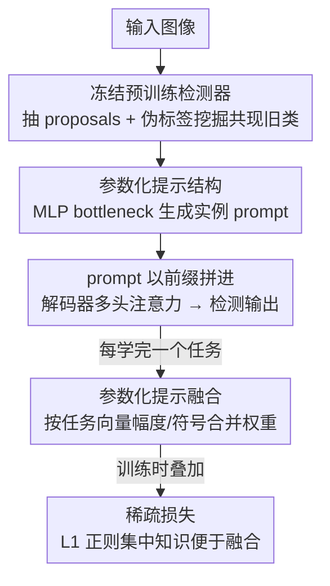

# Parameterized Prompt for Incremental Object Detection

**会议**: CVPR 2026  
**论文**: [CVF Open Access](https://openaccess.thecvf.com/content/CVPR2026/html/An_Parameterized_Prompt_for_Incremental_Object_Detection_CVPR_2026_paper.html)  
**代码**: https://github.com/EMLS-ICTCAS/P2IOD  
**领域**: 目标检测 / 增量学习 / Prompt  
**关键词**: 增量目标检测, 参数化提示, 提示池混淆, 模型融合, 灾难性遗忘

## 一句话总结
针对增量目标检测（IOD）中"提示池（prompts pool）"因检测场景固有的共现现象而失效的问题，本文用一个可参数化的 MLP bottleneck 取代离散提示池，配合基于任务向量的提示融合与稀疏损失，让旧任务知识被整体性地保留与更新，在 PASCAL VOC2007 与 MS COCO 上取得 SOTA。

## 研究背景与动机

**领域现状**：把可训练的 prompt 注入冻结的预训练模型，是当前增量学习（incremental learning）的主流路线之一。L2P、DualPrompt、CodaPrompt 等方法维护一个"提示池"——为每个任务存一组 task-specific prompts，推理时按 query 与各 prompt 的相似度做 top-K 匹配，从而在不改动主干的前提下缓解灾难性遗忘。

**现有痛点**：这套提示池范式在增量分类上很成功，但搬到增量目标检测（IOD）上会失效。IOD 的特殊之处在于**共现现象（co-occurrence）**：一张当前任务的训练图里，背景中常常出现属于旧任务、却没有标注的物体。提示池假设各任务类别互不相交（disjoint），与这一现象正面冲突。

**核心矛盾**：作者把提示池在 IOD 下的失效归纳为"提示池混淆（prompts pool confusion）"，具体分两种：① **匹配混淆**——一个跨任务都出现的物体会和所有 task-specific prompt 都高相似，无法匹配到"最相关"的那个；② **任务混淆**——当前任务 prompt 在学习时被背景里的旧类物体带偏，把不属于本任务的知识也学了进来，破坏了 prompt 表征的清晰度。问题根源在于提示池"按任务孤立存储知识"的机制，与 IOD"知识需要跨任务整体流动"的需求矛盾。

**本文目标**：设计一种提示结构，既能在共现场景下**自适应地整合（adaptive consolidation）**跨任务知识，又能**约束关键参数更新**以防遗忘。

**切入角度**：作者观察到神经网络本身就具备"全局演化"特性——网络会随损失自然地更新已学知识。与其用一池离散、彼此隔离的 prompt 向量，不如把"提示"这件事编码进一个小网络的权重空间里。

**核心 idea**：把提示池重新设计成**参数化提示（parameterized prompt）**——一个 MLP bottleneck，用网络权重而非离散向量来承载提示知识；再用**参数化提示融合**约束跨任务的参数更新，从根上消除提示池混淆。

## 方法详解

### 整体框架
P2IOD 建立在基于 Transformer 的检测器（Deformable-DETR / Co-DETR）之上，主干与编解码器全程冻结，只训练类别/框 embedding 和参数化提示结构 $\theta$。输入图像先经冻结检测器 $\theta^*$ 抽出一批 proposals，经 query 函数压缩成实例级查询，送入参数化提示结构（MLP bottleneck）生成实例特定的 prompt，再以前缀方式拼进解码器的多头自注意力，输出检测结果。每学完一个增量任务，额外做一次**参数化提示融合**：按参数变化幅度与方向，把当前任务的 prompt 权重与历史 prompt 权重合并；训练时叠加**稀疏损失**让知识集中到少数参数上、方便融合；并沿用伪标签机制挖掘背景中的旧类物体。

### 关键设计

**1. 参数化提示结构：用 MLP bottleneck 的权重空间取代离散提示池**

这是消除"提示池混淆"的核心一步。作者不再为每个任务存一组 prompt 向量，而是把提示知识编码进一个由两层前馈网络组成的 MLP bottleneck，让它根据实例直接生成 prompt。具体地，冻结检测器对输入 $x$ 单次前向得到 $N$ 个 proposals，query 函数把它们**取平均**压成一个查询向量 $Q(x,\theta^*)=\frac{1}{N}\sum_{n=1}^N \{\theta^*(x)\}_n$；再过 bottleneck $p=\mathrm{ReLU}(Q\cdot W^{(1)})\cdot W^{(2)}$，其中 $W^{(1)}\in\mathbb{R}^{D\times d}$ 降维、$W^{(2)}\in\mathbb{R}^{d\times \hat D}$（$\hat D=D\times L_p$）升维生成长度 $L_p$ 的 prompt。生成的 $p$ 按 DualPrompt 的方式拆成 $p_k,p_v$，分别拼接到解码器自注意力的 $V_m q_o$ 与 $W'_m q_o$ 上，保持输入输出序列长度不变。一个反直觉的设计是：作者发现**同时压缩物体 proposal 和背景 proposal**比只压物体更有效——因为背景知识能帮检测器更好区分前景/背景；这恰好与 MD-DETR 中"加背景查询会掉点"相反，作者认为后者的掉点正源于提示池的存储匹配机制限制了背景知识的吸收，反向印证提示池不适合 IOD。由于提示由一个连续可微的网络生成，旧任务知识能随共现物体的损失被自然、整体地更新，从根上避开了匹配/任务混淆。

**2. 参数化提示融合：按任务向量的幅度与符号合并跨任务权重**

参数化提示本身仍会遗忘，作者在每个增量任务（$t\geq 2$）训练后插入一次模型融合，把当前训练得到的 $\theta_t$ 与上一次融合结果 $\theta^f_{t-1}$ 合成测试用的 $\theta^f_t$。做法是先算**任务向量** $v_t=\theta_t-\theta^f_{t-1}$，分解为幅度 $\mu_t=|v_t|$ 与符号 $\gamma_t=\mathrm{sgn}(v_t)$；同时用 $v^f_{t-1}=\theta^f_{t-1}-\theta_{init}$ 描述历史整体变化。融合时分四种情况赋值（见下式）：对历史里幅度排前 $k\%$ 的关键参数（索引集 $\mathcal{I}^f_{t-1}$）原样保留旧值；对当前任务幅度排前 $l\%$、且不与历史关键参数重叠的位置保留新值；在两者符号一致 $\gamma_t=\gamma^f_{t-1}$ 且未被前两步占用的位置取二者平均；其余位置回退到旧值。

$$\theta^f_t[i]=\begin{cases}\theta^f_{t-1}[i], & i\in\mathcal{I}^f_{t-1}\\ \theta_t[i], & i\in\mathcal{I}_t\setminus\mathcal{I}^f_{t-1}\\ \tfrac{1}{2}(\theta_t[i]+\theta^f_{t-1}[i]), & \gamma_t[i]=\gamma^f_{t-1}[i],\ i\notin\mathcal{I}^f_{t-1}\cup\mathcal{I}_t\\ \theta^f_{t-1}[i], & \text{otherwise}\end{cases}$$

这样既保住各任务最重要的参数（防遗忘/保稳定性），又对方向一致的参数取平均（融合共识/保可塑性），且计算开销低，契合 IOD 常部署在边缘设备的需求。

**3. 稀疏损失：让每个任务的知识集中到少量参数，便于融合**

模型融合依赖"哪些参数重要"的判断，但实际学到的参数往往冗余、重要性难以区分。作者加一个 L1 稀疏损失 $L_s=\lambda\sum_j|\theta_j|$（$\theta_j$ 为第 $j$ 个解码器层的参数化提示，$\lambda$ 控制稀疏度），逼模型把关键知识压到一个小参数子集里。稀疏化后，不同任务的重要参数子集更容易错开、减少冲突，幅度排序选 top-k% 时也更干净，从而让上一条的融合策略真正生效。消融显示它能再带来约 1.1% 的整体提升。

> 此外作者沿用 MD-DETR 的伪标签机制：用上一任务训练的检测器对当前图推理，按阈值 $\tau$ 过滤高分预测作为旧类伪标签，挖掘共现背景里的旧物体。这部分是借用而非本文新设计，故并入框架不单列。

### 损失函数 / 训练策略
增量训练中仅类别 embedding、框 embedding、参数化提示结构 $\theta$ 可训练，其余 $\theta^*$ 冻结。训练目标在检测损失外叠加稀疏损失 $L_s$；每个任务训练结束后执行一次参数化提示融合得到 $\theta^f_t$ 用于测试。提示在每个解码器层独立参数化以增加多样性。

## 实验关键数据

### 主实验
PASCAL VOC2007（20 类）与 MS COCO（80 类），指标为 IOU=0.5 下的 mean AP（AP50, %）。下表为 VOC2007 单步设定（共现程度从 19+1 到 10+10 递增），"1-N / N-20"分别反映旧类稳定性与新类可塑性；标 ∗ 者为用任务子集测试可能高估的结果。

| 设定 | 指标 | MD-DETR (Obj365) | P2IOD (Obj365) | 提升 |
|------|------|------------------|----------------|------|
| 19+1 | 1-20 | 88.3 | **89.1** | +0.8 |
| 15+5 | 1-20 | 85.8 | **89.7** | +3.9 |
| 10+10 | 1-20 | 84.6 | **89.8** | +5.2 |

可见共现程度越高（19+1 → 10+10），P2IOD 相对提示池基线的优势越大，印证其对提示池混淆的缓解。MS COCO 多步设定（40+20+20、40+10+10+10+10）下，P2IOD 在最后一步分别达到 68.8 / 64.8 AP50，显著高于 MD-DETR 的 60.3 / 49.4，遗忘随步数增长被有效抑制。

### 消融实验
PASCAL VOC2007，5+5+5+5 四步设定（AP50, %），逐一叠加四个组件：

| 配置 | 伪标签 | 参数化提示 | 模型融合 | 稀疏损失 | 1-5（稳定） | 6-20（可塑） | 1-20 |
|------|:---:|:---:|:---:|:---:|------|------|------|
| (a) baseline | | | | | 73.3 | 65.4 | 67.4 |
| (b) | ✓ | | | | 73.3 | 64.6 | 66.8 |
| (c) | ✓ | ✓ | | | 70.7 | 76.6 | 75.1 |
| (d) | ✓ | ✓ | ✓ | | 73.1 | 76.0 | 75.3 |
| (e) | | ✓ | ✓ | ✓ | 67.0 | 73.0 | 71.5 |
| (f) full | ✓ | ✓ | ✓ | ✓ | **74.0** | **77.2** | **76.4** |

### 关键发现
- **参数化提示结构贡献最大**：从 (b)→(c)，新类（6-20）从 64.6 飙到 76.6（+9.5%），可塑性大幅提升，但旧类（1-5）掉 2.6%，说明仍有遗忘。
- **模型融合补稳定性**：(c)→(d) 让旧类回到 73.1，平衡稳定性与可塑性；稀疏损失再加约 1.1% 整体。
- **伪标签需配合提示结构才有用**：单加伪标签 (a)→(b) 反而掉点（缺可学参数，干扰当前任务）；但在 (e)（去掉伪标签）相比 full 稳定性明显下降，说明只有先消除提示池混淆，伪标签挖掘旧类的机制才不带副作用。
- 全组件相比 baseline 整体 +9.0%。

## 亮点与洞察
- **把"提示"从离散向量改成网络权重**：用 MLP bottleneck 的连续权重空间承载提示知识，使旧知识能随梯度被整体、平滑地更新，巧妙地把"灾难性遗忘"问题转化为"如何约束权重更新"问题，可迁移到其他基于 prompt 的增量任务。
- **首次系统刻画"提示池混淆"**：把提示池在 IOD 下失效拆成匹配混淆 + 任务混淆两类，并用相似度可视化佐证，问题定义本身就有价值。
- **任务向量分解 + 融合**：借鉴 task arithmetic 思路（幅度/符号分解、top-k% 保关键、同号取平均），给出一个低开销、面向边缘部署的增量融合方案。
- "压缩背景 proposal 反而有益"这一与 MD-DETR 相反的发现，反向证明了提示池机制限制背景知识吸收。

## 局限与展望
- **只在多头注意力里加 prompt**：作者坦言可变形注意力是空间局部结构，与需要全局交互的 prompt 难以融合，因此 prompt 仅注入解码器的 object query 交互层，未覆盖可变形注意力，留有空间。
- top-k% / top-l% 的保留比例、稀疏度 $\lambda$、bottleneck 隐层维度等超参较多，论文给了隐层维度分析但完整敏感性需查附录。
- 融合策略每步都要对全部提示参数排序合并，任务数极多时的累积稳定性（多步 COCO 已验证到 5 步）在更长序列下的表现待考。
- ⚠️ 部分公式（query 函数、MLP、融合分段式）来自 OCR 文本重排，记号以原文为准。

## 相关工作与启发
- **vs MD-DETR [2]**：MD-DETR 首次把提示引入 IOD，但直接沿用分类里的提示池，在共现场景遭遇混淆；P2IOD 把池换成参数化提示 + 融合，从根上消除混淆，且发现"压缩背景 proposal"应取相反结论。
- **vs L2P / DualPrompt / CodaPrompt**：这些是分类增量的提示池/线性组合方案，假设类别 disjoint；P2IOD 指出该假设在检测共现下不成立，并以连续权重空间替代离散匹配。
- **vs 知识蒸馏类 IOD（ERD / CL-DETR / SDDGR 等）**：蒸馏靠原检测器正则化输出/特征隐式挖掘旧类；P2IOD 走 prompt 路线，展示了 prompt 技术在 IOD 上的潜力（多步 COCO 上大幅领先蒸馏方法）。

## 评分
- 新颖性: ⭐⭐⭐⭐ 首次定义提示池混淆并用参数化提示+融合解决，思路清晰
- 实验充分度: ⭐⭐⭐⭐ VOC/COCO 单步多步 + 组件消融较完整，部分分析在附录
- 写作质量: ⭐⭐⭐⭐ 动机推导扎实，符号偏多
- 价值: ⭐⭐⭐⭐ 为 prompt-based IOD 提供了可落地、面向边缘的新范式

<!-- RELATED:START -->

## 相关论文

- [\[CVPR 2026\] Beyond Prompt Degradation: Prototype-Guided Dual-Pool Prompting for Incremental Object Detection](beyond_prompt_degradation_prototype-guided_dual-pool_prompting_for_incremental_o.md)
- [\[CVPR 2026\] Incremental Object Detection via Future-Aware Decoupled Cross-Head Distillation](incremental_object_detection_via_future-aware_decoupled_cross-head_distillation.md)
- [\[AAAI 2026\] YOLO-IOD: Towards Real Time Incremental Object Detection](../../AAAI2026/object_detection/yolo-iod_towards_real_time_incremental_object_detection.md)
- [\[CVPR 2026\] InsCal: Calibrated Multi-Source Fully Test-Time Prompt Tuning for Object Detection](inscal_calibrated_multi-source_fully_test-time_prompt_tuning_for_object_detectio.md)
- [\[CVPR 2026\] EW-DETR: Evolving World Object Detection via Incremental Low-Rank DEtection TRansformer](ew-detr_evolving_world_object_detection_via_incremental_low-rank_detection_trans.md)

<!-- RELATED:END -->
