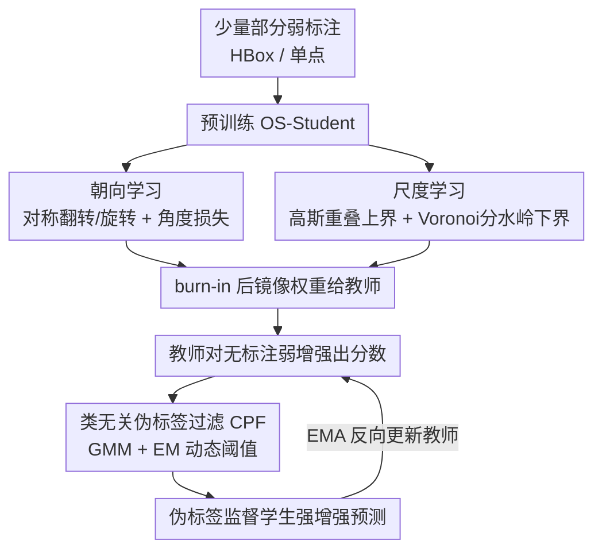

# Partial Weakly-Supervised Oriented Object Detection

**会议**: CVPR 2026  
**论文**: [CVF Open Access](https://openaccess.thecvf.com/content/CVPR2026/html/Liu_Partial_Weakly-Supervised_Oriented_Object_Detection_CVPR_2026_paper.html)  
**代码**: https://github.com/VisionXLab/PWOOD  
**领域**: 目标检测 / 旋转框检测 / 弱监督 / 遥感  
**关键词**: 旋转目标检测, 部分弱监督, 师生框架, 伪标签过滤, 标注成本

## 一句话总结
本文提出"部分弱监督旋转目标检测（PWOOD）"这一新设定——只用少量弱标注（水平框或单点）+ 大量无标注数据，配合能从弱标注里学到朝向与尺度的师生学生模型（OS-Student）和基于高斯混合的类无关伪标签过滤（CPF），在 DOTA / DIOR 上以更低标注成本逼近甚至超过用旋转框的半监督方法。

## 研究背景与动机

**领域现状**：旋转目标检测（OOD）在遥感等领域需求旺盛，但旋转框（RBox）标注昂贵。现有方案大致三类：① 全监督（用完整 RBox）；② 半监督 SOOD（用一部分 RBox + 无标注）；③ 弱监督 WOOD（用水平框 HBox 或单点等便宜标注）。三类都在"标注速度/成本"上各有牺牲。

**现有痛点**：半监督仍依赖昂贵的旋转框；弱监督虽便宜，但已有方法默认对**全部**数据都做弱标注，没有充分利用"少量弱标注 + 海量无标注"这种更省钱的组合。换言之，没人把"部分标注"和"弱标注"这两个降本维度叠在一起用。

**核心矛盾**：弱标注（尤其单点）天生缺失朝向和尺度信息，而师生半监督框架又高度依赖**静态阈值**筛选伪标签——训练早期教师弱、分数普遍偏低，后期教师强、分数升高，固定阈值无法适配这种动态分布，导致阈值不一致、鲁棒性下降。

**本文目标**：① 定义并打通"部分弱监督"这一更省钱的设定；② 让学生模型仅凭少量"缺朝向/缺尺度"的弱标注也能学到精确位姿；③ 用自适应阈值取代静态阈值，提升伪标签质量。

**切入角度**：作者继承师生范式，但给学生注入**朝向学习**与**尺度学习**两条自监督路径来补全弱标注缺的信息，并把伪标签筛选建模成一个可用 EM 求解的高斯混合分类问题。

**核心 idea**：用"部分弱标注预训练 + 无标注自训练"的师生框架，配一个会从弱标注里学朝向与尺度的 OS-Student 和一个动态调阈值的类无关伪标签过滤器（CPF）。

## 方法详解

### 整体框架
PWOOD 是一个师生（teacher-student）自训练框架，教师与学生共享主干/颈/头（FCOS + ResNet50 + FPN）。先用少量弱标注数据（部分 HBox 或部分点）预训练 OS-Student，其中朝向学习与尺度学习模块让学生从弱标注里学出朝向与尺度；到达 burn-in 步后把学生权重镜像给教师。随后引入无标注数据：教师对弱增强视图出预测，经 CPF（基于高斯混合 + EM 的动态阈值）筛出高质量伪标签，去监督学生在强增强视图上的预测；学生再用 EMA 反过来更新教师，形成正反馈，伪标签质量随训练逐步提升。

### 关键设计

**1. 朝向学习：用对称/旋转的自监督一致性从弱标注里抠出朝向**

水平框和单点都不含朝向，作者借鉴对称学习（H2RBox-v2）让学生学朝向。训练时把输入图垂直翻转或随机旋转角度 $\theta$ 得到变换视图，原图与变换视图都过网络出预测；弱标注也做同样变换形成弱监督对，同时由于原图与变换视图间存在确定映射，两者预测应满足同一映射关系，从而构成自监督对。据此定义角度损失（Smooth-L1）：

$$L^s_{Ang}=\begin{cases}L^s_{Ang}(\theta_{flip}+\theta,\,0), & trans=flip\\ L^s_{Ang}(\theta_{rot}-\theta,\,R), & trans=rotate(\theta)\end{cases}$$

即按变换类型（翻转/旋转）约束预测角度与几何变换一致。通过弱监督与自监督两条支路，学生在只有水平框的弱标注设定下也能学到精确朝向。

**2. 尺度学习：用高斯重叠定上界、Voronoi 分水岭定下界来补出尺度**

单点标注连尺度都没有，作者用空间布局学习（spatial layout learning）从上下两个边界把尺度框住。**上界**：把旋转框看作高斯分布，用 Bhattacharyya 系数度量不同预测框间的高斯重叠，通过最小化重叠避免框无限膨胀——$L^s_O=\frac{1}{N}\sum_{i,j\neq i}B(\mathcal{N}_i,\mathcal{N}_j)$，$B$ 为第 $i,j$ 个预测框高斯分布的 Bhattacharyya 系数。**下界**：以 Voronoi 图的脊线作背景标记、点标注作前景标记，用分水岭算法分割出每个物体的盆地区域；把盆地区域旋转到当前预测朝向后回归出宽高目标，再用高斯 Wasserstein 距离损失 $L^s_W=L_{GWD}$ 回归宽 $w_t$、高 $h_t$。一上一下两个边界共同约束，让模型在缺尺度的点标注下也能给出合理框大小。

**3. 类无关伪标签过滤（CPF）：用高斯混合 + EM 动态调阈值取代静态阈值**

针对静态阈值无法适配教师分数动态分布的痛点，作者把教师对各伪框的置信分数建模成两个一维高斯的混合：$P(s)=w_p\mathcal{N}_p(\mu_p,\sigma_p^2)+w_n\mathcal{N}_n(\mu_n,\sigma_n^2)$，分别对应正、负样本分布。正分布均值初始化为预测分数最大值、负分布初始化为最小值，两个权重各设 0.5。用 EM 算法迭代求出后验 $P_p$（某检测应被当作伪物体的似然），取使正样本后验最大的分数作为动态阈值 $T_d=\arg\max_s P_p(s,\mu_p,\sigma_p^2)$。因为只看分数分布、不区分类别，CPF 是"类无关"的，能随训练阶段自适应地把阈值往合适位置挪，缓解阈值不一致、提升伪标签稳定性。

### 损失函数 / 训练策略
学生监督损失 $L_s=\alpha_1 L^s_{cls}+\alpha_2 L^s_{cen}+\alpha_3 L^s_{box}+\alpha_4 L^s_{Ang}+\alpha_5 L^s_O+\alpha_6 L^s_W$，其中分类/中心度/框损失沿用 FCOS（focal / 交叉熵 / IoU），$(\alpha_1,\alpha_2,\alpha_3)=1$，$(\alpha_4,\alpha_5,\alpha_6)=(0.2,10,5)$。无标注侧损失 $L_u=\omega(L^u_{cls}+L^u_{cen}+L^u_{box})$，权重 $\omega$ 与各点分数挂钩、让高置信点贡献更大。总损失 $L=\alpha L_s+\beta L_u$，$\alpha=\beta=1$。基于 MMRotate 实现，AdamW 优化，30%/全量设定训 180k 步、10%/20% 训 120k 步。

## 实验关键数据

### 主实验
在 DOTA-v1.0/v1.5/v2.0 与 DIOR 上评测，指标为 mAP（DOTA 体系按 AP50 口径），分别取 10%/20%/30% 图像作有标注、其余作无标注。Vanilla Baseline 是简化版 MCL（去 GCA/CCSL）的 SOOD 基线，用**部分旋转框**；PWOOD 用更便宜的部分 HBox / 部分点。下表为 DIOR 与 DOTA-v1.0/v2.0（mAP, %）：

| 方法 (标注) | DIOR 20% | DOTA-v1.0 20% | DOTA-v2.0 20% |
|------|------|------|------|
| H2RBox-v2 (WOOD, 部分HBox) | 51.33 | 54.38 | 28.56 |
| Vanilla Baseline (SOOD, 部分RBox) | 57.07 | 62.82 | 34.03 |
| **PWOOD (部分HBox)** | **57.89** | **62.93** | **36.39** |
| PWOOD (部分Point) | 35.17 | 45.01 | 18.49 |

PWOOD 用**水平框**就追平/超过了用昂贵旋转框的 SOOD 基线（如 DIOR：54.33/57.89/60.42 vs 54.01/57.07/60.25），并在 DOTA-v2.0 上更明显地领先（小物体多、HBox 设定更占优）。

### DOTA-v1.5 对比
| 方法 (标注) | 10% | 20% | 30% |
|------|------|------|------|
| H2RBox-v2 (WOOD) | 42.19 | 49.01 | 55.19 |
| SOOD (部分RBox) | 48.63 | 55.58 | 59.23 |
| MCL (部分RBox) | 52.61 | 59.63 | 62.63 |
| Vanilla Baseline (部分RBox) | 49.53 | 58.28 | 61.00 |
| **PWOOD (部分HBox)** | **52.87** | **59.36** | **61.58** |
| PWOOD (部分Point) | 35.33 | 41.54 | 43.02 |

### 关键发现
- **HBox 设定整体可比甚至超 RBox 半监督**：DOTA-v1.5 上 PWOOD(HBox) 比同比例 SOOD 基线提升约 +3.34%/+1.08%/+0.58%（10/20/30%），即用更便宜的标注拿到相当或更好结果。
- **大幅碾压纯弱监督 WOOD**：相比同样只用部分 HBox 的 H2RBox-v2，DOTA-v1.5 上提升 10.68%/10.35%/6.39%，DIOR 上 6.56%~9.79%，说明充分挖掘无标注数据是关键收益来源。
- **点标注仍有差距**：部分点设定（如 DOTA-v1.5 35.33~43.02）明显低于 HBox，单点缺尺度/朝向信息更难，是更具挑战的廉价设定。
- 标注比例越低（10%），PWOOD 相对优势越大，越能体现"省标注"的价值。

## 亮点与洞察
- **叠加两个降本维度**：把"部分标注（半监督）"和"弱标注（HBox/点）"两个省钱方向合并成 PWOOD 新设定，是一个清晰且实用的问题定义，给标注预算有限的遥感场景提供新选项。
- **从弱标注里学位姿**：朝向学习（对称一致性）+ 尺度学习（高斯重叠上界 + Voronoi 分水岭下界）让学生从缺朝向/缺尺度的标注里"补"出旋转框，这套上下界夹逼的尺度学习思路可迁移到其它缺尺度的弱监督任务。
- **把阈值选择变成可学问题**：CPF 用 GMM+EM 把"该不该当伪标签"建模成正负分布的后验判别，动态阈值随教师能力演进，避免手调静态阈值，思路通用、可复用到其它半监督检测。

## 局限与展望
- **点标注效果仍弱**：单点设定 mAP 明显落后 HBox，缺尺度/朝向先验导致下界估计噪声大，论文也将其列为初步（preliminary）结果。
- **依赖弱标注质量与比例**：极低比例（<10%）或弱标注本身噪声大时的稳健性未充分探究。
- **多模块多损失、超参较多**：$(\alpha_4,\alpha_5,\alpha_6)$、$\alpha/\beta$、burn-in 步数等需调，完整敏感性放在补充材料。
- ⚠️ 框架图中的损失符号（$L^s_A/L^s_O/L^s_W$、$M$ 等）与部分数值来自 OCR 文本重排，记号/精确数字以原文为准。

## 相关工作与启发
- **vs SOOD / MCL（半监督 OOD）**：SOOD 用最优传输定义代价矩阵、MCL 引入高斯中心度与自适应标签分配，但都依赖**旋转框**；PWOOD 把监督换成更便宜的部分 HBox/点，并用 CPF 替掉静态阈值，做到"用更弱标注拿可比结果"。
- **vs H2RBox-v2 / Point2RBox-v2（弱监督 OOD）**：它们用全量弱标注但不利用无标注数据；PWOOD 只用部分弱标注 + 海量无标注，在同设定下大幅领先（DOTA-v1.5 +6~10%）。
- **vs Wholly-WOOD / PointOBB 系列**：同属降低标注成本路线，PWOOD 的差异在于把"部分 + 弱 + 无标注自训练"统一进一个师生框架，并支持多种弱标注形式（HBox/点）切换。

## 评分
- 新颖性: ⭐⭐⭐⭐ 首次提出部分弱监督 OOD 设定，问题定义实用
- 实验充分度: ⭐⭐⭐⭐ DOTA 三版本 + DIOR、多标注比例与形式较全面
- 写作质量: ⭐⭐⭐⭐ 动机清晰，符号与损失略密
- 价值: ⭐⭐⭐⭐ 给遥感等高标注成本场景提供省钱且有效的训练方案

<!-- RELATED:START -->

## 相关论文

- [\[ICLR 2026\] SPWOOD: Sparse Partial Weakly-Supervised Oriented Object Detection](../../ICLR2026/object_detection/spwood_sparse_partial_weakly-supervised_oriented_object_detection.md)
- [\[CVPR 2026\] Fourier Angle Alignment for Oriented Object Detection in Remote Sensing](fourier_angle_alignment_for_oriented_object_detection_in_remote_sensing.md)
- [\[ICLR 2026\] Bootstrapping MLLM for Weakly-Supervised Class-Agnostic Object Counting (WS-COC)](../../ICLR2026/object_detection/bootstrapping_mllm_for_weakly-supervised_class-agnostic_object_counting.md)
- [\[CVPR 2026\] From Detection to Association: Learning Discriminative Object Embeddings for Multi-Object Tracking](from_detection_to_association_learning_discriminative_object_embeddings_for_mult.md)
- [\[CVPR 2026\] Black-Box Domain Adaptation for Object Detection with Retention-Driven Knowledge Compression](black-box_domain_adaptation_for_object_detection_with_retention-driven_knowledge.md)

<!-- RELATED:END -->
