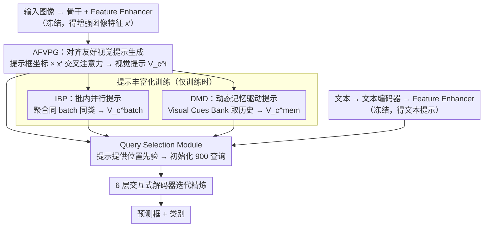

# PET-DINO: Unifying Visual Cues into Grounding DINO with Prompt-Enriched Training

**会议**: CVPR 2026  
**arXiv**: [2604.00503](https://arxiv.org/abs/2604.00503)  
**代码**: [https://fuweifuvtoo.github.io/pet-dino](https://fuweifuvtoo.github.io/pet-dino)  
**领域**: 目标检测 / 开放集检测  
**关键词**: 开放集目标检测, 视觉提示, Grounding DINO, 训练策略, 提示学习

## 一句话总结

PET-DINO 在 Grounding DINO 基础上构建了一个同时支持文本和视觉提示的通用目标检测器，设计了对齐友好的视觉提示生成模块（AFVPG）以及两种提示丰富化训练策略（IBP 和 DMD），在零样本检测任务上以更少的训练数据取得了有竞争力的性能。

## 研究背景与动机

**领域现状**：开放集目标检测（OSOD）旨在识别训练时未见的新类别。文本提示方法（如 Grounding DINO、GLIP）通过将视觉特征与预训练文本编码器对齐实现零样本泛化。视觉提示方法（如 T-Rex2、CP-DETR、YOLOE）则用目标的视觉表示作为提示来补充文本提示的不足。

**现有痛点**：（1）文本特征在特定专业领域或复杂目标上常常无法有效对应视觉概念，导致这些类别难以准确区分；（2）长尾类别缺乏足够的图文配对样本；（3）现有的视觉提示方法（T-Rex2、CP-DETR）采用紧耦合的多模态架构和多阶段训练，开发周期长；（4）对于数据驱动的 OSOD 模型，有效的训练策略尚未被充分探索。

**核心矛盾**：视觉提示天然包含超越文本描述的丰富信息，但训练时视觉提示来源于输入图像本身，限制了多样性——难以建模跨图像和类别级别的全局视觉提示，也无法在训练中离线预提取。

**本文目标**（1）在先进文本提示检测器基础上高效添加视觉提示能力，而非从头构建多模态系统；（2）设计首个针对双模态提示检测器的大规模训练策略，使模型在训练中能并行模拟多种实际使用场景。

**切入角度**：采用"继承式"策略——从已预训练的 Grounding DINO 出发，仅添加视觉提示生成模块，共享现有文本路径的参数，减少开发周期。

**核心 idea**：在文本预训练检测器上嫁接视觉提示模块并通过 batch 内并行提示和动态记忆库提示丰富化训练策略来提升零样本检测能力。

## 方法详解

### 整体框架

PET-DINO 想解决的问题是：怎样在已经训好的文本提示检测器（Grounding DINO）上低成本地长出"看图找同类"的视觉提示能力，而不必从头搭一套多模态系统。整体上它保留了两条并行的检测路线。文本路线原封不动地继承 Grounding DINO——文本经编码器生成 embedding，再经 Feature Enhancer 与图像特征交互，得到文本提示。视觉路线是新增的：用户给出的提示框坐标进入 AFVPG 模块，与同一个 Feature Enhancer 增强过的图像特征交互，聚合成视觉提示 $V_c^i$；训练时再用 IBP、DMD 两个策略把这条单图提示扩充成跨图像（$V_c^{batch}$）和跨迭代（$V_c^{mem}$）的提示，提升类级泛化。无论哪条路线，提示都送入 Query Selection Module 提供位置先验，初始化 900 个查询，再经 6 层交互式解码器迭代精炼，最后预测框和类别。训练时只解冻视觉提示相关的模块，骨干和文本路径全程冻结，从而把改动限制在"嫁接"的那一小块上。

### 关键设计

**1. AFVPG（对齐友好的视觉提示生成）：让视觉提示从"对齐过的"特征里长出来**

一个直接的做法是从骨干输出的原始特征里抠出提示框区域当视觉提示，但实验显示这样效果很差——原始特征还没和检测器内部的实例语义对齐。AFVPG 改从 Feature Enhancer 已经过可变形自注意力和 FFN 增强后的特征 $x'_i$ 取信息：对每个类别初始化可学习内容 embedding $C \in \mathbb{R}^{K \times D}$（$K$ 个提示框）外加一个通用载体 $C'$，把提示框坐标编码后与增强图像特征做多尺度可变形交叉注意力，再经自注意力和 FFN 聚合成一个全局视觉提示向量 $V \in \mathbb{R}^{1 \times D}$。关键一步是 AFVPG 直接复用文本分支 Feature Enhancer 里的可变形自注意力和 FFN 参数，于是文本路径学到的高层语义会顺势灌进视觉提示。两者叠加的收益很实在：相比 T-Rex2 的视觉编码器，Visual-I 上 +4.8 AP、Visual-G 上 +2.7 AP。

**2. IBP（批内并行提示）：用 batch 把单图提示扩成跨图像、类级提示**

视觉提示的天然短板是只能来自当前这张图，多样性受限，模型很容易退化成"复制这张图里的实例"，学不会泛化的类别概念。IBP 不增加任何数据成本就补上了这点：在一个 mini-batch 内，把同一 batch 其他图像里类别 $c$ 的视觉提示 $V_c^j$ 当作当前图像的跨图像提示，再把同类别的提示聚合成类级全局提示 $V_c^{batch}$。这样对图像 $i$ 上的类别 $c$ 就同时有了两种提示：来自自身图像的 $V_c^i$（对应交互式的 Exemplar-Guided Route）和来自 batch 聚合的 $V_c^{batch}$（对应 Global-Concept Route）。尤其当前图像根本不含类别 $c$ 时，别的图像贡献的提示直接把类别判别空间撑开了。效果上 IBP 是三个设计里最猛的一招，把 Visual-G 从 12.5 AP 一口气拉到 37.2 AP（+24.7）。

**3. DMD（动态记忆驱动提示）：把提示的多样性从"一个 batch"延伸到"整个训练史"**

IBP 仍受限于当前 batch 里出现了哪些类别。DMD 维护一个 Visual Cues Bank——每个类别一条 FIFO 队列（长度 $M=16$），动态存下历史迭代里提取的视觉提示 embedding。每次迭代随机采样 $d$ 个类别，从 Bank 里取历史提示聚合成第三种提示

$$V_c^{mem} = \frac{1}{M}\sum_{k=1}^{M} \tilde{V}_c^k,$$

于是每个类别最终拥有三种视觉提示 $\{V_c^i, V_c^{batch}, V_c^{mem}\}$。这条记忆库还有个副作用：那些很少同时出现在一个 batch 的稀有类别，现在也能借历史提示做对比学习。在 IBP 之上 DMD 再加 3.1 AP。

### 一个例子：类别"斑马"的三种提示怎么凑齐

设当前 batch 含 4 张图，其中图像 $i$ 里有一只斑马，另两张图各有一只斑马、第四张没有斑马。对类别"斑马"：AFVPG 先从图像 $i$ 的增强特征里抠出 $V_{斑马}^i$，这是最贴近当前实例的"示例式"提示；IBP 再把另外两张图里斑马的提示和 $V_{斑马}^i$ 一起聚合成 $V_{斑马}^{batch}$，于是即便第四张没有斑马，模型也已经见过这一类的"类级"视觉概念；DMD 则从 Visual Cues Bank 里斑马那条长度 16 的队列取出过去若干迭代攒下的斑马提示，平均成 $V_{斑马}^{mem}$。三者 $\{V_{斑马}^i, V_{斑马}^{batch}, V_{斑马}^{mem}\}$ 分别对应交互式、全局概念式、跨迭代三种真实使用场景，同一次前向里一起监督，逼着模型从"记住这一只"转向"理解斑马这一类"。

### 损失函数 / 训练策略

训练目标是 $\mathcal{L} = \mathcal{L}_{L1} + \mathcal{L}_{GIoU} + \mathcal{L}_{alignment}$，其中对齐项是 Focal loss。为了防止新增视觉路线把原有文本能力挤退化，采用循环训练：每 8 轮视觉提示训练穿插 1 轮文本提示训练。只有视觉提示相关模块可训练（学习率 1e-4），骨干冻结；共训 12 epochs，在第 8、11 epoch 学习率各降 10 倍。

## 实验关键数据

### 主实验

零样本交互式检测（Visual-I），Swin-T：

| 方法 | VLM sup. | 数据量 | COCO AP | LVIS AP | ODinW35 AP |
|------|----------|--------|---------|---------|------------|
| T-Rex2 | CLIP | 3.1M | 56.6 | 59.3 | 37.7 |
| CP-DETR-T | CLIP | 3.3M | 61.8 | 64.1 | 41.0 |
| **PET-DINO** | **无** | **0.6M** | **64.0** | 61.8 | 38.8 |
| **PET-DINO** | **无** | **2.5M** | **64.3** | **64.5** | **48.3** |

零样本通用检测（Visual-G），Swin-T：

| 方法 | 数据量 | COCO AP | LVIS AP | ODinW35 AP |
|------|--------|---------|---------|------------|
| T-Rex2 | 3.1M | 38.8 | 37.4 | 23.6 |
| **PET-DINO** | 0.6M | **40.3** | 29.6 | 20.4 |
| **PET-DINO** | 2.5M | 38.4 | 31.5 | **25.5** |

文本提示保持：PET-DINO Swin-L 在 COCO 上 54.0 AP（比 Grounding DINO +1.0，比 MM-Grounding-DINO +1.0），LVIS 39.3 AP（+2.6）。

### 消融实验

| 配置 | COCO Visual-I | COCO Visual-G | COCO Text | 说明 |
|------|---------------|---------------|-----------|------|
| 仅 AFVPG | 67.0 | 12.5 | 49.7 | Visual-G 很低 |
| AFVPG + DMD | 63.5 | 24.7 | 49.8 | +12.2 Visual-G |
| AFVPG + IBP | 63.2 | 37.2 | 49.6 | IBP 贡献最大 |
| AFVPG + IBP + DMD | 64.0 | **40.3** | 49.8 | 完整模型 |

AFVPG vs T-Rex2 编码器：Visual-I +4.8 AP, Visual-G +2.7 AP。

预训练继承 vs 从头训练：Visual-G +7.6 AP（继承策略）。

### 关键发现

- **IBP 是提升 Visual-G 的关键因素**：从 12.5 → 37.2 (+24.7 AP)，说明仅靠单图提示无法学会泛化性强的类级提示
- DMD 在 IBP 基础上进一步提升 3.1 AP，带来跨迭代的提示多样性
- Visual-I drop（67.0 → 64.0）换来 Visual-G 的巨大提升（12.5 → 40.3）是合理的权衡——模型从复制特定实例转向学习可泛化的类别模式
- 继承文本预训练比从头训练上界更高（Visual-G +7.6 AP），全局高层语义表示帮助理解类别概念
- PET-DINO 仅用 0.6M 数据就在 COCO Visual-I 上超过了用 3.3M 数据的 CP-DETR

## 亮点与洞察

- **"继承式"哲学**：在已预训练的文本检测器上嫁接视觉提示能力，而非从头构建多模态系统。这不仅减少了开发周期，还利用了文本分支的语义知识来提升视觉提示——非常实用的工程思路。
- **IBP 巧妙利用 batch 内并行性**：零成本地构造跨图像、类级、交互式三种提示场景，使单次训练覆盖多种实际部署场景。这个思路可以推广到任何需要多种提示模式的模型。
- **定量证明了文本预训练对视觉提示有迁移价值**（+7.6 AP），打破了"视觉提示需要独立训练"的常见假设。

## 局限与展望

- LVIS 上 Visual-G 性能与 T-Rex2 仍有差距（35.7 vs 47.6 Swin-L），长尾类别的视觉提示泛化仍是难点
- 未使用任何 VLM（如 CLIP）的监督信号——集成 CLIP 特征可能进一步提升跨域泛化
- 循环训练策略（8:1 视觉:文本）是手动设定的，自适应调度可能更优
- Visual Cues Bank 的队列长度 $M=16$ 和采样数 $d=40$ 需要根据数据集调整，缺乏自适应机制
- 未探索视觉+文本提示的融合使用（如同时提供文本和示例图片）

## 相关工作与启发

- **vs T-Rex2**: T-Rex2 是闭合式（不开放）的双模态提示检测器，需要 CLIP 监督和 SA-1B 等大规模数据。PET-DINO 开放支持文本提示，不需要 CLIP 监督，数据量小 5 倍以上在 COCO Visual-I 上仍然更优。但 T-Rex2 在 LVIS Visual-G 上遥遥领先，表明大规模数据和 CLIP 对长尾仍有优势。
- **vs CP-DETR**: CP-DETR 用紧耦合早期融合方式，PET-DINO 基于继承策略更灵活。CP-DETR Swin-L 在 LVIS 71.6 AP 但使用了 COCO 训练集（非零样本）。
- **vs YOLOE**: YOLOE 面向实时场景，用 MobileCLIP；PET-DINO 更侧重精度上界。

## 评分

- 新颖性: ⭐⭐⭐⭐ 继承策略思路新颖，IBP/DMD 训练策略是该方向的首次系统性探索
- 实验充分度: ⭐⭐⭐⭐ 三种协议、多个基准、完整消融、预训练分析，但缺少与 CLIP 监督方法的更公平对比
- 写作质量: ⭐⭐⭐⭐ 结构清晰但部分描述偏冗长，可以更精炼
- 价值: ⭐⭐⭐⭐ 为双模态提示检测器的训练策略提供了有价值的参考

<!-- RELATED:START -->

## 相关论文

- [\[CVPR 2026\] ViTPrompt: Training-Free Prompt Refinement with Visual Tokens for Open-Vocabulary Detection](vitprompt_training-free_prompt_refinement_with_visual_tokens_for_open-vocabulary.md)
- [\[AAAI 2026\] Connecting the Dots: Training-Free Visual Grounding via Agentic Reasoning](../../AAAI2026/object_detection/connecting_the_dots_training-free_visual_grounding_via_agent.md)
- [\[CVPR 2026\] Bidirectional Multimodal Prompt Learning with Scale-Aware Training for Few-Shot Multi-Class Anomaly Detection](bidirectional_multimodal_prompt_learning_with_scale-aware_training_for_few-shot_.md)
- [\[ICCV 2025\] Dynamic-DINO: Fine-Grained Mixture of Experts Tuning for Real-time Open-Vocabulary Object Detection](../../ICCV2025/object_detection/dynamicdino_finegrained_mixture_of_experts_tuning_for_realti.md)
- [\[CVPR 2026\] Beyond Prompt Degradation: Prototype-Guided Dual-Pool Prompting for Incremental Object Detection](beyond_prompt_degradation_prototype-guided_dual-pool_prompting_for_incremental_o.md)

<!-- RELATED:END -->
