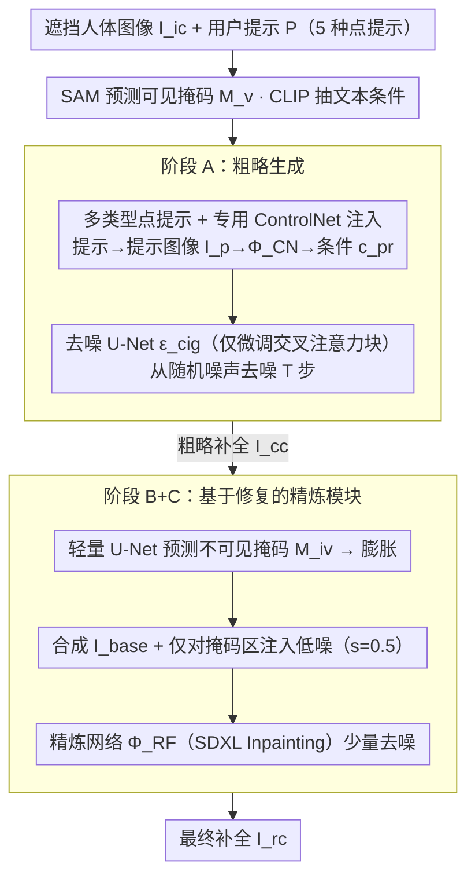

# PHAC: Promptable Human Amodal Completion

**会议**: CVPR 2026  
**arXiv**: [2603.14741](https://arxiv.org/abs/2603.14741)  
**代码**: 无  
**领域**: 目标检测  
**关键词**: 人体非模态补全, 扩散模型, ControlNet, 姿态引导生成, 图像修复

## 一句话总结

提出可提示人体非模态补全（PHAC）新任务，通过基于点的用户提示（姿态/边界框）配合 ControlNet 注入条件信号，并设计基于修复的精炼模块保留可见区域外观，实现高质量、可控的遮挡人体图像补全。

## 研究背景与动机

**人体非模态补全（HAC）的局限**：现有 HAC 方法只能从遮挡图像中幻想不可见区域，无法接受用户指定的约束（如目标姿态或空间范围），用户需反复采样才能获得满意结果。

**姿态引导人像合成（PGPIS）的不足**：PGPIS 允许姿态条件输入，但难以保持特定实例的可见外观，倾向于生成训练分布偏差的内容（如 DeepFashion 数据集的服装特征）。

**可见外观退化问题**：潜空间去噪和 VAE 重建会丢失精细可见细节，已有的解码器微调方案会引入模糊和边界伪影，UV 坐标方案在坐标噪声时丢失细节。

**缺乏多类型提示支持**：现有方法不支持多种类型的用户提示（姿态+边界框），无法灵活权衡性能与用户交互成本。

**零样本泛化能力弱**：PGPIS 基线（如 PIDM、MCLD）在训练集外的真实图像上常出现严重外观幻觉，将老年男性变为白人女性等极端失败情况。

**边界伪影**：直接将可见区域和生成区域拼接会在掩码边界处引入明显伪影，缺乏平滑过渡机制。

## 方法详解

### 整体框架

PHAC 要解决的痛点是：现有人体非模态补全只能「凭空幻想」被遮挡的区域，用户无法指定目标姿态或空间范围，而姿态引导合成又保不住可见区域的真实外观。它把补全拆成两阶段——(A) 粗略生成 + (B+C) 精炼。给定遮挡人体图像 $I_{ic}$ 和用户提示 $P$（支持 5 种类型：姿态 $p_{po}$、兴趣区域 bbox $p_{ib}$、全区域 bbox $p_{eb}$、姿态+兴趣 bbox $p_{poib}$、姿态+全 bbox $p_{poeb}$），先把提示渲染成提示图像 $I_p$，经专用 ControlNet $\Phi_{CN}$ 编码为条件信号 $c_{pr}$ 注入去噪 U-Net $\epsilon_{cig}$（仅微调其交叉注意力块以保住生成先验），从随机噪声去噪 $T$ 步得到粗略补全 $I_{cc}$；再由轻量 U-Net $\mathcal{U}_{iv}$ 预测不可见区域掩码 $M_{iv}$ 并膨胀，只对掩码区域注入低幅噪声，精炼网络 $\Phi_{RF}$ 做少量去噪得到最终输出 $I_{rc}$。

### 关键设计

**1. 多类型点提示 + 专用 ControlNet 注入：用几个点就能控制姿态和范围**

让用户控制补全本不该需要 3D 信息或密集掩码那么重的输入。PHAC 把约束压缩成少量点——姿态提示是在 OpenPose 检出的可见关节上、由用户补上缺失关节，bbox 提示只需点两个角点——并支持 5 种组合（姿态 $p_{po}$、兴趣区 bbox $p_{ib}$、全区 bbox $p_{eb}$，以及二者的两种组合 $p_{poib}$、$p_{poeb}$）。这些点被渲染成提示图像 $I_p$，送进**为每种提示类型单独训练的 ControlNet** $\Phi_{CN}$ 编码成条件信号 $c_{pr}$，再注入去噪 U-Net。同时用 SAM 直接从输入图预测可见掩码 $M_v$、用 CLIP 抽文本条件，省掉对真值掩码标注的依赖（区别于需要 GT 掩码的既有方法）。提示极轻量，用户可以在交互成本和控制精度之间灵活权衡。

**2. 仅微调交叉注意力块：保住预训练生成先验**

从头训练或全参微调容易破坏扩散模型已有的人体生成能力。PHAC 只微调去噪 U-Net $\epsilon_{cig}$ 的交叉注意力块、冻结其余权重，让提示信号经交叉注意力高效进入生成、获得强提示对齐，同时把预训练 DM 的生成先验原样保留下来，兼顾提示对齐与画质。

**3. 基于修复的精炼模块：保住可见区域、消除拼接伪影，且可即插即用**

粗略补全经潜空间去噪和 VAE 重建后会丢失可见细节，而直接把可见区域与生成区域硬拼（$I_{base}=I_{ic}\odot M_v + I_{cc}\odot(1-M_v)$）又会在掩码边界留下明显伪影。PHAC 不重新生成掩码区域的 RGB：先用轻量 U-Net $\mathcal{U}_{iv}$ 以 $I_{ic}$、$I_{cc}$、$M_v$ 为输入预测不可见掩码 $M_{iv}$ 并膨胀（避免漏掉边界像素），再对合成图只在掩码区注入少量噪声（$s=0.5$）、用预训练 SDXL Inpainting 精炼网络 $\Phi_{RF}$ 执行约 40% 步数（20 步）的去噪，让可见区域基本不变、生成区域与之平滑过渡，从而抹掉边界伪影。这个精炼并不绑定 PHAC 自身的生成阶段——它能直接套到其他扩散模型输出上当通用后处理组件：套到 MCLD 上 MSE 降约 60%、KID 降约 71%，套到 pix2gestalt 上 LPIPS 降 37%。

### 损失函数与训练策略

- **粗略生成损失**：标准扩散去噪目标 $\mathcal{L} = \mathbb{E}[\|\epsilon - \epsilon_{cig}(z_t, t, c_{te}, c_{pr})\|_2^2]$
- **掩码预测损失**：BCE + Dice 加权组合 $\mathcal{L} = \mathcal{L}_{BCE} + 0.5 \cdot \mathcal{L}_{Dice}$
- **精炼网络**：直接使用预训练 SDXL Inpainting 模型，无需额外训练
- **训练设置**：DM 学习率 $5 \times 10^{-6}$，ControlNet 学习率 $5 \times 10^{-5}$，batch=14，训练 1750 epoch（4×A6000，约 16 小时）；掩码 U-Net 训练 40 epoch（1×RTX 3090，约 30 分钟）
- **随机推理**：DM 为每个训练图像生成 $N=16$ 个粗略输出，掩码 U-Net 训练时随机采样其一进行监督

## 实验关键数据

### 主实验

**数据集**：OccThuman2.0（合成，5260 张）+ AHP（真实，56 张）

| 方法 | 提示类型 | LPIPS*↓ | SSIM↑ | KID*↓ | PSNR↑ | Joint Err.↓ |
|------|----------|---------|-------|-------|-------|-------------|
| PIDM | 2D pose | 126.33 | 0.797 | 56.91 | 16.80 | 113.72 |
| MCLD | UV map | 115.90 | 0.833 | 41.11 | 18.37 | 53.38 |
| pix2gestalt | - | 90.11 | 0.911 | 16.51 | 22.63 | 36.65 |
| SDHDO | 2D pose | 81.39 | 0.924 | 16.41 | 23.80 | 43.49 |
| **Ours** | **2D pose** | **49.47** | **0.948** | **6.12** | **25.86** | **23.33** |

*OccThuman2.0 数据集结果，值 ×10³*

| 方法 | LPIPS*↓ | SSIM↑ | KID*↓ | PSNR↑ | Joint Err.↓ |
|------|---------|-------|-------|-------|-------------|
| SDHDO | 64.19 | 0.956 | 6.05 | 24.45 | 9.24 |
| **Ours** | **38.77** | **0.970** | **1.25** | **26.93** | **6.37** |

*AHP 真实数据集结果*

### 消融实验

**不同提示类型对比（OccThuman2.0）**：

| 提示类型 | LPIPS*↓ | SSIM↑ | PSNR↑ | Joint Err.↓ |
|----------|---------|-------|-------|-------------|
| 姿态 $p_{po}$ | 49.47 | 0.948 | 25.86 | 23.33 |
| 兴趣 bbox $p_{ib}$ | 51.83 | 0.942 | 24.99 | 24.01 |
| 全区域 bbox $p_{eb}$ | 52.28 | 0.941 | 25.07 | 28.23 |
| 姿态+兴趣 bbox | 49.35 | 0.947 | 25.69 | 22.15 |
| 姿态+全 bbox | 49.42 | 0.946 | 25.49 | 21.96 |

**噪声强度消融（$s$ 参数）**：$s=0.5$ 在 OccThuman2.0 和 AHP 上均为最优，过小（0.1）去噪不充分，过大（0.9）破坏原有外观。

**精炼模块即插即用效果**：应用于 MCLD 后 MSE 降低约 60%、KID 降低约 71%；应用于 pix2gestalt 后 LPIPS 降低 37%。

### 关键发现

1. 姿态提示提供最有效的单提示引导，bbox 提示主要约束空间范围但留下姿态歧义
2. 组合提示（姿态+bbox）在保持感知质量的同时一致性降低关节误差
3. 精炼模块即使在本方法精炼前已超越所有基线，精炼后进一步提升全部指标
4. 兴趣区域 bbox 的每点增益最高（$\Delta$JE pp=2.86），用户交互效率最优

## 亮点与洞察

- **任务定义新颖**：首次提出可提示人体非模态补全任务，在 HAC 和 PGPIS 之间建立了自然连接
- **实用的提示设计**：基于点的提示极度轻量（几个点即可），避免了 3D 信息或密集掩码等难以获取的输入
- **精炼模块通用性**：基于修复的精炼是通用即插即用组件，对其他方法也有显著提升
- **仅微调交叉注意力**：以极小参数量变动获得强提示对齐，保留预训练先验
- **训练效率高**：主模型 4 卡 16 小时，掩码网络单卡 30 分钟，总训练成本可控

## 局限性

- 仅在合成数据（OccThuman2.0，526 个 3D 人体）上训练，真实场景多样性受限
- AHP 测试集仅 56 张图像，真实场景评估规模偏小
- 精炼网络依赖预训练 SDXL Inpainting，单张精炼约 4 秒，实时性不足
- 姿态提示需用户手动标注缺失关节，遮挡严重时点数增加交互负担
- 缺少与最新 DiT 架构或视频扩散模型的比较
- 未探索文本提示或其他高层语义条件的融合

## 相关工作

- **HAC 方法**：pix2gestalt（通用非模态补全+扩散先验）、SDHDO（人体专用+2D 姿态先验），但均不支持用户提示且可见外观退化
- **PGPIS 方法**：PIDM（2D pose map 条件扩散）、MCLD（UV map 条件），但训练数据偏差导致外观幻觉严重
- **ControlNet**：本文多类型提示注入的基础架构，每种提示类型训练专用 ControlNet
- **SAM**：用于自动预测可见区域掩码，替代依赖真值掩码的传统方案

## 评分

- 新颖性: ⭐⭐⭐⭐ — 任务定义新颖，提示机制设计巧妙
- 实验充分度: ⭐⭐⭐⭐ — 多基线比较+多维消融（提示类型/噪声强度/即插即用），但真实数据规模偏小
- 写作质量: ⭐⭐⭐⭐ — 结构清晰，公式完整，图表丰富
- 价值: ⭐⭐⭐⭐ — 精炼模块的通用性和提示设计的实用性有较好应用前景

<!-- RELATED:START -->

## 相关论文

- [\[CVPR 2026\] Show, Don't Tell: Detecting Novel Objects by Watching Human Videos](show_dont_tell_detecting_novel_objects_by_watching.md)
- [\[CVPR 2026\] Mining Instance-Centric Vision-Language Contexts for Human-Object Interaction Detection](mining_instance-centric_vision-language_contexts_for_human-object_interaction_de.md)
- [\[CVPR 2025\] ProbPose: A Probabilistic Approach to 2D Human Pose Estimation](../../CVPR2025/object_detection/probpose_a_probabilistic_approach_to_2d_human_pose_estimation.md)
- [\[NeurIPS 2025\] DETree: DEtecting Human-AI Collaborative Texts via Tree-Structured Hierarchical Representation Learning](../../NeurIPS2025/object_detection/detree_detecting_human-ai_collaborative_texts_via_tree-structured_hierarchical_r.md)
- [\[ICCV 2025\] Intervening in Black Box: Concept Bottleneck Model for Enhancing Human-Neural Network Mutual Understanding](../../ICCV2025/object_detection/intervening_in_black_box_concept_bottleneck_model_for_enhancing_human_neural_net.md)

<!-- RELATED:END -->
