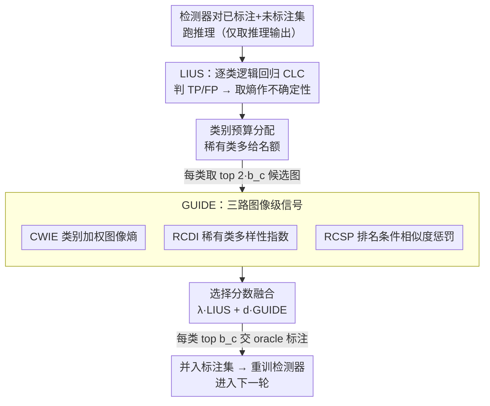

# Portable Active Learning for Object Detection

**会议**: CVPR 2026 (Highlight)  
**arXiv**: [2605.10349](https://arxiv.org/abs/2605.10349)  
**代码**: 无  
**领域**: 目标检测 / 主动学习  
**关键词**: 主动学习, 目标检测, 实例不确定性, 类别不平衡, 检测器无关

## 一句话总结
PAL 提出一个**只读检测器推理输出、不动模型内部和训练流程**的主动学习框架：用轻量逻辑回归分类器从「pre-NMS 框数 + 置信度」两个特征估计每个检测是真/假阳性、再取熵作为实例不确定性（LIUS），叠加三路图像级信号（GUIDE）做多样性与类别均衡筛选，在 COCO / VOC / BDD100K 上比 PPAL 等基线用更少标注达到更高检测精度。

## 研究背景与动机
**领域现状**：目标检测高度依赖大规模带框标注，而画框既贵又慢，是把检测器迁到新域/稀有类时最大的瓶颈。主动学习（AL）的思路是每轮只挑「最值得标」的图像交给标注员（oracle），用尽量少的标注逼近全量训练的精度。

**现有痛点**：检测领域的 AL 方法大多有两类毛病。其一，**侵入式**——像 LearnLoss、MIAL、PPAL 这类要么往检测器里加损失预测模块/对抗分类头，要么改训练 schedule、要么依赖模型中间特征（feature/gradient），换一个检测器就得重新接线，集成成本高、可移植性差。其二，**信号单一**——纯实例不确定性方法（MIAL/LearnLoss）很少把**图像级信号、类别不平衡线索、实例级不确定性**三者一起用，导致挑出来的 batch 要么扎堆在某个类、要么互相冗余。

**核心矛盾**：要"既好用又好接"——既要 detector-agnostic、零侵入（只用推理输出），又要让挑样兼顾「不确定性 + 多样性 + 类别均衡」这三件本来需要深入模型内部才好做的事。

**本文目标**：设计一个仅依赖推理输出、对任意检测器即插即用的打分函数，同时覆盖实例不确定性、图像级信息量、图像多样性、稀有类预算四个维度。

**切入角度**：作者观察到，一个检测的**真/假阳性其实可以只用两个推理副产物判别**——pre-NMS 阶段围在它周围的框数（密集高置信框簇往往意味着真有物体）和它的检测置信度。既然如此，就不必碰模型内部，用一个二维逻辑回归就能学出 TP/FP 决策边界。

**核心 idea**：把"实例不确定性"重写成"逻辑回归判别 TP/FP 的熵"（LIUS），再用三路纯图像/推理级信号（GUIDE）补齐图像信息量与多样性，两部分加权融合成选择分数——全程不改模型、不改训练代码。

## 方法详解

### 整体框架
PAL 是一个迭代式 AL 框架：每一轮里，当前标注集 $L_r$ 训练出的检测器对**已标注集和未标注池都跑一遍推理**；已标注集的检测（带 TP/FP 真值）用来训练**类别专属逻辑回归分类器 CLC**，CLC 再给未标注池的每个检测打 LIUS 不确定性分；按类别预算挑出每类候选图像后，进入 GUIDE 阶段用三路图像级信号（类别加权图像熵 CWIE、稀有类多样性指数 RCDI、排名条件相似度惩罚 RCSP）做最终排序；top 图像交给 oracle 标注、并入 $L_{r+1}$ 后重训检测器，循环往复。

最终每张图像 $I$ 中实例 $j$ 的总分是实例级与图像级两部分加权和：

$$\text{Score}(I, j) = \lambda \cdot S_{\text{LIUS}}(I_j) + d \cdot S_{\text{GUIDE}}(I), \quad \lambda + d = 1$$

### 关键设计

**1. LIUS：把实例不确定性重写成「逻辑回归判 TP/FP 的熵」**

这一步针对的痛点是：传统实例不确定性要么依赖模型中间特征、要么要改检测头。PAL 改成只用两个推理副产物作特征——$x_1$ 是该检测的 **pre-NMS 框数**（先抽全图 pre-NMS 框，NMS 出最终检测后用 IoU 阈值把 pre-NMS 框分配给各检测，分到的框数即此值；密集高置信框簇往往对应真物体），$x_2$ 是**检测置信度**。对每个类别 $c$，用已标注集（检测带 TP/FP 真值）训练一个二维逻辑回归分类器 CLC：

$$P(Y=1 \mid x) = \frac{1}{1 + e^{-(\beta_0 + \beta_1 x_1 + \beta_2 x_2)}}$$

它给出"该检测是真阳性"的概率。再用 Shannon 熵把这个概率转成不确定性分，即 LIUS：

$$\text{LIUS}(I_j) = -\sum_{Y_j \in \{0,1\}} P(Y_j) \log P(Y_j)$$

概率越接近 0.5（最难判 TP/FP）熵越大、越该标。论文用可视化说明（Fig.2/3）：早期 bus 这类低频类的 TP/FP 在特征空间几乎分不开，随着 AL 补入更多 bus 样本，FP 向低置信区、TP 向高置信高框数区分离，CLC 边界越来越干净——AL 反过来改善了检测器对该类的表现。作者特意验证（消融）用**简单逻辑回归**比 XGBoost 更好，因为复杂分类器在低频类上容易过拟合。

**2. 类别预算分配：给稀有类硬留名额，对抗长尾**

只按 LIUS 排序选样会被高频类霸占预算。PAL 引入按类预算：给类别 $c$ 一个权重，频次越低权重越高

$$r_c = 1 - 0.5\left(\frac{n_{c,l}}{N_l} + \frac{n_{c,u}}{N_u}\right)$$

其中 $n_{c,l}, n_{c,u}$ 是 $c$ 在标注集/未标注池的实例数，$N_l, N_u$ 是总检测数。再据此把总预算 $b$ 分到各类：

$$b_c = \min\!\left(n_{c,u},\; b \cdot \frac{r_c}{\sum_{c_i \in C} r_{c_i}}\right), \quad \sum_{c \in C} b_c = b$$

每类取 LIUS 最高实例所在的 **top $2b_c$ 张候选图**进入 GUIDE。这一机制让低频类（如 bus）有机会被持续补样，是后面"早轮 mAP 明显领先"的重要来源。

**3. GUIDE：三路纯图像/推理级信号补齐「图像信息量 + 多样性」**

LIUS 只关心"图里有没有难判的目标实例"，忽略了图像整体的信息量与彼此冗余。GUIDE 用三个**不碰模型内部**的图像级信号给候选图重新打分：

- **CWIE（类别加权图像熵）**：衡量图像级不确定性，但用类别权重 $r_{c_i}$ 压制高频类主导。对含 $O$ 个目标的图像 $I$，$\text{CWIE}(I) = -\sum_{i \in O} r_{c_i} \sum_{j \in C} p_{ij} \log p_{ij}$（$p_{ij}$ 是物体 $i$ 在类 $j$ 上的预测置信度）。⚠️ 公式符号以原文为准——这是分类熵按稀有类加权的形式。
- **RCDI（稀有类多样性指数）**：CWIE 可能被某个主导类的大量实例撑高，RCDI 改为奖励"跨越多个、尤其稀有类别"的图像：$\text{RCDI}(I) = \sum_{k \in K} r_k$，$K$ 是图中出现的不同类别集合，$r_k$ 同式 (5)。
- **RCSP（排名条件相似度惩罚）**：用预训练 ViT 编码器把图像编成低维向量，按 LIUS 降序给每类候选排名；排名第一的图多样性分记 1，对排名 $i$ 的图，与所有更高排名图的嵌入做余弦相似度，取最大值再用 1 减：$\text{RCSP}(I) = 1 - \max_{m \in [1, i-1]} \cos(e_i, e_m)$。关键巧思是"只罚低排名那张"——两张相似图只惩罚不那么重要的一张，避免两张都被丢掉。CWIE/RCDI 都用 min-max 缩放到 $[0,1]$。

**4. 选择分数融合：实例分 + 三路图像分加权汇总**

把 LIUS 与 GUIDE 三路展开成最终每图选择分数：

$$\text{Score}(I) = \lambda \cdot \text{LIUS}(I_j) + \gamma \cdot \text{RCSP}(I) + \delta\,(\text{CWIE}(I) + \text{RCDI}(I))$$

约束 $2\delta + \gamma = d$（$\lambda, d$ 即式 (2) 的权重）；CWIE 与 RCDI 共用同一权重 $\delta$ 以平衡"信息框数量"与"类别多样性"的贡献。每类按 Score 取 top $b_c$ 图送标注。实验用 $\lambda=0.9$、$\delta=0.04$、$\gamma=0.02$（即 $d=0.1$），且强调这些权重是经验设定、未做大量调参。

### 损失函数 / 训练策略
PAL 本身**不引入新损失**，检测器照常用各自原训练目标训练；PAL 只在每轮推理后训练轻量 CLC（逐类逻辑回归）并计算 GUIDE。复杂度上，跑完全量推理后，PAL 运行时间随实例数（或图像数，取大者）线性增长，且 CLC 训练/推理与 GUIDE 打分都可并行。一个细节：CLC 默认在检测器训练过的标注图上学 TP/FP，可能有偏；消融里改用验证集预测训练 CLC，发现差异可忽略，说明用训练数据本身就够。

## 实验关键数据

### 主实验
在 COCO / PASCAL VOC / BDD100K 上跨 RetinaNet、Faster R-CNN、SSD、YOLOX-Tiny、YOLO11s 多检测器评测，每个设置重复 3 次取均值。

| 数据集 / 检测器 | 指标 | 本文末轮 | 之前 SOTA | 提升 |
|--------|------|------|----------|------|
| COCO / RetinaNet | AP@0.5-0.95 | — | PPAL | +1.4 |
| PASCAL VOC / RetinaNet | mAP@0.5 | — | PPAL | +0.9 |
| BDD100K / RetinaNet | mAP@0.5 | 46.7 | PPAL 45.5 | +1.2 |
| BDD100K / YOLOX-Tiny | mAP@0.5 | 13.3 | Entropy 12.2 | +1.1 |
| COCO / YOLO11s | AP@0.5-0.95 | 12.2 | Random 10.7 | +1.5 |

BDD100K / RetinaNet 逐轮（每轮新标 2.5%，共到 12.5%）：

| 方法 | R1 | R2 | R3 | R4 | R5 |
|------|----|----|----|----|----|
| Random | 26.8 | 34.7 | 37.8 | 40.2 | 42.2 |
| Entropy | 26.8 | 36.3 | 41.5 | 43.5 | 44.8 |
| PPAL | 26.8 | 38.9 | 42.5 | 44.4 | 45.5 |
| **Ours** | 26.8 | **40.1** | **43.7** | **45.7** | **46.7** |

**标注效率**：要达到与 PAL 相当的精度，PPAL 平均要多标约 **20.7%**（COCO +18.6%、VOC +22.8%，对 RetinaNet、跨轮平均、不含第 1 轮随机轮）。

### 消融实验
（均在 COCO + RetinaNet，2% 种子集 + 4 轮各加 2%）

| 配置 | 关键发现 | 说明 |
|------|---------|------|
| Full PAL | 基准 | LIUS + GUIDE 完整 |
| w/o CWIE | 早轮掉点最多 | 去掉类别加权图像熵影响最大 |
| w/o RCSP | 早轮下降 | 去多样性惩罚后冗余上升 |
| w/o RCDI | 早轮下降 | 稀有类覆盖变差 |
| LIUS only (d=0) | 早轮明显退化 | 末轮接近 PAL，但小数据期差距大 |
| GUIDE 权重 0.1 | 近最优 | 增大或减小都不更好 |
| CLC 用验证集训练 | 收益可忽略 | 用训练数据训 CLC 已足够 |
| XGBoost 替代逻辑回归 | 无提升 | 复杂分类器在低频类上过拟合 |
| 编码器 ViT/CLIP/DINOv2 | Google ViT 早轮最好 | 后轮多样性下降，编码器影响变小 |

### 关键发现
- **CWIE 是 GUIDE 里贡献最大的分量**：去掉它早轮掉点最明显；但后轮去掉 RCSP/CWIE 反而略升——作者解释为后轮样本远离逻辑回归边界后 LIUS 数值偏低、方差变大，此时 RCSP/CWIE 的波动对选择分数干扰更大。
- **多样性（GUIDE）在小数据期最关键**：LIUS-only 末轮能逼近 PAL，但早轮差距大；COCO 上很多稀有类甚至稀到训不出逐类 CLC，更要靠 GUIDE 兜底。
- **简单 > 复杂**：逻辑回归优于 XGBoost、Google ViT 优于 CLIP/DINOv2，体现"低频类下越简单越稳、越不过拟合"。

## 亮点与洞察
- **只用推理输出做 AL，零侵入即插即用**：不碰模型内部、不改训练代码，换检测器（RetinaNet→Faster R-CNN→SSD→YOLOX-Tiny→YOLO11s）几乎零成本接入——这是它最实用、也最容易迁到工业部署的点。
- **TP/FP 可由两个推理副产物判别**：pre-NMS 框数 + 置信度这对极简特征，配二维逻辑回归就够画出 TP/FP 边界，避开了对模型特征/梯度的依赖，这个观察很巧。
- **RCSP「只罚低排名那张」**：传统相似度去重容易把一对相似图都误删，PAL 用排名条件惩罚只压低分那张，保住更有价值的一张，是个可复用的去冗余 trick。
- **AL 与检测器互相加强可视化**：Fig.2/3 直观展示随着 AL 补样，低频类的 TP/FP 在特征空间逐渐分离——把"为什么 AL 选这些样有用"讲成了看得见的故事。

## 局限性 / 可改进方向
- **后轮 GUIDE 可能起反作用**：消融显示后期去掉 RCSP/CWIE 反而略好，说明固定权重的 GUIDE 在数据变多、LIUS 方差变大后并非始终有益，缺一个随轮次自适应调权的机制。
- **依赖逐类 CLC，极稀有类训不出分类器**：COCO 上部分类别稀到无法训练逐类逻辑回归，此时只能靠 GUIDE 兜底，LIUS 对这些类失效。
- **权重靠经验设定**：$\lambda/\delta/\gamma$ 未做系统调参，跨数据集/检测器的鲁棒最优值未充分探讨；VOC 早轮还出现高方差、前两轮落后 PPAL 的现象。
- **pre-NMS 框数依赖检测器结构**：one-stage 与 anchor-free（YOLO 系）的 pre-NMS 框语义不同，特征 $x_1$ 的可比性与稳定性值得进一步分析。⚠️ 此为笔者推断。

## 相关工作与启发
- **vs PPAL**：PPAL 用难度校准不确定性 + 类别条件匹配相似度 + k-means++ 聚类，且**依赖模型特征**算多样性；PAL 全程只用推理/图像级信号、不碰模型，达到同等精度时让 PPAL 平均多标约 20.7%，可移植性更强。
- **vs MIAL / LearnLoss**：二者分别用对抗分类器 + 多示例学习、损失预测模块来估实例不确定性，都需往检测器里**加组件、改训练**；PAL 用逻辑回归 + 熵在推理后离线完成，零训练侵入。
- **vs CoreSet / CDAL（多样性/core-set）**：这些方法多依赖中间特征空间聚类或梯度，集成到现成检测器较麻烦；PAL 的 RCSP 用外部预训练 ViT 嵌入 + 排名条件惩罚实现多样性，与检测器解耦。

## 评分
- 新颖性: ⭐⭐⭐⭐ 把实例不确定性重写成"逻辑回归判 TP/FP 的熵"+ 三路纯推理级图像信号，组合新颖、工程导向强（虽各部件偏经典）。
- 实验充分度: ⭐⭐⭐⭐⭐ 3 数据集 × 5 检测器 × 重复 3 次，消融覆盖各分量/权重/编码器/分类器/CLC 训练数据，相当扎实。
- 写作质量: ⭐⭐⭐⭐ 结构清晰、可视化讲故事到位；部分公式符号 OCR 后略含糊（CWIE 符号需对原文）。
- 价值: ⭐⭐⭐⭐⭐ 真正 detector-agnostic、零侵入、可并行，对工业界低成本部署检测器非常实用，CVPR Highlight 名副其实。

<!-- RELATED:START -->

## 相关论文

- [\[ICCV 2025\] From Easy to Hard: Progressive Active Learning Framework for Infrared Small Target Detection with Single Point Supervision](../../ICCV2025/object_detection/from_easy_to_hard_progressive_active_learning_framework_for_infrared_small_targe.md)
- [\[CVPR 2026\] From Detection to Association: Learning Discriminative Object Embeddings for Multi-Object Tracking](from_detection_to_association_learning_discriminative_object_embeddings_for_mult.md)
- [\[CVPR 2026\] Balanced Hierarchical Contrastive Learning with Decoupled Queries for Fine-grained Object Detection in Remote Sensing Images](balanced_hierarchical_contrastive_learning_with_decoupled_queries_for_fine-grain.md)
- [\[CVPR 2026\] Towards Persistence: Learning Topological Constraints for Event-based Small Object Detection](towards_persistence_learning_topological_constraints_for_event-based_small_objec.md)
- [\[CVPR 2026\] Expert-Teacher-Student Collaborative Learning for Domain Adaptive Object Detection](expert-teacher-student_collaborative_learning_for_domain_adaptive_object_detecti.md)

<!-- RELATED:END -->
