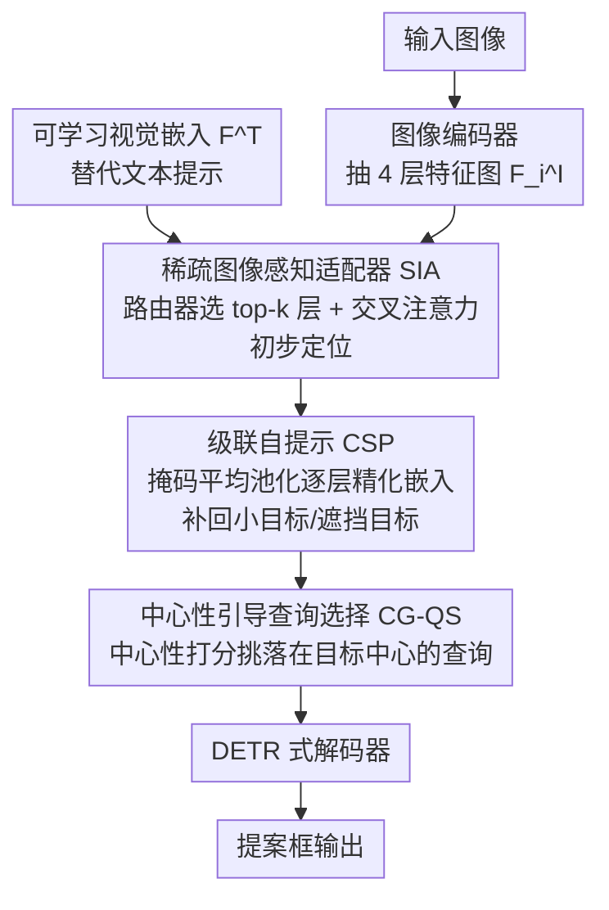

# Prompt-Free Universal Region Proposal Network

**会议**: CVPR 2026  
**arXiv**: [2603.17554](https://arxiv.org/abs/2603.17554)  
**代码**: [GitHub](https://github.com/tangqh03/PF-RPN)  
**领域**: 目标检测  
**关键词**: 区域提案, 无提示检测, 零样本泛化, 可学习嵌入, 开放世界

## 一句话总结

PF-RPN 用可学习视觉嵌入替代文本/图像提示，通过稀疏图像感知适配器、级联自提示和中心性引导查询选择三个模块，仅用 5% COCO 数据训练即可在 19 个跨域数据集上实现 SOTA 零样本区域提案。

## 研究背景与动机

**领域现状**：区域提案网络（RPN）是目标检测的核心组件，负责生成候选框。开放词汇目标检测（OVD）模型如 Grounding DINO、YOLO-World 通过文本类别名或示例图像作为提示来定位目标，具有跨域泛化能力。

**现有痛点**：OVD 方法依赖外部提示（类别名/示例图像），在实际场景中这些信息往往不可用——比如工业缺陷检测和水下目标检测中，目标类别和参考图像都无法预先获取。虽然有一些 prompt-free OVD 方法（如 GenerateU、DetCLIPv3）利用大型视觉语言模型生成文本描述来消除手动提示，但引入了巨大的显存和延迟开销。

**核心矛盾**：要实现"无提示"的通用目标定位，既不能依赖外部文本/图像输入，又不能使用计算量巨大的生成式 VLM。需要找到一种轻量且高效的方式来替代文本嵌入的角色。

**本文目标** 设计一个无需任何外部提示、只利用视觉特征就能在未知域中定位任意目标的轻量级区域提案网络。

**切入角度**：作者观察到 OVD 模型中文本嵌入的作用本质上是提供查询信号来匹配视觉特征，因此可以用一个**可学习的视觉嵌入**来替代文本嵌入，并通过图像自身的视觉特征来动态更新这个嵌入。进一步观察到：(1) 目标内部特征的定位能力比可学习嵌入更强，(2) 靠近目标中心的查询比边缘查询产生更准确的提案。

**核心 idea**：用可学习的视觉嵌入替代文本提示，通过多层级视觉特征的自适应聚合和级联自提示迭代精化来实现无提示的通用目标定位。

## 方法详解

### 整体框架

PF-RPN 想回答一个问题：在拿不到任何文本类别名或参考图像的情况下，怎么让检测器在没见过的域里定位任意目标？它建立在 Grounding DINO（Swin-B backbone）之上，但把原本由文本编码器提供的查询信号整个换成一个可学习的视觉嵌入 $F^T$，再让图像自己的特征来把这个嵌入"喂"成靠谱的定位信号。

具体怎么转：输入图像先经编码器抽出 4 个层级的特征图 $F_i^I \in \mathbb{R}^{H_i \times W_i \times C}$。SIA 模块从这 4 层里挑出最有信息量的几层，把它们融进可学习嵌入完成初步定位；CSP 模块发现 SIA 一步到位往往漏掉小目标和遮挡目标，于是用已经激活的目标区域特征反过来多轮精化这个嵌入；CG-QS 模块再从精化后产生的查询里挑出落在目标中心附近的高质量查询。最后这批查询交给 DETR 式解码器输出提案框。三个模块共享同一个"用视觉特征喂养可学习嵌入"的主线，逐级把嵌入从粗糙的语义指针磨成精准的目标指针。

### 关键设计

**1. 稀疏图像感知适配器（SIA）：只挑对的特征层喂给可学习嵌入**

朴素做法是把 4 个层级的特征全部融进可学习嵌入，但浅层利于小目标、深层捕获大目标，每张图真正用得上的层并不一样，全融会把无关层的噪声也搅进来。SIA 改成先做选择题再做融合：对每层特征全局平均池化得到紧凑表示 $\bar{F}_i^I$，用一个轻量 MLP 路由器预测各层重要性权重 $w_i = \text{Router}(\bar{F}_i^I)$，按 MoE（混合专家）的方式只取 top-$k$ 层（$k \leq 4$，默认 $k=2$）。被选中的层再通过交叉注意力更新嵌入：

$$\tilde{F}^T = \sum_{j=1}^{k} \tilde{w}_{\sigma(j)} \cdot \text{Attn}(F^T, [\bar{F}_{\sigma(j)}^I, F_{\sigma(j)}^I])$$

注意力的 key/value 同时塞进了全局表示 $\bar{F}_{\sigma(j)}^I$ 和局部特征 $F_{\sigma(j)}^I$，让嵌入既拿到粗粒度的语义线索又拿到细粒度的结构线索。把"选层"放在注意力之前是关键——消融里去掉 MoE、改成对所有层做注意力，CD-FSOD AR100 从 60.7 掉到 58.6、ODinW13 从 76.5 掉到 68.7，因为注意力只在单层内部加权，没法替代跨层筛选这一步。

**2. 级联自提示（CSP）：用目标自身的特征反向精化嵌入**

SIA 单步适应之后，嵌入激活的区域里仍混着背景，小目标和被遮挡的目标尤其容易漏。CSP 利用一个观察——目标内部的特征比可学习嵌入本身更会定位——让已经激活的目标区域反过来引导嵌入更新，而且从深层到浅层级联做，先把语义聚合稳，再逐层补回结构细节。在第 $i$ 层先用上一轮嵌入和当前层特征算余弦相似度、过阈值 $\delta=0.3$ 得到目标区域掩码 $M_i = \mathbb{1}(\cos(\tilde{F}_{i-1}^T, F_i^I) > \delta)$，再用掩码平均池化（MAP）把这块区域的特征加回嵌入：

$$\tilde{F}_i^T = \tilde{F}_{i-1}^T + \text{MAP}(M_i, F_i^I)$$

这等于让嵌入每过一层就"照一次镜子"，把自己更新得更贴近真实目标的外观。默认迭代 3 次，相比只迭代 1 次把 AR100 从 59.6 提到 60.7，而代价只是约 4.6ms 延迟。

**3. 中心性引导查询选择（CG-QS）：优先挑落在目标中心的查询**

精化后会产生一批候选查询，但作者可视化发现靠近目标中心的查询比贴在边缘的查询回归出的框准得多，边缘查询则容易制造假阳性。CG-QS 因此显式给每个查询 $f_i$ 打一个中心性分数：轻量 MLP 预测 $g_i$，用查询位置到 GT 框四边距离 $l,r,t,b$ 构造的真值来监督——

$$c_i = \sqrt{\frac{\min(l,r)}{\max(l,r)} \times \frac{\min(t,b)}{\max(t,b)}}$$

这个 $c_i$ 在框正中心取到 1、越靠边越接近 0，监督损失为 $\mathcal{L}_{ctr} = \sum_i \|g_i - c_i\|_1$。推理时把预测的中心性分数和分类分数联合起来定最终候选查询集，等于在选框之前先把"位置可信度"也纳入排序，从源头压低边缘查询带来的假阳性。

### 损失函数 / 训练策略

总损失：$\mathcal{L} = \mathcal{L}_{reg} + \mathcal{L}_{cls} + \mathcal{L}_{rt} + \lambda \mathcal{L}_{ctr}$，其中 $\mathcal{L}_{reg}$ 包含 L1 和 GIoU 损失，$\mathcal{L}_{cls}$ 是查询与可学习嵌入之间的对比损失，$\mathcal{L}_{rt} = \text{std}(w_i)$ 是 MoE 路由器的负载均衡辅助损失（防止少数专家被过度激活），$\lambda=5$。

训练数据仅用 **5% COCO**（80 类）+ **5% ImageNet**（1000 类，伪框）。加入 ImageNet 分类数据是为了减轻检测数据微调导致的图像编码器偏差。训练在 4x RTX 4090 上完成。

## 实验关键数据

### 主实验

在 CD-FSOD（6 个跨域数据集）和 ODinW13（13 个多样域数据集）上评估 Average Recall：

| 方法 | Prompt-Free | CD-FSOD AR100/300/900 | ODinW13 AR100/300/900 |
|------|-------------|----------------------|----------------------|
| GDINO (text prompt) | ✗ | 52.9/53.5/54.7 | 72.1/73.4/74.0 |
| GDINO ("object") | ✓ | 54.7/57.8/61.6 | 69.1/70.9/72.4 |
| YOLOE-v8-L | ✗ | 44.4/46.2/47.1 | 66.6/67.8/68.3 |
| GenerateU | ✓ | 47.7/54.1/55.7 | 67.3/71.5/72.2 |
| Cascade RPN | ✓ | 45.8/52.0/56.9 | 60.9/65.5/70.2 |
| **PF-RPN (Ours)** | **✓** | **60.7/65.3/68.2** | **76.5/78.6/79.8** |

PF-RPN 在 CD-FSOD 上比 Grounding DINO 提升 +7.8/+11.8/+13.5 AR，在 ODinW13 上提升 +4.4/+5.2/+5.8 AR。比 GenerateU 提升 +13.0 AR100，同时 VRAM 仅 0.5G（GenerateU 需 12.2G），推理速度快约 20 倍。

### 消融实验

| 配置 | CD-FSOD AR100 | 说明 |
|------|--------------|------|
| Baseline (GDINO) | 52.9 | 无任何模块 |
| + SIA | 57.8 | 视觉特征比文本更有效 (+4.9) |
| + SIA + CSP | 60.2 | 级联自提示减少遗漏 (+2.4) |
| + SIA + CG-QS | 59.6 | 中心性选择提升质量 (+1.8) |
| + SIA + CSP + CG-QS (Full) | **60.7** | 三模块互补，最优 |

### 关键发现

- **SIA 模块贡献最大**：单独加入即提升 4.9 AR，说明视觉特征作为查询比文本有效得多
- **MoE 路由至关重要**：去掉 MoE 在 CD-FSOD 上从 60.7 降到 58.6，在 ODinW13 上从 76.5 降到 68.7。注意力机制只在单层内运作，无法跨层选择
- **CSP 迭代次数**：3 次迭代 AR100=60.7，比 1 次（59.6）提升 1.1，延迟仅增加 ~4.6ms
- **top-k 选择**：$k=2$ 最优（AR100=60.7），$k=1$ 信息不足，$k=3,4$ 引入冗余
- **集成到其他检测器**有效：嵌入 DE-ViT 提升 +3.7 AP，嵌入 CD-ViTO 提升 +5.5 AP
- **Backbone 无关**：SwinB (+7.8 AR100) 和 ResNet50 (+5.2 AR100) 均有显著提升

## 亮点与洞察

- **真正的无提示检测**：不依赖任何文本/图像/VLM，用可学习嵌入替代文本通道，消除了 OVD 在实际部署中的提示依赖瓶颈。这个思路可以迁移到其他需要跨模态对齐的任务中
- **数据效率极高**：仅 5% COCO 训练就在 19 个跨域数据集上泛化良好，且进一步增加数据（5%→10%）收益递减，说明模型结构本身带来的泛化能力才是关键
- **MoE 路由做特征层选择**是一个优雅的设计：传统方法用 FPN 或注意力做多尺度融合，但这里用路由器先筛选最相关的特征层再做注意力，避免了无关层的噪声干扰

## 局限与展望

- **仅生成提案不分类**：PF-RPN 只负责定位，不能给出类别名称。需要搭配下游分类器才能构成完整的检测系统
- **极端域差距泛化上限**：在部分极端跨域场景（如 ArTaxOr 昆虫图像）可能仍有改进空间
- **静态阈值 $\delta=0.3$**：CSP 模块使用固定的余弦相似度阈值，可能不适应所有场景，自适应阈值可能带来进一步提升
- **可学习嵌入的初始化**：当前是随机初始化，如果用预训练的视觉原型来初始化可能能提升收敛速度和最终性能

## 相关工作与启发

- **vs Grounding DINO**: PF-RPN 基于 GDINO 框架，但移除了文本编码器和文本提示依赖，用 SIA+CSP+CG-QS 替代语言引导查询选择。在无提示设置下全面超越 GDINO，同时更快（移除了文本编码器的计算开销）
- **vs GenerateU**: GenerateU 用生成式方法将视觉区域映射到自由文本名称来实现无提示检测，但依赖大型 captioner，VRAM 高达 12.2G。PF-RPN 仅需 0.5G，速度快 20 倍，性能反而更好 (+13.0 AR100)
- **vs YOLOE**: YOLOE 虽然支持 prompt-free 检测，但其零样本泛化受限于静态文本代理。PF-RPN 通过动态视觉嵌入更新实现更强泛化

## 评分

- 新颖性: ⭐⭐⭐⭐ 用可学习嵌入替代文本提示+MoE路由+级联自提示的组合设计巧妙，但整体框架仍基于 GDINO
- 实验充分度: ⭐⭐⭐⭐⭐ 19个跨域数据集+完整消融+多backbone+集成实验+效率对比，非常全面
- 写作质量: ⭐⭐⭐⭐ 结构清晰，每个模块的动机和设计阐述到位，可视化辅助理解
- 价值: ⭐⭐⭐⭐ 解决了 OVD 实际部署的关键痛点，数据效率高、推理高效，实用性很强

<!-- RELATED:START -->

## 相关论文

- [\[CVPR 2026\] ViTPrompt: Training-Free Prompt Refinement with Visual Tokens for Open-Vocabulary Detection](vitprompt_training-free_prompt_refinement_with_visual_tokens_for_open-vocabulary.md)
- [\[CVPR 2026\] Object-Generalized Re-Identification: A Step Towards Universal Instance Perception](object-generalized_re-identification_a_step_towards_universal_instance_perceptio.md)
- [\[CVPR 2026\] Visual Prototype Conditioned Focal Region Generation for UAV-Based Object Detection](visual_prototype_conditioned_focal_region_generation_for_uav-based_object_detect.md)
- [\[CVPR 2026\] UAVGen: Visual Prototype Conditioned Focal Region Generation for UAV-Based Object Detection](uavgen_visual_prototype_conditioned_focal_region_generation_for_uav_based_object_detection.md)
- [\[CVPR 2026\] UniSpector: Towards Universal Open-set Defect Recognition via Spectral-Contrastive Visual Prompting](unispector_towards_universal_open-set_defect_recognition_via_spectral-contrastiv.md)

<!-- RELATED:END -->
