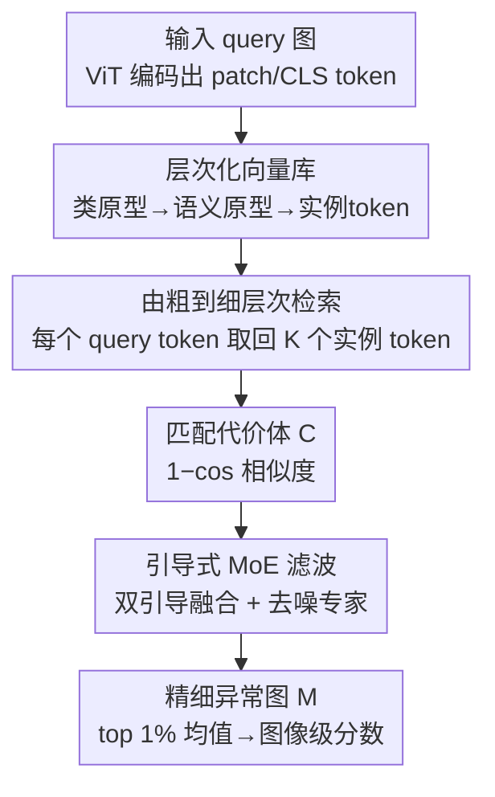

# RAID: Retrieval-Augmented Anomaly Detection

**会议**: CVPR 2026  
**论文**: [CVF Open Access](https://openaccess.thecvf.com/content/CVPR2026/html/Cai_RAID_Retrieval-Augmented_Anomaly_Detection_CVPR_2026_paper.html)  
**代码**: https://github.com/Mingxiu-Cai/RAID  
**领域**: 异常检测  
**关键词**: 无监督异常检测, 检索增强生成, 层次化向量库, 引导式MoE, 代价体滤波

## 一句话总结
RAID 把无监督异常检测（UAD）重新解读为检索增强生成（RAG）流程：先用一个三层向量库（类原型→语义原型→实例 token）做由粗到细的检索，再用一个"引导式 MoE 滤波器"对检索得到的匹配代价体去噪，从而抑制匹配噪声、画出边界清晰的异常图，在 MVTec/VisA/MPDD/BTAD 的全样本、少样本、多数据集设定下都拿到 SOTA。

## 研究背景与动机

**领域现状**：无监督异常检测的主流是"建立测试图与正常模板的对应关系"，分两条路线——重建式（GAN/Transformer/扩散把异常区域映回正常流形，靠残差找异常）和嵌入式（把正常模板特征塞进 memory bank，query patch 去做特征匹配，如 PatchCore、AnomalyDINO）。近年又流行用视觉基础模型（DINOv2、CLIP）提供语义更丰富的特征。

**现有痛点**：无论哪条路线，"测试图 ↔ 正常模板"的匹配都不可避免地引入噪声——来自类内差异、对应不完美、模板数量有限。这种噪声在异常图上表现为模糊的异常边界、漏掉细微缺陷。CostFilter-AD 试图用一个"匹配代价滤波"插件去噪，但它构建的是全局匹配空间，既慢又受限于宿主模型给的初始异常线索。

**核心矛盾**：作者观察到，现有 UAD 方法其实只实现了 RAG 的"检索"一半——检索一个正常对照物（重建/记忆检索/师生蒸馏），然后靠特征匹配判异常；却忽略了 RAG 的"生成推理"阶段，于是检索带来的噪声没有被进一步消化，直接污染了最终异常图。

**本文目标**：把 UAD 补全成一条完整的 RAG 管线——既要高效可扩展地检索正常表示，又要在生成阶段对检索回来的多个对照物做联合推理，主动压制匹配噪声。

**核心 idea**：用 RAG 的视角重写 UAD——层次化检索负责"取回上下文相关的正常参照"，引导式 MoE 滤波负责"在生成阶段对匹配代价体去噪"，二者联合实现噪声鲁棒的异常检测与定位。

## 方法详解

### 整体框架

RAID 把整个 UAD 抽象成一个公式 $M = G(\{p_Q\}, R(\{p_Q\}, D))$：输入 query 图像先经预训练 ViT（DINOv2-s）编码成 patch token $\{p_Q\}$ 和 CLS token $c_Q$；$R(\cdot)$ 在层次化向量库 $D$ 上做由粗到细的检索，给每个 query token 取回最相关的模板实例 token；$G(\cdot)$ 则把 query 与检索结果配成一个匹配代价体，用引导式 MoE 滤波器去噪，生成精细的异常图 $M$。整条管线分两大阶段：**检索阶段**（建库 + 层次检索）和**生成阶段**（代价体 + 引导式 MoE 滤波）。

### 关键设计

**1. 层次化向量库：用"类原型→语义原型→实例 token"三级结构换掉平铺式 memory bank**

现有嵌入式方法用的是 flat 结构——每个 query patch 在一个巨大的 memory bank 里全局搜最相似的对应物，库一大就又慢又难泛化到没见过的类别，少样本时还对噪声模板极度敏感。RAID 把模板 token 组织成三层实体来同时兼顾类间可区分性和类内表征丰富度。最顶层**类原型** $\{\bar c\}$ 是对所有模板 CLS token 做 K-means 得到的类中心 $\{\bar c\}=\mathrm{KMeans}(\{c_T^n\}_{n=1}^N)$，编码类别级语义，因此能做"类别无关、数据集无关"的检索，给多数据集 UAD 提供可扩展性。中间层**语义原型** $\{\bar s\}_c$ 是在每个类内对 patch token 做 K-means（论文设每类 50 个）得到的簇心，捕捉类内反复出现的纹理、结构件、背景等模式。最底层**实例 token** $\{t\}_{c,j}$ 则按"类→语义原型"的索引流把原始 patch token 全部存下，保留细粒度视觉细节供像素级匹配。三层串成索引流 $\{\bar c\}\to\{\bar s\}\to\{\bar t\}$，让后面的检索可以一级级收窄。

**2. 由粗到细的层次检索：把全局搜索拆成三级 top-K，5× 提速且精度不掉**

有了三层库就能做 coarse-to-fine 检索，逐级缩小搜索空间。顶层用 query 的 CLS token 和类原型比余弦相似度，取 top-1 估出输入类别 $\hat c = \arg\max_c \mathrm{sim}(c_Q, \bar c_c)$；中层让每个 query patch token $p_Q$ 在该类的语义原型集里检索 top-$K'$（论文 $K'=5$）个最近语义原型；底层再让 $p_Q$ 在这些语义原型挂着的实例 token 集里检索 top-$K$（论文 $K=150$）个最相似实例 token。其中每个 patch token 在 $K'$ 个语义原型里只保留最相关的一个。这样遍历完所有 query token，就为每张图准备好 $H'\times W'\times 1$ 个语义原型和 $H'\times W'\times K$ 个模板 token。相比 flat 检索，层次结构既降低了代价体的匹配维度又保住了语义保真度——消融里 hierarchical 比 flat 单图延迟低约 5×（0.052s vs 0.267s），而 I-/P-AUROC 几乎一致（99.4%/98.6%）。

**3. 匹配代价体 + 引导式 MoE 滤波：把 RAG 的"生成"阶段做成对代价体的自适应去噪**

检索虽然取回了模板 token，但也带进了来自不可靠匹配、空间错位、域偏移的"幻觉噪声"，会模糊异常边界、淹没细微缺陷。RAID 把 RAG 的生成阶段重写成"基于滤波的生成推理"。先对每个 query token 和它检索回的实例 token 算 patch 级代价 $C_{y,x,k}=1-\mathrm{sim}(p_Q^{(y,x)}, t^{(y,x),k})$，得到 3D 异常代价体 $C\in\mathbb{R}^{H'\times W'\times K}$（相似度越低越像异常）；由于层次检索只挑了少量高相关候选，这个代价体比 CostFilter-AD 的全局匹配空间紧凑得多，因此推理更快。然后用**两阶段引导式 MoE 滤波器**精修这个代价体。第一阶段做**双引导融合**：把语义原型重排成图状的原型引导图 $g_s$、query token 重排成 $g_Q$，一个卷积 router 对 $\mathrm{cat}(g_Q,g_s)$ 算稀疏路由、只激活 top-k 个引导专家，聚合出融合引导 $\tilde g=\sum_i \tilde p_i E_g^i(\mathrm{cat}(g_Q,g_s))$。第二阶段做**引导滤波**：另一组去噪专家被 router 稠密激活，每个专家 $E_C^i$ 在融合引导 $\tilde g$ 下对代价体 $C$ 做双分支滤波——一条 cross-attention 分支（$\tilde g$ 当 query、$C$ 当 key/value）提供全局感知，一条卷积分支精修局部响应——最后稠密加权汇总成异常图 $M=\sum_i p_i\cdot \tilde C_i$。检索来的语义先验是类别/数据集无关的，注入到动态激活的 MoE 里，让滤波器专注于"匹配代价去噪"并学到类别无关的异常表示，这正是它在未见类别上少样本泛化强的来源。

### 损失函数 / 训练策略

采用 UAD 常用的自监督策略：合成异常图像 + 对应合成掩码 $M_s$。总损失 $L = L_{\text{focal}}(M, M_s) + \lambda_{\text{bal}} L_{\text{bal}}$，其中 focal loss 处理正常/异常像素的极端不平衡，$L_{\text{bal}}$ 正则化专家路由防止偏向主导专家、避免 router collapse，$\lambda_{\text{bal}}=0.005$。推理时图像级分数取异常图 $M$ 中 top 1% 最高响应的均值，像素级定位直接用 $M$。训练 100 epoch、Adam、初始学习率 $1\times10^{-4}$，全样本/多数据集输入 256×256，少样本输入 224×224。

## 实验关键数据

### 主实验

四个工业异常检测基准（MVTec-AD、VisA、MPDD、BTAD），全样本多类 UAD 设定下的图像级/像素级 AUROC（%）：

| 数据集 | 指标 | RAID | CostFilter-AD | AnomalyDINO | GLAD |
|--------|------|------|---------------|-------------|------|
| MVTec-AD | I-AUROC / P-AUROC | **99.4 / 98.6** | 99.0 / 98.0 | 96.8 / 98.1 | 97.5 / 97.3 |
| MVTec-AD | 像素级 AP | **71.7** | 58.1 | 61.3 | 58.8 |
| VisA | I-AUROC / P-AUROC | **94.9 / 99.0** | 93.4 / 98.6 | 90.5 / 97.5 | 90.1 / 97.4 |
| MPDD | I-AUROC / P-AUROC | **96.3 / 98.9** | 93.1 / 97.5 | — | 90.8 / 98.0 |
| BTAD | 像素级 AP | **67.3** | 47.0 | — | — |

像素级 AP 提升尤为夸张（MVTec 上 58.1→71.7），说明引导式滤波在"精细边界 + 细微异常"上的优势。少样本（在 MPDD 上训练、迁移到 MVTec/VisA，5 seed 平均 I-/P-AUROC）：

| 设定 | 数据集 | RAID | IIPAD | PromptAD | Win-CLIP |
|------|--------|------|-------|----------|----------|
| 1-shot | MVTec-AD | **95.1 / 96.6** | 94.2 / 96.4 | 93.0 / 95.2 | 92.6 / 91.6 |
| 2-shot | MVTec-AD | **96.6 / 97.1** | 95.7 / 96.7 | 95.4 / 95.6 | 93.8 / 91.9 |
| 4-shot | VisA | 89.3 / **98.2** | 88.3 / 97.4 | 87.5 / 97.9 | 85.7 / 96.0 |

值得注意：RAID 是纯图像（不用语言先验），且输入分辨率比 FastRecon/Win-CLIP 更低，仍超出。多数据集（一个模型联合训 4 个库，36 类，I-AUROC/I-AP/P-AUROC/P-AP）：RAID 总均值 **95.4 / 96.7 / 98.5 / 57.0** vs OneNIP 的 92.0 / 94.7 / 97.9 / 48.9，且从多类设定切到多数据集统一设定几乎不掉点。

### 消融实验

引导式 MoE 滤波器各组件（MVTec-AD，I-/P-AUROC）：

| ID | 配置 | I-/P-AUROC | 说明 |
|----|------|-----------|------|
| 0 | 仅检索 | 97.9 / 97.5 | 不滤波的基线 |
| 1 | +Cross-Att.+RouterC | 98.5 / 97.6 | 第二阶段交叉注意力分支 |
| 2 | +一阶段 MoEg | 99.2 / 98.4 | 双引导融合贡献最大 |
| 6 | 去掉 RouterC | 98.0 / 97.5 | 无稀疏路由→专家不再专精，掉点 |
| 7 | Full | **99.4 / 98.6** | 完整模型 |

检索策略对比（MVTec-AD）：flat 检索单图 0.267s、I-/P-AUROC 99.4/98.7；hierarchical 检索单图 0.052s、99.3/98.7——精度持平但快约 5×。专家数 $(E_g, E_C)$ 在 $(3,3)$ 时最佳（99.4/98.6），过多（4,3）或减少引导多样性（2,3）都掉点，体现"容量-专精"权衡。

### 关键发现
- **双引导融合（一阶段 MoEg）是滤波器里贡献最大的一块**：ID1→ID2 一步把 I-AUROC 从 98.5 抬到 99.2，说明"用语义原型+query 双重引导来定向去噪"比单纯交叉注意力更管用。
- **稀疏路由不可少**：去掉 RouterC（ID6）直接掉回 98.0/97.5，稀疏激活是保住专家专精、防 router collapse 的关键。
- **模板"相关性"比"数量"更重要**：每类模板从 20 增到 80 时性能从 98.1/97.7 升到 99.4/98.6，但用"全部"模板反而轻微回落到 99.3/98.6，说明层次检索把候选压成干净代价体后，相关性才是主导因素。

## 亮点与洞察
- **把 UAD 套进 RAG 框架是个很顺的重述**：作者指出现有重建/记忆/蒸馏方法都只是 RAG 的"检索"半截，缺了"生成推理"，于是补上一个对代价体去噪的生成阶段——这个视角既解释了为什么旧方法噪声大，又自然导出了方法设计。
- **层次化检索同时解决"准"和"快"**：三级 top-K 把全局搜索压成小候选集，既降低代价体维度（让滤波更轻），又把单图延迟降 5×，这种"用结构换效率、效率反哺精度"的设计可迁移到任何大 memory bank 的检索任务。
- **"对匹配代价体做 MoE 去噪"而非"对图像做重建"**：把生成阶段定位成对 cost volume 的滤波，比直接生成正常图更聚焦噪声本身，像素级 AP 的大幅提升正来自这里。

## 局限与展望
- 检索/匹配仍依赖 DINOv2 特征的质量，对预训练编码器域外的工业纹理（如反光金属、透明件）是否稳健，论文未单独压力测试。
- 引入了双阶段 MoE，FLOPs（14.2G）和显存（6.5GB）明显高于 PatchCore（7.12G/3.46GB），是用算力换精度；轻量化部署需进一步压缩。
- 多个超参（每类语义原型 50、$K'=5$、$K=150$、专家数 3/3）按 MVTec 调到最优，跨域时这些设定的敏感性论文只给了少量分析。⚠️ 部分细粒度 MoE 结构在正文外的 Appendix，本笔记据正文描述整理。
- 作者展望把 RAG 范式推向"智能体式 / 跨模态"异常检测，做更可解释、可扩展、数据高效的工业智能。

## 相关工作与启发
- **vs CostFilter-AD**: 二者都做"匹配代价滤波"，但 CostFilter-AD 在全局匹配空间上滤波、且受宿主模型初始线索限制；RAID 先用层次检索把候选压成紧凑代价体再滤，既快又不依赖宿主，像素级 AP 大幅领先（MVTec 58.1→71.7）。
- **vs PatchCore / AnomalyDINO**: 它们是纯检索（flat memory bank）+特征匹配判异常，没有生成阶段消化检索噪声；RAID 补上引导式 MoE 生成推理，且用层次库替掉平铺库，多类大库下又快又准。
- **vs Win-CLIP / PromptAD**: 这两者靠语言/文本先验做少样本；RAID 纯图像、低分辨率仍超出，说明结构化视觉检索 + 代价体去噪本身就足够强的迁移泛化。
- **vs ADSeeker**: ADSeeker 把异常分析做成视觉-语言问答、用 MLLM 生成文本异常描述；RAID 针对纯视觉、像素级输出的 UAD，不依赖文本，定位在"准+快"的平衡上。

## 评分
- 新颖性: ⭐⭐⭐⭐⭐ 用 RAG 视角统一重述 UAD 并补全"生成推理"阶段，角度新且自洽。
- 实验充分度: ⭐⭐⭐⭐⭐ 四基准 × 全样本/少样本/多数据集三设定，消融覆盖检索策略、模板量、MoE 各组件、专家数。
- 写作质量: ⭐⭐⭐⭐ RAG 类比讲得清楚，但 MoE 细节部分压进 Appendix，正文略紧凑。
- 价值: ⭐⭐⭐⭐⭐ 工业异常检测多设定全面 SOTA，层次检索+代价体去噪的思路可复用性强。

<!-- RELATED:START -->

## 相关论文

- [\[NeurIPS 2025\] Video-RAG: Visually-aligned Retrieval-Augmented Long Video Comprehension](../../NeurIPS2025/object_detection/video-rag_visually-aligned_retrieval-augmented_long_video_comprehension.md)
- [\[CVPR 2026\] WeDetect: Fast Open-Vocabulary Object Detection as Retrieval](wedetect_fast_open-vocabulary_object_detection_as_retrieval.md)
- [\[AAAI 2026\] CASL: Curvature-Augmented Self-supervised Learning for 3D Anomaly Detection](../../AAAI2026/object_detection/casl_curvature-augmented_self-supervised_learning_for_3d_anomaly_detection.md)
- [\[CVPR 2026\] Beyond Caption-Based Queries for Video Moment Retrieval](beyond_caption-based_queries_for_video_moment_retrieval.md)
- [\[CVPR 2026\] Beyond Semantic Search: Towards Referential Anchoring in Composed Image Retrieval](beyond_semantic_search_towards_referential_anchoring_in_composed_image_retrieval.md)

<!-- RELATED:END -->
