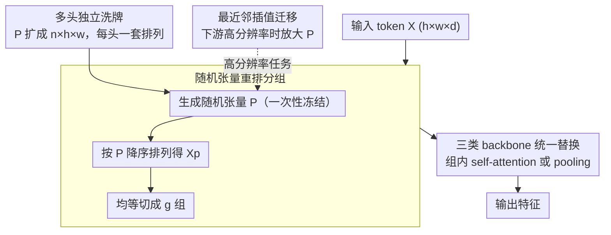

# Random Wins All: Rethinking Grouping Strategies for Vision Tokens

**会议**: CVPR 2026  
**arXiv**: [2603.00486](https://arxiv.org/abs/2603.00486)  
**作者**: Qihang Fan, Yuang Ai, Huaibo Huang, Ran He (中科院自动化所)
**代码**: [GitHub](https://github.com/qhfan/random)  
**领域**: 3D视觉  
**关键词**: Vision Transformer, Token分组, 随机分组, 注意力机制, 效率优化

## 一句话总结

提出极简的随机分组策略替代 Vision Transformer 中各种精心设计的 token 分组方法，在图像分类、目标检测、语义分割、点云分割和 VLM 上几乎全面超越所有 baseline，并从位置信息、头特征多样性、全局感受野和固定分组模式四个维度解释了随机分组成功的原因。

## 研究背景与动机

- **已有方法的困境**: Transformer 的自注意力机制具有 $O(n^2)$ 二次复杂度，Vision Token 分组是降低复杂度的主流方案。从简单的窗口分区（Swin Transformer）到语义感知的树结构分组（Quadtree）、双层路由分组（BiFormer），分组策略设计越来越复杂，但推理效率不断下降。
- **核心疑问**: 这些精心设计的分组方法真的有必要吗？复杂的聚类和路由操作严重影响部署效率，而性能提升是否来源于分组策略本身？
- **反直觉发现**: 一个极简的随机分组策略——仅对 token 做随机排列再等分——几乎在所有任务和所有 baseline 上都能超越原有的复杂分组方法，同时推理速度更快。
- **解决方案**: 提出 Random Grouping Strategy，并深入分析为何如此简单的方法能成功，总结出分组策略设计的四个关键要素。

## 方法详解

### 整体框架

这篇论文想回答一个很朴素的问题：Vision Transformer 里那些越做越花哨的 token 分组（窗口、四叉树、双层路由）到底有没有必要？它给出的答案近乎挑衅——把 token 随机打乱再等分成组，就足以打败所有精心设计的分组方案。整条流程因此短到只剩三步：先生成一个随机张量、按它把 token 重排、再把重排后的序列均等切成若干组，组内照常做 self-attention 或 pooling。关键在于这个随机张量一旦生成就被冻结，所有图像、所有训练步都用同一套打乱顺序，于是分组模式既"随机"又"固定"。其余三处设计都是围绕这个核心展开：用多头独立洗牌让每个注意力头看到不同的全局组合，用最近邻插值把固定尺寸的随机张量迁到高分辨率下游任务，再以统一的替换方式插进三类 backbone（plain / partition-based / pooling-based）。正因为不依赖任何聚类或路由，它能即插即用地替换 Swin、CSwin、Quadtree、BiFormer、PVTv2、Focal 等 backbone 里的分组模块，也能直接迁到点云和 VLM 上。

### 关键设计

**1. 随机张量重排分组：用一次性洗牌打碎所有局部偏置**

之前的分组方法都在小心翼翼地保留空间局部性（相邻 token 进同一窗口），而局部窗口恰恰把感受野困死了。这里反其道而行：对输入 $X \in \mathbb{R}^{h \times w \times d}$，先采样一个与之空间一一对应的随机张量 $P \in \mathbb{R}^{h \times w}$，按 $P$ 的值对 token 降序排列得到重排序列 $X_p$，再把 $X_p$ 均等切成若干组。由于排序是随机的，同一组里的 token 来自图像上互不相邻的位置，组内注意力天然就有了全局视野，而代价只是一个排序操作。注意 $P$ 在初始化后就被存下来固定不变——所有图像沿用同一顺序，模型才能在稳定的分组结构上学到可复用的特征，而不是每次都面对一套新的随机排列。

**2. 多头独立洗牌：让每个注意力头看到不同的全局组合**

如果所有头共用同一个 $P$，那么每个头看到的分组完全一样，多头注意力的多样性优势就被浪费了。作者把随机张量从 $h \times w$ 扩成 $n \times h \times w$（$n$ 为头数），给每个头配一套独立的随机排列，于是同一层里不同头会把全局 token 揉成不同的组合。这一步不是锦上添花——消融里把所有头退回共享单一 $P$，Random-Swin-T 直接从 82.7% 掉到 80.5%，说明"每个头各自洗牌"本身就是性能的重要来源。

**3. 最近邻插值迁移：把固定尺寸的 $P$ 搬到高分辨率下游任务**

$P$ 的尺寸在分类预训练时被钉死成 $h \times w$，可检测（800×1333）、分割（512×512）的输入分辨率要大得多，固定的 $P$ 盖不住。解决办法是用最近邻插值把 $P$ 拉伸到目标分辨率。之所以坚持最近邻而不用双线性，是因为分组的本质是离散指派——每个 token 该进哪组是个整数标签，线性插值会把相邻位置的标签平滑成中间值，反而模糊了分组边界，而最近邻原样复制标签，保住了排列的离散结构。

**4. 三类 backbone 统一替换：证明随机分组是架构无关的通用件**

为了说明随机分组不是只对某一种结构管用，作者把现有 backbone 归成三类，各给一套统一的替换方式。对 Plain backbone（如 DeiT），直接在全局 token 上套随机分组，组内做 self-attention，把原本 $O(n^2)$ 的全局注意力降到组内 $O((n/g)^2)$（$g$ 为组数）；对 Partition-based backbone（如 Swin、CSwin、BiFormer），把原有的窗口划分或双层路由整段换成随机分组；对 Pooling-based backbone（如 PVTv2、Focal），则替换 token pooling 之前的空间分组。三类都只动"怎么分组"这一步、不碰其余结构，却普遍涨点又提速，恰好坐实了随机分组是一个可插拔的通用组件。

## 实验关键数据

### 主实验：ImageNet-1K 图像分类

| 模型 | Params (M) | FLOPs (G) | 吞吐量 (img/s) | Top-1 Acc (%) |
|------|-----------|-----------|---------------|---------------|
| DeiT-T | 6 | 1.3 | 6433 | 72.2 |
| **Random-DeiT-T** | 6 | 1.1 | 6682 | **73.1 (+0.9)** |
| DeiT-S | 22 | 4.6 | 3122 | 79.8 |
| **Random-DeiT-S** | 22 | 4.3 | 3313 | **80.9 (+1.1)** |
| DeiT-B | 87 | 17.6 | 1226 | 81.8 |
| **Random-DeiT-B** | 87 | 17.0 | 1348 | **82.5 (+0.7)** |
| Swin-T | 28 | 4.5 | 1738 | 81.3 |
| **Random-Swin-T** | 28 | 4.5 | 1866 | **82.7 (+1.4)** |
| Swin-S | 50 | 8.7 | 1186 | 83.0 |
| **Random-Swin-S** | 50 | 8.7 | 1248 | **83.9 (+0.9)** |
| Swin-B | 88 | 15.4 | 864 | 83.5 |
| **Random-Swin-B** | 88 | 15.4 | 902 | **84.4 (+0.9)** |
| Quadtree-b2 | 24 | 4.5 | 467 | 82.7 |
| **Random-Quadtree-b2** | 21 | 4.3 | 1926 | **83.4 (+0.7)** |
| BiFormer-B | 57 | 9.8 | 544 | 84.3 |
| **Random-BiFormer-B** | 57 | 9.6 | 667 | **85.1 (+0.8)** |
| PVTv2-B2 | 25 | 4.0 | 1663 | 82.0 |
| **Random-PVTv2-B2** | 21 | 4.2 | 1678 | **82.7 (+0.7)** |
| Focal-B | 90 | 16.0 | 248 | 83.8 |
| **Random-Focal-B** | 88 | 15.5 | 887 | **84.5 (+0.7)** |

### 主实验：COCO 目标检测与实例分割

| Backbone | Mask R-CNN AP^b | AP^m | RetinaNet AP^b |
|----------|----------------|------|----------------|
| Swin-T | 43.7 | 39.8 | 41.7 |
| **Random-Swin-T** | **46.0 (+2.3)** | **41.9 (+2.1)** | **44.3 (+2.6)** |
| Swin-S | 45.7 | 41.1 | 44.5 |
| **Random-Swin-S** | **48.0 (+2.3)** | **43.2 (+2.1)** | **46.6 (+2.1)** |
| Swin-B | 46.9 | 42.3 | 45.0 |
| **Random-Swin-B** | **49.1 (+2.2)** | **44.6 (+2.3)** | **47.4 (+2.4)** |
| PVTv2-B2 | 45.3 | 41.2 | 44.6 |
| **Random-PVTv2-B2** | **47.1 (+1.8)** | **42.4 (+1.2)** | **46.0 (+1.4)** |

### 主实验：ADE20K 语义分割

| 模型 | UperNet 160K mIoU (%) |
|------|-----------------------|
| Swin-T | 44.5 |
| **Random-Swin-T** | **46.8 (+2.3)** |
| Swin-S | 47.6 |
| **Random-Swin-S** | **48.9 (+1.3)** |
| CSwin-B | 51.1 |
| **Random-CSwin-B** | **52.2 (+1.1)** |
| BiFormer-B | 51.0 |
| **Random-BiFormer-B** | **52.0 (+1.0)** |

### 消融实验：四个关键因素

| 消融项 | 模型 | Acc (%) | 变化 |
|--------|------|---------|------|
| **位置信息** | Random-Swin-T | 82.7 | - |
| 　去除 PE | Random-Swin-T w/o PE | 79.3 | **-3.4** |
| 　对比: Swin-T w/o PE | - | 80.1 | -1.6 |
| **头特征多样性** | Random-Swin-T (多 P) | 82.7 | - |
| 　所有头共享单一 P | Random-Swin-T (单 P) | 80.5 | **-2.2** |
| **全局感受野** | Random-Swin-T (全局) | 82.7 | - |
| 　限制为局部区域 | Random-Swin-T (区域) | 81.5 | **-1.2** |
| **固定分组模式** | Random-Swin-T (固定 P) | 82.7 | - |
| 　每张图用不同 P | Fully Random Swin-T | 76.4 | **-6.3** |

### 消融实验：从完全随机到 Random-Swin 的路线图

| 配置 | 吞吐量 (img/s) | Acc (%) |
|------|---------------|---------|
| Fully Random (单 P) | 1922 | 71.2 |
| + 固定分组模式 | 1922 | 77.6 (+6.4) |
| + 多头独立 P | 1917 | 80.1 (+2.5) |
| + CPE 位置编码 | 1866 | 82.7 (+2.6) |
| Swin-T (对比) | 1738 | 81.3 |

### 关键发现

1. **随机分组全面优于精心设计方法**: 在 3 类 backbone × 6+ 架构 × 5 个任务上，随机分组几乎无一例外地超越原始分组策略，同时推理速度更快
2. **下游任务增益更大**: 在 COCO 检测上 Random-Swin-T 的增益高达 +2.3 AP^b 和 +2.6 RetinaNet AP^b，远超分类任务的 +1.4%
3. **速度优势显著**: Random-Quadtree-b2 吞吐量 1926 img/s vs 原 Quadtree-b2 的 467 img/s，速度提升 4.1 倍，同时精度 +0.7%
4. **固定模式是最关键因素**: Fully Random（每图不同 P）导致 -6.3% 的灾难性下降，说明模型需要一致的分组模式来学习稳定特征
5. **多模态泛化**: 在 Point Transformer v3 上降低延迟 23%（88ms→68ms）同时 mIoU +0.2；在 LLaVA-1.5/1.6 上所有 benchmark 均提升

## 亮点与洞察

- **反直觉但深刻的发现**: 精心设计的分组策略不如随机分组，颠覆了"越复杂越好"的惯性思维。核心贡献不仅是方法本身，更是对分组策略设计空间的深刻理解
- **四因素分析的指导意义**: 位置信息、头多样性、全局感受野和固定模式四要素为未来 Transformer 效率优化提供了清晰的设计准则
- **极致简洁的工程价值**: 无需聚类/路由/树结构等复杂操作，仅排序+切分，部署友好，适合工业落地
- **路线图实验设计精巧**: Tab.10 的渐进式消融完美展示了从完全随机（71.2%）到逐步加入关键因素最终超越 Swin-T（82.7% vs 81.3%）的过程

## 局限性

- 随机分组在已具备全局感受野的架构（如 CSwin）上增益较小（CSwin-T 仅 +0.4%），说明其优势主要来自全局感受野和头多样性的增强
- 固定随机张量的形状依赖于训练分辨率，迁移到大分辨率需要插值，可能损失部分随机性质量
- 论文未讨论随机种子的敏感性，不同随机初始化是否导致性能方差

## 相关工作与启发

- **Swin Transformer** [ICCV 2021]: 窗口分组的代表方法，被随机分组全面超越，说明局部窗口并非最优选择
- **BiFormer** [CVPR 2023]: 双层路由分组，复杂度高但被简单随机方法超越，揭示了"过度设计"的问题
- **Point Transformer v3** [CVPR 2024]: 点云场景中的分组策略也可被随机分组替代，揭示了跨模态的普适性

## 评分

| 维度 | 评分 (1-10) | 说明 |
|------|------------|------|
| 新颖性 | 9 | 极简但反直觉的发现，挑战了整个 token 分组方向 |
| 技术深度 | 8 | 四因素分析深入系统，消融实验设计精巧 |
| 实验充分度 | 9 | 6 类 backbone、5 个任务、3 种模态的全面验证 |
| 写作质量 | 8 | 逻辑清晰，从现象到解释层层推进 |
| 实用价值 | 9 | 即插即用，部署友好，工程价值极高 |
| **总分** | **8.6** | 以极简方法挑战复杂设计的范式性工作 |

<!-- RELATED:START -->

## 相关论文

- [\[CVPR 2026\] VisualAD: Language-Free Zero-Shot Anomaly Detection via Vision Transformer](visualad_language-free_zero-shot_anomaly_detection_via_vision_transformer.md)
- [\[CVPR 2026\] Mining Instance-Centric Vision-Language Contexts for Human-Object Interaction Detection](mining_instance-centric_vision-language_contexts_for_human-object_interaction_de.md)
- [\[CVPR 2026\] AnomalyVFM -- Transforming Vision Foundation Models into Zero-Shot Anomaly Detectors](anomalyvfm_--_transforming_vision_foundation_models_into_zero-shot_anomaly_detec.md)
- [\[CVPR 2025\] Boosting Domain Incremental Learning: Selecting the Optimal Parameters Is All You Need](../../CVPR2025/object_detection/boosting_domain_incremental_learning_selecting_the_optimal_parameters_is_all_you.md)
- [\[CVPR 2026\] Saliency-R1: Enforcing Interpretable and Faithful Vision-language Reasoning via Saliency-map Alignment Reward](saliency-r1_enforcing_interpretable_and_faithful_vision-language_reasoning_via_s.md)

<!-- RELATED:END -->
