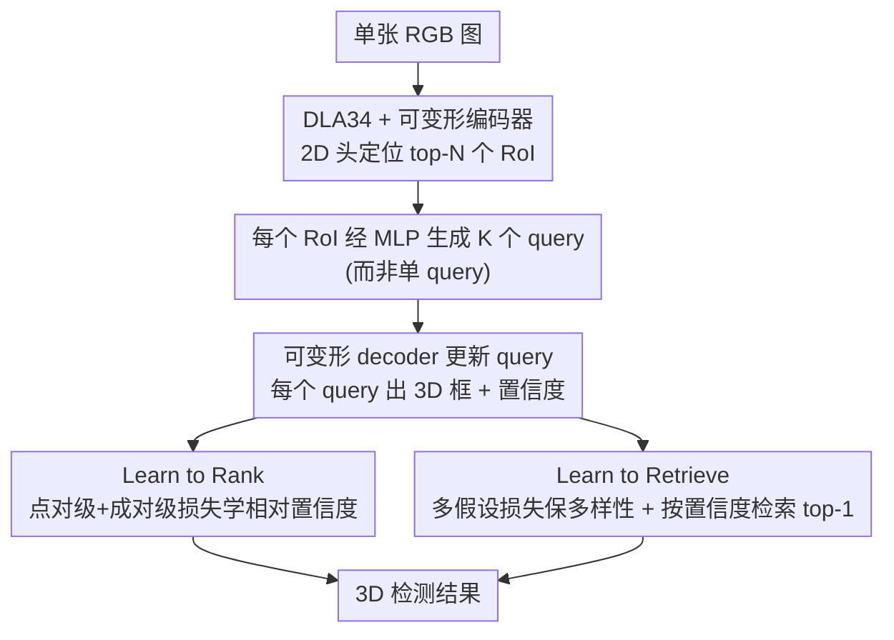

# RARE: Learn to RAnk and REtrieve for Monocular 3D Object Detection

**会议**: CVPR 2026  
**论文**: [CVF Open Access](https://openaccess.thecvf.com/content/CVPR2026/html/Park_RARE_Learn_to_RAnk_and_REtrieve_for_Monocular_3D_Object_CVPR_2026_paper.html)  
**代码**: https://github.com/HyeonjeongPark37/RARE  
**领域**: 目标检测 / 3D视觉  
**关键词**: 单目3D检测, 置信度估计, learning-to-rank, 多假设, query set

## 一句话总结
RARE 用"排序 + 检索"两个机制统一解决单目 3D 检测的两大顽疾：把置信度估计从回归绝对分改成**学相对排序**，再为每个物体构造一组 query 预测多个合理的 3D 假设、按学到的置信度**检索**出最优解，在 KITTI / nuScenes 上超过一众单目 SOTA。

## 研究背景与动机
**领域现状**：单目 3D 检测从一张 RGB 图推断物体的 3D 框、类别和置信度，是自动驾驶/机器人里低成本易部署的方案。其中分类基本已被解决（KITTI 车辆 2D mAP 已 >90%），真正难的是 **3D 定位**和**置信度估计**。

**现有痛点**：① 定位本质是病态的——同一个 2D 观测可以对应多个合理的 3D 配置，即便加了几何约束也还原不出唯一解；现有方法对每个物体只回归**一个确定的 3D 框**，结果常常坍缩到一个"谁都不像"的均值估计（mean-collapsing）。② 置信度普遍是**回归绝对分**（用分类分、深度不确定性或 3D 框质量），但诊断研究和作者自测都表明这些分数与真实定位精度严重错位。

**核心矛盾**：作者点出两个根因。其一，绝对置信度数值**极不稳定**——单目里深度/朝向的微小误差就能让真实置信度剧烈变化，所以回归绝对值天生学不稳。其二，单点回归与 3D 定位的**多峰本质**冲突——面对"一个 2D 对多个 3D"的歧义，单点预测只能取条件均值。论文给了量化：KITTI 焦距 $f\approx721.54$、车高 $H\approx1.5$m 时，1 像素的高度变化在 20/30/40m 处分别引起约 0.36/0.81/1.43m 的深度变化，距离越远歧义越大。

**本文目标**：同时改造置信度估计和 3D 定位，让前者稳健、后者能表达多峰。

**切入角度**：既然绝对分不稳，就只学**相对顺序**（排序对定位误差远不敏感）；既然单点会坍缩到均值，就**显式预测一组多样且合理的假设**再挑最好的。

**核心 idea**：把单目 3D 检测重述为"learn to rank（学排序得到稳健置信度）+ learn to retrieve（学检索从多假设里挑最优）"，二者塞进同一个 detection transformer 端到端训练。

## 方法详解

### 整体框架
给一张 RGB 图，DLA34 backbone 提多尺度特征 → 多尺度可变形自注意力编码器；同时一个 2D 头预测 centerness/2D 尺寸/偏移热图来定位 RoI，按 centerness 留 top-N 个 RoI。每个 RoI 用 RoI Align 取特征，经 MLP 生成 **K 个 query**（而非传统的 1 个），可变形 transformer decoder 更新这组 query，每个更新后的 query 预测一个候选 3D 框和置信度。两大机制嵌在其中：**learning to rank** 用点对级 + 成对级损失把置信度学成相对排序信号；**learning to retrieve** 用多假设损失让这 K 个 query 既多样又合理，推理时按置信度检索 top-1。

### 关键设计

**1. Learning to Rank：把置信度从"回归绝对值"改成"学相对排序"**

针对绝对置信度不稳的痛点，RARE 不再去拟合精确的置信度数值，而是学**检测之间的相对优劣**。先定义每个检测的真值置信度为它与同类真值框的最大 3D IoU：$\hat{c}_i = \max_j \delta(y_i=\hat{y}_j)\,\text{IoU}_\text{3D}(b_i,\hat{b}_j)$（$\delta$ 为指示函数）。排序损失由两项组成 $L_\text{rank}=\ell_\text{point}+\ell_\text{pair}$：**点对级** $\ell_\text{point}=\frac{1}{|D|}\sum_i (c_i-\hat{c}_i)^2$ 让预测置信度与真值对齐、锚定全局标定（提供绝对量纲）；**成对级**先取偏好标签 $\hat{r}_{i,j}=\text{sign}(\hat{c}_i-\hat{c}_j)\in\{-1,+1\}$，再用 logistic 损失 $\ell_\text{pair}=\frac{1}{|P|}\sum_{(i,j)\in P}\log(1+\exp(-\hat{r}_{i,j}(z_i-z_j)))$ 强制"质量高的检测得分更高"、细化局部排序（$z_i$ 是未归一化的置信 logit）。两项缺一不可：只用成对级会收敛慢、分数不可解释，只用点对级则排序一致性（Spearman）偏弱；联合起来点对级定量纲、成对级磨排序。这和 2D 里把样本硬分正/负再优化分离的排序损失不同——RARE **不预设 IoU 阈值、不分正负集**，而是让分数直接编码竞争预测的相对质量，从而支撑后续检索。

**2. Learning to Retrieve：为每个物体造一组假设、检索最优解**

针对单点回归坍缩到均值的痛点，RARE 给每个 RoI 用 MLP 生成 $K$ 个 query $\{q_{i,1},\dots,q_{i,K}\}=\text{MLP}(F^\text{RoI}_i)$，每个 query 经 decoder 各预测一个候选 3D 框 $b_{i,k}=(x_{i,k},d_{i,k},s_{i,k},\theta_{i,k})$ 和置信度 $c_{i,k}$，这 $K$ 个框代表该物体的 $K$ 种可能空间配置。训练用 **3D 框多假设损失**让这组假设既贴真值又保持多样：把 K 个置信 logit 过 softmax 得 $\{p_{i,k}\}$，$L_\text{3D}=\frac{1}{M}\sum_i\sum_k p_{i,k}\ell_\text{box}(b_{i,k},\hat{b}_i)+\sum_k|\bar{p}_k-\tfrac{1}{K}|$。第一项按选择概率软加权地把各假设拉向真值（自信的拉得紧、不确定的轻推），第二项以 batch 内平均选择概率 $\bar{p}_k=\frac{1}{M}\sum_i p_{i,k}$ 对均匀先验的偏离做正则，**防止概率质量坍缩到少数几个假设**、逼出多样性。推理时直接检索每个 RoI 里置信度最高的那个：$k^*=\arg\max_k c_{i,k}$。消融显示这第二个正则项是关键——只加 retrieval 而不加多样性正则，模型仍会让单个 query 主导；加上后 AP3D 才显著提升，说明"单纯增加 query 数量不够，必须有检索感知监督 + 多样性正则"才能把多个候选变成互补的 3D 假设。论文还观测到学到的假设深度跨度（如 40m 处 0.45×3≈1.35m）恰好匹配像素量化引起的深度歧义（≈1.43m），即假设自适应地覆盖了成像本身的不确定性。

### 损失函数 / 训练策略
端到端总损失 $L_\text{all}=\lambda_\text{2D}L_\text{2D}+\lambda_\text{3D}L_\text{3D}+\lambda_\text{rank}L_\text{rank}$，其中 $L_\text{2D}$ 是 2D 热图的 MSE。超参 $\lambda_\text{2D}=\lambda_\text{3D}=1$，$\lambda_\text{rank}$ 对 $\ell_\text{point}$ 取 10、对 $\ell_\text{pair}$ 取 0.5；K=3，RoI 池化 7×7，3 层编码器 + 3 层解码器、8 头、隐维 256。用 HTL 分层任务学习 + 线性 warm-up，配 MixUp3D 与 DivAlign 增广，Adam（lr=0.001）训 800 epoch，2×A100。推理丢弃 2D 分 <0.2 的检测，**不做 NMS**。

## 实验关键数据

> 指标说明：**AP3D|40 / APBEV|40** 为 40 个召回点下的 3D / 俯视框平均精度（Car IoU=0.7，行人/骑车人 0.5）；**Pearson / Spearman** 衡量预测置信度与真值置信度的线性 / 排序相关性（越高越好）；**深度 MAE** 为预测深度与真值的平均绝对误差（越低越好）。

### 主实验

| 数据集/类别 | 指标 | 之前最好(单目) | RARE | 相对提升 |
|------|------|------|------|------|
| KITTI test / Car | AP3D Easy/Mod/Hard | 26.35/18.72/15.97 (MonoDGP) | 28.83/19.57/17.38 | +9.4%/+4.5%/+8.8% |
| KITTI test / Car | APBEV Easy/Mod/Hard | 35.24/25.23/22.02 (MonoDGP) | 38.46/26.37/23.46 | +9.1%/+4.5%/+6.5% |
| KITTI test / Cyclist | AP3D Easy/Mod/Hard | 7.34/4.28/3.78 (MonoUNI) | 11.17/5.96/5.28 | +52%/+39%/+40% |
| nuScenes frontal val | 深度 MAE (All) | 1.26 (DEVIANT) | 1.05 | 更低更好 |

RARE 纯单目却能与用 LiDAR 辅助训练的方法（如 MonoTAKD†）掰手腕，AP3D 上还反超它 +3.3%/+0.7%/+5.3%；跨数据集（KITTI 训→nuScenes 测）深度 MAE 全距离段最优，说明学到的表示迁移性好。

### 消融实验

| 配置 | AP3D Easy/Mod/Hard | 说明 |
|------|------|------|
| Baseline (单点 + 深度不确定置信) | 24.93/19.04/16.57 | 类 MonoDETR 方案 |
| + Learn to Rank | 26.54/21.15/18.20 | 仅加排序置信度 |
| + Learn to Retrieve | 27.81/20.64/17.56 | 仅加多假设检索 |
| + Rank + Retrieve (Full) | 28.58/22.05/19.21 | 完整 RARE |

置信度学习单独拆解（Tab.5）：Baseline 的 Pearson/Spearman 仅 0.540/0.480；只用点对级 → 0.827/0.650（线性标定大涨但排序仍弱）；只用成对级 → 0.820/0.719（排序强、标定略降）；联合 → 0.825/0.754，标定与排序双优。

### 关键发现
- **排序与检索强协同**：完整模型相对 baseline 提升 14.6%/15.8%/15.9%，大于任一单项——排序损失给出可靠置信度去挑候选，检索模块供给丰富多峰假设让排序有的可挑，二者互为前提。
- **多样性正则是检索的胜负手**：朴素地给所有 query 同一真值监督只比 baseline 略好（易坍缩到几乎相同的框）；加检索感知监督再加均匀先验正则才把多个候选逼成互补假设。
- **对小/细长物体增益最大**：Cyclist 相对提升高达 39%–52%，正是因为这类物体尺度小、深度歧义大，单点回归最不可靠，而多假设 + 排序检索恰好对症。
- **更小更快还更准**：参数 32.9M（< MonoDETR 35.9M、MonoDGP 38.9M），运行时 35.3ms 仅比 MonoDETR 略增，Mod. AP3D 却最高。

## 亮点与洞察
- **把"病态问题"显式当多峰建模**：与其压一个均值，不如承认 2D→3D 的一对多本质、预测一组假设再检索——这种"多假设 + 检索"范式可迁移到深度估计、姿态估计等同样欠定的逆问题。
- **置信度"只学序不学值"**：相对排序对单目里常见的深度/朝向噪声远不敏感，比回归绝对分稳得多；点对级定量纲 + 成对级磨排序的组合很优雅，且不需要预设 IoU 阈值分正负。
- **假设跨度对齐成像歧义**：学到的多假设深度跨度自发匹配像素量化引起的深度不确定性（40m 处约 1.35m vs 1.43m），是个很漂亮的"模型自适应到几何先验"的证据。

## 局限与展望
- **K 固定为小值**：每物体只造 K=3 个假设，对极远/极歧义场景假设数是否够、K 自适应化论文未深入探讨。⚠️ K 更大时精度/开销的完整曲线未给出，具体拐点待确认。
- **依赖 2D 头与 RoI 质量**：query 由 RoI 特征生成，若 2D centerness 漏检或 RoI 偏，下游多假设也无从谈起；推理还要靠 2D 分阈值（0.2）过滤。
- **置信真值仍用 3D IoU**：排序的监督信号来自与真值框的 IoU，训练时需要 3D 框标注；对无标注或弱标注场景如何学排序未涉及。
- **改进方向**：让 K 随物体距离/歧义自适应；把检索从"逐 RoI 取 top-1"扩成考虑全局一致性的集合级检索。

## 相关工作与启发
- **vs MonoDETR / MonoDGP（DETR 系单目）**：它们仍是每个物体出单点 3D 估计、置信用深度不确定性；RARE 保留 DETR 架构但换成多 query 多假设 + 排序置信，KITTI Car Mod. 19.57 超过 MonoDGP 18.72，且更小更快。
- **vs MonoDIS / PL（置信度代理）**：MonoDIS 从回归损失导置信、PL 仅在目标里编码顺序；RARE 用点对级 + 成对级联合学相对排序，Pearson/Spearman 双高。
- **vs anchor-based 多框（如 [3]）/ 多深度方法**：前者依赖预定义 anchor、对覆盖与类别偏置敏感，后者只盯深度线索且引入阈值超参；RARE 生成数据相关、紧凑的整框候选集，无需固定 anchor 或外部深度线索。
- **vs camera-multiplex (UCMR)**：受其多视角软平均思想启发，但 RARE 把它落到"每物体一组 3D 框候选 + 学到的置信度检索"上，专门服务单目 3D 检测。

## 评分
- 新颖性: ⭐⭐⭐⭐⭐ "rank + retrieve"统一框架，把置信度与定位两个老问题用一个视角重写，思路新
- 实验充分度: ⭐⭐⭐⭐⭐ KITTI 三类 + nuScenes 跨域 + 置信度相关性 + 多假设几何多样性，消融到位
- 写作质量: ⭐⭐⭐⭐⭐ 动机推导有量化、机制与损失讲得清晰
- 价值: ⭐⭐⭐⭐ 纯单目逼近 LiDAR 辅助方法，且更小更快，落地价值高（但仍限于检测范式内）

<!-- RELATED:START -->

## 相关论文

- [\[ICCV 2025\] 3D-MOOD: Lifting 2D to 3D for Monocular Open-Set Object Detection](../../ICCV2025/object_detection/3dmood_lifting_2d_to_3d_for_monocular_openset_object_detecti.md)
- [\[CVPR 2026\] EW-DETR: Evolving World Object Detection via Incremental Low-Rank DEtection TRansformer](ew-detr_evolving_world_object_detection_via_incremental_low-rank_detection_trans.md)
- [\[CVPR 2026\] LocateAnything3D: Vision-Language 3D Detection with Chain-of-Sight](locateanything3d_vision-language_3d_detection_with_chain-of-sight.md)
- [\[CVPR 2026\] FSLoRA: Harmonizing Detection and Re-Identification via Freq-Spatial Low-Rank Adapter for One-Stage Person Search](fslora_harmonizing_detection_and_re-identification_via_freq-spatial_low-rank_ada.md)
- [\[CVPR 2026\] Geometry-Aligned and Anomaly-Aware Reconstruction for 3D Anomaly Detection](geometry-aligned_and_anomaly-aware_reconstruction_for_3d_anomaly_detection.md)

<!-- RELATED:END -->
