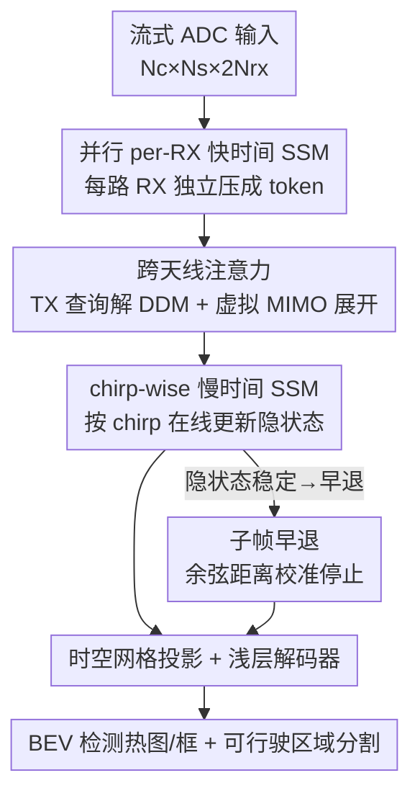

# RAVEN: Radar Adaptive Vision Encoders for Efficient Chirp-wise Object Detection and Segmentation

**会议**: CVPR 2026  
**论文**: [CVF Open Access](https://openaccess.thecvf.com/content/CVPR2026/html/Sen_RAVEN_Radar_Adaptive_Vision_Encoders_for_Efficient_Chirp-wise_Object_Detection_CVPR_2026_paper.html)  
**代码**: 无  
**领域**: 自动驾驶 / 雷达感知 / 目标检测  
**关键词**: FMCW 雷达, MIMO, 状态空间模型, 早退推理, BEV 检测

## 一句话总结
RAVEN 把 FMCW 雷达的原始 ADC 流直接喂给一套「per-RX 快时间 SSM + 跨天线注意力 + chirp-wise 慢时间 SSM」的轻量编码器，在保留 MIMO 虚拟阵列几何的同时，用校准的早退规则只读一帧里前几个 chirp 就出检测结果，相比传统帧式雷达骨干算力降到约 1/170、端到端延迟降约 4 倍，仍在 RADIal / RaDICaL 上拿到 SOTA 的检测与可行驶区域分割。

## 研究背景与动机
**领域现状**：毫米波雷达在恶劣天气/光照下比相机、LiDAR 更鲁棒，还能直接靠多普勒测速，是移动平台上有吸引力的感知模态。主流雷达深度学习管线是「帧式」的：先收齐一整帧所有 ADC 采样，沿 range/angle/Doppler 三个维度做一连串 FFT 构造出高分辨率的 RAD（range–angle–Doppler）张量，再用稠密 CNN/Transformer 骨干去处理这些 3D 特征图。

**现有痛点**：帧式范式有两个硬伤。其一，延迟被锁死在至少一个完整帧间隔——必须等整帧采完才能算。其二，RAD 立方体很大（如 3TX×4RX 配置下 256×64×12），构造和稠密推理都贵，在嵌入式/高速平台上几乎跑不动。于是出现了直接在流式 ADC 上做推理的序列模型（chirp 一到就处理），峰值内存更低、原则上能更早决策；但这类轻量序列方法在目标检测这种复杂任务上往往掉点。

**核心矛盾**：作者指出现有轻量序列方法掉点的两个根因。第一，它们在管线早期就把多个接收（RX）通道压缩/混合掉了，丢失了 MIMO 阵列提供的显式空间定位（角度）信息；把 $N_{rx}$ 维接收响应塌缩成一个标量，等价于施加一个固定的均匀波束成形器，相对相位差（编码角度）就没了。第二，在多普勒分割复用（DDM）系统里，不同发射（TX）天线的波形在频域交织、潜伏在每路接收流中，不显式分离这些 TX 分量，虚拟阵列元素就会混叠在一起，角度估计随之退化、检测精度下降。

**本文目标 + 核心 idea**：在保持流式友好的前提下，让编码器显式保留 MIMO 结构。具体拆成两点：（1）先对每个 RX 通道独立做快时间处理，保住每根天线的相位/幅度结构；（2）用一个轻量跨天线注意力模块，学习类似导向矢量的权重把 RX 跨通道融合、顺带解开 DDM 里的潜在 TX 结构——它扮演一个「可学习的波束成形器」，直接从流式信号里重建虚拟阵列特征，**不用构造 RAD 张量、不用昂贵 FFT 管线**。再叠加一条观察：相邻 chirp 主要贡献差分运动（多普勒）信息，检测性能在少量 chirp 后就饱和，于是用早 chirp 监督训练 + 校准停止规则做「子帧」早退，进一步省 FLOPs 和延迟。

## 方法详解

### 整体框架
RAVEN 接收一帧流式复数 ADC 输入 $X \in \mathbb{R}^{N_c \times N_s \times 2N_{rx}}$（$N_c$ 个 chirp 的慢时间轴、每 chirp $N_s$ 个快时间采样、$2N_{rx}$ 个 I/Q 通道），输出 BEV 目标检测（热图+框）和可行驶区域分割图。整条管线分五个阶段：每路 RX 先各自过一个快时间 SSM 压成紧凑 token；跨天线注意力把同一 chirp 的各 RX token 融合、展开成虚拟 MIMO 特征；慢时间 chirp-wise SSM 按 chirp 顺序在线更新隐状态；再把序列特征投影成 $T \times H \times W$ 的时空网格；最后用浅层 CNN 解码器出检测/分割。前三个阶段是本文真正的创新点；spatial projection 和 decoder 属于通用脚手架。推理时，慢时间 SSM 的隐状态一旦稳定，校准停止规则就触发早退，只用前一小段 chirp 就出结果。

### 关键设计

**1. 并行 per-RX 快时间 SSM 编码：先各管各的，保住天线相位结构**

针对「早期混 RX 通道会丢角度信息」这个痛点，RAVEN 在最前端拒绝跨通道混合。对每个接收通道 $r$、每个 chirp $k$，取其快时间 I/Q 序列 $\mathbf{x}_{r,k} \in \mathbb{R}^{N_s \times 2}$，用该 RX 专属的状态空间编码器（Mamba block 实现）$\mathrm{SSM}_r$ 处理得到 $\tilde{\mathbf{z}}_{r,k}$，再自适应池化成一个极小的 per-chirp token $\mathbf{f}_{r,k} = \mathrm{Pool}_1(\tilde{\mathbf{z}}_{r,k}^\top) \in \mathbb{R}^2$。把所有接收堆起来得到 $\mathbf{F}_k \in \mathbb{R}^{N_{rx} \times 2}$。关键在于「每路独立」：每个 RX 流被概括成一个微小 token，但仍然携带该天线的 range/相位信息，给下游跨天线融合提供一个紧凑却保留几何的输入——而不是像旧方法那样早早平均成一个标量、把角度线索抹平。

**2. 跨天线注意力 + 虚拟 MIMO 展开：用 TX 查询当可学习波束成形器解 DDM**

这是 RAVEN 恢复角度精度的核心。它把上一阶段的 per-RX 摘要 $\mathbf{F}_k$ 先投影成 $d$ 维 token 并加上可学习的 RX 位置嵌入 $\mathbf{H}^{rx}_k = \mathbf{W}_{in}\mathbf{F}_k + \mathbf{E}^{rx}$，然后引入一组**可学习的 TX 查询** $\mathbf{Q} \in \mathbb{R}^{N_{tx} \times d}$，以 query=TX、key/value=RX 的方式做交叉注意力：$\mathrm{Attn}(\mathbf{q},\mathbf{k},\mathbf{v}) = \mathrm{softmax}(\mathbf{q}\mathbf{k}^\top/\sqrt{d})\,\mathbf{v}$，再加 TX 侧残差和 FFN 得到 TX 专属摘要 $\mathbf{T} \in \mathbb{R}^{N_{tx} \times d}$。这些 TX 查询的作用就像可学习的导向矢量：在 RX token 场里搜索、抽出被 DDM 频域交织的 TX 特定信息。最后对每个虚拟 MIMO 对 $(r,t)$，把对应的 RX 与 TX token 拼接再投影成紧凑二维特征 $\mathbf{p}_{r,t} = \mathbf{W}_{pair}[\mathbf{h}^{rx}_r; \mathbf{t}_t] \in \mathbb{R}^2$，堆叠并归一化成 per-chirp 输出 $\mathbf{y}_k = \mathrm{LN}(\mathrm{vec}(\mathbf{P}_k)) \in \mathbb{R}^{2N_{rx}N_{tx}}$。这一步等效于直接从时域流信号重建了虚拟阵列特征、并强调跨天线相位一致的回波（DDM 兼容），却完全绕开了 RAD 张量构造和 FFT，开销对一个流式 SSM 骨干而言可忽略。

**3. chirp-wise 慢时间 SSM + 子帧早退：状态稳了就别再读 chirp**

把每 chirp 的 $\mathbf{y}_k$ 先降维成慢时间特征 $\mathbf{z}_k \in \mathbb{R}^D$，再用 Mamba 式结构化 SSM 沿 chirp 序列读出最终表示 $\mathbf{Z}_* = \mathrm{SSM}(\mathbf{Z})$——SSM 既支持流式在线更新又能并行训练，让模型不必等整帧就能做 anytime 决策。早退分两层落地：训练用**多前缀监督**，取若干 chirp 前缀长度 $\mathcal{L}=\{L_1,\dots,L_M\}$（$L_M=N_c$），对每个前缀 $\mathbf{Z}^{(L)}_*$ 都过同一套投影与解码器、对同一帧真值算损失，得到深监督目标 $\mathcal{L}_{task}=\sum_{L\in\mathcal{L}}[\ell_{det}(\widehat{\mathrm{Det}}^{(L)},\mathrm{Det}^\star)+\ell_{seg}(\widehat{\mathrm{Seg}}^{(L)},\mathrm{Seg}^\star)]$，逼模型在更早的 chirp 上就收敛。推理时用校准停止规则：对每个新 chirp 的隐状态 $z_L$，算它相对此前各状态的**最小余弦距离** $d_L = \min_{1\le j<L}(1 - z_L^\top z_j / (\|z_L\|\|z_j\|))$；当 $d_L$ 跌破校准阈值 $\tau$（论文从训练集余弦距离的拐点取 $\tau=0.2$），说明隐动态已饱和、再读 chirp 收益微乎其微。由于解码器按 $K$ 个池化 chirp 成块运算，实际用块平均分数 $\bar d_m = \frac{1}{K}\sum d_L$，取最早满足 $\bar d_m \le \tau$ 的块，早退索引为 $L_{exit}=K\cdot\min\{m:\bar d_m\le\tau\}$。

### 损失函数 / 训练策略
RADIal 上联合训练检测与可行驶区域分割：分割用 Jaccard(IoU) loss，检测用 Focal loss + Smooth L1 回归；Adam（lr $1\times10^{-4}$、weight decay $5\times10^{-6}$）、batch size 8、200 epoch。RaDICaL 上训练 BEV 占据分割，主损失为 BCE，300 epoch。所有 chirp 前缀都用深监督共享同一组真值。

## 实验关键数据

### 主实验
两个自动驾驶雷达数据集：RaDICaL（4RX×2TX TDM-MIMO，BEV 占据分割）与 RADIal（12TX×16RX DDM、192 虚拟天线，检测+可行驶区域分割联合任务）。所有 baseline 都在同样的 ADC 表示上训练。

RaDICaL 上，RAVEN 用极低的 0.053 GMACs 拿到几乎最优的掩码质量：

| 模型 | GMACs ↓ | Params(M) ↓ | Dice ↑ | Chamfer ↓ |
|------|---------|-------------|--------|-----------|
| ChirpNet | 1.480 | 3.780 | 0.986 | 0.097 |
| T-FFTRadNet | 15.990 | 9.000 | 0.995 | 0.108 |
| FFT-RadNet | 41.740 | 4.250 | 0.996 | 0.076 |
| SSMRadNet | 0.108 | 0.566 | 0.996 | 0.086 |
| **RAVEN (本文)** | **0.053** | **0.347** | **0.997** | 0.082 |

相比 FFT-RadNet（0.996 Dice / 41.74 GMACs），RAVEN 算力低近 790×、参数少约 12×（0.35M vs 4.25M），Dice 还略高。

RADIal 上，RAVEN 全帧版在分割（mIoU 0.90）与多数检测指标上领先，且算力远低于注意力类 SOTA：

| 模型 | mIoU ↑ | F1 ↑ | mAP ↑ | mAR ↑ | RE(m) ↓ | GMACs ↓ | Lat.(ms) ↓ |
|------|--------|------|-------|-------|---------|---------|------------|
| FFT-RadNet | 0.74 | 0.88 | 0.97 | 0.82 | 0.14 | 146.82 | 53.59 |
| TransRadar | 0.82 | 0.93 | 0.95 | 0.91 | 0.15 | 171.50 | — |
| SSMRadNet | 0.79 | 0.77 | 0.83 | 0.71 | 0.14 | 1.67 | 14.20 |
| **RAVEN (子帧)** | 0.85 | 0.89 | 0.88 | 0.89 | 0.17 | **0.27** | **9.15** |
| **RAVEN (全帧)** | **0.90** | **0.93** | 0.95 | **0.92** | **0.12** | 1.02 | 20.08 |

全帧 RAVEN 仅用 1.02 GMACs，比 TransRadar（171.5）省约 170×、比 T-FFTRadNet（97）省约 95×，分割/检测精度持平或更高。

### 消融实验
子帧早退 vs 全帧是核心的「效率—精度」权衡分析（来自上表两行 RAVEN）：

| 配置 | mIoU | F1 | GMACs | Lat.(ms) | 说明 |
|------|------|----|-------|----------|------|
| RAVEN 全帧（读满 256 chirp） | 0.90 | 0.93 | 1.02 | 20.08 | 精度上限 |
| RAVEN 子帧早退 | 0.85 | 0.89 | 0.27 | 9.15 | 算力再降 ~3.8×、延迟降 ~2.2×，mIoU 仅掉 0.05 |

### 关键发现
- **chirp 信息边际递减是早退的物理依据**：训练集最小余弦距离随 chirp 数下降并出现明显「拐点」，验证集 mIoU/F1 在 32→64 chirp 间还有增益、之后基本走平；把 chirp 预算从 256 降到 32–64 区间能拿到 >2× 加速而精度几乎不掉，由此自然定出 $\tau=0.2$。
- **跨天线注意力是恢复角度的关键**：保留 per-RX 结构 + 显式 TX 解混让 RAVEN 在 DDM 配置的 RADIal 上既低算力又低 range/angle 误差（全帧 RE 0.12m / AE 0.10°），而早期混通道的轻量序列方法（如 ChirpNet GRU/SSM 变体）mIoU 只有 0.64–0.66。
- **场景质量决定早退可靠性**：结构化多车场景里早 chirp 形成粗假设、后续 chirp 精修且抑制幻觉；但杂乱/噪声场景下早期推理不稳，chirp-state 信号会变得不规则，分割可能持续不可靠。

## 亮点与洞察
- **把雷达物理直接编进网络结构**：用「per-RX 独立编码 + TX 查询交叉注意力」显式复刻 MIMO 虚拟阵列和 DDM 解混，等于把传统的 FFT+波束成形换成可学习版本，既省掉 RAD 张量又保住角度——这种「用物理先验约束架构而非堆数据硬学」的思路可迁移到其他阵列信号（声呐、超声）。
- **anytime 推理用隐状态稳定度而非额外置信头**：早退判据直接是慢时间 SSM 相邻隐状态的余弦距离，不引入 MSDNet/DeeBERT 那种重量级中间分类头，几乎零额外开销就实现自适应早停，这点对 SSM 类序列模型很有借鉴价值。
- **多前缀深监督是「训练得动早退」的关键**：同一帧对多个 chirp 前缀都算 loss，逼模型把判别力前移到早 chirp，否则单纯加停止规则会因早期特征不够而掉点严重。

## 局限与展望
- 作者承认杂乱/低质数据下早退不可靠——分割可能全程不稳、目标在 clutter 中短暂出现又消失，此时 chirp 相似度信号噪声大，早停反而冒险。
- ⚠️ 子帧早退在 RADIal 上的代价不只是 mIoU 掉 0.05：mAP 从 0.95 降到 0.88、AE 从 0.10° 升到 0.25°，角度/检测精度损失比分割更明显，说明早退更适合对角度不敏感的场景。
- 实验只在两个数据集、两种 MIMO 配置（TDM 的 RaDICaL、DDM 的 RADIal）上验证，且 RaDICaL 标签由相机检测经 RetinaNet 生成（弱监督），真值质量与跨平台泛化仍待考。
- 校准阈值 $\tau$ 由训练集统计定出、全局固定，没有按场景自适应；杂乱场景或许需要动态 $\tau$。

## 相关工作与启发
- **vs 帧式 RAD 管线（FFT-RadNet / TransRadar）**：它们构造完整 RAD 立方体再上稠密骨干，精度高但算力（>100 GMACs）和延迟被锁死在整帧；RAVEN 直接在流式 ADC 上做、绕开 FFT，算力低 1–2 个数量级且能子帧早退，精度持平甚至更高。
- **vs 轻量 chirp-wise 序列模型（ChirpNet / SSMRadNet）**：它们同样流式、省内存，但早期混 RX 通道、不解 DDM，角度线索被抹平，检测/分割掉点（mIoU 0.64–0.79）；RAVEN 的区别在于用 per-RX 独立编码 + 跨天线注意力把 MIMO 几何留到融合阶段才显式重建，因此在相近甚至更低算力下精度大幅领先。
- **vs 通用早退推理（MSDNet / DeeBERT / FastBERT）**：它们靠附加的中间分类头 + 置信/熵准则决定何时停；RAVEN 把早退判据落在 SSM 隐状态的余弦稳定度上，无需额外头，更契合流式序列骨干。

## 评分
- 新颖性: ⭐⭐⭐⭐⭐ 把雷达阵列物理（per-RX 相位、DDM TX 解混）显式编成可学习注意力 + SSM 隐状态早退，组合很新。
- 实验充分度: ⭐⭐⭐⭐ 两数据集覆盖 TDM/DDM 两种配置、baseline 充分且统一 ADC 输入，但缺少对跨天线模块本身的逐组件消融表。
- 写作质量: ⭐⭐⭐⭐⭐ 物理动机—架构—早退三段逻辑清晰，公式与图配合到位。
- 价值: ⭐⭐⭐⭐⭐ 算力降两个数量级 + 子帧低延迟，对嵌入式/高速雷达感知落地价值大。

<!-- RELATED:START -->

## 相关论文

- [\[CVPR 2026\] Parameter-Efficient Semantic Augmentation for Enhancing Open-Vocabulary Object Detection](parameter-efficient_semantic_augmentation_for_enhancing_open-vocabulary_object_d.md)
- [\[CVPR 2026\] Expert-Teacher-Student Collaborative Learning for Domain Adaptive Object Detection](expert-teacher-student_collaborative_learning_for_domain_adaptive_object_detecti.md)
- [\[AAAI 2026\] LampQ: Towards Accurate Layer-wise Mixed Precision Quantization for Vision Transformers](../../AAAI2026/object_detection/lampq_towards_accurate_layer-wise_mixed_precision_quantization_for_vision_transf.md)
- [\[CVPR 2025\] Efficient Test-Time Adaptive Object Detection via Sensitivity-Guided Pruning](../../CVPR2025/object_detection/efficient_test-time_adaptive_object_detection_via_sensitivity-guided_pruning.md)
- [\[CVPR 2026\] Heuristic-inspired Reasoning Priors Facilitate Data-Efficient Referring Object Detection](heuristic-inspired_reasoning_priors_facilitate_data-efficient_referring_object_d.md)

<!-- RELATED:END -->
