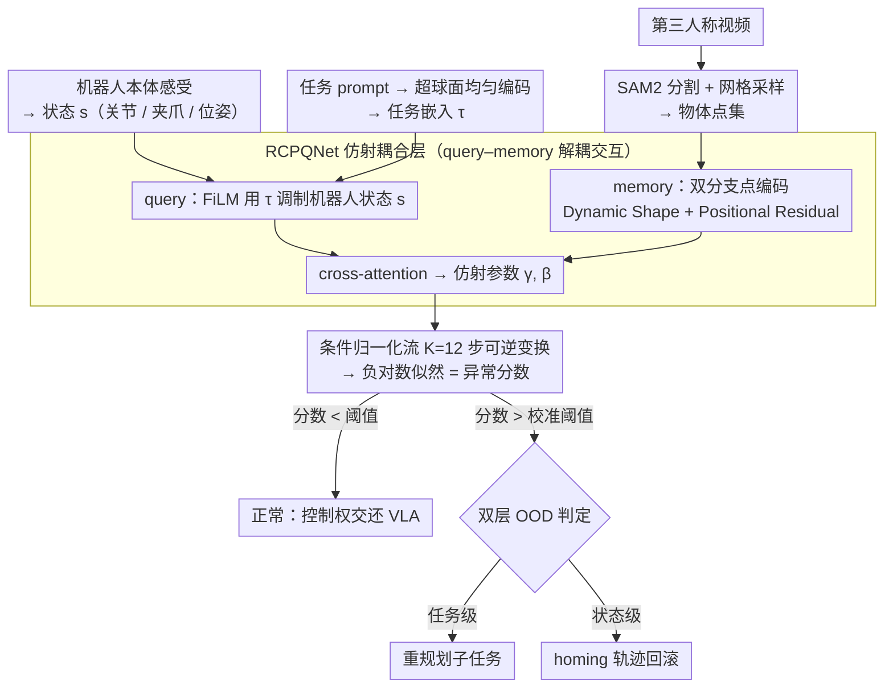

# RC-NF: Robot-Conditioned Normalizing Flow for Real-Time Anomaly Detection in Robotic Manipulation

**会议**: CVPR2026  
**arXiv**: [2603.11106](https://arxiv.org/abs/2603.11106)  
**代码**: 无  
**领域**:目标检测
**关键词**: 异常检测, normalizing flow, VLA monitoring, 机器人操作, 分布外

## 一句话总结

提出 Robot-Conditioned Normalizing Flow (RC-NF)，通过条件归一化流对机器人状态与物体运动轨迹的联合分布建模，实现 <100ms 实时异常检测，可作为 VLA 模型（如 π₀）的即插即用监控模块，支持任务级重规划和状态级轨迹回滚。

## 研究背景与动机

VLA (Vision-Language-Action) 模型通过模仿学习从专家示范数据中学习，能把自然语言指令映射到低层控制动作。但在实际部署时面临严峻的 OOD (Out-of-Distribution) 挑战：

**任务级 OOD**：环境变化导致当前指令不再适用（如执行"把球放进抽屉"时抽屉突然关闭）

**状态级 OOD**：指令仍有效但机器人物理状态偏离训练分布（如物体从夹爪滑落）

现有运行时监控方案的局限：

- **状态分类方法**（行为树等）：依赖穷举异常条件或手动定义前置条件，难以覆盖真实操作中的组合变异性
- **VLM 推理方法**（Sentinel 等双系统架构）：需要链式推理，延迟达数秒级，无法及时干预
- **FailDetect**（无监督 flow matching）：直接拼接图像特征与机器人状态，特征选择和处理存在改进空间

**核心动机**：需要一个仅用正样本训练、实时（<100ms）、可即插即用的异常检测模块，无需枚举所有异常类型，也无需多步推理。

## 方法详解

### 整体框架

RC-NF 要解决的问题是：VLA 在真实执行时，怎么只靠正常演示数据、在 <100ms 内就察觉"事情不对劲"。它的思路是把"机器人当前在做什么"和"物体在怎么动"放进同一个条件归一化流里，算出当前这一帧配置落在正常分布下的概率密度——密度越低越异常。整个网络基于 Glow 架构，核心改造是设计了新的仿射耦合层 RCPQNet（Robot-Conditioned Point Query Network），把机器人状态和任务信息作为条件注入流。

数据的走向是这样：SAM2 先从第三人称视频里把物体抠成分割 mask，再网格采样成点集；任务 prompt 被编码成超球面上的均匀分布向量；机器人本体感受同时给出关节、夹爪、位姿状态。这三路信息进入以机器人状态和任务嵌入为条件的归一化流，经 K=12 步可逆变换后，输出负对数似然作为异常分数。分数一旦越过校准阈值就触发分级纠正：判为任务级 OOD 就重规划，判为状态级 OOD 就把轨迹回滚到安全位姿（homing）。

### 关键设计

**1. 条件归一化流：给"正常"算出一个可比较的概率密度**

正常演示其实分布很宽（不同物体、不同摆位、不同抓取时序），靠分类器穷举"什么算正常"几乎不可能，所以 RC-NF 改用密度估计。条件 $c = (s, \tau)$ 里，$s$ 是机器人状态（T 维关节状态、夹爪状态、笛卡尔位姿），$\tau$ 是任务嵌入；物体点集 $\mathcal{X}$ 经 K=12 步可逆变换被映射到高斯潜分布 $\mathcal{Z} \sim \mathcal{N}(\mu_{\text{task}}, I)$，潜空间均值 $\mu_{\text{task}}$ 由任务嵌入广播得到。条件似然按变量替换公式，把每步可逆变换的 Jacobian 行列式累加起来：

$$\log p_{X|C}(x|c) = \log p_{Z|C}(z|c) + \sum_{i=1}^{K} \log \left| \det \frac{\partial f_{i,c}(y_{i-1})}{\partial y_{i-1}} \right|$$

它的负值就是异常分数：正常配置落在高密度区、分数低，一旦偏离训练分布，密度骤降、分数飙高。任务嵌入这步同样关键——把不同任务的 prompt 映射到 T 维超球面表面，超球面上的均匀分布让各任务的潜分布均值尽量分开，避免不同任务的密度互相污染。

**2. RCPQNet：用 query–memory 结构把"机器人在做什么"和"物体在怎么动"对齐起来**

条件流好不好用，关键看仿射耦合层怎么吃进条件，RCPQNet 把它拆成"查询"和"记忆"两路。查询这一路（Task-aware Robot-Conditioned Query）：机器人状态先线性投影到潜空间，再由 FiLM 机制用任务嵌入 $\tau$ 调制，生成同时编码机器人状态和任务目标的 query token——相当于带着"我正在做这个任务、机器人现在这个姿态"的问题去观察物体。记忆这一路（Dual-Branch Point Feature Encoding）负责刻画物体怎么动，又分两支：Dynamic Shape 分支对每帧点集做中心化和归一化，抹掉平移和尺度效应，把所有物体点视为一个整体、用形状变化来表示物体之间的相对运动；Positional Residual 分支则补回形状归一化丢掉的位置信息，保留机器人–物体运动里的平均位移。两支各自经 MLP 升维 → 平均池化得帧级表征 → GRU 建模时间依赖 → Transformer Encoder 汇成记忆向量，最后 query 和 memory 在 Transformer 里做 cross-attention，吐出仿射变换参数 $\gamma, \beta$。举个具体的：夹爪松脱（Gripper Slippage）时，query 显示夹爪本该夹住物体，而 memory 里物体点集却出现了不该有的相对位移，两者一对齐，密度立刻掉下来、分数报警。

**3. 解耦但交互的特征处理：避开 FailDetect 的特征纠缠与不平衡**

FailDetect 直接把图像特征和机器人状态拼在一起喂进 flow，问题是这两类特征维度和语义差异都很大，拼接后容易彼此淹没（特征纠缠），也容易一方主导另一方（特征不平衡）。RC-NF 的解耦正是冲着这点来的：机器人状态只走 query、物体点特征只走 memory，两者直到 cross-attention 才发生交互。这样既保留了"机器人状态决定物体该怎么动"这层因果交互，又让两路各自维持清晰、平衡的表征。消融实验从反面印证了这一点——去掉机器人状态条件，Gripper Open 的 AUC 从 0.931 跌到 0.633；去掉 Dynamic Shape 分支，Spatial Misalignment 的 AUC 直接崩到 0.102，说明解耦与交互缺一不可。

**4. 双层 OOD 检测与分级处理：把"察觉异常"接到"怎么纠正"**

算出异常分数只是第一步，真正落地还得回答"发现不对劲之后做什么"。RC-NF 作为并行监控模块持续读取视觉流和机器人状态反馈，每个时间步把当前配置的负对数似然当异常分数；一旦越过由校准集估计的静态阈值（训练时的去偏操作保证了分数的时间平滑性，所以阈值无需随时间变化），高层系统就判断这是哪一类 OOD 并分级处理。任务级 OOD 指环境或上下文已经和指令对不上（如"把蓝球放进打开的抽屉"时抽屉却关上了），此时 RC-NF 通知高层控制器（人或 LLM 规划器）重规划出一串符合新环境的子任务；状态级 OOD 指任务仍然有效、但机器人物理状态漂出了正常分布（如球从夹爪滑落），此时触发 homing 把机械臂回滚到初始安全状态、局部调整轨迹直到分数重新降到阈值以下，再把控制权无缝交还 VLA。实践中系统先做轻量的状态级恢复、必要时才升级到任务级重规划——比一刀切的"检测到失败就停"更精细，也更贴近真实部署。

### 损失函数与训练策略

- **训练目标**：最大化正常演示的条件对数似然（公式 5），等价于最小化 $\frac{1}{2}\|z - \mu_{\text{task}}\|_2^2$ 加上 Jacobian 行列式项
- **仅正样本无监督训练**：只需成功演示数据，不需要异常样本
- **去偏 (debiasing)**：训练时应用去偏操作确保异常分数的时间平滑性
- **静态阈值**：上阈值由校准集估计，$\text{Upper}_\mathcal{T} = \mu_\mathcal{T} + Q_{1-\alpha}(D_\mathcal{T})$，$\alpha = 0.05$
- **训练设置**：K=12 个流步骤，训练 100 epochs，每任务 50 个演示

## 实验关键数据

### 主实验：LIBERO-Anomaly-10 基准

| 方法 | Gripper Open AUC | Gripper Open AP | Gripper Slippage AUC | Gripper Slippage AP | Spatial Misalign AUC | Spatial Misalign AP | Avg AUC | Avg AP |
|------|:---:|:---:|:---:|:---:|:---:|:---:|:---:|:---:|
| GPT-5 | 0.914 | 0.964 | 0.894 | 0.872 | 0.490 | 0.402 | 0.850 | 0.851 |
| Gemini 2.5 Pro | 0.864 | 0.933 | 0.863 | 0.851 | 0.517 | 0.427 | 0.819 | 0.831 |
| Claude 4.5 | 0.875 | 0.940 | 0.855 | 0.829 | 0.529 | 0.429 | 0.821 | 0.825 |
| FailDetect | 0.788 | 0.903 | 0.667 | 0.693 | 0.656 | 0.582 | 0.718 | 0.770 |
| **RC-NF (Ours)** | **0.931** | **0.978** | **0.920** | **0.918** | **0.968** | **0.959** | **0.931** | **0.949** |

### 消融实验：RCPQNet 各组件

| 配置 | Gripper Open AUC | Gripper Slippage AUC | Spatial Misalign AUC | Avg AUC | Avg AP |
|------|:---:|:---:|:---:|:---:|:---:|
| RC-NF (完整) | 0.931 | 0.920 | 0.968 | 0.931 | 0.949 |
| w/o Task Embedding | 0.877 | 0.867 | 0.814 | 0.864 | 0.901 |
| w/o Robot State | 0.633 | 0.744 | 0.893 | 0.715 | 0.840 |
| w/o Pos. Residual 分支 | 0.905 | 0.897 | 0.854 | 0.895 | 0.923 |
| w/o Dyn. Shape 分支 | 0.767 | 0.776 | 0.102 | 0.684 | 0.790 |

### 关键发现

1. **RC-NF 全面碾压 VLM 方案**：在 Spatial Misalignment 上，VLM 退化至随机水平（AUC≈0.5），而 RC-NF 达到 0.968，说明基于轨迹概率密度的方法远优于依赖语义推理的 VLM
2. **Dynamic Shape 分支至关重要**：移除后平均 AUC 从 0.931 降至 0.684，Spatial Misalignment 更是灾难性下降到 0.102，表明时序形状演变是检测异常的最强证据
3. **机器人状态条件不可或缺**：移除后 Gripper Open 的 AUC 从 0.931 骤降至 0.633，因夹爪未关闭不会直接位移物体，异常体现在机器人与物体的相对运动中
4. **实时性**：RTX 3090 上推理延迟 <100ms，远快于 VLM 方案的秒级延迟
5. **真实世界迁移成功**：RC-NF 从仿真到实物场景有效迁移，与 π₀ 配合成功处理了抽屉突然关闭（任务级）和球滑落（状态级）两种 OOD 场景

## 亮点与洞察

1. **解耦条件化设计精巧**：将机器人状态作为 query、物体点集作为 memory 的解耦处理方式，既保留了交互信息又避免了特征纠缠，是对 FailDetect 简单拼接方案的本质改进
2. **只需正样本**：无监督训练仅依赖成功演示，避免了枚举异常类型的困难，更符合实际部署场景
3. **双层 OOD 处理机制**：区分任务级和状态级 OOD 并分别处理（重规划 vs 轨迹回滚），比一刀切的失败检测更精细实用
4. **即插即用**：不修改 VLA 架构，作为并行监控模块运行，工程落地友好
5. **超球面任务嵌入**：将任务 prompt 映射到超球面均匀分布，确保任务间最大分离，为密度估计提供良好几何结构

## 局限与展望

1. **依赖 SAM2 分割质量**：首帧需要 bbox prompt（仿真用图形学方法，真实用 Gemini 2.5 Pro），分割失败会影响点集质量
2. **每任务需独立训练和校准阈值**：新任务需重新收集演示和校准，扩展性受限
3. **静态阈值**：虽然去偏保证了时间平滑性，但固定阈值可能在长尾分布场景中不够鲁棒
4. **仅用第三人称相机**：RC-NF 只用一个第三人称视角做监控，多视角融合可能进一步提升
5. **异常分类较粗**：仅区分任务级和状态级 OOD，未细分异常类型来指导具体修复策略
6. **LIBERO-Anomaly-10 规模有限**：仅 10 个任务 3 类异常，更大规模更多样化的基准值得构建

## 相关工作与启发

- **FailDetect**：同为 flow-based 无监督方法但直接拼接特征，是最直接的对比；RC-NF 的解耦条件化设计是核心差异化
- **Sentinel / VLM 监控**：VLM 在语义理解上强但空间推理弱且延迟高，说明低层几何/轨迹特征对操作异常检测的重要性
- **行人异常检测方法**：RC-NF 的归一化流思路受行人场景启发，迁移到机器人操作场景
- **π₀ 等 VLA 模型**：RC-NF 定位为 VLA 的辅助监控模块，不替代而是增强 VLA
- 启发：**解耦设计 + 概率密度估计**可能推广到其他需要实时监控的机器人任务（导航、多臂协作等）

## 评分

- 新颖性: ⭐⭐⭐⭐ — 条件归一化流用于机器人异常检测是新颖组合，RCPQNet 解耦设计有工程和学术价值
- 实验充分度: ⭐⭐⭐⭐ — 定量（仿真基准+多基线对比+消融）和定性（真实世界π₀集成）兼备，消融分析透彻
- 写作质量: ⭐⭐⭐⭐ — 问题定义清晰，方法描述完整，图表直观
- 价值: ⭐⭐⭐⭐⭐ — 切中 VLA 部署的核心痛点，即插即用设计实用性强，<100ms 延迟满足实时需求

<!-- RELATED:START -->

## 相关论文

- [\[CVPR 2026\] YOLO-ULM: Ultra-Lightweight Models for Real-Time Object Detection](yolo-ulm_ultra-lightweight_models_for_real-time_object_detection.md)
- [\[CVPR 2026\] BUSSARD: Normalizing Flows for Bijective Universal Scene-Specific Anomalous Relationship Detection](bussard_normalizing_flows_for_bijective_universal_scene-specific_anomalous_relat.md)
- [\[CVPR 2026\] YOLO-Master: MOE-Accelerated with Specialized Transformers for Enhanced Real-time Detection](yolo-master_moe-accelerated_with_specialized_transformers_for_enhanced_real-time.md)
- [\[CVPR 2026\] AKCMamba-YOLO: Selective State Space Models For Real-Time Object Detection](akcmamba-yolo_selective_state_space_models_for_real-time_object_detection.md)
- [\[CVPR 2026\] GPFlow: Gaussian Prototype Probability Flow for Unsupervised Multi-Modal Anomaly Detection](gpflow_gaussian_prototype_probability_flow_for_unsupervised_multi-modal_anomaly_.md)

<!-- RELATED:END -->
