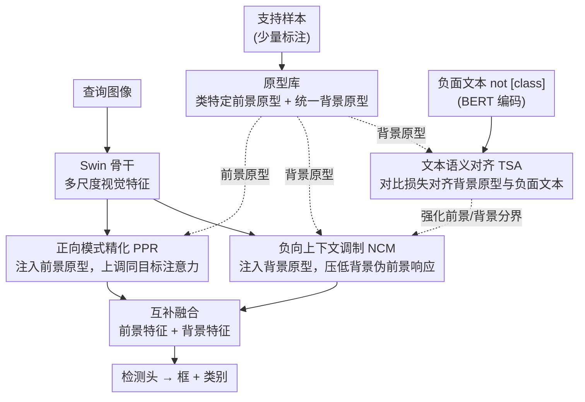

# Remedying Target-Domain Astigmatism for Cross-Domain Few-Shot Object Detection

**会议**: CVPR 2026  
**arXiv**: [2603.18541](https://arxiv.org/abs/2603.18541)  
**代码**: 无  
**领域**: 目标检测  
**关键词**: 跨域少样本检测, 注意力散光, 仿生中央凹视觉, 原型学习, 负上下文建模

## 一句话总结

首次发现跨域少样本目标检测（CD-FSOD）中模型注意力在目标域持续分散的"散光"现象，受人类中央凹视觉系统启发，设计正向模式精化（PPR）、负向上下文调制（NCM）和文本语义对齐（TSA）三个互补模块来重塑注意力，在6个跨域基准上以显著优势达到SOTA。

## 研究背景与动机

**领域现状**：跨域少样本目标检测（CD-FSOD）旨在将源域预训练的检测器适应到标注稀缺的目标域，是实际应用（医学诊断、工业检测等）中的关键需求。现有方法如CD-ViTO已建立了多域基准，但性能仍不令人满意。

**现有痛点**：作者通过深入分析Transformer各层的注意力模式，发现了一个此前被忽视的现象：在源域中，注意力随网络深度逐渐聚焦到前景目标上；但在目标域中，注意力始终保持分散和无焦状态，导致过大的边界框和大量冗余预测。这就像人类散光（Astigmatism）一样，目标域中的模型无法聚焦于关键物体。

**核心矛盾**：通过测量注意力距离 $\bar{d} = \frac{1}{N}\sum_{i,j} A_{ij} \cdot \|p_i - p_j\|$，发现目标域的注意力距离始终高于源域。常规微调虽有减小散焦的趋势（注意力距离差值为负），但效果远不够——微调后目标域的注意力分散度仍远超源域。

**本文目标**：如何增强模型自身修复散光问题的内在趋势，使注意力从分散模式转变为聚焦的、以目标为中心的模式，从而在目标域实现精准检测。

**切入角度**：受人类视觉系统中央凹结构的启发——中央感知区域捕获高细节信息（前景），外周区域捕获低细节信息（背景），中心-周边对比机制维持注意力集中。据此设计三个模块分别增强中心区域表征、周边区域表征和两者之间的区分度。

**核心 idea**：通过类特定前景原型增强目标区域注意力（上调 $A_2, A_3$），通过统一背景原型抑制背景区域的伪前景响应（下调 $A_1$），再通过"not [class]"文本线索从跨模态角度强化前景-背景分离，三管齐下将散焦注意力转变为聚焦模式。

## 方法详解

### 整体框架

方法建立在GLIP检测器上，用Swin Transformer骨干提取多尺度特征，整条思路是把"散光"分解成三个可单独干预的注意力病灶再逐一矫正。微调阶段，模型从支持样本里把类特定前景原型和一个统一背景原型抽出来存进原型库，同时用检测损失和跨模态对齐损失联合训练。推理阶段从库里调原型：PPR负责增强前景特征、NCM负责增强背景特征，两路互补特征相加融合后再送进检测头。三个模块分别对应中央凹视觉的三种角色——中央感知（前景）、外周感知（背景）、中心-周边对比（前景/背景分界）。

### 关键设计

**1. 正向模式精化（PPR）：把散在目标内部的注意力重新拉回前景**

散光最直接的表现是同一个目标内部 patch 之间的注意力权重 $A_2, A_3$ 偏低，模型看到目标却"看不实"。PPR 先从支持样本的前景区域均值池化得到类原型 $\mathbf{p}_{fg}^c$，推理时计算特征图每个位置与所有类原型的余弦相似度，用阈值 $\tau_{fg}$ 卡出前景掩码 $\mathbf{M}_{fg}$，再对掩码内的高相似度区域注入温度缩放 softmax 加权后的原型：$\mathbf{f}_v^{pos}(x,y) = \mathbf{f}_v \cdot \mathbf{M}_{fg} + \gamma_{fg} \sum_c w_c \mathbf{p}_{fg}^c \cdot \mathbf{M}_{fg}$。原型注入相当于给目标内部所有 patch 灌入一份共同的类语义，特征一致性上来后，同目标 patch 之间的注意力自然被拉高，这也是消融里 PPR 单模块贡献最大（+2.06%）的原因——前景增强是矫正散光的主战场。

**2. 负向上下文调制（NCM）：压住背景里冒出来的伪前景响应**

散焦的另一面是背景 patch 的注意力权重 $A_1$ 过高，模型把大片背景误当成可能的目标，于是吐出过大的框和冗余预测。NCM 从支持样本中标注框外的区域均值池化得到一个**不区分类别**的统一背景原型 $\mathbf{p}_{bg}$，推理时同样定位出背景区域并注入该原型：$\mathbf{f}_v^{neg}(x,y) = \mathbf{f}_v \cdot \mathbf{M}_{bg} + \gamma_{bg} \mathbf{p}_{bg} \cdot \mathbf{M}_{bg}$。背景增强后与前景在特征空间里更可分，前景对背景的错误关注随之降低。背景之所以用单一原型而非分类建模，是因为"非目标"本身就是一个通用概念，统一表示既省参数又够用——消融也显示 NCM 在高背景比例（0.7–1.0）场景下增益最明显。

**3. 文本语义对齐（TSA）：再从语言模态加一道前景-背景分界**

纯视觉原型在域差距大时容易失准，单靠视觉两路未必拉得开前景和背景。TSA 引入跨模态监督：构造"not [class]"形式的负面文本（如"not sofa, not dog"），用 BERT 编码成文本特征 $\mathbf{F}_t^{bg}$，把 NCM 的背景原型当作视觉特征 $\mathbf{F}_v^{bg}$，两者经可学习投影层映射到共享语义空间，再用对比损失对齐：$\mathcal{L}_{ctr} = -\log \frac{\exp(\text{diag}(\mathcal{S})/\tau)}{\sum_{i,j}\exp(\mathcal{S}_{i,j}/\tau)}$。"not [class]"这个设计的巧处在于它从反面直接给背景下了语义定义，让模型在语言层面也建立起清晰的前景/背景边界，与视觉原型形成中心-周边的对比增强。

### 损失函数 / 训练策略

总损失为 $\mathcal{L}_{total} = \mathcal{L}_{detection} + \lambda_{bg} \cdot \mathcal{L}_{ctr}$，其中检测损失包含分类损失和定位损失。TSA损失权重 $\lambda_{bg}$ 在 $10^3$ 时最优。推理时PPR和NCM的增强特征通过互补融合 $\mathbf{F}_v^{enhanced} = \mathbf{f}_v^{pos} + \mathbf{f}_v^{neg}$ 送入检测头。

## 实验关键数据

### 主实验

| 方法 | 1-shot Avg mAP | 5-shot Avg mAP | 10-shot Avg mAP |
|------|-------|----------|-------|
| GLIP | 18.98 | 29.36 | 33.93 |
| CD-ViTO* | 15.96 | 28.30 | 33.47 |
| Domain-RAG* | 16.52 | 27.98 | 32.81 |
| VFM-MoE* | 17.59 | 28.45 | 33.94 |
| **Ours** | **23.81** | **33.73** | **39.17** |

6个数据集（ArTaxOr、Clipart1k、DIOR、DeepFish、NEU-DET、UODD）跨昆虫、卡通、遥感、水下等多域，1/5/10-shot全面SOTA。5-shot平均mAP比最强baseline高5.28个点（33.73 vs 28.45）。

### 消融实验

| 配置 | ArTaxOr | Clipart1k | DeepFish | NEU-DET | UODD | 平均增益 |
|------|---------|------|---------|------|------|------|
| Baseline (GLIP) | 48.11 | 39.28 | 28.40 | 19.55 | 11.40 | - |
| +NCM | 49.95 | 40.52 | 29.58 | 20.48 | 12.21 | +1.06 |
| +NCM+PPR | 52.68 | 42.95 | 31.96 | 22.38 | 14.26 | +2.06 |
| +NCM+PPR+TSA | **54.98** | **44.83** | **33.87** | **23.64** | **15.66** | +1.59 |

三个模块叠加有效，PPR贡献最大（+2.06%），验证了前景增强是矫正散光的核心。

### 关键发现

- 注意力距离分析量化证实：常规微调仅将注意力分散度降低0.25%-1.30%，本方法可降低0.47%-1.72%
- 背景比例分析显示NCM在高背景比例（0.7-1.0）时优势更明显，验证了负上下文利用的有效性
- 背景文本数量在200条时达到最佳性价比（+1.39% AP，仅增加84MB显存）
- 本方法大幅减少冗余检测框（如海事场景从100个降到9个），定性结果非常有说服力

## 亮点与洞察

- "散光"问题的发现本身就是重要的科学贡献，通过注意力距离指标的量化分析揭示了CD-FSOD中一个被忽视的核心问题
- 仿生设计的类比非常自然：中央凹→PPR、外周视觉→NCM、中心-周边对比→TSA，生物学启发与技术方案高度吻合
- "not [class]"负面文本提示的设计创新且实用，从反面定义背景语义来强化前景/背景分离
- 方法引入极少的额外参数和计算开销，具有良好的部署效率

## 局限与展望

- 原型质量严重依赖少量支持样本，极端少样本（如1-shot）时原型可能不够准确
- 仅在Swin-Tiny骨干上验证，更大模型或不同架构（如ViT-L）上的表现未知
- 背景原型作为统一概念处理可能在复杂场景中过于简化，分层次的背景建模或许更有效
- "not [class]"提示需要预知目标域的类别名称，在类别未知的开放域场景中需要调整

## 相关工作与启发

- **vs CD-ViTO**: CD-ViTO通过知识蒸馏保留源域先验，但未处理注意力分散问题。本文5-shot平均mAP高5.43个点（33.73 vs 28.30）
- **vs Distill-CDFSOD**: 蒸馏方法在域差距大时效果受限，本文从注意力机制层面直接改善特征质量
- **vs IPNet**: IPNet为前景和背景设计独立的域对齐路径，但未利用跨模态文本信息；本文TSA模块提供语义层面的额外监督

## 评分

- 新颖性: ⭐⭐⭐⭐⭐ 散光问题的发现和仿生中央凹视觉的设计理念都很有原创性
- 实验充分度: ⭐⭐⭐⭐ 6个数据集、3种shot设置、多模块消融、注意力可视化，非常全面
- 写作质量: ⭐⭐⭐⭐⭐ 问题发现→量化分析→仿生启发→技术方案的叙事逻辑非常清晰
- 价值: ⭐⭐⭐⭐ 散光现象的发现和矫正方法对CD-FSOD社区有重要启发，方法可推广到其他跨域任务

<!-- RELATED:START -->

## 相关论文

- [\[CVPR 2026\] Learning Multi-Modal Prototypes for Cross-Domain Few-Shot Object Detection](learning_multi-modal_prototypes_for_cross-domain_few-shot_object_detection.md)
- [\[CVPR 2026\] A Closer Look at Cross-Domain Few-Shot Object Detection: Fine-Tuning Matters and Parallel Decoder Helps](a_closer_look_at_cross-domain_few-shot_object_detection_fine-tuning_matters_and_.md)
- [\[CVPR 2026\] Evaluating Few-Shot Pill Recognition Under Visual Domain Shift](evaluating_few-shot_pill_recognition_under_visual_domain_shift.md)
- [\[CVPR 2026\] Anomaly-Related Residual Fields for Cross-domain Anomaly Detection](anomaly-related_residual_fields_for_cross-domain_anomaly_detection.md)
- [\[CVPR 2026\] Black-Box Domain Adaptation for Object Detection with Retention-Driven Knowledge Compression](black-box_domain_adaptation_for_object_detection_with_retention-driven_knowledge.md)

<!-- RELATED:END -->
