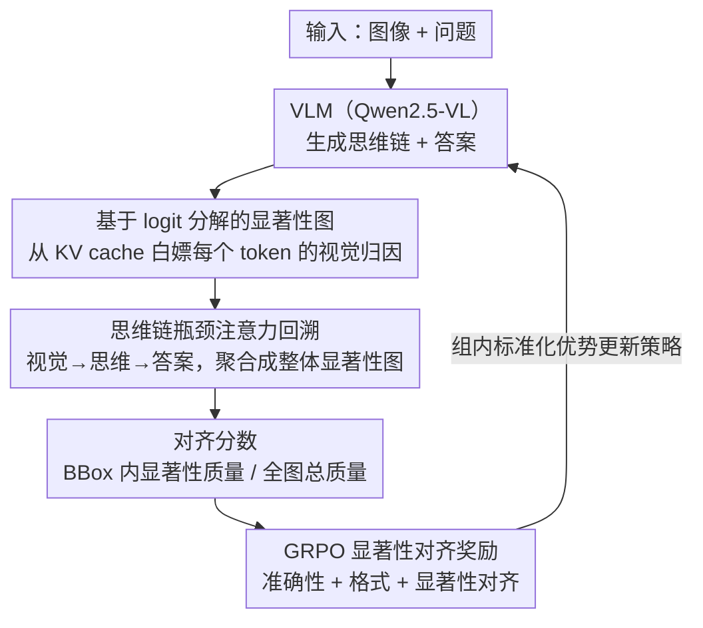

# Saliency-R1: Enforcing Interpretable and Faithful Vision-language Reasoning via Saliency-map Alignment Reward

**会议**: CVPR 2026  
**arXiv**: [2604.04500](https://arxiv.org/abs/2604.04500)  
**代码**: [https://github.com/peterant330/Saliency_R1](https://github.com/peterant330/Saliency_R1)  
**领域**: 目标检测  
**关键词**: 视觉语言模型, 显著性图, GRPO强化学习, 可解释推理, 注意力对齐

## 一句话总结

提出 Saliency-R1，通过基于 logit 分解的高效显著性图技术和思维链瓶颈注意力回溯，将显著性图与人工标注 bounding box 的对齐度作为 GRPO 奖励，训练 VLM 在推理时聚焦任务相关的图像区域，提升推理的可解释性和忠实性。

## 研究背景与动机

1. **领域现状**：VLM 在推理、问答等任务上取得了显著进展。为增强可信度，通常让模型生成自然语言解释（如 Chain-of-Thought）来展示推理过程。DeepSeek-R1 等推理模型也被训练以产生详细的思维链。

2. **现有痛点**：(1) VLM 倾向于过度依赖文本线索，视觉信号的作用相对较小；(2) 生成的推理轨迹与最终答案之间存在不一致——"想的"和"做的"不一样；(3) 推理过程本身可能误用视觉线索或幻觉出不存在的细节。

3. **核心矛盾**：不同的推理过程可能关注图像的不同区域，即使它们得出了相同的正确答案。不忠实的推理过程要么关注无关区域，要么根本没有考虑图像，仅靠文本捷径得出答案。

4. **本文目标** (1) 设计高效的显著性图方法来可视化视觉信息如何影响生成的 token；(2) 追踪视觉信息如何通过思维链流向最终答案；(3) 用显著性对齐作为奖励，通过 GRPO 训练模型关注正确区域。

5. **切入角度**：将 token logit 分解为各上下文 token 的一阶直接贡献，提取视觉 token 的贡献作为显著性图，无需额外的前向/反向传播。

6. **核心 idea**：用计算零开销的 logit 分解显著性图度量 VLM 推理的视觉聚焦区域，以其与人工标注的对齐度作为 GRPO 奖励来训练更忠实的推理。

## 方法详解

### 整体框架

整篇要解决的核心问题是：VLM 给出正确答案时，到底是"看对了地方"还是"靠文本捷径蒙对的"？Saliency-R1 把这个问题转化为一个可优化的奖励。它先用一种零额外计算的方式，从模型推理过程本身读出"每个生成 token 在看图像的哪块区域"，再沿着思维链把视觉注意力一路传播到最终答案 token，得到一张整体显著性图；最后拿这张图和人工标注的 bounding box 比对，对齐得越好奖励越高，并把这个奖励塞进 GRPO 强化学习循环里训练模型。三个环节——读显著性、传播显著性、用显著性当奖励——首尾相接，构成"看对地方才算对"的训练范式。

### 关键设计

**1. 基于 logit 分解的显著性图：从 KV cache 里"白嫖"出注意力归因**

痛点在于，传统显著性方法（Grad-CAM 要反传、TAM 要解优化问题）每生成一个 token 就得额外算一遍，根本没法塞进每步采样 8 个回滚的 RL 训练。本文的做法是利用 Transformer 残差连接的线性性：最终输出 logit 可以拆成各位置 token 的直接贡献之和。预测 $t_{i+1}$ 时，上下文 token $t_p$ 的直接贡献为

$$c_p = \sum_{l=1}^{L} \sum_{j=1}^{H} \alpha_{i,j,p}^l\, \mathbf{W}_{o,j}^l \mathbf{W}_{v,j}^l \mathbf{h}_p^{l-1}\, \mathbf{E}_u$$

其中 $\alpha$ 是注意力权重，$\mathbf{W}_o, \mathbf{W}_v$ 是输出与 value 投影，$\mathbf{E}_u$ 是 unembedding 矩阵。只取视觉 token 对应的 $c_p$，按 patch 位置重排成二维网格，再用 ReLU 滤掉负贡献，就得到一张显著性图。关键在于这个式子里的每一项都是现成的——注意力权重 $\alpha$ 在大多数 attention 实现里本就可读，$\mathbf{W}_v^l \mathbf{h}_p^{l-1}$ 早已存在 KV cache 中，所以**整套显著性图无需任何额外前向或反向传播**，计算开销可忽略。代价是只算了一阶直接贡献、忽略了跨层的间接贡献，但已有文献表明间接贡献占比很小，对齐直接贡献就足以反映 patch 的相对重要性。

**2. 思维链瓶颈注意力回溯：逼信息"过思维 token 这道闸"**

单 token 的显著性还不够，真正要判断的是答案是否"经过思考"得来。本文把思维 token 设为视觉到答案之间唯一的信息瓶颈：先取视觉→思维 token 的注意力矩阵 $\mathcal{A}_{vt}^{l,h}$ 和思维→答案 token 的注意力矩阵 $\mathcal{A}_{ta}^{l,h}$，两者相乘得到视觉经思维流向答案的过渡注意力

$$\tilde{\mathcal{A}}_{va}^{l,h} = \mathcal{A}_{vt}^{l,h}\, \mathcal{A}_{ta}^{l,h}$$

这样若答案 token 绕过思维 token、直接从视觉 token 取信息（即文本捷径），这条乘积路径上的权重就会很低，CoT 不忠实的行为便暴露出来。这里刻意**不对注意力矩阵做列归一化**：像介词这类 token 本身从思维/视觉 token 拿到的贡献就很少，强行归一化会把它们的影响抬高，保留原始量级才能让它们在整体显著性图里维持应有的小权重。

**3. 基于 GRPO 的显著性对齐奖励：把"看对地方"变成可优化信号**

有了整体显著性图，对齐分数定义为 bounding box 内显著性质量占全图总质量的比例：

$$\text{Align} = \frac{\sum_{i \in \text{BBox}} \text{Saliency}(i)}{\sum_{i \in \text{Image}} \text{Saliency}(i)}$$

它直接回答"模型的注意力有多少落在了问题相关区域"。总奖励由三部分相加，$\mathcal{R} = \mathcal{R}_{\text{accuracy}} + \mathcal{R}_{\text{format}} + \mathcal{R}_{\text{saliency}}$：$\mathcal{R}_{\text{accuracy}}$ 用 LLM-as-judge（GPT-4o-mini）判答案对错（0/1），$\mathcal{R}_{\text{format}}$ 检查 `<think></think>` 标签是否齐全（0/1），$\mathcal{R}_{\text{saliency}}$ 即上面的对齐分数。训练用 GRPO，每条样本采 8 个回滚，以组内标准化奖励作为优势函数。之所以要单加显著性这一项，是因为纯准确性奖励分不清"看对答对"和"没看对但蒙对"——前者奖励一致、后者奖励互相矛盾，显著性项把"注意力落在正确区域"明确拎出来奖励，模型才被迫学会忠实地用图。

### 损失函数 / 训练策略

两阶段训练：(1) 冷启动 SFT，使用过滤后的 Vision-R1-cold 数据集（272,881 样本），用 llama-factory 训练；(2) GRPO 训练，使用 saliency-r1-8k 数据集（8,080 VQA 样本，含 bounding box 标注），用 TRL 框架，batch size 64，KL 系数 0.001，LoRA rank 16，学习率 $10^{-5}$，8 卡 A6000。基模型 Qwen2.5-VL（3B 和 7B）。

## 实验关键数据

### 主实验（显著性图忠实度）

| 方法 | COCO Cap. Del. 5%↓ | Del. 15%↓ | Del. 30%↓ | Ins. 30%↑ |
|------|-------------------|-----------|-----------|-----------|
| CAM | 86.19 | 82.44 | 78.34 | 28.02 |
| ATTN-LRP | 76.42 | 64.22 | 52.92 | 45.67 |
| TAM | 83.91 | 79.33 | 73.29 | 45.24 |
| **Ours** | **70.96** | **59.45** | **50.34** | 45.22 |

在 COCO Captions 上，删除指标比次优方法低 5.46%/4.77%/2.57%，证明方法忠实地捕捉了视觉 patch 的相对重要性。

### 消融实验

| 奖励配置 | 说明 |
|---------|------|
| $\mathcal{R}_{\text{accuracy}}$ only | 纯准确性奖励，baseline |
| $\mathcal{R}_{\text{accuracy}} + \mathcal{R}_{\text{format}}$ | 加格式奖励 |
| $\mathcal{R}_{\text{accuracy}} + \mathcal{R}_{\text{format}} + \mathcal{R}_{\text{saliency}}$ | 完整 Saliency-R1，提升推理忠实性和准确性 |

### 关键发现

- **零成本显著性图效果优于梯度方法**：仅利用注意力权重和 KV cache 中已有的计算结果，删除测试中超越了需要反向传播的 ATTN-LRP 和需要解优化问题的 TAM。
- **显著性奖励同时提升忠实性和准确性**：加显著性奖励不仅让模型关注正确区域（更高对齐分数），还提升了下游任务的答案准确率，说明关注正确区域本身就能改善推理质量。
- **思维链瓶颈回溯揭示推理忠实度差异**：不同推理轨迹即使得出相同答案，其视觉聚焦区域可能完全不同，不忠实的推理通过该机制可被检测出来。
- **方法对 3B 和 7B 模型均有效**：在两种规模的 Qwen2.5-VL 上均带来改善，显示方法的泛化性。

## 亮点与洞察

- **"零开销"显著性图是关键创新**：通过巧妙利用 Transformer 已有的注意力权重和 KV cache，实现了无需梯度计算的高效显著性图，这使得显著性信号可以直接嵌入 GRPO 训练循环而不增加计算负担。
- **"看对了才算对"的训练理念**：传统 RL 只奖励正确答案，Saliency-R1 额外要求"看对地方"，这从根本上解决了模型"蒙对答案"但推理不忠实的问题。这种思路可以推广到任何需要可解释推理的场景。
- **思维链瓶颈概念**：将思维 token 建模为视觉→答案的信息传递瓶颈，这个框架不仅用于可视化，更提供了一个检测 CoT 忠实度的定量工具。
- **数据效率**：仅用 8,080 个带 bounding box 标注的 VQA 样本就实现了显著改善，说明显著性奖励是高效的信号。

## 局限与展望

- 仅考虑直接贡献（一阶分解），忽略了多层间接贡献（如 FFN 层的非线性变换），显著性图并非完全精确
- 需要带 bounding box 标注的训练数据，标注成本限制了规模扩展
- 当前的注意力回溯是启发式的（矩阵乘法近似信息流），缺乏理论保证
- 仅在 Qwen2.5-VL 上验证，其他架构（如 LLaVA、InternVL）的适用性未知
- 可以考虑用 GradCAM 等方法作为补充验证，或引入更精细的区域标注（分割掩码 vs bounding box）
- 显著性奖励的 $\mathcal{R}_{\text{saliency}}$ 权重未做详细的超参数搜索

## 相关工作与启发

- **vs DeepSeek-R1 / Claude**: 这些模型训练 CoT 推理但不监控视觉聚焦区域，可能产生"看错但蒙对"的不忠实推理。Saliency-R1 通过显著性对齐奖励直接解决这一问题
- **vs Grad-CAM / ATTN-LRP**: 传统显著性方法需要额外计算（反向传播/扰动），Saliency-R1 的 logit 分解方法在忠实度上可比或更优，但计算成本为零
- **vs ADAPTVIS**: ADAPTVIS 在推理时自适应调整注意力，Saliency-R1 在训练时通过奖励塑造注意力模式，两种方法可以互补使用
- 该工作是首个在后训练阶段将视觉注意力与人工标注对齐的方法，开辟了 VLM 可解释 RL 训练的新方向

## 评分

- 新颖性: ⭐⭐⭐⭐⭐ 零开销显著性图 + 思维链瓶颈回溯 + 显著性对齐 GRPO 奖励，三个贡献每个都有新意且有机组合
- 实验充分度: ⭐⭐⭐⭐ 忠实度评估（deletion/insertion）充分，但完整的下游任务性能表格在缓存中截断
- 写作质量: ⭐⭐⭐⭐⭐ 动机图（不同推理轨迹关注不同区域）非常直观，方法流程图清晰，数学推导严谨
- 价值: ⭐⭐⭐⭐⭐ 对 VLM 可信推理具有重要意义，方法实用且可复现，开辟了显著性引导 RL 训练的新方向

<!-- RELATED:START -->

## 相关论文

- [\[CVPR 2026\] LocateAnything3D: Vision-Language 3D Detection with Chain-of-Sight](locateanything3d_vision-language_3d_detection_with_chain-of-sight.md)
- [\[CVPR 2026\] Mining Instance-Centric Vision-Language Contexts for Human-Object Interaction Detection](mining_instance-centric_vision-language_contexts_for_human-object_interaction_de.md)
- [\[CVPR 2026\] CrossVL: Complexity-Aware Feature Routing and Paired Curriculum for Cross-View Vision-Language Detection](crossvl_complexity-aware_feature_routing_and_paired_curriculum_for_cross-view_vi.md)
- [\[CVPR 2026\] VisualAD: Language-Free Zero-Shot Anomaly Detection via Vision Transformer](visualad_language-free_zero-shot_anomaly_detection_via_vision_transformer.md)
- [\[ECCV 2024\] SHINE: Saliency-aware HIerarchical NEgative Ranking for Compositional Temporal Grounding](../../ECCV2024/object_detection/shine_saliency-aware_hierarchical_negative_ranking_for_compositional_temporal_gr.md)

<!-- RELATED:END -->
