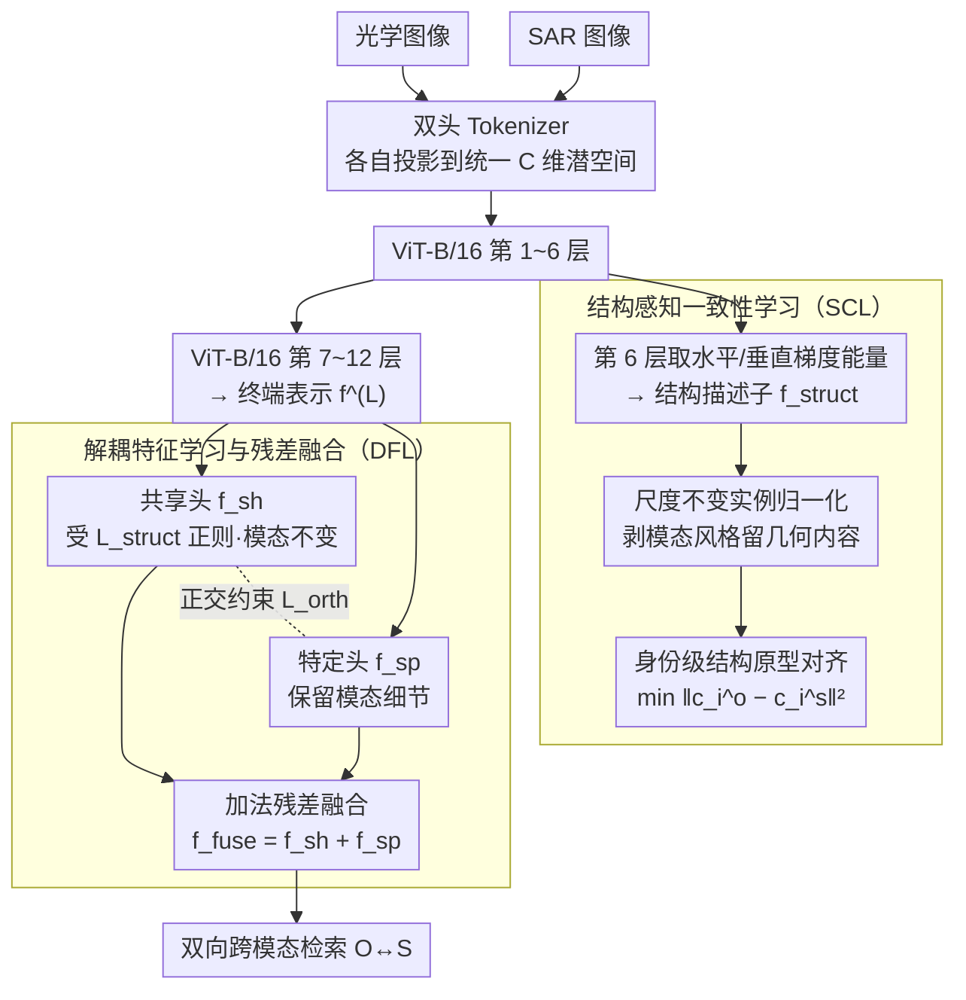

<!-- 由 src/gen_stubs.py 自动生成 -->
# SDF-Net: Structure-Aware Disentangled Feature Learning for Optical–SAR Ship Re-Identification

**会议**: CVPR2026  
**arXiv**: [2603.12588](https://arxiv.org/abs/2603.12588)  
**代码**: [cfrfree/SDF-Net](https://github.com/cfrfree/SDF-Net)  
**领域**: 目标检测 / 跨模态重识别  
**关键词**: 光学-SAR跨模态匹配, 船舶重识别, 特征解耦, 结构一致性, Vision Transformer

## 一句话总结

提出 SDF-Net，利用船舶刚体几何结构作为跨模态不变锚点，在中间层提取梯度能量强制结构一致性，在终端层解耦模态共享/特定特征并通过加法残差融合，在 HOSS-ReID 上取得 SOTA（All mAP 60.9%，超 TransOSS 3.5%）。

## 研究背景与动机

**光学-SAR 模态差异巨大**：光学图像基于被动反射，SAR 基于主动微波后向散射，两者之间存在严重的非线性辐射畸变（NRD），直接外观对齐数学上不适定

**现有方法忽视物理先验**：主流方法将跨模态 ReID 当作纯统计分布对齐问题，缺乏对船舶作为刚体这一物理特性的显式利用

**生成式方法代价高且引入伪影**：CycleGAN 等图像翻译方法虽减少统计差异，但计算成本高且可能引入遮蔽身份关键特征的幻觉伪影

**行人 ReID 方法不可直接迁移**：VI-ReID 方法关注人体姿态对齐和可变形部件，而船舶是刚体，几何结构跨模态稳定但辐射外观剧变，设计假设完全不同

**关键观察——几何结构是跨模态不变量**：船舶的船体轮廓、长宽比、空间布局在光学和 SAR 中高度一致，而纹理/强度响应是模态特定的

**中间层特征是最佳结构探针**：原始像素被 SAR 散斑噪声严重干扰，高层语义太抽象丢失空间拓扑，中间层恰好保留几何布局又足够抽象以过滤低层噪声

## 方法详解

### 整体框架

SDF-Net 抓住的关键点是：光学和 SAR 成像物理完全不同（被动反射 vs 主动微波散射），辐射外观剧变让直接对齐数学上不适定，但船舶是刚体，几何结构在两个模态里高度一致——所以它把几何结构当作跨模态不变锚点。整体基于 ViT-B/16，分四步走：输入端用跨模态双头 Tokenizer 把光学/SAR 图像各自线性投影到统一 C 维潜空间、中和低层传感器差异；中间层（第 $B_s$ 层 Transformer block）提取梯度能量做结构感知一致性学习（SCL），对齐跨模态结构原型；终端层把表示解耦成模态共享身份特征 $\mathbf{f}_{sh}$ 和模态特定特征 $\mathbf{f}_{sp}$ 再加法融合（DFL）；推理时用融合特征 $\mathbf{f}_{fuse}$ 做双向跨模态检索。其中双头 Tokenizer 与检索是脚手架，两个核心贡献是分别作用在中间层和终端层的 SCL 与 DFL。

### 关键设计

**1. 结构感知一致性学习（SCL）：把几何结构从辐射外观里剥出来对齐**

原始像素被 SAR 散斑噪声严重干扰，高层语义又太抽象丢了空间拓扑，所以 SDF-Net 选中间层（第 $B_s=6$ 层）作结构探针。它对特征图 $\mathbf{F}^{(B_s)}$ 算水平/垂直一阶偏导

$$\mathbf{G}_x(h,w) = \mathbf{F}(h,w+1) - \mathbf{F}(h,w-1)$$

空间积分得到通道级梯度能量描述子 $\mathbf{f}_{struct} = \mathbf{e}_x + \mathbf{e}_y \in \mathbb{R}^{B \times C}$，全局聚合能抑制 SAR 角反射器这类孤立强散射点。接着对 $\mathbf{f}_{struct}$ 沿通道做尺度不变实例归一化，把 SAR 的高动态范围和光学的窄带反射映射到同一标准化流形，等于剥掉模态特定风格、留下几何内容。最后在身份级而非实例级对齐：对每个身份 $i$ 算光学/SAR 结构原型 $\mathbf{c}_i^o$、$\mathbf{c}_i^s$，最小化欧氏距离

$$\mathcal{L}_{struct} = \frac{1}{|\mathcal{I}|} \sum_{i \in \mathcal{I}} \|\mathbf{c}_i^o - \mathbf{c}_i^s\|_2^2$$

原型级对齐避免过拟合到单样本噪声。

**2. 解耦特征学习与残差融合（DFL）：把模态特定信息当残差补回去而非丢掉**

跨模态匹配里模态特定特征（SAR 角反射器响应、光学颜色纹理）常被当噪声丢弃，但它们其实含精细身份信息。DFL 把终端表示 $\mathbf{F}^{(L)}$ 经两个独立线性投影头分成受 $\mathcal{L}_{struct}$ 正则的模态不变共享特征 $\mathbf{f}_{sh}$ 和保留模态细节的特定特征 $\mathbf{f}_{sp}$，用正交性约束 $\mathcal{L}_{orth} = \mathbb{E}[|\langle \bar{\mathbf{f}}_{sh}, \bar{\mathbf{f}}_{sp} \rangle|]$ 保证两个子空间独立，再做加法残差融合 $\mathbf{f}_{fuse} = \mathbf{f}_{sh} + \mathbf{f}_{sp}$。加法融合无参数、不扩展维度，把模态特定特征当残差补充进共享身份特征，既不丢判别信息又极致高效。

### 损失函数

$$\mathcal{L} = \mathcal{L}_{id} + \lambda_{orth} \mathcal{L}_{orth} + \lambda_{struct} \mathcal{L}_{struct}$$

其中 $\mathcal{L}_{id}$ 包含标签平滑交叉熵 + 加权三元组损失，$\lambda_{orth}=10.0$，$\lambda_{struct}=1.0$。

## 实验

### 数据集与设置

- **HOSS-ReID 基准**：训练集 1063 张（574 光学 + 489 SAR），测试集含 All-to-All / Optical-to-SAR / SAR-to-Optical 三种协议
- 单卡 RTX 3090，ViT-B/16 骨干，输入 256×128，SGD 优化器，100 epochs，P×K 采样（8身份×4实例，每身份 2 光学 + 2 SAR）

### 主实验：与 SOTA 对比（HOSS-ReID）

| 方法 | All mAP | All R1 | O→S mAP | O→S R1 | S→O mAP | S→O R1 |
|------|---------|--------|---------|--------|---------|--------|
| TransReID (ICCV21) | 48.1 | 60.8 | 27.3 | 18.5 | 20.9 | 11.9 |
| VersReID (TPAMI24) | 49.3 | 59.7 | 25.7 | 13.8 | 27.7 | 17.9 |
| D2InterNet (SIGIR25) | 50.2 | 59.1 | 33.0 | 21.5 | 28.8 | 25.4 |
| TransOSS (ICCV25) | 57.4 | 65.9 | 48.9 | 33.8 | 38.7 | 29.9 |
| **SDF-Net (本文)** | **60.9** | **69.9** | **50.0** | **35.4** | **46.6** | **38.8** |

### 消融实验

**模块有效性**：SCL 单独提升 SAR→Optical mAP（44.5→46.6），DFL 大幅提升 All R1（67.6→69.9），两者联合达到最优平衡（All mAP 60.9）。

**结构提取层选择**：$B_s=6$ 性能最佳，浅层（2/4）受噪声干扰，深层（8/10/12）空间语义坍缩。

**融合策略对比**：

| 策略 | All mAP | All R1 | S→O mAP |
|------|---------|--------|---------|
| 仅模态特定 $\mathbf{f}_{sp}$ | 58.7 | 67.6 | 43.9 |
| 仅共享 $\mathbf{f}_{sh}$ | 59.2 | 68.2 | 43.1 |
| 拼接 Cat | 59.5 | 68.8 | 45.1 |
| **加法融合（本文）** | **60.9** | **69.9** | **46.6** |

### 关键发现

- **计算效率极高**：SDF-Net 与 TransOSS 参数量完全相同（86.24M），FLOPs 仅增 0.17G（<0.8%），却获得 3.5% mAP / 4.0% R1 提升
- SAR→Optical 场景提升最显著（mAP +7.9%），验证了几何结构锚点对抵抗 SAR 辐射畸变的有效性
- 超参数敏感性分析表明 $\lambda_{orth}=10.0$、$\lambda_{struct}=1.0$ 附近性能稳定，偏离时温和退化而非灾难性下降

## 亮点

- **物理先验驱动设计**：首次在光学-SAR 船舶 ReID 中将刚体几何不变性作为核心学习目标，而非依赖隐式统计对齐
- **零额外参数**：SCL（梯度能量+IN）和 DFL（加法融合）均为无参数操作，极致高效
- **中间层结构探针**：巧妙利用中间 Transformer 层既过滤了低层噪声又保持空间拓扑的特性
- **原型级对齐**：在身份级而非实例级对齐结构，避免过拟合到单样本噪声
- Grad-CAM 可视化和逐层特征演化分析提供了充分的可解释性支持

## 局限性

- 梯度能量方法在极低分辨率 SAR 目标（结构轮廓完全淹没在密集散斑中）时可能失效
- 当前框架假设俯视/近垂直观测视角，实际卫星影像中极端入射角导致的 3D 结构畸变（层叠、前缩）尚未处理
- 仅在 HOSS-ReID 单一数据集验证，泛化性待更多基准确认
- 训练集规模较小（1063 张），未探索大规模预训练或数据增强策略

## 相关工作

- **跨模态行人 ReID**（VI-ReID）：DEEN、Hi-CMD、VersReID 等针对可见-红外的姿态对齐方法，不适用于刚体船舶
- **解耦表示学习**：Hi-CMD 的层级解耦、正交子空间投影，本文将模态特定特征作为残差补充而非噪声丢弃
- **光学-SAR 匹配**：HOPC 等手工结构描述子在原始像素级操作易受散斑干扰，本文转到中间潜空间
- **最强基线 TransOSS**（ICCV25）：基于 ViT 的跨模态 Tokenization，靠隐式自注意力对齐，缺乏显式物理约束

## 评分

- 新颖性: ⭐⭐⭐⭐ — 物理先验+中间层梯度能量+无参数融合的组合有独创性
- 实验充分度: ⭐⭐⭐⭐ — 消融全面（模块/层/融合/超参/计算量），可视化丰富，但仅单一数据集
- 写作质量: ⭐⭐⭐⭐ — 物理动机阐述清晰，公式推导完整
- 价值: ⭐⭐⭐⭐ — 在遥感跨模态匹配领域开拓了物理引导的结构感知范式

<!-- RELATED:START -->

## 相关论文

- [\[CVPR 2026\] AR²-4FV: Anchored Referring and Re-identification for Long-Term Grounding in Fixed-View Videos](ar2-4fv_anchored_referring_and_re-identification_for_long-term_grounding_in_fixe.md)
- [\[CVPR 2026\] PaQ-DETR: Learning Pattern and Quality-Aware Dynamic Queries for Object Detection](paq-detr_learning_pattern_and_quality-aware_dynamic_queries_for_object_detection.md)
- [\[CVPR 2026\] DA-Mamba: Learning Domain-Aware State Space Model for Global-Local Alignment in Domain Adaptive Object Detection](da-mamba_learning_domain-aware_state_space_model_for_global-local_alignment_in_d.md)
- [\[CVPR 2026\] Foundation Model Priors Enhance Object Focus in Feature Space for Source-Free Object Detection](foundation_model_priors_enhance_object_focus_in_feature_space_for_source-free_ob.md)
- [\[CVPR 2026\] UniMMAD: Unified Multi-Modal and Multi-Class Anomaly Detection via MoE-Driven Feature Decompression](unimmad_unified_multi-modal_and_multi-class_anomaly_detection_via_moe-driven_fea.md)

<!-- RELATED:END -->
