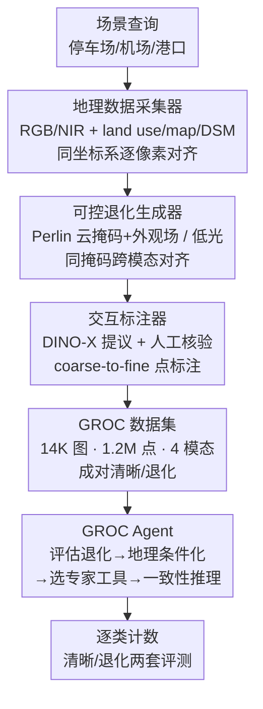

# See What We Cannot See: A Geo-guided Reasoning Benchmark for Object Counting under Adverse Earth Observation Conditions

**会议**: CVPR 2026  
**论文**: [CVF Open Access](https://openaccess.thecvf.com/content/CVPR2026/html/Wang_See_What_We_Cannot_See_A_Geo-guided_Reasoning_Benchmark_for_CVPR_2026_paper.html)  
**代码**: https://github.com/jwang-rs/GROC  
**领域**: 目标检测 / 遥感计数  
**关键词**: 遥感计数, 地理多模态, amodal 推理, 数据引擎, 计数 Agent

## 一句话总结
提出 GROC——首个面向「恶劣对地观测条件下地理引导推理计数」的大规模基准（14K 图像、1.2M 点标注，每图对齐 land use / map / DSM 三种地理模态并配套清晰-退化成对样本），通过一套可控退化 + 交互标注的数据引擎构建，并配一个以 GPT-5 为骨干、调用专家计数工具的 GROC Agent 作为基线，系统性揭示：现有计数模型一旦云雾/低光遮挡视觉线索就大幅掉点，而地理模态能提供稳定的结构与语境先验显著提升鲁棒性。

## 研究背景与动机
**领域现状**：遥感目标计数（RSOC）这些年进展很快，主流做法分密度图回归、检测和回归三类，配套的基准（RSOC、NWPU-MOC、CARPK、DroneRGBT 等）也越来越大。

**现有痛点**：几乎所有现有基准都建立在一个隐含假设上——**目标是可见的**。它们只考核「模型对已经能在视觉信号（或至多一个额外模态）里观察到的物体数得准不准」。但真实对地观测里云、雾、阴影、低光极常见，当云层完全遮住地面时，常规计数模型赖以工作的视觉信息直接消失了。现有数据集大多只有 1-2 个模态、规模有限、且没有「清晰-退化」成对图像，导致根本没法判断一个模型到底是靠可见纹理在数，还是真的会利用地理信息去推断已经看不见的物体。

**核心矛盾**：计数本质上被绑死在「直接感知」上，可对地观测里恰恰**有视觉失效但地理模态依然可靠**的天然互补性没被利用——land use 和 map 描述区域的功能语境（停车场/港口/机场），DSM 描述对天气光照不变的地表几何结构，这些先验在外观线索失效时仍然成立。作者把「靠这些先验去推断看不见物体的存在与分布」称为 **geo-guided amodal reasoning（地理引导的非模态推理）**。

**本文目标**：(1) 造一个能真正考核这种能力的数据集——必须同时具备多地理模态、成对清晰/退化观测、足够大的规模和可靠标注；(2) 提供可规模化生产此类数据的引擎；(3) 建立首个基准并给一个利用地理模态推理的 Agent 基线。

**切入角度**：从「earth observation 天然提供地理模态」这个观察出发——既然视觉会失效但 DSM/map/land use 不会，那就把它们对齐进来，逼模型去「看见看不见的东西」。

**核心 idea**：把对齐的三种地理模态 + 成对清晰/退化图像打包成基准，把计数问题从「感知得准」升级成「视觉证据不全时还能不能基于地理先验推理出来」。

## 方法详解
这篇是 benchmark 论文，核心贡献是 **GROC 数据集 + 可规模化数据引擎 + GROC Agent 基线**三件套，下面按数据集设计、引擎、Agent 三块讲清。

### 整体框架
GROC 围绕一个目标组织：让基准能区分「模型是在感知可见物体，还是在用地理先验做非模态推理」。为此数据集每张图都同时带 **视觉信号（RGB + NIR 四波段）** 和 **三种对齐地理模态（land use / map / DSM）**，并提供 **同一场景的清晰版与合成退化版成对样本**。数据由一条三段式引擎流水线产出——地理数据采集器先按场景查询（停车场/机场/港口）抓取地理配准影像并裁成 1024×1024 patch、保留地理坐标；可控退化生成器在清晰 patch 上合成云雾遮挡和低光，产出 modality-consistent 的退化样本；交互标注器借 DINO-X 做点提议、人工核验，coarse-to-fine 完成密集点标注。最终在数据集之上建立基准：把密度计数模型、检测器、MLLM、以及一个调用专家工具的 GROC Agent 一起拉来评测，分清晰场景和退化场景两套打分。

### 关键设计

**1. GROC 数据集：用地理模态 + 成对清晰/退化样本撑起「非模态推理」考核**

针对「现有基准只有 1-2 模态、没成对退化图、数不准就分不清是感知还是推理」这个痛点，GROC 在数据组成上做了三件别人没做全的事。其一，**四模态对齐**：每张图除 RGB/NIR 外，对齐了 land use（粗语义语境的类别栅格）、map（结构化空间布局的栅格层）、DSM（描述地表几何的单波段栅格），三者与影像在**同一年份、同一坐标系逐像素对齐**，保证每个像素对应同一物理位置——这正是视觉失效时还能推理的前提。其二，**成对清晰/退化观测**：验证/测试集额外含退化子集，同一场景既有清晰又有退化版本，使「视觉变差掉多少分」可被受控地量化。其三，规模与标注质量：1.2M 点标注、14K 图像、GSD 0.25m，聚焦 car/truck/boat/airplane 四类**可移动**目标（选可移动而非静态目标，是因为静态物体一旦退化消失就能直接数，而移动目标在视觉被遮时更依赖语境与地理先验来推断），天然呈长尾分布。对比现有基准（见下表 Table 1 摘要），GROC 是首个把模态数提到 4、同时具备恶劣天气+光照退化、且实例数破百万的基准。

**2. 可规模化数据引擎：可控退化 + DINO-X 交互标注，低成本造出可靠的成对样本**

针对「这种成对、多模态、密集标注的数据靠人工根本造不起」的痛点，引擎用三个组件流水化解决。采集器从公共地理库抓取地理配准的 RGB/NIR/DSM/map/land use，按场景查询裁 patch 并保留 patch 级地理坐标，每个 patch 同时导出轻量 PNG（可视化）和原始 TIFF（保留辐射与地理元数据）。**可控退化生成器**是关键：云的合成拆成「程序化云掩码」和「云外观场」两部分——掩码决定云覆盖的空间范围与不透明度，外观场决定云的视觉特征，退化图通过按掩码把清晰图与云外观混合得到（重度遮挡区被云信号主导、清晰区贴近原观测）。云形态用**多尺度 Perlin 湍流**生成，可灵活控制云的位置、厚度、不透明度，从薄雾、散云一直覆盖到密集阴天；还加入云阴影和轻微逐通道空间偏移来模拟传感器视差。**关键的一点是同一套云/阴影掩码同时作用于 RGB 和 NIR，保证跨模态遮挡对齐**——这对地理引导推理至关重要。低光则通过降曝光、gamma 压暗、并注入「暗区更强」的信号相关噪声来近似成像过程。**交互标注器**用 coarse-to-fine：稀疏区人工直接点标，密集区先框出感兴趣区域、裁出 RGB patch 交给 DINO-X 出点提议，标注员核验纠正、对难区进一步细分重复，直到完成；DINO-X 全程作为固定的提议生成器，标注结果全部经人工核验。

**3. GROC Agent：以 reasoning–action–observation 循环把地理模态与专家工具串成可推理的计数基线**

针对「光有数据集没有会用地理模态的方法，基准无法被有意义地探测」的痛点，作者给了一个轻量、可解释的 agentic 基线——刻意不做成复杂的独立模型，而当作考核「多模态推理能否在视觉不可靠时帮上忙」的 testbed。它建在带视觉-语言理解和工具调用能力的 MLLM 上（当前实现用 **GPT-5** 作骨干，但框架 model-agnostic），**纯 prompt、不在 GROC 上微调**，因此其行为反映的是通用多模态推理与工具协调能力而非数据集特化。推理流程是一个结构化循环：先从视觉信号评估退化程度、估计外观线索的可靠性；再引入对齐的 land use/map/DSM 提供稳定的结构与语义语境；然后根据场景状况和目标类别**自适应选择外部专家工具**（接入 BL、PSGCNet、FIDTM、DINO-X 等强计数模型，覆盖密度估计与检测两种视角），并做**一致性感知推理**——不是朴素聚合，而是借工具间一致性压制不可靠预测、refine 最终估计。输出是逐类计数 + 一段结构化推理轨迹（解释结论怎么从视觉线索、地理先验和工具响应推导出来）。作者强调它不是终极解法，而是可扩展的基准基线。

## 实验关键数据

评测全程用官方 train/val/test（约 70%/15%/15%，且地理上不重叠以防空间泄漏），指标为 MAE 和 RMSE（越低越好）；退化评测从 val/test 选 200 张代表性图像合成恶劣天气与光照。

### 主实验：清晰场景四类计数（Table 2，MAE）

| 方法 | Airplane MAE | Truck MAE | Boat MAE | Car MAE |
|------|------|------|------|------|
| MCNN (2016) | 3.213 | 5.446 | 12.412 | 11.358 |
| CSRNet (2018) | 3.382 | 5.683 | 6.169 | 8.730 |
| PSGCNet (2022) | 1.115 | 2.636 | 3.512 | 5.412 |
| FIDTM (2023) | 4.138 | 2.856 | 3.887 | 6.089 |
| DINO-X (2025) | 0.345 | 3.130 | 9.102 | 12.429 |
| Qwen3-VL-8B-Instruct (2025) | 0.286 | 3.055 | 10.608 | 11.330 |
| **GROC Agent (ours)** | **0.276** | **2.411** | **3.227** | **5.131** |

清晰场景下专门的计数模型已经很强，PSGCNet 各类最均衡；开放词表检测器（GroundingDINO/DINO-X）在 airplane 这种显著、可分目标上极好（DINO-X airplane MAE 0.345），但在 boat/car 这类小而密的类别上明显劣化（DINO-X boat MAE 9.102）。GROC Agent 靠自适应整合多个专家模型、削减单一工具的大误差，拿到总体最佳。但作者明确指出：清晰场景主要反映标准感知能力，GROC 的真正挑战在退化场景。

### 退化场景鲁棒性（Table 3，整体 MAE）

| 方法 | clear MAE | adverse MAE | weather MAE | illumination MAE |
|------|------|------|------|------|
| BL (2019) | 4.968 | 19.322 | 17.659 | 21.075 |
| PSGCNet (2022) | 4.105 | 18.947 | 17.927 | 20.023 |
| FIDTM (2023) | 4.589 | 26.135 | 16.464 | 36.332 |
| GroundingDINO Pro (2024) | 12.437 | 28.759 | 32.613 | 24.647 |
| DINO-X (2025) | 8.418 | 20.608 | 26.948 | 13.924 |
| Qwen3-VL-8B-Instruct (2025) | 40.302 | 40.841 | 41.433 | 40.217 |
| **GROC Agent (ours)** | **3.940** | **14.476** | **15.378** | **13.518** |

所有方法一旦遇到云雾/低光都明显掉点，证实它们重度依赖直接视觉信号：如 PSGCNet 的 MAE 从清晰 4.105 飙到 adverse 18.947。其中密度类（FIDTM、BL）在恶劣天气下相对稳，开放词表检测器 DINO-X 因鲁棒特征在低光下更抗（illumination MAE 13.924）；而通用 MLLM（Qwen3-VL-8B）几乎不受退化影响地「一直很差」（各列 MAE 都在 40 上下），说明通用多模态推理本身远不足以胜任退化计数。GROC Agent 在所有退化设置下总体最佳（adverse MAE 14.476），靠自适应组合专家工具+缓解不可靠预测取得。

### 关键发现
- **清晰 → 退化的巨大鸿沟是核心结论**：高分模型在退化后普遍大幅掉点，说明现有方法泛化能力局限于直接感知；而利用地理信息的方法鲁棒性更好，凸显「基于稳定地理先验推理」相比「只靠外观」的价值。
- **小而密类别是软肋**：检测器在 airplane（大而稀）上极强，但 boat/car（小而密）上即便清晰场景也明显劣化，退化后更甚。
- **Agent 增益有上限**：GROC Agent 虽总体最佳，但作者坦言在视觉证据几乎完全不可用的严重退化下增益有限——这正说明「超越直接感知的计数」仍是开放难题，呼唤更强的地理引导推理。⚠️ 论文正文未给 Agent 各专家工具的逐一消融，工具贡献拆分以原文/补充材料为准。

## 亮点与洞察
- **「成对清晰/退化 + 跨模态对齐遮挡」是这套基准最巧的地方**：同一套云/阴影掩码同时打到 RGB 和 NIR 上，保证退化是 modality-consistent 的，从而能干净地把「感知能力」和「推理能力」解耦评测——这是现有基准做不到的。
- **用可控退化把「数据稀缺」问题工程化解决**：把云合成拆成掩码 + 外观场、用多尺度 Perlin 湍流参数化云的厚度/范围/不透明度，等于把退化变成可调旋钮，能系统性产出不同损坏程度的成对样本，这套思路可迁移到任何需要「成对清晰-退化」评测的遥感任务。
- **Agent 当 testbed 而非 SOTA 的定位很克制**：纯 prompt、不微调、model-agnostic，把它当「探针」而非终极方案，反而让基准结论更可信——它揭示的鸿沟不是某个特定模型的缺陷，而是范式级的。
- **「geo-guided amodal reasoning」是个可迁移的问题表述**：把「看不见还要数」明确成非模态推理 + 地理先验，给遥感感知指了一个新方向。

## 局限与展望
- 作者承认 GROC Agent 在严重退化下增益有限，地理引导推理远未解决——这既是局限也是留给后续的空间。
- ⚠️ 退化样本是**合成**的（程序化云 + gamma 压暗噪声），realism 验证放在补充材料；合成退化与真实云雾/低光的分布差异可能影响结论外推，真实退化数据的鲁棒性仍待验证。
- 退化评测只在 200 张代表性子集上做，规模相对清晰场景小很多，统计稳健性有限。
- 类别只覆盖 car/truck/boat/airplane 四类移动目标，向建筑/树木等其他遥感目标的泛化未知。
- 改进思路：把 Agent 从「调用现成专家工具」升级为「真正端到端学会用 DSM/map 做几何/语境推断」，以及引入真实退化数据做对照，可能是缩小这个鸿沟的方向。

## 相关工作与启发
- **vs 通用目标计数（GOC，如 ShanghaiTech/NWPU-Crowd 及 CAPTURe）**：GOC 多假设目标可见，CAPTURe 虽考核非模态计数但缺地理模态线索；GROC 提供对齐地理模态，能真正评测「靠先验推断不可见物体」。
- **vs 遥感计数基准（RSOC、NWPU-MOC）**：它们限于 1-2 模态、极少有成对清晰/退化观测，无法考核 amodal 推理；GROC 用三对齐地理模态 + 成对退化补齐这两点。
- **vs 多模态计数（MMOC，融合热成像/NIR/深度/SAR）**：这些仍是 perception-driven，要求物体至少在某一模态里可感知；GROC 的关键差异在于考核「所有视觉模态都失效时，能否靠地理先验推理」。

## 评分
- 新颖性: ⭐⭐⭐⭐⭐ 首个把「地理引导非模态推理」问题化并配齐四模态 + 成对退化的计数基准，问题表述本身就开了新方向。
- 实验充分度: ⭐⭐⭐⭐ 横扫密度/检测/MLLM/Agent 四类基线、清晰与退化两套评测充分，但退化仅 200 张子集且 Agent 工具贡献缺细粒度消融。
- 写作质量: ⭐⭐⭐⭐ 动机链条清晰、数据引擎讲得具体，「see what we cannot see」的叙事统一有力。
- 价值: ⭐⭐⭐⭐⭐ 数据集 + 引擎 + Agent 三件套开源，为鲁棒遥感计数与地理引导推理提供了可直接用的 testbed。

<!-- RELATED:START -->

## 相关论文

- [\[CVPR 2026\] Does YOLO Really Need to See Every Training Image in Every Epoch?](does_yolo_really_need_to_see_every_training_image_in_every_epoch.md)
- [\[CVPR 2026\] CD-Buffer: Complementary Dual-Buffer Framework for Test-Time Adaptation in Adverse Weather Object Detection](cd-buffer_complementary_dual-buffer_framework_for_test-time_adaptation_in_advers.md)
- [\[CVPR 2026\] Boosting Quantitive and Spatial Awareness for Zero-Shot Object Counting](boosting_quantitive_and_spatial_awareness_for_zero-shot_object_counting.md)
- [\[CVPR 2026\] ADSeeker: A Knowledge-Grounded Reasoning Framework for Industry Anomaly Detection and Reasoning](adseeker_a_knowledge-grounded_reasoning_framework_for_industry_anomaly_detection.md)
- [\[CVPR 2026\] Heuristic-inspired Reasoning Priors Facilitate Data-Efficient Referring Object Detection](heuristic-inspired_reasoning_priors_facilitate_data-efficient_referring_object_d.md)

<!-- RELATED:END -->
