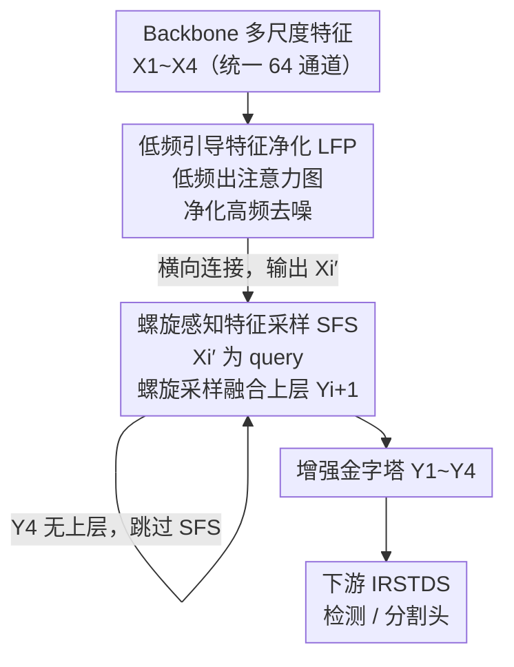

# Seeing Through the Noise: Improving Infrared Small Target Detection and Segmentation from Noise Suppression Perspective

**会议**: CVPR 2026  
**论文**: [CVF Open Access](https://openaccess.thecvf.com/content/CVPR2026/html/Yuan_Seeing_Through_the_Noise_Improving_Infrared_Small_Target_Detection_and_CVPR_2026_paper.html)  
**代码**: 无  
**领域**: 目标检测 / 红外小目标  
**关键词**: 红外小目标, 噪声抑制, 频域分析, 特征金字塔, 虚警抑制

## 一句话总结
针对红外小目标检测中"增强高频特征会同步抬高虚警率"的痛点，本文从频域视角提出噪声抑制型特征金字塔 NS-FPN，用低频引导的特征净化模块（LFP）和螺旋感知的特征采样模块（SFS）替换 FPN 里的 1×1 卷积与上采样，在几乎不增加计算量的前提下大幅压低虚警并提升定位精度。

## 研究背景与动机
**领域现状**：红外小目标检测与分割（IRSTDS）目前由 CNN 方法主导，主流思路是设计更复杂的特征融合结构（DNANet、MSHNet、IRSAM 等），把高层语义和低层细节融合起来，以更准地定位那些又暗又小、几乎没有纹理的目标。

**现有痛点**：这些方法只盯着"增强特征表示"，几乎都倚重高频分量来刻画目标边缘和细节。结果是 IoU、Pd（检出概率）确实漂亮，但虚警率（Fa）居高不下——增强高频的同时把高频里夹带的噪声也一起放大了，背景杂波被误判成目标。

**核心矛盾**：作者把图像做离散 Haar 小波分解后发现一对相互拉扯的事实：① 高频分量对定位至关重要，但也是虚警的主要来源；② 低频分量会损害定位精度，却恰恰是压制虚警的最佳线索。换句话说，定位精度和虚警抑制在频域上落在了高频/低频两端，单纯堆高频不可能两头都赢。

**本文目标 / 切入角度**：与其继续在网络结构上做加法，不如换一个被忽略的视角——主动做"噪声抑制"而非一味"特征增强"。具体拆成两件事：用低频去净化高频里的噪声，再在特征融合（采样）阶段避开周围背景噪声。

**核心 idea**：用低频分量去引导、净化高频分量，并按红外小目标的强度分布先验做结构化采样，把噪声抑制直接嵌进 FPN 的横向连接和上采样里，做成一个轻量、可即插即用的 NS-FPN。

## 方法详解

### 整体框架
NS-FPN 沿用经典 FPN 的自顶向下结构：从 backbone 抽取多尺度特征 $\{X_1, X_2, X_3, X_4\}$（对应步长 2/4/8/16，统一降到 64 通道），再自顶向下构造特征金字塔 $\{Y_1, Y_2, Y_3, Y_4\}$。关键改动只有两处替换：

- 用 **LFP 模块** 替换原 FPN 横向连接里的 1×1 卷积——对每个尺度的 $X_i$ 做低频引导的高频净化，输出去噪后的 $X_i'$（所有 4 个尺度都接 LFP）；
- 用 **SFS 模块** 替换原 FPN 的上采样操作——以净化后的 $X_i'$ 为查询、上层特征 $Y_{i+1}$ 为键值，按螺旋形采样融合，输出 $Y_i$（仅 $Y_1, Y_2, Y_3$ 接 SFS，$Y_4$ 不接，因其没有更上层特征可融）。

整条管线就是"先 LFP 净化、再 SFS 采样融合"在每个尺度上重复，最后把增强后的 $\{Y_1, ..., Y_4\}$ 送入下游检测/分割头。正因为只是替换 FPN 里两个标准组件，NS-FPN 能轻松插进现有的 IRSTDS 框架（分割接 MSHNet、检测接 YOLOv8n-p2）。

### 关键设计

**1. 低频引导的特征净化 LFP：让低频当"门卫"，把高频里的噪声筛掉**

这一模块正面回应"高频带来定位也带来虚警"的矛盾。它的核心假设是：低频分量虽然定位差，但能可靠地指出"目标大概在哪"，因此可以用低频生成一张目标位置的权重图，去约束高频该在哪里被增强、哪里该被压住。LFP 是一个两阶段净化机制。

第一阶段，对输入特征 $X_i$ 做单层 2D 离散小波变换分解出低/高频：$[F_l, F_h] = \text{DWT}(X)$。再对低频 $F_l$ 做空间注意力，把平均池化和最大池化拼起来过卷积、Sigmoid 得到权重图 $A_s = \text{Sigmoid}(\text{Conv}(\text{APool}(F_l)\,\|\,\text{MPool}(F_l)))$，并用它逐元素调制高频：$\hat{F_h} = A_s \odot F_h$。这一步用"低频认定的目标位置"去放大目标相关高频、抑制背景高频。

第二阶段，对调制后的高频 $\hat{F_h}$ 再做一道**门控高斯滤波**，只对那些绝对值低于阈值 $\tau$ 的"低置信高频"施加平滑，高置信的高频原样保留：

$$\tilde{F_h} = \mathcal{G}(\hat{F_h}) \cdot \mathbb{I}_{<\tau}(|\hat{F_h}|) + \hat{F_h} \cdot \mathbb{I}_{\geq\tau}(|\hat{F_h}|)$$

其中 $\mathbb{I}(\cdot)$ 是指示函数做门控，$\mathcal{G}$ 是高斯核 $\mathcal{G}(i,j;\sigma) = \frac{1}{Z}\exp(-\frac{(i-c)^2+(j-c)^2}{2\sigma^2})$，$\sigma$ 是可学习的标准差。最后用逆小波变换重建：$X' = \text{IDWT}(F_l, \tilde{F_h})$。这样输出既保留了被低频认可的高频增强，又把模糊不清的噪声高频平滑掉，从源头压低虚警。

**2. 螺旋感知的特征采样 SFS：按红外小目标的强度分布形状采样，避开周围背景噪声**

净化完每个尺度的特征后，自顶向下融合时需要把上层 $Y_{i+1}$ 采样到当前尺度。直接用可变形注意力 DAT 做随机稀疏采样在这里行不通——红外小目标又暗又小、占据紧凑且形状一致的区域，随机采样点很难区分目标和周围背景，反而徒增计算（见实验 Table 1：DAT 不仅没涨点，IoU 还从 68.82 掉到 68.52、虚警升高）。

SFS 的解法是把采样点的位置先验"焊死"成螺旋形。对上层特征先铺一组均匀参考点 $p$，再用偏移 $\Delta p = s + \epsilon$ 去采样：$Y_{i+1}' = \phi(Y_{i+1}; p+\Delta p)$，其中 $\phi$ 是双线性插值，$s$ 是固定的螺旋分布、$\epsilon$ 是可学习偏置。螺旋模式在极坐标下按注意力头 $h$ 构造：$s^{(h,k)} = l_s\,[\cos\theta_{h,k}, \sin\theta_{h,k}]^\top$，$\theta_{h,k} = \frac{2\pi k}{P} + \frac{2\pi h}{H}$，半径 $l_s = l_0 + k\cdot\Delta l$ 随采样点序号 $k$ 螺旋外扩。之所以用螺旋，是因为红外小目标的强度近似高斯分布，螺旋采样能从目标中心向外细粒度地铺点、贴合这种由强到弱的径向结构，从而采到更干净的目标相关特征。

采样得到 $Y_{i+1}'$ 后，以 LFP 净化特征 $X_i'$ 为查询、$Y_{i+1}'$ 为键值做交叉注意力算相似度 $F_s = \text{Attn}(\text{LN}(X_i'), \text{LN}(Y_{i+1}'))$，再残差融合 $Y_i = X_i' + F_s$。SFS 还有一个降本的巧思：**所有查询共享同一组可学习偏移**（而非每个查询各学一套），因为小目标形状一致，共享偏移让采样更稳定、计算更省（Table 1：SFS 比 DAT 计算量更低且效果更好）。

## 实验关键数据

数据集为 IRSTD-1k（1000 张 512×512 红外图）和 NUAA-SIRST（427 张），各按 8:2 划分训练/测试。分割用 IoU/Pd/Fa，检测用 mAP50/mAP75/mAP。分割接 MSHNet、检测接 YOLOv8n-p2。

### 主实验
与各类 SOTA 在 IRSTD-1k / NUAA-SIRST 上的分割对比（Fa 单位 $10^{-6}$，越低越好）：

| 方法 | IRSTD-1k IoU↑ | IRSTD-1k Pd↑ | IRSTD-1k Fa↓ | NUAA IoU↑ | NUAA Pd↑ | NUAA Fa↓ |
|------|------|------|------|------|------|------|
| DNANet (TIP 22) | 65.71 | 91.84 | 17.61 | 74.31 | 98.17 | 15.97 |
| SCTransNet (TGRS 24) | 68.64 | 91.84 | 11.92 | 77.09 | 98.17 | 15.26 |
| MSHNet (CVPR 24) | 67.16 | 93.88 | 15.03 | 74.60 | 99.08 | 17.21 |
| **MSHNet + NS-FPN (Ours)** | **69.29** | **95.24** | **8.58** | **78.75** | **100.0** | **1.60** |

虚警抑制是最大亮点：NUAA 上 Fa 从基线 MSHNet 的 17.21 直接压到 1.60，同时 IoU/Pd 还都涨到最优。检测任务上 YOLOv8n + NS-FPN 也全面领先：IRSTD-1k mAP 从 41.5→42.1、mAP75 从 31.9→36.9；NUAA mAP75 从 40.3 飙到 61.6。

不同 FPN 变体对比（增量为相对 FPN 的参数/FLOPs）也显示 NS-FPN 在涨点的同时极轻量：

| 方法 | IoU | Pd | Fa | mAP50 | 参数(M) | FLOPs(G) |
|------|------|------|------|------|------|------|
| FPN | 67.0 | 91.2 | 13.1 | 85.9 | 3.91 | 6.80 |
| PANet | 68.9 | 93.5 | 6.7 | 85.0 | +0.41 | +1.41 |
| HSFPN | 66.7 | 94.9 | 18.1 | 85.1 | +0.17 | +0.98 |
| **Ours** | **69.2** | **95.2** | 8.5 | **86.3** | +0.26 | +1.16 |

### 消融实验
LFP 与 SFS 逐模块叠加（baseline = MSHNet + 原 FPN）：

| LFP | SFS | IRSTD-1k IoU↑ | IRSTD-1k Fa↓ | NUAA IoU↑ | NUAA Fa↓ |
|------|------|------|------|------|------|
| | | 67.04 | 13.06 | 76.04 | 12.42 |
| ✓ | | 68.82 | 9.79 | 76.99 | 12.07 |
| | ✓ | 67.81 | 13.66 | 78.07 | 4.61 |
| ✓ | ✓ | **69.29** | **8.58** | **78.75** | **1.60** |

| 采样方式 | IoU↑ | Pd↑ | Fa↓ | FLOPs |
|------|------|------|------|------|
| Upsample | 68.82 | 94.56 | 9.79 | 6.80G |
| DAT | 68.52 | 93.54 | 10.40 | +1.24G |
| **SFS (Ours)** | **69.29** | **95.24** | **8.58** | +1.16G |

### 关键发现
- **两模块互补、合力压虚警**：单独上 LFP 主要在 IRSTD-1k 上把 IoU/Pd 拉高、Fa 降 3.27；单独上 SFS 在 NUAA 上把 Fa 从 12.42 砍到 4.61；两者合用才同时拿到最优 IoU 和最低 Fa。
- **LFP 用在大尺度层更利于压虚警**：Table 3 显示把 LFP 用在大尺度浅层（X1、X2）能把 Fa 压到 6.15，小尺度深层语义强但 Fa 偏高；全尺度都用取得最佳整体折中。
- **SFS 优于 DAT 且更省**：螺旋采样 + 共享偏移比可变形随机采样既涨点又少算 0.08G FLOPs，验证了"对齐目标强度分布的结构化采样"对小目标更有效。
- **超参 H=8、P=4 最优**：注意力头 H 过多会因每头信息不足掉点，采样点 P 过大会引入更多计算和虚警。

## 亮点与洞察
- **换视角而非堆结构**：把红外小目标的虚警问题第一次明确归因到"高频增强带噪"，并从频域给出"低频压噪、高频定位"的清晰分工，这个观察本身比具体模块更有启发性。
- **低频当注意力先验**：用低频生成空间注意力图去门控高频，是一种很巧的"用频域语义指导频域细节"的做法，可迁移到任何"细节增强会放大噪声"的小目标/低 SNR 任务（如医学小病灶、遥感弱目标）。
- **把领域先验写进采样几何**：螺旋采样直接把"目标强度近高斯、形状一致"的物理先验编码进采样点轨迹，比让网络从随机点自己学更稳更省——这种"用先验约束注意力采样几何"的思路值得借鉴。
- **即插即用、近零成本**：仅替换 FPN 的两个标准算子，+0.26M 参数 / +1.16G FLOPs 就能给现成检测/分割框架同时降虚警涨点，落地性很强。

## 局限与展望
- 实验只在 IRSTD-1k 和 NUAA-SIRST 两个数据集上验证，规模偏小（合计不到 1500 张），在更大规模、更多样杂波场景下的泛化性待考。
- 门控高斯滤波依赖一个经验阈值 $\tau$，论文未充分讨论其敏感性；$\tau$ 选取不当可能误平滑掉弱目标的真高频。⚠️ 阈值设置细节以原文为准。
- 螺旋采样的几何先验是为"近高斯、形状一致"的红外小目标量身定做的，对形状不规则或较大的目标可能不再适配，方法的适用边界相对窄。
- 后续可探索把噪声抑制思路推广到视频红外序列（利用时序低频做更强的虚警抑制），或让螺旋参数（$l_0$、$\Delta l$）自适应目标尺度。

## 相关工作与启发
- **vs MSHNet / DNANet 等增强派**：它们专注设计复杂融合结构来增强特征以"抵消"噪声影响，结果定位好但虚警高；本文转向主动抑制噪声，在同一 backbone 上把虚警大幅压低，定位还更准。
- **vs HS-FPN**：HS-FPN 为可见光小目标设计，过度依赖预设频段的高频、忽视低频，对红外任务失效；本文反其道用低频自适应引导高频，是专为 IRSTDS 定制。
- **vs DAT（可变形注意力）**：DAT 的随机稀疏采样对又小又紧凑的红外目标不友好，既不涨点又增算；SFS 用螺旋结构 + 共享偏移把采样几何对齐到目标强度分布，更稳更省。
- **vs IRPruneDet / IRSAM**：同样关注频域/小波，但它们仍在"如何更好利用高频"的框架内（剪枝或去噪保边），本文则把低频提升为压制高频噪声的主动线索，问题切入点不同。

## 评分
- 新颖性: ⭐⭐⭐⭐⭐ 首次从频域把红外小目标虚警归因到高频带噪，并用低频引导净化 + 螺旋采样给出系统解法，视角新。
- 实验充分度: ⭐⭐⭐⭐ 检测+分割双任务、多 SOTA 对比、逐模块/逐尺度/超参消融齐全，但仅两个小数据集。
- 写作质量: ⭐⭐⭐⭐⭐ 频域动机分析清晰，图表（频域分解、采样可视化）支撑到位，逻辑顺畅。
- 价值: ⭐⭐⭐⭐⭐ 轻量即插即用、显著降虚警，对红外小目标这类高虚警痛点任务实用性强。

<!-- RELATED:START -->

## 相关论文

- [\[CVPR 2026\] Target-Aware Invertible Encoder with Reconstruction Guidance for Infrared Small Target Detection](target-aware_invertible_encoder_with_reconstruction_guidance_for_infrared_small_.md)
- [\[CVPR 2026\] CHAL: Causal-guided Hierarchical Anomaly-aware Learning for Moving Infrared Small Target Detection](chal_causal-guided_hierarchical_anomaly-aware_learning_for_moving_infrared_small.md)
- [\[NeurIPS 2025\] Rethinking Evaluation of Infrared Small Target Detection](../../NeurIPS2025/object_detection/rethinking_evaluation_of_infrared_small_target_detection.md)
- [\[CVPR 2026\] Towards an Incremental Unified Multimodal Anomaly Detection: Augmenting Multimodal Denoising From an Information Bottleneck Perspective](towards_an_incremental_unified_multimodal_anomaly_detection_augmenting_multimoda.md)
- [\[CVPR 2026\] RAVEN: Radar Adaptive Vision Encoders for Efficient Chirp-wise Object Detection and Segmentation](raven_radar_adaptive_vision_encoders_for_efficient_chirp-wise_object_detection_a.md)

<!-- RELATED:END -->
