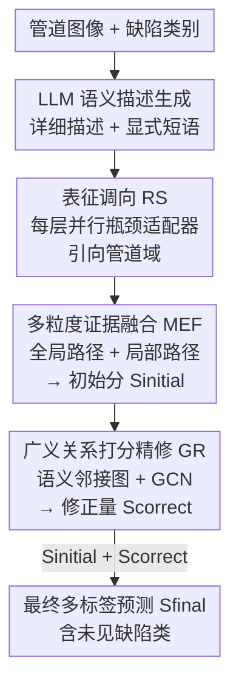

# SFR-Net: Steering-Fusion-Refining Network in Multi-label Zero-Shot Sewer Defect Detection

**会议**: CVPR 2026  
**论文**: [CVF Open Access](https://openaccess.thecvf.com/content/CVPR2026/html/Chen_SFR-Net_Steering-Fusion-Refining_Network_in_Multi-label_Zero-Shot_Sewer_Defect_Detection_CVPR_2026_paper.html)  
**代码**: https://github.com/infinitycan/SFR-Net (有)  
**领域**: 多标签零样本 / 工业缺陷检测 / 视觉-语言对齐  
**关键词**: 多标签零样本学习, 下水道缺陷检测, CLIP域适配, 图卷积, 参数高效微调

## 一句话总结
SFR-Net 用「调向（RS）→ 融合（MEF）→ 精修（GR）」三段式流水线把 CLIP 改造到下水道缺陷场景，先用轻量适配器把表征引向管道域、再融合全局与局部证据出初始分、最后用 GCN 从可见类学到一套可迁移的"打分修正逻辑"补到未见类上，在 Sewer-ML 和自建 WZ-Pipe 两个数据集的多标签零样本任务上刷到 SOTA（Sewer-ML ML-ZSL mAP 12.58%，约为次优方法的两倍）。

## 研究背景与动机

**领域现状**：市政下水道缺陷检测本质是一个多标签图像识别任务——一张管道内壁图里可能同时有变形、堵塞、裂缝、树根入侵等多种缺陷。主流做法是在 Sewer-ML 这类数据集上训 CNN/GNN 多标签分类器，闭集性能不错。

**现有痛点**：管道场景标注成本极高，而且很多罕见缺陷要管道运行几十年才出现，早期训练样本极度稀缺，导致严重长尾甚至某些类别完全没有样本可学。多标签零样本学习（ML-ZSL）本是出路——借助词嵌入/语义知识从可见类迁移到未见类，但现有 ML-ZSL 方法在这个专业域里全都水土不服：基于属性的方法要人工定义庞大属性矩阵、扩展性差；基于 CLIP 等 VLM 的方法受困于下水道数据与预训练数据之间的巨大域间隙；CoOp/CoCoOp 这类提示微调方法因为冻结图像编码器、缺乏域适配和细粒度特征提取能力，面对昏暗光照、细微裂缝时仍然失败。

**核心矛盾**：作者把根因归结为一个叫**对齐歧义（Alignment Ambiguity）**的问题——管道内部复杂的视觉环境与往往稀疏的语义描述之间，无法建立鲁棒且细粒度的视觉-语义对齐。一方面图像编码器没被调到管道域，提取的特征本身就糊；另一方面全局 CLS 特征丢了识别细微缺陷所需的局部细节；再加上未见类缺乏直接监督，打分容易跑偏。

**本文目标**：在不引入大量参数、不破坏 CLIP 泛化能力的前提下，把对齐歧义逐级化解，让模型既能识别可见缺陷又能泛化到从未见过的缺陷类别。

**切入角度**：与其一步到位硬对齐，不如把"消歧"拆成渐进的三步——先把表征"调向"管道域（解决特征不适配），再"融合"多粒度证据得到可靠初判（解决细节丢失），最后从可见类关系里"精修"打分逻辑并迁移到未见类（解决零样本打分跑偏）。

**核心 idea**：用三阶段的 Steering-Fusion-Refining 流水线渐进消解视觉-语义对齐歧义，并用一条"可迁移的打分修正技能"把零样本泛化能力补齐。

## 方法详解

### 整体框架
SFR-Net 建立在冻结的 CLIP（ViT-B/16）双编码器之上，图像和文本编码器主干全程不训练。输入一张管道图像，输出是对全部缺陷类别（含训练时从未出现的未见类）的多标签预测分数。整条流水线分三段：**RS** 在编码器每一层并行插入轻量适配器，把中间表征持续"引向"管道域；**MEF** 在调好向的特征上，分全局/局部两条解耦路径产出初始预测分 $S_{\text{initial}}$；**GR** 用一张由语义相似度构建的类别邻接图驱动 GCN，从可见类学到一套"打分修正"技能，算出修正量 $S_{\text{correct}}$ 加回去得到最终分 $S_{\text{final}}$。文本侧的语义描述则由 LLM 预先生成（详细描述供 CLIP 文本编码器编码、显式短语供 GR 构图），整套用一个组合损失 $\mathcal{L}_{\text{scl}}$ 端到端训练。

### 关键设计

**1. LLM 定制化缺陷描述生成：把"一张照片是X"换成域专家级文本**

现有 ML-ZSL 大多只用 `"A photo of a [Category]"` 这种固定模板，在充斥专业术语的下水道场景里语义太单薄，文本特征不鲁棒，对齐自然糊。作者改用 LLM（实现里是 Gemini-2.5 Flash）为每个缺陷码生成两种文本：**详细描述（Detailed Description）**——一句域专属、严格控制在 77 token 以内（CLIP 上下文长度）的句子，喂给 CLIP 文本编码器产出鲁棒语义特征；**显式短语（Explicit Phrase）**——一个简洁无歧义的名词短语，专门用于 GR 模块构建类别邻接矩阵。提示词里塞进角色设定、参考标准（丹麦 TVinspektion 排水管道检测规范）和格式约束，把 LLM 的专业知识逼出来。消融（表4）显示：人工短描述反而最差（细粒度语义不足），固定模板因继承了 CLIP 的结构对齐居然超过人工描述，而 LLM 增强描述在所有任务上最好——证明高语义密度的域专属文本是泛化的关键燃料。

**2. 表征调向 RS：用每层瓶颈适配器把 CLIP 拽进管道域而不遗忘**

把 CLIP 用到零样本缺陷检测，核心难题是既要跨过域间隙、又不能灾难性遗忘——表5 证明全量微调（All-Finetune）会让可见类知识崩坏。受 PEFT 启发，RS 在图像/文本编码器的**每个** Transformer 层旁并行插入一个独立的 RS Block：给定输入特征 $X_{\text{in}}$，经一个瓶颈结构（维度 $D\to d\to D$，$d=128$）算出域专属修正量

$$X_{\text{rs}} = \text{Linear}_2(\text{Dropout}(\text{GeLU}(\text{Linear}_1(X_{\text{in}}))))$$

再以残差形式叠回原层输出：$X_{\text{out}} = \text{TransformerLayer}(X_{\text{in}}) + X_{\text{rs}}$。这种"残差域特征学习"把连续、渐进的域调向叠加在中间表征上，主干冻结所以不遗忘，又能针对昏暗光照、细微裂缝锻造专业特征。代价极小：整个模型可学习参数仅 6.05M（表7），却把 ML-GZSL mAP 从 CLIP 基线的 9.92% 一举拉到 39.62%。表5 还揭示一个权衡：partial-finetune（只调末三层）保泛化最好但 F1 和 GZSL 偏弱，train-vision（只调图像编码器）灾难性遗忘最严重，逐层 RS 是最平衡的方案。

**3. 多粒度证据融合 MEF：全局判大局、局部抠细节，分数相加**

CLIP 图像编码器只输出一个全局 CLS 向量做对齐，它擅长抓整体语境，却因信息聚合丢失了识别细微缺陷的局部细节。MEF 用两条互补路径解耦这件事。**全局路径**：拿全局图像特征 $X_g$ 与文本特征 $T_l$ 直接算余弦相似度，得每类的整体匹配分 $S_{\text{glb}}=\cos(X_g, T_l^\top)$，提供稳定的整体判断。**局部路径**：先算局部图像特征 $X_l\in\mathbb{R}^{P\times D}$（$P=196$ 个 patch）与文本的逐元素亲和度，并沿局部 token 维做 Softmax 得到每类的位置权重 $W_{\text{affinity}}=\text{Softmax}(\cos(X_l, T_l^\top))$；再用其转置加权聚合局部 token，为每类生成专属的局部证据特征，过一个 MLP 得局部匹配分 $S_{\text{loc}}=\text{MLP}(W_{\text{affinity}}^\top \cdot X_l)$。最后逐元素相加 $S_{\text{initial}}=S_{\text{glb}}+S_{\text{loc}}$。这样既保留全局稳定决策、又补回细粒度信息，缓解全局聚合的信息损失。消融里 MEF 给 ML-ZSL mAP 再添 1.45%。

**4. 广义关系打分精修 GR：从可见类学一套"打分修正逻辑"迁移给未见类**

零样本最大的痛是未见类没有直接监督、初判分容易跑偏。GR 的归纳假设很巧：**打分之间相互作用的逻辑规律在所有类别上是通用的**，所以可以从可见类的关系里学到这套修正逻辑，推理时迁移给未见类。具体做法：先把 LLM 生成的显式短语用 CLIP 原始文本编码器编成语义向量 $T_s$，算余弦相似度矩阵 $M=\cos(T_s, T_s^\top)$；再用阈值 $\gamma=0.85$ 二值化成邻接矩阵 $A$（$M_{ij}>\gamma$ 且 $i\neq j$ 时 $A_{ij}=1$）；加自环、对称归一化得 $\tilde{A}=\hat{D}^{-1/2}\hat{A}\hat{D}^{-1/2}$。然后把 MEF 的初始分 $S_{\text{initial}}$ 当作图节点特征，跑两层 GCN 学出修正量

$$S_{\text{correct}} = \tilde{A}\left[\text{ReLU}\left(\tilde{A}\,S_{\text{initial}}\,W^{(0)}\right)\right]W^{(1)}$$

其中 $W^{(0)}\in\mathbb{R}^{1\times 64}$、$W^{(1)}\in\mathbb{R}^{64\times 1}$ 是可学习权重。最终分 $S_{\text{final}}=S_{\text{initial}}+S_{\text{correct}}$ 更具逻辑一致性。关键在于 GCN 学的是"如何根据邻类分数修正本类分数"这个与具体类别无关的技能，所以未见类即使没监督也能借邻接关系被修正。表6 证明：把语义邻接换成单位阵（GCN 退化成 MLP）ML-ZSL mAP 从 12.58% 暴跌到 7.74%，随机矩阵居然比单位阵好（随机交换带来正则化），但语义相似度矩阵显著领先两者。

### 损失函数 / 训练策略
组合损失叫**协同对比损失** $\mathcal{L}_{\text{scl}}=\mathcal{L}_{\text{mmc}}+\lambda\mathcal{L}_{\text{rank}}$（$\lambda=10$）。**多匹配对比损失** $\mathcal{L}_{\text{mmc}}$（沿用 RAM 设计）在 batch 范围内拉近图像与正类标签、推远所有负类，温度 $\tau=0.1$，分母对整个 batch 的所有分数求和作为综合负集。**Rank 损失** $\mathcal{L}_{\text{rank}}=\frac{1}{|\mathcal{P}|}\sum_{(i,j)\in\mathcal{P}}\max(0, m+S^{(i)}_{\text{negative}}-S^{(i,j)}_{\text{positive}})$ 强制每个正标签分数比最难负标签高出 margin $m=0.2$，专治复杂管道场景下的排序。训练用 CLIP ViT-B/16（编码器冻结），AdamW（lr $10^{-3}$，weight decay $10^{-4}$），输入 $224\times224$（196 patch），8 epoch，batch size 896，单卡 RTX 3090。

## 实验关键数据

### 主实验
两个数据集：公开的 **Sewer-ML**（130 万图、17 类，取最稀有 5 类作未见类）和自建私有 **WZ-Pipe**（63,978 图、17 类，同样取最稀有 5 类）。评测用 mAP 和 Top-K 的 P/R/F1。所有对比方法在同一环境复现。

| 数据集 / 任务 | 指标 | SFR-Net | 次优方法 | 提升 |
|--------|------|------|----------|------|
| Sewer-ML / ML-ZSL | mAP | **12.58** | DualCoOp 6.58 | +6.00（约2×） |
| Sewer-ML / ML-ZSL | F1@1 | **13.59** | ML-Decoder 8.22 | +5.37 |
| Sewer-ML / ML-GZSL | mAP | **43.28** | ML-Decoder 38.57 | +4.71 |
| WZ-Pipe / ML-ZSL | mAP | **9.88** | ML-Decoder 4.07 | 约2.4× |
| WZ-Pipe / ML-GZSL | mAP | **37.42** | MKT 26.99 | +10.43 |

SFR-Net 在两个数据集、ML-ZSL 与 ML-GZSL 四个设定上全面 SOTA，尤其零样本 mAP 普遍接近或超过次优方法的两倍，验证了对未见缺陷类的泛化能力。

### 消融实验

模块逐级累加（Sewer-ML，表3）：

| 配置 | ML-ZSL mAP | ML-GZSL mAP | 说明 |
|------|---------|---------|------|
| CLIP 基线（无任何模块） | 4.94 | 9.92 | 直接用 CLIP，几乎不可用 |
| +RS | 8.36 | 39.62 | 域调向是涨幅最大的一步 |
| +RS +MEF | 9.81 | 40.81 | 局部细节再补 ML-ZSL +1.45 |
| +RS +MEF +GR | 12.25 | 41.54 | 打分修正显著拉高零样本 |
| 完整（+Lrank） | **12.58** | **43.28** | Rank 损失收尾 |

其他关键消融：文本策略（表4）LLM 描述 12.58 > 固定模板 7.13 > 人工描述 6.90；邻接矩阵（表6）语义 12.58 > 随机 8.28 > 单位阵 7.74；微调策略（表5）逐层 RS 在 F1 与 GZSL 上最平衡。

### 关键发现
- **RS 是贡献最大的单一模块**：仅它一项就把 ML-GZSL mAP 从 9.92% 拉到 39.62%（绝对涨幅近 30 个点），说明把 CLIP 表征调向管道域、跨越域间隙是这个场景成败的根本。
- **GR 主要吃零样本红利**：从 9.81→12.25 的 ML-ZSL mAP 跳跃几乎全归功于 GR，证明"可迁移打分修正逻辑"这个假设在未见类上确实成立；而它对 GZSL 提升相对温和（40.81→41.54）。
- **轻量却高效**：可学习参数仅 6.05M、FLOPs 110.62G，与 RAM（13.02M）相当甚至更省，却把 mAP 从 RAM 的 4.01/23.88 提到 12.58/43.28（表7），是精度-开销权衡里的最优点。
- **Grad-CAM 定性**（图4）：SFR-Net 对长裂缝、大面积树根/沉积、细小入渗等不同尺度缺陷都能精准聚焦，而 RAM 注意力分散，印证其视觉-语义对齐更鲁棒。

## 亮点与洞察
- **"打分逻辑可迁移"这个归纳假设是全文最巧的一笔**：它没有去对齐未见类的视觉/语义（那本来就难），而是把可见类之间"分数如何相互修正"抽象成一个类别无关的技能，用 GCN 学下来再迁移——这是绕开零样本无监督困境的聪明侧路，可迁移到任何多标签零样本场景（不限于下水道）。
- **三阶段各打一个痛点、互不重叠**：RS 治"特征没调到域"、MEF 治"全局丢细节"、GR 治"零样本打分跑偏"，消融里每一步都有独立增益，这种"对齐歧义逐级消解"的拆法本身就是可复用的设计模板。
- **用 LLM 当"语义放大器"而非分类器**：让 LLM 按检测规范生成两类用途不同的文本（描述供编码、短语供构图），把领域知识注入零样本管线，这种"文本侧增强"几乎零成本就能迁移到其他专业域（医学、遥感、工业质检）。
- **参数高效到 6M 还反超重型方法**：逐层瓶颈适配器 + 冻结主干，既防遗忘又省算力，对工业落地很友好。

## 局限与展望
- **绝对精度仍然偏低**：ML-ZSL mAP 只有 12.58%（WZ-Pipe 9.88%），虽是 SOTA 但离实用还远——零样本下水道缺陷检测本身极难，论文也没回避，但读者需注意这是"相对领先"而非"绝对可用"。
- **作者承认的局限**：模型会对背景特征（隐私遮挡区、检测设备）产生虚假注意力；目前只做分类、没做细粒度缺陷分级（严重程度评估），而后者才是实际养护决策需要的。
- **关键超参依赖经验设定**：邻接阈值 $\gamma=0.85$、rank margin $m=0.2$、$\lambda=10$ 等都是固定值，论文正文未给敏感性分析（称在补充材料里），跨数据集泛化性存疑。
- **未见类选取方式偏理想**：两个数据集都把"最稀有 5 类"当未见类，这与真实场景中"全新出现的缺陷类型"分布可能不同，零样本能力的外推性还需更贴近实战的设定验证。
- **可改进方向**：GR 的邻接图是静态二值的，可探索可学习/软邻接；MEF 的全局+局部简单相加，或许加权融合/注意力门控能更好；背景虚假注意力可用前景掩码或对比正则缓解。

## 相关工作与启发
- **vs RAM / MKT（依赖原始 CLIP 图像编码器的 ML-ZSL）**: 它们冻结原始图像编码器导致特征提取受限、难编码复杂域知识；SFR-Net 用逐层 RS 适配器把编码器调向管道域（参数仅多 6M），从根上解决域间隙，mAP 大幅领先（12.58 vs 4.01/4.86）。$\mathcal{L}_{\text{mmc}}$ 仍沿用 RAM 设计，属站在其肩上。
- **vs CoOp / CoCoOp（提示微调）**: 它们只学文本端 prompt、冻结图像编码器，缺乏对细粒度工业视觉的适配能力；SFR-Net 同时调图像和文本两侧表征，并补上局部证据与打分精修。
- **vs DualCoOp / ML-Decoder（通用域多标签 ZSL）**: 它们在通用域强，但搬到下水道这种专业细粒度场景时域间隙吃掉了优势；SFR-Net 针对专业域设计了 LLM 描述 + 域调向 + 关系修正的组合拳，在 WZ-Pipe 上达到 ML-Decoder 的约 2.4 倍。
- **vs CT-GNN / LMT-GCN（闭集 GNN 多标签分类）**: 它们用 GNN 建模缺陷共现增强闭集鲁棒性，但缺乏向未见类迁移的机制；SFR-Net 同样用图结构（GCN），但学的是"可迁移的打分修正技能"而非闭集类别依赖，是把 GNN 思路迁到零样本的关键转变。

## 评分
- 新颖性: ⭐⭐⭐⭐ "打分逻辑可迁移"假设 + 三阶段消歧框架在专业域 ML-ZSL 上是首次成功应用，组合扎实但单个模块（PEFT 适配器、GCN 修正、多粒度融合）多为已有思想的巧妙拼装。
- 实验充分度: ⭐⭐⭐⭐ 两数据集×两任务全面对比 + 6 张消融表 + Grad-CAM + 参数/FLOPs 分析，逻辑完整；扣分在超参敏感性和部分细节挪到补充材料。
- 写作质量: ⭐⭐⭐⭐ "对齐歧义→三阶段消解"主线清晰、公式与图配套；个别表述略堆砌形容词。
- 价值: ⭐⭐⭐⭐ 解决了高标注成本、长尾稀缺的真实工业痛点，开源 WZ-Pipe 数据集 + 代码，零样本工业缺陷检测有现实意义；绝对精度偏低限制了即刻落地。

<!-- RELATED:START -->

## 相关论文

- [\[CVPR 2026\] Defect Cue-Preserved Structural Feature Refinement for Few-Shot Anomaly Detection](defect_cue-preserved_structural_feature_refinement_for_few-shot_anomaly_detectio.md)
- [\[CVPR 2026\] AnomalyVFM -- Transforming Vision Foundation Models into Zero-Shot Anomaly Detectors](anomalyvfm_--_transforming_vision_foundation_models_into_zero-shot_anomaly_detec.md)
- [\[CVPR 2026\] MoECLIP: Patch-Specialized Experts for Zero-shot Anomaly Detection](moeclip_patch-specialized_experts_for_zero-shot_anomaly_detection.md)
- [\[CVPR 2026\] VisualAD: Language-Free Zero-Shot Anomaly Detection via Vision Transformer](visualad_language-free_zero-shot_anomaly_detection_via_vision_transformer.md)
- [\[CVPR 2026\] MRD: Multi-resolution Retrieval-Detection Fusion for High-Resolution Image Understanding](mrd_multi-resolution_retrieval-detection_fusion_for_high-resolution_image_unders.md)

<!-- RELATED:END -->
