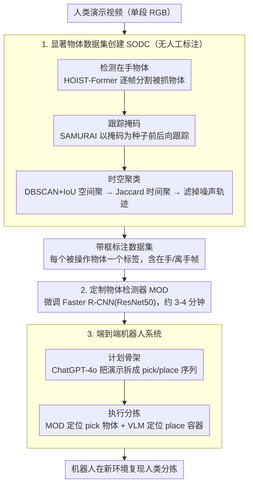

# Show, Don't Tell: Detecting Novel Objects by Watching Human Videos

**会议**: CVPR 2026  
**arXiv**: [2603.12751](https://arxiv.org/abs/2603.12751)  
**代码**: 无  
**领域**: 目标检测 / 机器人  
**关键词**: novel object detection, self-supervised, human demonstration, bespoke detector, robot manipulation

## 一句话总结

提出 "Show, Don't Tell" 范式——通过观看人类演示视频自动创建训练数据集并训练定制化物体检测器，完全绕过语言描述和提示工程，在真实机器人场景中显著超越 SOTA 开集/闭集检测器的新物体识别能力。

## 研究背景与动机

**领域现状**：机器人操作任务中，准确识别和定位目标物体是执行抓取、装配等操作的前提。当前的目标检测方法主要分为两类：闭集检测器（YOLO、Faster R-CNN 等）在预定义类别上表现良好，但无法处理训练集中未见过的物体；开集检测器（如基于 VLM 的 GroundingDINO、OWL-ViT）通过语言描述进行零样本检测，理论上可以处理任意物体。

**现有痛点**：闭集检测器面对分布外（OOD）新物体时直接失败，而开集检测器虽然理论可行，但在实际部署中存在严重的实用性问题——需要人类为每个新物体精心编写文本提示（prompt engineering），这一过程既昂贵又不可靠。尤其当需要区分外观相似但功能不同的物体实例（同类不同品牌产品、不同颜色的工具等）时，自然语言难以提供足够的区分度。

**核心矛盾**：语言作为物体描述的媒介存在根本性局限——它擅长描述类别级语义（"一个杯子"），但在实例级精确识别上效率极低。真正需要的是一种无需语言的自适应物体识别方式，能够从单次人类演示中快速学习识别特定物体。

**本文目标**：(1) 如何从人类演示视频中自动提取物体信息并构建训练数据集？(2) 如何快速训练出针对特定物体的高精度检测器？(3) 如何将整个流程集成到真实机器人系统中实现端到端部署？

**切入角度**：作者观察到，人类在演示操作任务时自然地从多个角度展示和操作目标物体，这一过程本身就提供了丰富的多视角训练数据。利用这种"隐式监督"可以完全绕过语言描述的瓶颈。

**核心 idea**：用人类演示视频中的视觉信息替代语言描述，自动创建训练数据集来训练定制化物体检测器，实现 "展示而非描述"（Show, Don't Tell）的新物体识别范式。

## 方法详解

### 整体框架

"Show, Don't Tell" 想绕开开集检测器对语言提示的依赖：与其让人类为每个新物体写文本描述，不如让人类直接"演示"——在机器人相机视野内拿起并操作目标物体，系统从这段视频里自己学会认它。整条流水线因此被组织成一个从演示到自主操作的闭环：人类先在相机前完成一次分拣演示，系统用「显著物体数据集创建（SODC）」管线从视频里自动抠出被操作物体、生成带边界框的标注样本，再用这批样本微调出一个只认这几个物体的「定制物体检测器（MOD）」，最后把它接进机器人的感知-规划-执行回路。关键在于全程不需要任何人工标注框、也不需要一句文字描述——演示这个动作本身既是任务示范、又是数据采集。

### 关键设计

**1. 显著物体数据集创建（SODC）：把"人手抓取"当成免费的标注信号**

难点在于一段演示视频里有桌面、背景、人手和各种杂物，怎么知道哪个区域才是要学的目标物体。SODC 用三步把答案算出来。第一步**检测在手物体**：用人-物交互检测器 HOIST-Former 逐帧输出"人手正在抓的物体"的分割掩码——这等于直接把"被人操作"当作显著性信号，省掉了人工指认。由于 HOIST-Former 自带的跨帧标签关联太噪，系统索性逐帧独立处理、不在帧间做关联。第二步**跟踪掩码**：只有抓取帧的掩码远远不够（且这些帧里物体大半被手挡住），于是把 HOIST-Former 的掩码当"种子"喂给跟踪器 SAMURAI，沿时间前向、后向把每个物体跟遍整段视频（包括没被操作的帧），得到一堆 track——track 数远多于真实物体数。第三步**时空聚类合并**：先把掩码转成边界框，用 DBSCAN（以 IoU 为距离）在每帧内做空间聚类，给每个框打上"逐帧簇号"；再把同一条 track 的逐帧簇号串成"簇轨迹"，用 Jaccard 相似度对簇轨迹做时间聚类，把走向一致的 track 归为同一物体，并丢掉 track 数太少的簇（当噪声滤掉）。空间+时间双重聚类让它对短暂遮挡、以及"某一帧里恰好叠在一起其实是两个物体"都鲁棒。最终产出是一批带标注框的图像，每个被操作物体一个标签，且同时含在手和离手两种状态——正好补上了纯 HOIST 输出只有在手帧的短板。

**2. 定制物体检测器（MOD）：为当前任务训一个"小而专"的模型**

开集大模型追求认遍世界上所有物体，代价是实例级区分能力弱、还得靠提示词调教。本文反其道而行——用 SODC 产出的数据集，**微调一个预训练 Faster R-CNN（ResNet50 骨干）**，只优化标准的 RCNN 损失（分类 + objectness/框回归），让它专门分清眼前这几个目标物体。因为只需认这少数几类、数据又是自动管线产出的小规模高质量样本，训练在 4 张 T4 GPU 上只要约 3–4 分钟；训练时配合随机翻转、色彩/亮度/对比度扰动、裁剪、缩放、模糊、仿射变换等大量数据增强，弥补小数据集的多样性不足。这个"小而专"模型在目标物体上的实例级精度远超通用 VLM，而"几分钟训完"这一点直接支撑了在线适应：换一批新物体，机器人当场重学一遍即可。

**3. 端到端机器人系统：从一次演示到自主分拣的闭环**

单有视觉算法不等于能落地，本文把整套管线接成真实机器人上能跑的闭环。人类对着相机演示一次分拣后，机器人自动处理这段视频：跑 SODC 建数据集、训 MOD，并额外**生成计划骨架（plan skeleton）**——用 ChatGPT-4o 读视频，把演示拆成一串 pick/place 动作，其中 pick 的物体用 MOD 的 ID 指代、place 的容器用语言命名，例如 `[Pick(MOD_ID0), Place("basket")]`。执行时，机器人用 MOD 定位人类搭出的新物体（pick 目标），而人类没直接碰过的容器类物体（place 目标）则交给开集 VLM 识别——这样 place 目标可以是语义级的，允许机器人用与演示中形状不同的篮子。识别到的物体存进场景图、跨帧聚合点云，最后按计划骨架的顺序在新环境里复现这套分拣。整条理解流水线（计划骨架生成 + MOD 训练）对一段 15 秒视频约耗时 4–7 分钟。正是这套工程闭环验证了"从一次演示到自主操作"在真实世界确实可行。

## 实验关键数据

### 主实验：物体检测与任务完成率

| 方法 | 类型 | 新物体检测精度 | 实例区分能力 | 人工提示需求 | 端到端任务完成率 |
|------|------|---------------|-------------|-------------|-----------------|
| 预训练 YOLO | 闭集 | 极低（OOD 失败） | 无 | 无 | 低 |
| GroundingDINO | 开集 | 中等 | 弱（依赖文本质量） | 高（逐物体编写） | 中等 |
| OWL-ViT + CLIP | 开集 | 中等偏低 | 弱 | 高（精细提示） | 中等偏低 |
| Few-shot 检测器 | 小样本 | 中等 | 中等 | 中（人工标注 support set） | 中等 |
| **Show, Don't Tell** | **定制** | **显著最优** | **强（实例级）** | **零（全自动）** | **最高** |

### 消融实验：关键组件贡献

| 配置 | 检测效果变化 | 说明 |
|------|-------------|------|
| 完整系统 | 基准线（最优） | 自动数据集 + 定制检测器 + 多帧验证 |
| 去除多帧一致性验证 | 明显下降 | 标注噪声增多，训练数据质量降低 |
| 通用大模型替代定制检测器 | 显著下降 | 通用模型在实例级区分上能力不足 |
| 减少演示视频长度（50%） | 轻微下降 | 系统对数据量有一定鲁棒性 |
| 仅使用单帧物体提取 | 明显下降 | 多视角覆盖对检测器泛化能力至关重要 |
| 去除数据增强 | 中等下降 | 仿射变换和色彩抖动对小数据集训练重要 |

### 关键发现

- **"Show" 显著优于 "Tell"**：定制检测器在新物体检测上大幅超越所有基于语言描述的开集方法，尤其在实例级区分（区分同类不同实例）上优势明显
- **自动数据集质量足够支撑训练**：通过多帧一致性验证后，自动提取的标注质量足以训练出高性能检测器
- **快速适应能力**：新物体仅需一次人类演示（几分钟视频），系统即可在数分钟内完成从数据创建到检测器部署的全流程
- **真实机器人验证**：集成系统在真实世界机器人操作任务中验证有效，高检测精度直接转化为更高的任务成功率
- **多视角覆盖是关键**：消融实验表明多帧提取和多视角数据对最终检测器的泛化能力至关重要

## 亮点与洞察

- **范式创新极具启发性**：从 "Tell"（语言描述）到 "Show"（视觉展示）的范式转变触及了 VLM 时代一个被忽视的问题——语言并非所有视觉识别任务的最优接口。在需要精确实例级识别的场景中，直接视觉对齐可能是更自然的路径。这一洞察可迁移到工业质检、个性化推荐等领域
- **端到端工程闭环**：覆盖了数据采集、自动标注、模型训练到机器人部署的完整流程，这种系统级的工程集成方案具有很高的实用价值和可复现性
- **"小而专"胜过"大而全"**：在特定应用场景中，快速训练的定制检测器可能比庞大的通用开集检测器更有效，这对当前追求通用视觉模型的趋势提供了有价值的反思

## 局限与展望

- **缺乏跨场景知识迁移**：每个新任务/新物体组合都需要从头训练检测器，无法利用之前场景中学到的特征。可考虑引入元学习（meta-learning）机制，让检测器在少量演示下更快收敛
- **演示视频质量依赖**：系统性能与人类演示质量（光照、遮挡、物体展示充分程度）正相关，非结构化环境中可能需要更鲁棒的数据提取策略
- **极相似物体的区分瓶颈**：当多个物体外观几乎完全相同时，纯视觉方法的区分能力可能受限，可引入辅助线索（空间位置、抓取顺序）
- **可扩展性**：论文中验证的物体数量较少，数十种物体的大规模场景（仓储分拣等）的可扩展性有待研究

## 相关工作与启发

- **vs GroundingDINO / OWL-ViT**：这些开放词汇检测方法依赖文本提示，本文完全绕过语言。类别级识别上开集方法更通用，但实例级识别上 "Show, Don't Tell" 更精确
- **vs Few-shot Object Detection (FSOD)**：FSOD 多为元学习范式，需人工提供标注好的 support set 且模型较重。本文通过视频自动构建训练集并使用轻量级定制模型
- **vs Learning from Demonstration (LfD)**：LfD 传统上关注从演示中学习动作策略，本文创新性地将"从演示中学习"扩展到感知层面，形成完整的感知-执行闭环

## 评分

- 新颖性: ⭐⭐⭐⭐ 范式层面的创新——用视觉展示替代语言描述来教检测器识别新物体，思路简洁有力
- 实验充分度: ⭐⭐⭐ 有真实机器人验证和消融分析，但论文全文未能完整获取，定量对比细节有待确认
- 写作质量: ⭐⭐⭐⭐ "Show, Don't Tell" 命名精准传神，故事线清晰连贯
- 价值: ⭐⭐⭐⭐ 对机器人场景的物体识别提供了实用且工程可行的解决方案

<!-- RELATED:START -->

## 相关论文

- [\[CVPR 2026\] Detecting Unknown Objects via Energy-Based Separation for Open World Object Detection](detecting_unknown_objects_via_energy-based_separation.md)
- [\[CVPR 2026\] Toward Generalizable Whole Brain Representations with High-Resolution Light-Sheet Data](toward_generalizable_whole_brain_representations_with_high-resolution_light-shee.md)
- [\[CVPR 2026\] PHAC: Promptable Human Amodal Completion](phac_promptable_human_amodal_completion.md)
- [\[CVPR 2026\] NoOVD: Novel Category Discovery and Embedding for Open-Vocabulary Object Detection](noovd_novel_category_discovery_and_embedding_for_open-vocabulary_object_detectio.md)
- [\[CVPR 2026\] Novel Anomaly Detection Scenarios and Evaluation Metrics to Address the Ambiguity in the Definition of Normal Samples](novel_anomaly_detection_scenarios_and_evaluation_metrics_to_address_the_ambiguit.md)

<!-- RELATED:END -->
