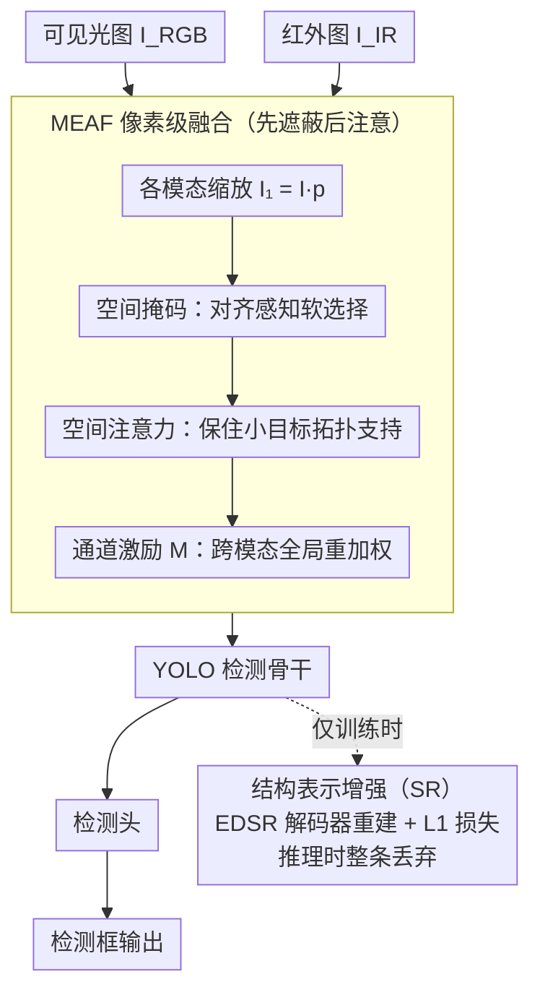

# Small Target Detection Based on Mask-Enhanced Attention Fusion of Visible and Infrared Remote Sensing Images

**会议**: CVPR 2026  
**arXiv**: [2603.06925](https://arxiv.org/abs/2603.06925)  
**代码**: 无  
**领域**: 目标检测  
**关键词**: 小目标检测, 可见光红外融合, 遥感, 空间注意力, 轻量级网络

## 一句话总结

提出 ESM-YOLO+，一个轻量级可见光-红外融合小目标检测网络，通过 Mask-Enhanced Attention Fusion (MEAF) 模块实现像素级跨模态自适应融合，并引入训练时结构表示增强提升空间判别力，在 VEDAI 上达 84.71% mAP 同时参数量减少 93.6%。

## 研究背景与动机

**领域现状**: 无人机遥感图像中的小目标检测因目标像素少、背景复杂而极具挑战。可见光提供纹理结构信息但受光照影响大，红外提供热辐射信息但缺乏细粒度特征。多模态融合是提升检测的有效途径。

**现有痛点**: 现有多模态检测器（如 MIR-YOLO、DVIF-Net）过度追求复杂融合设计——引入 Vision-LSTM、门控聚合等重型结构，不适合资源受限的无人机和卫星平台。更重要的是，它们要么假设模态完美对齐，要么依赖密集特征编码，未直接解决跨模态结构不一致问题。

**核心矛盾**: 直接融合实质上是无条件聚合——可能放大模态主导的背景响应或抑制空间局部化的弱小目标。有效融合应编码空间可靠性先验，在可信区域进行条件化跨模态交互。

**本文目标** (1) 如何在像素级实现轻量且有效的跨模态融合？(2) 如何在不增加推理成本的情况下增强空间结构表示能力？

**切入角度**: 提出"先遮蔽后注意"（mask-then-attend）范式——可学习空间掩码做对齐感知选择，空间注意力做拓扑一致性重加权。

**核心 idea**: 用可学习空间掩码抑制不可靠跨模态交互 + 空间注意力保持小目标空间支持 + 训练时超分辨率引导增强特征空间判别力。

## 方法详解

### 整体框架

ESM-YOLO+ 要解决的是无人机/卫星平台上的一个两难：既要靠可见光-红外融合把弱小目标从复杂背景里捞出来，又不能像现有融合检测器那样堆 Vision-LSTM、门控聚合这类重型结构。它的做法是把"融合"这件事拆成像素级的一步轻量操作，再用一个训练时才存在的辅助分支补强骨干。整条链路是：可见光图 $I^{RGB}$ 和红外图 $I^{IR}$ 先各自经 MEAF 模块做对齐感知的像素级融合，融合后的特征送进基于 YOLO 的检测骨干和检测头出框；训练时额外挂一个 EDSR 超分辨率分支从骨干中间特征做图像重建，只贡献梯度、推理时整条砍掉。所以推理阶段的网络其实就是"MEAF 融合 + YOLO 检测"，超分支不占任何成本。

### 关键设计

**1. Mask-Enhanced Attention Fusion (MEAF)：把无条件聚合改成"先遮蔽后注意"**

直接把 RGB 和 IR 加在一起的问题是它无条件聚合——模态主导的背景响应会被放大，而只在局部有空间支持的弱小目标反而被淹没。MEAF 对两个模态各做一套"先遮蔽后注意"：先用可学习标量 $p$ 做模态缩放 $I_1 = I \cdot p$ 让网络自己决定该信哪个模态多一点；再生成一张空间掩码 $I_{mask} = I_1 \otimes \text{Conv}_{1\times1}(\sigma_R(\text{Conv}_{3\times3}(I_1)))$，这一步本质是对齐感知的软选择，让显著结构亮起来、不可靠区域被压暗，从而避免在两模态结构不一致的地方硬融。掩码后的特征经卷积聚合并加残差连接保住原始信息，再过一层空间注意力 $I_{SA} = \sigma_S(\text{Conv}(\text{Cat}(\bar{I}, \hat{I})))$——其中 $\bar{I}$、$\hat{I}$ 是沿通道维的均值池化与最大池化，拼起来卷积后过 $\sigma_S$ 得到逐像素权重，专门维持小目标那一小撮像素的拓扑支持不被抹掉。最后用一个通道激励向量 $M$ 对两模态拼接后的特征做全局重加权完成融合。掩码负责"在可信区域才融"，空间注意力负责"融的时候别丢小目标的空间位置"，两者一个管模态异质性、一个管尺度对齐，互补而非叠床架屋。

**2. 训练时结构表示增强（SR）：用一条推理时免费的超分支逼骨干留住细节**

小目标检测最怕的是骨干在激进下采样里把细粒度空间拓扑磨没了，可是直接加深骨干又会拖垮推理速度。这一设计的取巧之处在于把增强放在训练阶段：在骨干中间某个阶段接一个轻量级解码器 $\mathcal{D}$ 做图像重建，用 L1 损失 $\mathcal{L}_{SR} = \|S - \mathcal{D}(X)\|_1$ 把重建结果对齐到下采样后的输入 $S$。为了重建得出来，骨干特征 $X$ 就不得不保留足以还原结构的空间信息，相当于一条额外的梯度信号在反向时持续"提醒"骨干别丢细节。训练一结束这条重建分支整体丢弃，推理时网络结构和参数完全不受影响——增强是白拿的，代价只在训练时多算一条 L1。

### 损失函数 / 训练策略

总损失：$\mathcal{L}_{total} = c_1 \mathcal{L}_{det} + c_2 \mathcal{L}_{SR}$。检测损失包含目标存在、定位和分类三部分。SGD + Nesterov 加速梯度，学习率 0.01，动量 0.937，300 epochs。单卡 RTX 4060。训练用 1024x1024，测试用 512x512。

## 实验关键数据

### 主实验（VEDAI 数据集 mAP50 %）

| 方法 | Car | Truck | Boat | Van | mAP50 |
|------|-----|-------|------|-----|-------|
| YOLOv5s | 80.81 | 54.71 | 24.25 | 45.96 | 56.79 |
| SuperYOLO | 91.13 | 70.18 | 60.24 | 76.50 | 75.09 |
| ESM-YOLO | 90.80 | 83.83 | 85.23 | 80.11 | 82.42 |
| **ESM-YOLO+** | **93.64** | **86.65** | **71.57** | **85.20** | **84.71** |

### 效率对比

| 指标 | 基线 | ESM-YOLO+ | 减少比例 |
|------|------|-----------|---------|
| 参数量 | - | 极轻量 | **-93.6%** |
| GFLOPs | - | 极低 | **-68.0%** |

### 关键发现

- 比基线 ESM-YOLO 提升 2.29% mAP，同时大幅降低复杂度
- 在 DroneVehicle 上达 74.0% mAP，验证了方法在大规模、多类别场景的有效性
- SR 分支训练时 F1 曲线更高，证实辅助重建梯度有效增强了特征判别力
- 可视化对比显示 ESM-YOLO+ 显著减少了虚警和漏检

## 亮点与洞察

- **mask-then-attend 范式**：将融合从无条件聚合变为条件化交互，思路清晰且轻量——可迁移到其他多模态融合任务
- **训练时增强推理时免费**：SR 分支仅提供梯度指导不参与推理，这种"训练时正则化"策略在轻量模型中特别有价值
- **93.6% 参数减少**：在提升精度的同时大幅降低复杂度，体现了设计的高效性

## 局限与展望

- MEAF 假设 RGB 和 IR 图像已粗对齐，对严重空间错位可能需要额外的几何校正
- 仅在车辆类小目标上验证，更多目标类型（行人、建筑等）需要进一步评估
- 4 因子空间分区固定为均匀划分，自适应的基于语义的分区策略可能更好

## 相关工作与启发

- **vs ESM-YOLO**: ESM-YOLO 用 BEF（简单卷积激励），ESM-YOLO+ 用 MEAF（掩码+空间注意力），mAP 提升 2.29%
- **vs SuperYOLO**: SuperYOLO 虽精度尚可但计算开销大，ESM-YOLO+ 以更低复杂度实现更高精度

## 评分

- 新颖性: ⭐⭐⭐ 对现有方法的改进型工作，但 mask-then-attend 范式有一定新意
- 实验充分度: ⭐⭐⭐⭐ 两个数据集、完整对比和可视化分析
- 写作质量: ⭐⭐⭐⭐ 动机清晰，公式规范
- 价值: ⭐⭐⭐⭐ 对轻量化遥感小目标检测有实用参考价值

<!-- RELATED:START -->

## 相关论文

- [\[CVPR 2026\] Fourier Angle Alignment for Oriented Object Detection in Remote Sensing](fourier_angle_alignment_for_oriented_object_detection_in_remote_sensing.md)
- [\[CVPR 2026\] Remedying Target-Domain Astigmatism for Cross-Domain Few-Shot Object Detection](remedying_target-domain_astigmatism_for_cross-domain_few-shot_object_detection.md)
- [\[CVPR 2026\] PaQ-DETR: Learning Pattern and Quality-Aware Dynamic Queries for Object Detection](paq-detr_learning_pattern_and_quality-aware_dynamic_queries_for_object_detection.md)
- [\[CVPR 2026\] CD-Buffer: Complementary Dual-Buffer Framework for Test-Time Adaptation in Adverse Weather Object Detection](cd-buffer_complementary_dual-buffer_framework_for_test-time_adaptation_in_advers.md)
- [\[CVPR 2026\] Evaluating Few-Shot Pill Recognition Under Visual Domain Shift](evaluating_few-shot_pill_recognition_under_visual_domain_shift.md)

<!-- RELATED:END -->
