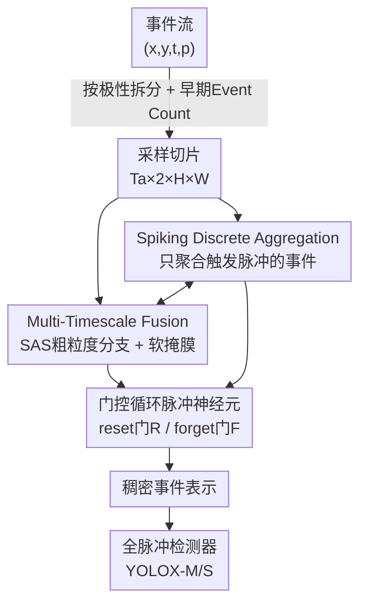

# Spike-driven Discrete Aggregation for Event-based Object Detection

**会议**: CVPR 2026  
**论文**: [CVF Open Access](https://openaccess.thecvf.com/content/CVPR2026/html/Li_Spike-driven_Discrete_Aggregation_for_Event-based_Object_Detection_CVPR_2026_paper.html)  
**代码**: 无  
**领域**: 目标检测 / 事件相机 / 脉冲神经网络  
**关键词**: 事件相机, 脉冲神经网络, 离散聚合, 门控循环脉冲神经元, 多时间尺度融合

## 一句话总结
针对事件相机的目标检测，本文提出"离散聚合"思路——用脉冲神经元的阈值发放机制自适应地只挑出有信息量的事件来聚合（SDA 模块 + 门控循环脉冲神经元 + 多时间尺度融合），在 Gen1 上以更少参数取得 43.4% mAP50:95，比此前全脉冲 SOTA 高 4.5%。

## 研究背景与动机
**领域现状**：事件相机异步记录像素级亮度变化，有超高动态范围（>120 dB）和微秒级时间分辨率，特别适合运动模糊、极端光照下的目标检测。但事件流是异步、稀疏的，没法直接喂给检测网络，必须先"采样到时间区间 + 聚合成稠密张量（event representation）"。近年的 SOTA（RVT、SpikeYOLO、EAS-SNN 等）几乎都把精力放在 backbone 的高层设计上，而事件表示这一步只用最简单的 Event Count。

**现有痛点**：作者把现有几乎所有聚合方式归纳为**连续聚合（continuous aggregation）**——在采样区间内把**所有**事件不加筛选地累加进去。比如 ASTMNet 用 TCN 整段处理逐像素事件序列；EAS-SNN 即使某个事件没让脉冲神经元发放，也照样累加它的膜电位。问题是事件流里混着大量无信息事件（传感器噪声、运动模糊伪影），连续聚合把这些垃圾也一并塞进表示里，稀释了真正有判别力的时空线索，拖累检测精度。

**核心矛盾**：稠密表示（dense）效果好但因连续聚合而吞入无信息事件；稀疏表示（GNN/SNN）省能耗但精度差。两边都没有一个**可微分、又能选择性过滤**的聚合算子。已有的离散筛选方法 HOTS 虽然能选择性提取，但不可微，无法端到端优化。

**切入角度**：作者注意到 SNN 的脉冲发放机制天然就是一种"离散筛选"——只有当膜电位累积超过阈值才发放脉冲，无信息事件因膜电位不够而触发不了脉冲。这与"离散地只保留有信息量的事件"的诉求严丝合缝，而且 SNN 可以用替代梯度（surrogate gradient）端到端训练。

**核心 idea**：用脉冲神经元的"是否发放"来决定"是否聚合"，把事件选择和聚合耦合成一个统一、可微的操作，并让下游检测网络的高层语义反过来优化这个聚合过程。

## 方法详解

### 整体框架
方法的目标是设计一个**可微分的聚合模块**，做到三件事：(1) 采样后离散、自适应地只聚合有信息量的事件；(2) 充分利用事件的时空相关性；(3) 跨多个时间尺度捕捉特征以增强表示。

整条流水线：原始事件流先按正负极性拆分、做早期 Event Count 粗聚合（把 µs 级事件近似成 $T_a$ 个固定时间分辨率 $\Delta t_a$ 的切片）；切片送入 **Spiking Discrete Aggregation (SDA)** 模块，模块内每个 $(x,y,p)$ 坐标-极性组合配一个**门控循环脉冲神经元**，只把"让该神经元发放脉冲"的事件累加进表示；为补足单一时间尺度的不足，**Multi-Timescale Fusion (MTF)** 再并入一条粗粒度时间分支（SAS），并用其膜电位生成软掩膜回调 SDA；最终表示无缝喂给一个**全脉冲检测器**（fully spiking YOLOX-M/S）。

### 关键设计

**1. Spiking Discrete Aggregation：用脉冲发放当作"事件该不该聚合"的开关**

这是全文的灵魂，针对连续聚合"无差别累加"的痛点。在 SDA 里，每个空间坐标加极性组合 $(x,y,p)$ 各配一个 LIF 神经元。给定采样事件集 $\hat{E}$，一个事件**只有在驱动其对应神经元发放脉冲时才被选入聚合**，聚合本身就是把被选中事件的膜电位 $u$ 累加起来。形式上选择和聚合耦合成一个操作：

$$g_{SDA}(x,y,p) = \sum_{\substack{(x_i,y_i,p_i,t_i)\in\hat{E}(x,y,p) \\ \land\, s_{t_i}(x_i,y_i,p_i)=1}} u_{t_i}(x_i,y_i,p_i)$$

其中 $s_t=\Theta(u_t - V_{thresh})$ 是发放状态（Heaviside 阶跃）。对比此前 SNN 的连续累加（作者称之为 Spiking Continuous Aggregation, SCA），SCA 即使事件没让神经元发放也照累膜电位；SDA 则显式区分事件重要性，只让发放的"有信息事件"进表示。妙在它借了 LIF 的阈值机制，无信息事件膜电位累不到阈值、自然被滤掉，且整个过程靠 BPTT + 替代梯度可与下游检测器联合训练——这就把"可微"和"离散筛选"这对此前难以兼得的性质同时拿到了手。

**2. 门控循环脉冲神经元（GRSN）：给神经元装上可学习的记忆闸门，自适应分配事件重要性**

普通 LIF 只有简单的"积分-发放"动力学，靠一个常数衰减因子 $\tau$ 控制历史膜电位的影响，没法在噪声/稀疏条件下自适应地决定该记住多少、该忘掉多少。本文把 $\tau$ 换成可学习的**重置门 R**：

$$u_t(x,y,p) = R_t(x,y,p)\cdot \hat{u}_{t-1}(x,y,p) + I_t(x,y,p)$$

当 $R_t$ 趋近 0，就丢弃先前状态、把累积的噪声抹掉。同时在输入电流上引入**遗忘门 F** 和循环连接：$I_t = F_t\cdot I_{t-1} + c_t$，其中 $c_t = W_I^q q_t + W_I^s s_{t-1}$（把上一步脉冲 $s_{t-1}$ 也反馈进来）。两个门都由当前输入和上一步脉冲经 sigmoid 算出：$R_t=\sigma(W_R^q q_t + W_R^s s_{t-1})$，$F_t=\sigma(W_F^q q_t + W_F^s s_{t-1})$。考虑到局部区域事件的强空间相关性，所有权重映射用 $3\times3$ 卷积实现。门控让神经元能动态、可学习地调制内部记忆和外部输入，是 SDA 能"恰当给不同时刻的事件赋权"的关键——消融里去掉 GRSN，SDA-MTF 掉 2% 以上。

**3. 多时间尺度融合（MTF）：用软掩膜把粗粒度时间线索注入细粒度聚合**

事件的时间密度和物体运动速度强相关（快物体事件密、慢物体事件稀），单一时间尺度的 SDA 不够。MTF 并入一条 **SAS（带自适应采样的 SCA）** 分支：SAS 在相邻两次脉冲发放时刻 $t_{j-1}(x,y,p)$、$t_j(x,y,p)$ 之间连续聚合事件（粗粒度、段间隔 $\Delta t_m \ge \Delta t_a$）。但作者发现，直接把 SDA 和 SAS 两路表示逐元素相加**并不稳定提升**性能（Tab.3 第 5-6 行）。于是改用 SAS 分支的膜电位生成一个软掩膜：

$$M_j(x,y,p) = \sigma\Big(\sum_{e_i\in\hat{E}^A_j(x,y,p)} u_{t_i}(x_i,y_i,p_i)\Big)$$

把它乘进 GRSN 的电流更新里：$I_t = F_t\cdot I_{t-1} + M_j\cdot c_t$。这样粗时间尺度不再是简单加法，而是作为"区间级重要性调制"去引导细粒度的 SDA——既补了多尺度时间信息，又避免了直接相加带来的干扰。消融显示加掩膜后 mAP50:95 从 42.8% 提到 43.4%。

### 损失函数 / 训练策略
检测框架用全脉冲版 YOLOX-M（25.3M）/ YOLOX-S（8.9M），Backbone、FPN、Head 由 P-LIF 和 SEW-Residual 块搭成，统一 3 个时间步。Adam 优化、初始学习率 0.002、cosine 衰减；数据预处理与增广沿用 RVT 和 EAS-SNN。Gen1 取标注前 240 ms 事件流，SDA 切片间隔 $\Delta t_a=20$ ms、SAS 段间隔 $\Delta t_m=60$ ms。SDA 通过 BPTT + 替代梯度与下游检测器联合训练。

## 实验关键数据

### 主实验
Gen1（用 DASNN 表示只含 SDA、DASNN-MTF 表示 SDA-MTF）：

| 方法 | 表示 | 网络 | 参数 | mAP50:95 | mAP50 |
|------|------|------|------|----------|-------|
| EAS-SNN† | ARSNN | SNN | 25.3M | 37.5 | 69.9 |
| SpikeYOLO | HIST. | SNN | 23.1M | 38.9 | 67.2 |
| CREST | MESTOR | SNN | 7.61M | 36.0 | 63.2 |
| 本文 (S) SDA | SDA | SNN | 8.9M | 39.9 | 69.9 |
| 本文 (S) SDA-MTF | — | SNN | 8.9M | 40.5 | 70.5 |
| 本文 (M) SDA | SDA | SNN | 25.3M | 42.8 | 72.6 |
| **本文 (M) SDA-MTF** | — | SNN | 25.3M | **43.4** | **73.1** |

DASNN-MTF(M) 取得 43.4% mAP50:95，比全脉冲 SOTA（SpikeYOLO）高 4.5%；小模型（8.9M）也比 SpikeYOLO 高 1.6%。与同架构的 EAS-SNN 比，DASNN 用一半的表示参数就拿到 +5.3%，验证 SDA 本身的有效性。能效是 ANN 的 3.79×。

1Mpx 与 N-Caltech101（首次在 1Mpx 上训练评估全脉冲模型）：

| 方法 | 网络 | 1Mpx mAP50:95 | 1Mpx mAP50 | N-Cal mAP50:95 | N-Cal mAP50 |
|------|------|------|------|------|------|
| EAS-SNN† | SNN | 28.1 | 55.3 | 36.3 | 56.4 |
| DASNN-MTF(M) | SNN | **30.4** | **59.1** | **40.1** | **61.9** |

### 消融实验
Gen1 + 全脉冲 YOLOX-M：

| 配置 | GRSN | Mask | mAP50:95 | mAP50 | 说明 |
|------|------|------|----------|-------|------|
| Event Count | – | – | 32.3 | 58.0 | 常用表示 |
| Time Surface | – | – | 37.3 | 66.5 | 常用表示 |
| Voxel Cube | – | – | 32.6 | 59.2 | 常用表示 |
| Baseline (SCA) | ✓ | – | 41.2 | 71.3 | 连续聚合同分辨率 |
| SDA | ✓ | – | 42.8 | 72.6 | 离散聚合 +1.6 |
| SDA-MTF | ✓ | ✗ | 42.8 | 72.8 | 加法融合无增益 |
| SDA-MTF | ✗ | ✗ | 40.7 | 70.1 | 去掉 GRSN 掉 >2% |
| **SDA-MTF** | ✓ | ✓ | **43.4** | **73.1** | 软掩膜融合 |

### 关键发现
- **离散 vs 连续是真增益而非分辨率红利**：把 SCA baseline 设成与 SDA 相同的 20 ms 时间分辨率，SDA 仍 +1.6% mAP50:95，说明提升来自"只聚合有信息事件"而非更高分辨率。
- **软掩膜是 MTF 成立的关键**：两路表示直接相加不涨点（42.8→42.8），改成用 SAS 膜电位生成软掩膜调制 SDA 才涨到 43.4%。
- **跨架构通用**：SDA/SDA-MTF 接到 ANN 检测器上一致提升——YOLOX-S +8.4%、PVT-S +3.0%、RVT-B（已建模时序）+1.2%；已建模时序的 backbone 增益较小，符合预期。
- **高速场景更受益**：按光流把物体分四档速度，SDA-MTF 在 Lv3/Lv4（快速运动）增益最明显（如 Lv4 42.5→44.0）。
- **抗噪**：在自然/随机噪声下 SDA 的性能下降比例显著小于 SCA。

## 亮点与洞察
- **把 SNN 的"物理缺陷"变成功能特性**：脉冲阈值机制本来只是低功耗推理的副产品，作者却把"够不到阈值就不发放"重新诠释为"无信息事件天然被过滤"，让离散筛选和可微聚合这对原本矛盾的需求同时实现——这是最 aha 的概念翻转。
- **门控循环脉冲神经元**这个组件本身可复用：把 GRU 式的 reset/forget 门嫁接到 LIF 上，给脉冲神经元加了可学习的时序记忆，对其他需要时序建模的 SNN 任务（事件分类、动作识别）都有迁移价值。
- **软掩膜式多尺度融合**值得借鉴：当"直接相加"破坏表示时，改用一路的统计量去调制另一路而非简单融合，是处理多分支冲突的通用 trick。
- 表示层做对了，能把简单 backbone 拉到媲美复杂设计——提醒社区别只卷 backbone，低层事件表示同样关键。

## 局限与展望
- 受当前硬件限制，µs 级事件仍要先用 Event Count 近似成固定分辨率切片（$T_a\times2\times H\times W$），并非真正逐事件异步处理，离事件相机的原生异步优势还有距离。
- MTF 只用了两个时间尺度（$\Delta t_a$、$\Delta t_m$），更细的多尺度调度（自适应选尺度数）未探索；时间分辨率影响只在补充材料给出，正文未充分展开。⚠️ 部分超参敏感性结论以原文补充材料为准。
- 软掩膜为何只对带 GRSN 的 SDA 起效、对纯加法不起效，作者给了现象但机理分析偏经验。
- 评测集中在车辆/通用事件检测数据集，更复杂类别、更长时序依赖的场景泛化性待验证。

## 相关工作与启发
- **vs 连续聚合（Event Count / ASTMNet / EAS-SNN 的 SCA）**：它们在采样区间内无差别累加所有事件，吞入噪声；本文 SDA 用脉冲发放当门控只聚合有信息事件，且可微端到端，Gen1 同分辨率下 +1.6%。
- **vs HOTS**：HOTS 也是离散筛选（time-surface 衰减选时空特征），但不可微、不能端到端训练；本文借 SNN 替代梯度解决了可微性。
- **vs SpikeYOLO / EMS-ResNet / CREST**：这些聚焦全脉冲 backbone/架构设计，事件表示仍用简单/连续方式；本文证明把表示层做对，用更少参数（8.9M vs 23.1M）即超过它们。
- **vs EAS-SNN**：同一检测架构、自适应采样的思路被本文继承进 SAS 分支，但 EAS-SNN 仍是连续聚合；本文用 SDA 替换核心聚合，表示参数减半仍 +5.3%。

## 评分
- 新颖性: ⭐⭐⭐⭐⭐ 把 SNN 阈值机制重新诠释为可微离散事件筛选，概念清晰且少见
- 实验充分度: ⭐⭐⭐⭐⭐ 三数据集 + 跨 SNN/ANN 架构 + 速度分档 + 抗噪 + 能效，消融到位
- 写作质量: ⭐⭐⭐⭐ 动机和模块逻辑顺，但 SAS/掩膜细节较密、部分需翻原文
- 价值: ⭐⭐⭐⭐⭐ 提醒社区重视低层事件表示，组件可迁移到其他事件/SNN 任务

<!-- RELATED:START -->

## 相关论文

- [\[CVPR 2026\] Towards Persistence: Learning Topological Constraints for Event-based Small Object Detection](towards_persistence_learning_topological_constraints_for_event-based_small_objec.md)
- [\[CVPR 2026\] D2FANet: Enhancing Video Object Detection with Dual-Domain Feature Aggregation Network](d2fanet_enhancing_video_object_detection_with_dual-domain_feature_aggregation_ne.md)
- [\[CVPR 2026\] Black-Box Domain Adaptation for Object Detection with Retention-Driven Knowledge Compression](black-box_domain_adaptation_for_object_detection_with_retention-driven_knowledge.md)
- [\[CVPR 2026\] Beyond Duality: A Hybrid Framework of Leveraging Shared and Private Features for RGB-Event Object Detection](beyond_duality_a_hybrid_framework_of_leveraging_shared_and_private_features_for_.md)
- [\[CVPR 2026\] Reasoning-Driven Anomaly Detection and Localization with Image-Level Supervision](reasoning-driven_anomaly_detection_and_localization_with_image-level_supervision.md)

<!-- RELATED:END -->
