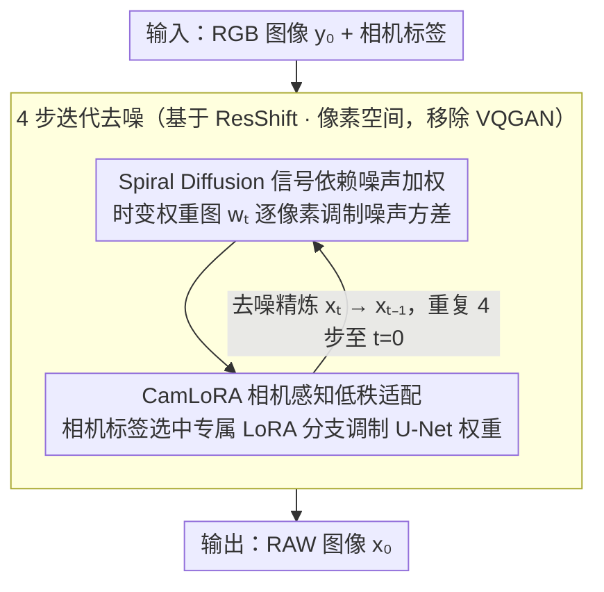

<!-- 由 src/gen_stubs.py 自动生成 -->
# SpiralDiff: Spiral Diffusion with LoRA for RGB-to-RAW Conversion Across Cameras

**会议**: CVPR2026  
**arXiv**: [2603.14885](https://arxiv.org/abs/2603.14885)  
**代码**: [Chuancy-TJU/SpiralDiff](https://github.com/Chuancy-TJU/SpiralDiff)  
**领域**: 目标检测 / 图像信号处理  
**关键词**: RGB-to-RAW, 扩散模型, 信号依赖噪声, LoRA, 跨相机适配, 目标检测

## 一句话总结

提出 SpiralDiff，一种面向 RGB-to-RAW 转换的扩散框架，通过信号依赖的噪声加权策略适应不同像素强度区域的重建难度，并引入 CamLoRA 模块实现单一模型跨多相机的轻量适配。

## 背景与动机

1. **RAW 图像信息更丰富**：RAW 保留线性辐射响应和高动态范围，直接在 RAW 域做去噪、低光增强和目标检测等任务效果更佳，但 RAW 数据集规模和多样性远不如 RGB。
2. **RGB-to-RAW 转换需求**：从海量 RGB 数据合成 RAW 可避免昂贵的传感器数据采集，但现有方法在高强度区域（过曝/非线性色调映射）表现不佳。
3. **重建难度随像素强度变化**：低亮度区域 RGB-RAW 残差小且稳定，容易高保真恢复；高亮度/过曝区域残差大且方差高（源于乘性数字增益和值截断），统一策略无法兼顾。
4. **多相机 ISP 差异大**：不同相机的 ISP 流水线（去马赛克、白平衡、色调映射等）差异显著，简单混合训练会导致性能退化。
5. **元数据方法局限**：依赖 ISP 参数或采样 RAW 像素的方法在真实场景中通常无法获取元数据。
6. **现有无元数据方法的不足**：CycleISP、InvISP、ReRAW 等采用全局统一重建策略，未针对信号依赖特性做自适应处理，且缺乏跨相机适配能力。

## 方法详解

### 整体框架

SpiralDiff 要解决的是 RGB-to-RAW 转换里两个老问题：高亮度/过曝区域因为乘性增益和值截断、残差大方差高，统一重建策略顾此失彼；不同相机 ISP 差异大，简单混合训练会退化。它基于 ResShift（高效残差偏移扩散）构建，只需 4 步采样：输入 RGB 图像和相机标签，含 Swin Transformer 层的 U-Net 反复去噪、从噪声 RAW 估计逐步精炼出目标 RAW。整个过程直接在像素空间操作（移除了 VQGAN 潜空间压缩，因为它是在 RGB 上训练的、不适合 RAW），并通过信号依赖噪声加权和 CamLoRA 两个设计分别应对强度自适应和跨相机适配。

### 关键设计

**1. Spiral Diffusion 信号依赖噪声加权：按像素强度分配重建难度**

RGB 像素强度和 RGB-RAW 残差正相关——暗区残差小且稳定、容易高保真恢复，亮区残差大且不确定，统一噪声调度没法兼顾。SpiralDiff 引入随扩散步演变的时变权重图 $\mathbf{w}_t = \mathbf{x}_0 + \eta_t \mathbf{e}_0$（$t=T$ 时接近 RGB $\mathbf{y}_0$，$t=0$ 时接近 RAW $\mathbf{x}_0$，实现从 RGB 到 RAW 的平滑过渡）。前向过程在 ResShift 的各向同性高斯噪声上用 $\mathbf{w}_t^2$ 逐像素调制噪声方差——暗区低噪保保真度，亮区高噪给模型更大生成自由度；反向过程的均值 $\boldsymbol{\mu}_{t-1}$ 仍是去噪项和干净项的凸组合，但混合系数 $\boldsymbol{\gamma}_t$ 依赖空间权重图，做到像素自适应融合，当 $\mathbf{w}_t \equiv 1$ 时退化为标准 ResShift。消融里静态 RGB 加权甚至不如均匀基线，正说明「随步演变」这一点才是关键。

**2. CamLoRA 相机感知低秩适配：一个模型轻量适配多相机**

不同相机的 ISP 流水线差异显著，混合训练会互相干扰。CamLoRA 对 U-Net 中 Swin Transformer 层的 $\mathbf{W}_q, \mathbf{W}_k, \mathbf{W}_v, \mathbf{W}_o$ 加相机专属低秩更新 $\Delta \mathbf{W}_i = \mathbf{B}_i \mathbf{A}_i$（秩 $r=8$）：训练时共享骨干用全部数据更新，只让当前相机标签对应的 LoRA 分支参与梯度，额外参数仅占 2.7%（1.05M），四个相机各一组适配器。它还天然支持 few-shot 扩展——预训练统一模型后，对新相机只微调一组 LoRA 分支，1-shot 就能到 42.85 dB PSNR，而从头训练只有 39.83 dB。

### 损失函数

沿用 ResShift 的目标：训练网络 $f_\theta(\mathbf{x}_t, \mathbf{y}_0, t)$ 预测 $\mathbf{x}_0$，结合扩散损失优化。

## 实验关键数据

### 主实验 — 四个数据集定量对比

| 方法 | FiveK Canon | FiveK Nikon | NOD Nikon | NOD Sony |
|------|------------|------------|-----------|----------|
| CycleISP | 37.93 / 0.9913 | 40.18 / 0.9920 | 50.11 / 0.9985 | 46.57 / 0.9975 |
| InvISP | 36.81 / 0.9814 | 34.30 / 0.9163 | 48.29 / 0.9954 | 44.76 / 0.9922 |
| RAW-Diffusion | 39.96 / 0.9890 | 39.68 / 0.9866 | 50.52 / 0.9954 | 47.31 / 0.9908 |
| **SpiralDiff** | **42.82 / 0.9936** | **41.72 / 0.9925** | **53.64 / 0.9990** | **50.46 / 0.9980** |
| +CamLoRA (合并) | 42.46 / 0.9934 | 43.82 / 0.9950 | 52.62 / 0.9988 | 50.08 / 0.9977 |

> SpiralDiff 在独立训练设置下全面超越 SOTA，较 RAW-Diffusion PSNR 提升 **+2.86 dB**（FiveK Canon）、**+3.12 dB**（NOD Nikon）。

### 过曝测试集对比

| 方法 | FiveK Canon PSNR | NOD Nikon PSNR |
|------|-----------------|----------------|
| RAW-Diffusion | 30.60 | 40.05 |
| **SpiralDiff** | **31.10** | **40.79** |

### 消融实验

| 噪声加权策略 | FiveK Canon PSNR | NOD Nikon PSNR |
|-------------|-----------------|----------------|
| 基线（均匀噪声） | 41.40 | 53.48 |
| 静态 $\mathbf{y}_0$ 加权 | 40.06 | 53.42 |
| **时变 $\mathbf{w}_t$ 加权** | **42.82** | **53.64** |

- 静态 RGB 加权甚至不如基线，验证了时变权重图的必要性。
- CamLoRA vs 直接相机嵌入：嵌入方式反而低于无条件基线，CamLoRA 有效提升约 +0.5 dB。
- 插件实验：将 RAW-Diffusion 中的 DDPM 替换为 SpiralDiff，PSNR 提升 +1.57 dB（FiveK Canon）。

### 下游目标检测

| 训练数据 | NOD Nikon AP | NOD Sony AP |
|---------|-------------|-------------|
| RGB-only | 19.1 | 19.7 |
| RAW-only (100张) | 18.4 | 17.6 |
| RAW + BDD-RAW (合成) | **26.7** | **29.0** |

> 合成 RAW 数据显著提升低数据场景下的目标检测性能（AP 提升 +8.3/+11.4）。

## 亮点

1. **信号依赖噪声调度**概念新颖，直觉清晰——暗区少噪保细节，亮区多噪增灵活性，与物理特性高度吻合。
2. **CamLoRA** 仅 2.7% 参数开销即实现跨相机统一模型，且支持 few-shot 快速适配新相机。
3. **4 步采样**推理效率高，实用性强。
4. 实验覆盖全面：4 个数据集 + 过曝测试 + 真实 ISP + 下游检测 + 充分消融。
5. 在 RAW-Diffusion 上做插件替换即可显著提升，说明 SpiralDiff 的通用性。

## 局限与展望

1. 权重图 $\mathbf{w}_t$ 的设计依赖 ground-truth $\mathbf{x}_0$，推理时需通过网络预测替代，可能引入误差累积。
2. 仅在 4 个相机上验证 CamLoRA，对更大规模相机池（数十种传感器）的扩展性待考察。
3. 像素空间扩散在高分辨率图像上的计算开销较大，未探索潜空间加速路线。
4. 下游检测实验仅用了 100 张真实 RAW + 合成增强的简单设置，更大规模场景下的效果需进一步验证。
5. 噪声加权仅考虑像素强度，未纳入空间纹理复杂度等结构信息。

## 与相关工作的对比

| 维度 | CycleISP / InvISP | RAW-Diffusion | SpiralDiff |
|------|-------------------|---------------|------------|
| 噪声类型 | 无扩散 | DDPM 各向同性 | 信号依赖时变加权 |
| 跨相机支持 | 无 | 无 | CamLoRA |
| 采样步数 | — | ~1000 | 4 |
| 过曝处理 | 差 | 一般 | 好（自适应噪声） |
| Few-shot | 不支持 | 不支持 | 支持（LoRA 微调） |

## 评分

- 新颖性: ⭐⭐⭐⭐ — 信号依赖噪声 + 时变权重图 + CamLoRA 组合新颖
- 实验充分度: ⭐⭐⭐⭐⭐ — 4 数据集 + 过曝/真实 ISP/下游检测/消融/插件实验
- 写作质量: ⭐⭐⭐⭐ — 动机清晰、公式推导完整、图示直观
- 价值: ⭐⭐⭐⭐ — 对 RAW 域数据增强和跨相机适配有实际应用价值

<!-- RELATED:START -->

## 相关论文

- [\[CVPR 2026\] DetAny4D: Detect Anything 4D Temporally in a Streaming RGB Video](detany4d_detect_anything_4d_temporally_in_a_streaming_rgb_video.md)
- [\[CVPR 2026\] InvAD: Inversion-based Reconstruction-Free Anomaly Detection with Diffusion Models](invad_inversion-based_reconstruction-free_anomaly_detection_with_diffusion_model.md)
- [\[CVPR 2025\] Towards RAW Object Detection in Diverse Conditions](../../CVPR2025/object_detection/towards_raw_object_detection_in_diverse_conditions.md)
- [\[ICCV 2025\] Diffusion Curriculum: Synthetic-to-Real Data Curriculum via Image-Guided Diffusion](../../ICCV2025/object_detection/diffusion_curriculum_synthetic-to-real_data_curriculum_via_image-guided_diffusio.md)
- [\[CVPR 2025\] Generalized Diffusion Detector: Mining Robust Features from Diffusion Models for Domain-Generalized Detection](../../CVPR2025/object_detection/generalized_diffusion_detector_mining_robust_features_from_diffusion_models_for_.md)

<!-- RELATED:END -->
