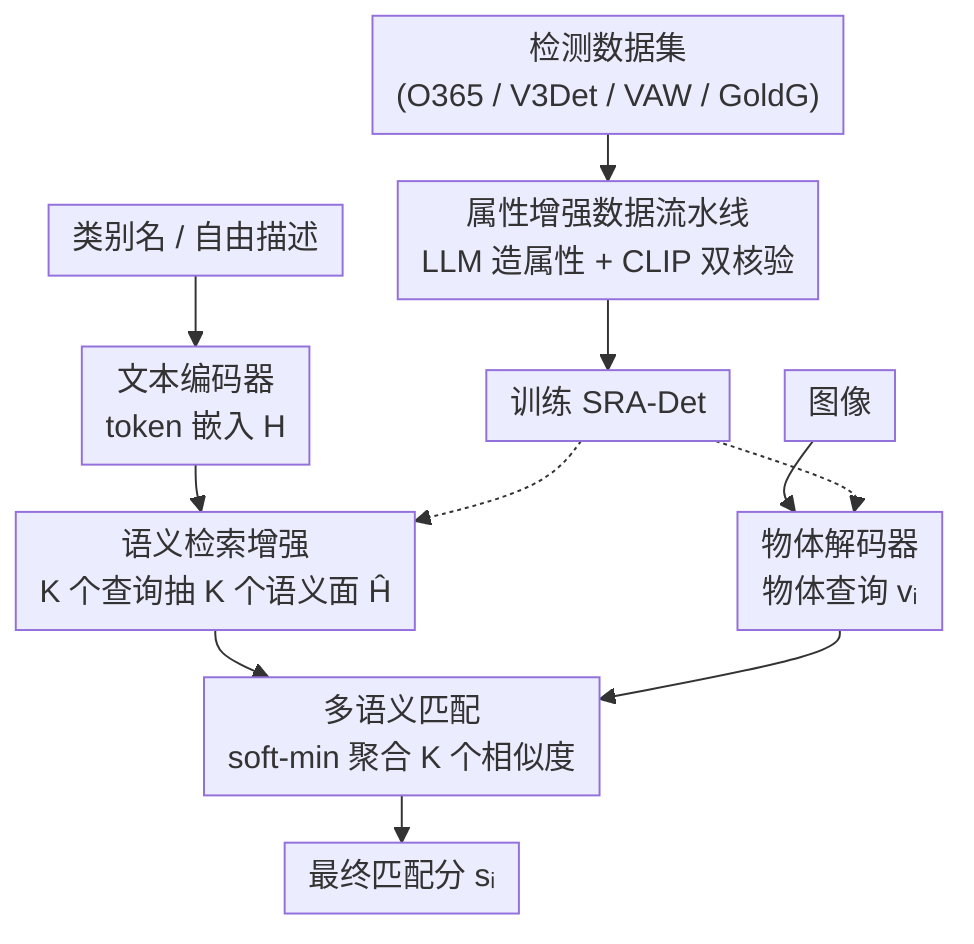

# SRA-Det: Learning Omni-Grained Open-Vocabulary Detection Beyond Category Names

**会议**: CVPR 2026  
**论文**: [CVF Open Access](https://openaccess.thecvf.com/content/CVPR2026/html/Yang_SRA-Det_Learning_Omni-Grained_Open-Vocabulary_Detection_Beyond_Category_Names_CVPR_2026_paper.html)  
**代码**: 无  
**领域**: 目标检测 / 开放词表检测  
**关键词**: 开放词表检测, 细粒度识别, 语义检索, 软最小匹配, 属性增强数据

## 一句话总结
针对开放词表检测只会按"类别名"匹配、对颜色/材质/图案等细粒度属性不敏感的问题，SRA-Det 用一组可学习检索查询从文本 token 里抽出多个语义面（facet），再用 soft-min 匹配让它们像"逻辑与"一样必须全部满足，配合一条用 LLM 自动生成属性、用 CLIP 双重核验的数据流水线扩充监督，零样本下在 FG-OVD 上拿到 54.9 mAP、在 LVIS 上保持 40.4 AP。

## 研究背景与动机

**领域现状**：开放词表目标检测（OVD）的主流做法是借助 CLIP 这类视觉-语言预训练，把候选区域特征和文本嵌入对齐，从而能识别训练词表之外的任意类别。GLIP、GroundingDINO、OWL-ViT、YOLO-World、MM-GDINO、LLMDet 等都在 COCO/LVIS 上展现了很强的零样本泛化。

**现有痛点**：这些方法和它们的评测都停留在"粗粒度类别"层面——只要框对了类别就算对，不管模型是否真的理解了描述里的细粒度属性。结果是：能找到"a dog"的检测器，未必能识别"a dog with gray and white fur and blue eyes"；能找到"a knife"的，可能漏掉"a grey metal knife with a black plastic handle"。FG-OVD 这类基准专门用只差一两个属性的"hard negative"描述来考验检测器，主流模型在这种更严格的协议下掉点明显。

**核心矛盾**：根因在于现有方法**把整条描述压成一个最终文本向量**。即便像 NoctOWL、HA-FGOVD 这样开始重视属性，最终也还是把属性信息线性融进一个全局向量里。一旦坍缩成单向量，强势的类别语义会盖过属性线索，"部分匹配"的物体（违反了一两个关键属性）依然能拿到高分。

**本文目标**：作者把问题拆成两个子问题——(i) 视觉匹配时文本到底该怎么表示，(ii) 细粒度属性监督怎么在大规模检测数据上低成本拿到。

**切入角度**：一条正确的检测，必须**同时**满足描述里说的所有语义线索；那匹配分数就应该是这些线索的"逻辑与"，而不是一个会被强项掩盖弱项的加权和。要做"与"，前提是先把描述显式拆成多个面，再分别核验。

**核心 idea**：用一小组可学习检索查询从 token 级文本特征里"检索"出多个互补的语义面，再用可微的 soft-min 聚合各面相似度，让任何一个属性不匹配都会把总分拉低；同时用 LLM+CLIP 自动造属性监督来喂饱这套机制。

## 方法详解

### 整体框架
SRA-Det 由两条相互补充的线组成：**模型侧**把单向量文本表示换成"多语义面 + soft-min 匹配"，解决"怎么表示和核验文本"；**数据侧**用一条自动流水线给大规模检测数据补上密集的视觉属性标注，解决"细粒度监督从哪来"。

模型本体是 DETR 风格的双流结构：图像编码器 + 物体解码器产出 $N$ 个物体查询 $v_i$，文本编码器把类别名或自由描述编码成 token 嵌入。关键的改动发生在文本分支——**语义检索增强（SRA）**模块用 $K$ 个查询从 token 嵌入里抽出 $K$ 个语义面 $\hat h_k$；推理时**多语义匹配**模块把每个物体查询和这 $K$ 个面逐一算相似度，再 soft-min 聚成最终分 $s_i$。训练数据则先经过**属性增强数据流水线**扩充，再喂给检测器。

### 关键设计

**1. 语义检索增强 SRA：把一条描述拆成多个互补语义面，而不是压成单向量**

这一项直接针对"单向量让类别语义盖过属性"的痛点。模块输入是 $K$ 个检索查询 $Q=\{q_1,\dots,q_K\}$（论文取 $K=3$）和文本 token 序列 $H=\{h_1,\dots,h_L\}$（取自文本编码器最后一层，去掉 [SOS]/[EOS]）。每个查询用注意力去"读"这些 token，抽出一个语义面：$r_k=\mathrm{Attention}(q_k,H,H)$。为了让不同查询各看一块，作者给每个查询配可学习位置嵌入 $p_k$，并把上一个检索结果当历史上下文注入下一个查询：$q_k=\mathrm{LN}(r_{k-1}+p_k)$（初始查询用 token 的全局平均池化 $r_0=\mathrm{AvgPool}(H)$）。这种"逐查询条件化"让 $K$ 个面递进地抽取互补信息，比一上来就并行抽更不容易重复。

抽出的 $r_k$ 再和全局文本嵌入 $h_{\mathrm{eos}}$ 融合增强：$h'_k=h_{\mathrm{eos}}+r_k$，$h_k=h'_k+\mathrm{MLP}(\mathrm{LN}(h'_k))$，最后投影 + L2 归一化得到多语义表示 $\hat H=\{\hat h_1,\dots,\hat h_K\}$。为保证这 $K$ 个面"既分散又全覆盖"，作者在检索注意力图 $A=\{a_1,\dots,a_K\}$ 上加两条正则：多样性损失 $\mathcal L_{\mathrm{div}}=\frac{1}{K(K-1)}\sum_{i\neq j}\langle a_i,a_j\rangle^2$ 压低不同查询注意力的内积、逼它们看不同区域；覆盖损失 $\mathcal L_{\mathrm{cov}}=\frac1L\sum_{j=1}^L\big(\frac1K\sum_{i=1}^K a_{i,j}-\frac1L\big)^2$ 鼓励所有有效 token 都被均匀照顾到，避免有的属性词被漏读。

**2. 多语义匹配（soft-min）：让"所有属性都满足"才得高分，等价于可微的逻辑与**

有了 $K$ 个语义面，怎么聚合成一个分数才能体现"必须全满足"？对每个物体查询 $v_i$，先和各面算相似度 $s_{i,k}=\langle v_i,\hat h_k\rangle$。直接取最小值 $\min_k s_{i,k}$ 确实能表达逻辑与——一票否决——但 $\min$ 不可微、只给最小项回传梯度，容易训练坍缩。作者改用 soft-min：

$$s_i=-\tau\log\sum_{k=1}^{K}\exp\!\Big(-\frac{s_{i,k}}{\tau}\Big)+\tau\log K$$

当各面分数接近时它表现得像平均，当某一面明显偏低时它趋近最小值——于是一个属性不匹配（比如把 metal 错认成 rattan）就足以把整体分压下去，正是细粒度识别需要的"短板决定成败"。这和旧方法"单向量点积"的本质区别在于：旧方法里弱属性能被强类别分数平均掉，而 soft-min 让弱项主导结果。

**3. 属性增强数据流水线：用 LLM 造属性、CLIP 双重核验，给大检测集补上密集属性监督**

模型再好也要有细粒度监督喂。大词表检测集类别全但几乎没有属性标注，人工标注代价高、直接用多模态大模型又会引入噪声和幻觉。流水线分三步化解：(1) **类别先验生成属性**——对每个类别用 prompt 让 LLM（实现用 DeepSeek V3.1）生成候选视觉属性，并强约束"必须是判别性的纯视觉属性（颜色/形状/部件/材质/纹理/图案/位置状态）、只要正属性不要否定、排除功能用途等非视觉属性"；标注时每个物体只和它自己类别的候选属性匹配，把搜索空间压小、标注更稳。(2) **CLIP 特征提取**——把物体 RoI 裁出来过 CLIP 图像编码器，并做 20%/40% 扩框和水平翻转后平均、L2 归一化得稳健视觉特征 $\hat f_{roi}$；属性侧用多模板（"a {category} with {attribute}"等）编码得描述特征 $\hat f^d_{attr}$，另外单独编码属性短语和类别名并相加归一化得 $f^c_{attr}=\mathrm{norm}(f_{attr}+f_{class})$。(3) **双重核验标注**——算三组相似度 $s^d_{attr}=\langle\hat f_{roi},\hat f^d_{attr}\rangle$、$s^c_{attr}=\langle\hat f_{roi},f^c_{attr}\rangle$、$s_{class}=\langle\hat f_{roi},f_{class}\rangle$，只保留同时满足 $s^d_{attr}>\max(s_{class},\gamma)$ 且 $s^c_{attr}>\max(s_{class},\gamma)$ 的属性（$\gamma$ 为置信阈值）。"双 check + 高于类别分"这一关把弱接地、噪声属性挡掉，只留视觉上真有支撑的标注。

### 损失函数 / 训练策略
沿用 DETR 风格检测器的训练目标，把上面的正则一并并入：

$$\mathcal L=\mathcal L_{\mathrm{align}}+\mathcal L_{\mathrm{align\_des}}+\mathcal L_{\mathrm{box}}+\mathcal L_{\mathrm{GIoU}}+\mathcal L_{\mathrm{div}}+\mathcal L_{\mathrm{cov}}$$

其中 $\mathcal L_{\mathrm{align}}$、$\mathcal L_{\mathrm{align\_des}}$ 分别是类别名和属性增强描述的对齐损失，$\mathcal L_{\mathrm{box}}$、$\mathcal L_{\mathrm{GIoU}}$ 是标准框回归损失。骨干用 Swin-T，文本编码器用预训练 Open-CLIP ViT-B/16，$K=3$，最长文本 20 token，batch 256，8 张 A800 训 12 个 epoch。

## 实验关键数据

### 主实验
零样本设置下，SRA-Det 用 Swin-T 在 FG-OVD 八子集平均 54.9 mAP，比此前零样本最好的 OWL-ViT(L/14) 高 13.8 mAP，甚至超过微调过的 NoctOWLv2(L/14)；在 LVIS minival 上保持 40.4 AP 的强类别级性能。

| 基准 | 指标 | SRA-Det(Swin-T) | 对比方法 | 差距 |
|------|------|------|----------|------|
| FG-OVD（零样本，8 子集均值） | mAP | **54.9** | OWL-ViT(L/14) 41.1 | +13.8 |
| LVIS minival（零样本） | AP | **40.4** | YOLO-World-L 35.4 | +5.0 |
| LVIS minival（零样本） | AP | 40.4 | GroundingDINO 27.4 | +13.0 |
| FG-OVD（微调后） | mAP | **67.8** | GUIDED 66.4 | +1.4 |

横向看，LLMDet 在 LVIS 上报告了更高 AP，但它是在强检测器 MM-GDINO 上微调、且训练用了 COCO，与 SRA-Det 从双流检测器训起、且细粒度性能远更强不完全可比（⚠️ 不同训练数据/初始化，AP 高低不宜直接论优劣）。和多模态大模型比，SRA-Det 仅 0.116B 参数就拿到 FG-OVD 上最高 F1 46.29、最高 Recall 51.71，胜过 2B 的 Qwen3-VL-2B-Instruct 和 4B 的 Rex-Omni，参数效率明显更高。在 OmniLabel(23.2) 和 OVDEval(17.3) 上也用更小骨干稳过多个强基线。

### 消融实验

| 配置 | LVIS AP | FG-OVD Hard | 说明 |
|------|---------|-------------|------|
| 仅 V3Det | 27.6 | 25.3 | 起点 |
| + 属性增强数据 | 27.9 (+0.3) | 30.3 (+5.0) | 自动属性监督 |
| + VAW | 28.5 (+0.6) | 43.1 (+12.8) | 真实属性数据贡献最大 |
| + O365 & GoldG | 40.4 (+11.9) | 45.2 (+2.1) | 大检测/接地数据补类别级 |
| w/o SRA | 28.5 | 40.8 | 去掉语义检索增强 |
| w/ SRA（完整） | 28.5 | 43.1 (+2.3) | LVIS 不变、细粒度涨 |

查询初始化消融：仅可学习查询(LQ) 42.3 → MLP(EOS) 42.6 → LQ+EOS 43.0 → **LQ+上一检索结果 43.1**（FG-OVD Hard），印证"用检索历史条件化每个查询"能逐步抽出更互补的语义面。

### 关键发现
- **SRA 只在该发力的地方发力**：加了 SRA 后 LVIS 保持 28.5 AP 不变，FG-OVD Hard 从 40.8 涨到 43.1——印证"粗类别识别单向量就够，细粒度才需要多面联合核验"。
- **属性监督真实数据比合成的更顶用**：自动属性增强数据给 FG-OVD Hard +5.0，但加入真实属性集 VAW 一举 +12.8，说明显式视觉属性监督是细粒度识别的关键瓶颈。
- **大检测/接地数据主要补类别级**：加 O365 & GoldG 让 LVIS 猛涨 +11.9，而对 FG-OVD Hard 只 +2.1，两类数据职责清晰。

## 亮点与洞察
- **把"逻辑与"做成可微算子**：soft-min 用 $-\tau\log\sum\exp(-s/\tau)$ 在"平均"与"取最小"之间平滑切换，既保留一票否决的语义、又不像硬 min 那样只回传单项梯度导致坍缩——这个"短板主导分数"的设计可迁移到任何"必须同时满足多条件"的匹配/检索任务。
- **检索查询的递进条件化**：用上一面的检索结果初始化下一面查询，让 K 个面互补而非冗余，比并行抽取多了一条信息流，消融里 +0.8 的稳定收益。
- **数据流水线"只造正向纯视觉属性 + 双 CLIP 核验 + 高于类别分"三道闸**，把 LLM 幻觉和 CLIP 噪声压到可用，是低成本扩属性监督的实用范式。

## 局限与展望
- 作者承认：属性增强流水线受限于 LLM 生成属性和 CLIP 核验的不完美，仍可能引入噪声/偏差；对视觉证据细微、长尾的稀有/歧义属性，SRA-Det 也会力不从心。
- 自己看：$K=3$ 是个偏小的固定值，描述里属性数远多于 3 时多语义面够不够覆盖、是否需要自适应 $K$，论文未深入；soft-min 的温度 $\tau$ 和阈值 $\gamma$ 的敏感性也未给系统分析（⚠️ 文中未报）。
- 改进思路：把属性数随描述长度自适应、对长尾属性引入难例重加权，或用更强的开放词表 VLM 替换 CLIP 做核验，可能进一步缩小细粒度差距。

## 相关工作与启发
- **vs HA-FGOVD / NoctOWL**：它们也重视属性，但仍把描述线性融成单个组合向量，违反一个属性时相似度可能照样高；SRA-Det 学一组检索查询分别盯不同片段、再用 soft-min 做逻辑与，对部分匹配的惩罚强得多。
- **vs GUIDED**：GUIDED 把细粒度 OVD 拆成主体识别 + 粗检测 + 属性判别三段、用 LLM 解析线索引导匹配；SRA-Det 不显式分阶段，而是在匹配机制本身（多面 + soft-min）里内建多属性一致性，微调后 67.8 > GUIDED 66.4。
- **vs LLMDet / MM-GDINO**：这类靠强检测器微调 + 大规模生成式监督冲 LVIS AP；SRA-Det 从双流检测器训起、不用 COCO，类别级保持竞争力的同时细粒度大幅领先，路线互补。

## 评分
- 新颖性: ⭐⭐⭐⭐ 把"多语义面 + soft-min 逻辑与"引入 OVD 匹配，角度清晰且有效
- 实验充分度: ⭐⭐⭐⭐ 覆盖 LVIS/FG-OVD/OmniLabel/OVDEval + MLLM 对比 + 数据/模块/初始化多组消融
- 写作质量: ⭐⭐⭐⭐ 动机和方法叙述清楚，公式与图配合到位
- 价值: ⭐⭐⭐⭐ 缩小粗/细粒度 OVD 差距，soft-min 匹配与属性流水线均可复用

<!-- RELATED:START -->

## 相关论文

- [\[CVPR 2026\] Consistency Beyond Contrast: Enhancing Open-Vocabulary Object Detection Robustness via Contextual Consistency Learning](consistency_beyond_contrast_enhancing_open-vocabulary_object_detection_robustnes.md)
- [\[CVPR 2026\] NoOVD: Novel Category Discovery and Embedding for Open-Vocabulary Object Detection](noovd_novel_category_discovery_and_embedding_for_open-vocabulary_object_detectio.md)
- [\[CVPR 2026\] Thermal-Det: Language-Guided Cross-Modal Distillation for Open-Vocabulary Thermal Object Detection](thermal-det_language-guided_cross-modal_distillation_for_open-vocabulary_thermal.md)
- [\[CVPR 2026\] WeDetect: Fast Open-Vocabulary Object Detection as Retrieval](wedetect_fast_open-vocabulary_object_detection_as_retrieval.md)
- [\[CVPR 2026\] ViTPrompt: Training-Free Prompt Refinement with Visual Tokens for Open-Vocabulary Detection](vitprompt_training-free_prompt_refinement_with_visual_tokens_for_open-vocabulary.md)

<!-- RELATED:END -->
