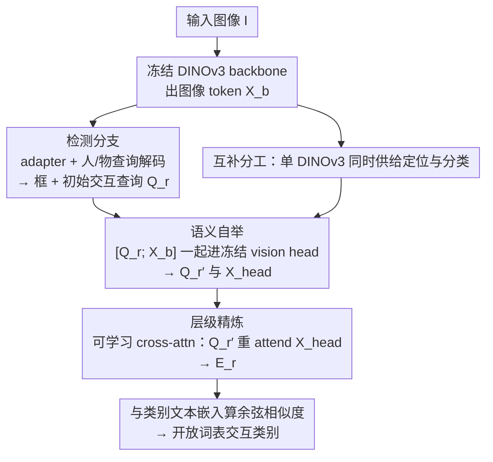

# SL-HOI：精简化的开放词表人-物交互检测

**会议**: CVPR 2026  
**论文**: [CVF Open Access](https://openaccess.thecvf.com/content/CVPR2026/html/Sun_Streamlined_Open-Vocabulary_Human-Object_Interaction_Detection_CVPR_2026_paper.html)  
**代码**: https://github.com/MPI-Lab/SL-HOI  
**领域**: 目标检测 / 人-物交互检测  
**关键词**: 开放词表HOI, DINOv3, 单VLM检测, 语义自举, 表征鸿沟

## 一句话总结
SL-HOI 只用一个冻结的 DINOv3（dino.txt 变体）做开放词表 HOI 检测——用 backbone 做精细定位、用文本对齐的 vision head 做开放词表交互分类，并通过"把交互查询和图像 token 一起塞进冻结 vision head"来弥合两者的表征鸿沟，仅训练少量参数就在 SWiG-HOI 和 HICO-DET 上刷到 SOTA。

## 研究背景与动机

**领域现状**：开放词表 HOI 检测要在一张图里定位所有"人-物对"并识别它们的交互动作，且要能识别训练时没见过的交互类别。当前主流靠预训练 VLM 来获得泛化能力，分两派：一派（VLM-collaborated）是"传统 HOI 检测器 + VLM"协作，VLM 主要负责把可泛化的交互表征喂给检测器；另一派（VLM-only）直接把一个 VLM 改造成既做检测又做分类的 HOI 检测器。

**现有痛点**：第一派要训练两个独立模型，结构复杂，而且两个模型之间的特征融合很难——因为跨模型表征存在巨大鸿沟（cross-model representation gap）。第二派通常基于 CLIP，但 CLIP 的训练目标是对齐"整图 vs 整句"的全局特征，提取不出做实例定位所需的细粒度区域特征，所以检测精度往往偏弱。

**核心矛盾**：HOI 检测同时需要两种性质相反的特征——**精细的局部定位特征**（找准人/物的框）和**整体的关系语义特征**（理解交互、并能开放词表泛化）。把这两件事拆给两个模型会带来跨模型鸿沟；塞进一个 CLIP 又顾此失彼。

**切入角度**：作者观察到 dino.txt（DINOv3 + vision head 的图文对齐变体）内部天然存在"功能分工"：可视化最后一个自注意力块的注意力图发现，DINOv3 backbone 的注意力高度聚焦在小而具体的区域（适合定位），而 vision head 的注意力是整体性的、会聚合全图的关系上下文（适合交互分类）。既然一个模型内部就同时具备这两种互补特征，何必再外挂第二个模型？

**核心 idea**：用**单一冻结 DINOv3** 同时承担定位与分类——backbone 出细粒度特征做检测、vision head 做开放词表分类；并通过"让交互查询和图像 token 共享同一条冻结 vision head 的前向通路"来消除两者的表征鸿沟。整个 DINOv3 全程冻结，只加少量可训练参数。

## 方法详解

### 整体框架

SL-HOI 是一个建立在冻结 DINOv3（dino.txt 变体，ViT-L/16）之上的单阶段（one-stage）框架。输入一张图 $I\in\mathbb{R}^{H\times W\times 3}$，冻结的 backbone 产出图像 token $X_b\in\mathbb{R}^{N\times D}$，这些 token 同时供给两条分支：

- **检测分支**（沿用标准 HOI 检测解码器）：先降维、加位置编码、过一个 detection adapter，再用一组人查询 $Q_h$ 和一组物查询 $Q_o$ 做交叉注意力，得到 $E_h, E_o$ 回归人/物框。这条分支是脚手架，沿用已有设计。
- **交互分类分支**（本文核心贡献）：把 $E_h, E_o$ 逐元素平均、投影成初始交互查询 $Q_r$；关键一步是把 $Q_r$ 和 backbone 图像 token $X_b$ **一起**送进冻结 vision head（而不是只送图像 token），得到语义增强的查询 $Q_r'$ 和被查询调制过的图像 token $X_{\text{head}}$；最后用一个可学习的 cross-attention block 让 $Q_r'$ 重新 attend 到 $X_{\text{head}}$，得到 $E_r$ 做开放词表分类。

### 关键设计

**1. 互补分工：用单一冻结 DINOv3 同时承担定位与分类**

这一设计针对的是"两个模型→跨模型鸿沟 / 单 CLIP→定位弱"的两难。作者把 dino.txt 拆成两个互补部件并各取所长：DINOv3 backbone 经大规模自监督预训练、配合 Gram anchoring 保留稠密空间细节，注意力聚焦在小区域，因此拿它的 patch token 做 key/value、配一个小检测解码器来定位人和物；vision head（两个自注意力块，把 class token / register token / patch token 联合处理后投影到文本嵌入空间）注意力是整体性的、富含关系上下文，因此用它做开放词表交互分类。关键在于**全部 DINOv3 参数都冻结**，只加少量可训练参数（detection adapter、检测解码器、最后一个 cross-attention block），所以既保住了自监督特征的质量，又能快速适配 HOI 任务。这与 VLM-only 派的本质区别是：别人用的是 CLIP 这种"全局对齐"的 VLM，定位先天不足；SL-HOI 用的 DINOv3 backbone 本来就为稠密预测而生。

**2. 语义自举：把交互查询塞进冻结 vision head 弥合表征鸿沟**

这一设计针对核心痛点——交互查询 $Q_r$ 和 vision head 输出之间仍存在表征鸿沟，直接做 cross-attention 效果不好。常规做法（late fusion）是单独用一个可学习解码器，让交互查询去 attend vision head 的**输出**特征；但查询和输出来自不同的表征空间，硬融合不顺。作者的做法是强制让两者共享同一表征空间：把交互查询 $Q_r$ 和 backbone 图像 token $X_b$ **拼在一起**送进冻结 vision head 的自注意力层，即 $[Q_r';\,X_{\text{head}}]=\mathcal{F}_{\text{head}}([Q_r;\,X_b])$。这一步**零额外训练成本**（vision head 冻结），却让交互查询直接走完 head 的预训练前向通路、与图像 token 充分交互，从而被对齐进 head 的文本-语义空间，得到语义增强的 $Q_r'$。一个额外好处是它同时产出**被查询调制过的图像 token** $X_{\text{head}}$——这些 token 已经带上了任务相关的交互线索，为下一步埋好伏笔。消融显示交互查询不只是"信息接收者"，也是"信息给予者"：若用 attention mask 阻断查询对图像 token 的影响（让 token 保持"纯净"），各项指标全面下降。

**3. 层级精炼：用可学习 cross-attention 复用被查询调制的图像 token**

这一设计的出发点是"精简架构应该榨干所有可用信息"——上一步顺带产出的 $X_{\text{head}}$ 是宝贵的上下文特征源，不该丢掉。作者引入一个轻量可学习解码器 $\mathcal{G}_{\text{decoder}}$（单层 cross-attention + 一个 MLP），让语义增强后的查询 $Q_r'$ 再去 attend 这些被自己调制过的 token：$E_r=\mathcal{G}_{\text{decoder}}(Q_r',\,X_{\text{head}})$。这构成一个"先粗对齐、再聚焦精炼"的层级过程：语义自举做的是冻结 head 里的全局语义对齐（提升 unseen/rare 泛化），层级精炼做的是针对 HOI 任务的可学习聚焦（提升 rare/non-rare）。定性分析把这一两阶段刻画为 **Local-Global-Local** 的推理流：自举阶段注意力铺得很广（继承 head 的图文对齐目标），精炼阶段注意力收回到显著的交互区域。最终 $E_r$ 投影到文本空间，与所有交互类别的文本嵌入 $E_t$ 算带可学习温度 $\tau$ 的余弦相似度 softmax：$p_{ij}=\dfrac{\exp(\tau\cos(e_r'^{(i)},e_t^{(j)}))}{\sum_{k\in\mathcal{R}}\exp(\tau\cos(e_r'^{(i)},e_t^{(k)}))}$，得到开放词表分类结果。

### 损失函数 / 训练策略

DINOv3 全程冻结，仅训练 detection adapter（$L_E=2$ 层自注意力）、检测解码器（$L_D=3$ 层，人/物各 $N_q=64$ 个查询）、以及交互分类前的 1 层 cross-attention 解码器（特征维 $D=1024$）。优化器 AdamW、学习率 $1\times10^{-4}$，8 卡 RTX 4090。两个数据集训练目标不同：SWiG-HOI 用 batch 内负样本的对比目标，HICO-DET 则对整个类别集合做分类。

## 实验关键数据

### 主实验（开放词表设置）

SWiG-HOI（约 5,500 关系类、其中 >1,000 类训练时未见），mAP%：

| 方法 | Unseen | Rare | Non-rare | Full |
|------|--------|------|----------|------|
| THID | 10.04 | 12.82 | 17.67 | 13.26 |
| CMD-SE | 10.70 | 14.64 | 21.46 | 15.26 |
| INP-CC | 11.02 | 16.74 | 22.84 | 16.74 |
| SGC-Net | 12.46 | 16.55 | 23.67 | 17.20 |
| MP-HOI-L（带检测预训练） | - | 18.59 | 25.76 | 16.21 |
| **SL-HOI（本文）** | **19.04** | **24.69** | **30.62** | **24.67** |

Unseen 类比次优 SGC-Net 高 6.58%，Full 类高 7.47%；即便对手用了 Swin-Large / CLIP-ViT-L 等更大 backbone 加额外预训练，也没能拿到同等收益——说明增益来自架构设计而非单纯堆 backbone。

HICO-DET 开放词表（mAP%，注意 COCO 物体标签会让"带检测预训练"组占便宜）：

| 方法 | Backbone | Unseen | Seen | Full |
|------|----------|--------|------|------|
| INP-CC（无检测预训练） | CLIP-ViT-B/16 | 17.38 | 24.74 | 23.13 |
| BC-HOI（带检测预训练） | ResNet50+BLIP-2-ViT-G/14 | 42.31 | 40.67 | 40.99 |
| **SL-HOI（本文）** | DINOv3-ViT-L/16 | 40.53 | 42.99 | 42.49 |

对比"无检测预训练"组，SL-HOI 在 unseen/seen/full 分别大涨 17.26% / 14.65% / 15.27%；即便对上"带 COCO 检测预训练"的强基线，也在 seen/full 上各高 2.16% / 1.50%（仅 unseen 略逊于 BC-HOI）。闭集 HICO-DET 上同样全面超过 SOTA BC-HOI（Full +2.04%）。

### 消融实验

组件叠加分析（SWiG-HOI，mAP%）：

| 配置 | Unseen | Rare | Non-rare | Full |
|------|--------|------|----------|------|
| Baseline（late-fusion 解码器） | 16.55 | 21.66 | 27.75 | 21.82 |
| + 语义自举 | 18.09 | 23.27 | 28.83 | 23.28 |
| + 层级精炼（完整 SL-HOI） | 19.04 | 24.69 | 30.62 | 24.67 |

设计变体对照（验证两点关键选择）：

| 配置 | Unseen | Rare | Non-rare | Full | 说明 |
|------|--------|------|----------|------|------|
| Late Fusion (Head only) | 16.55 | 21.66 | 27.75 | 21.82 | 仅 attend head 输出 |
| Late Fusion (Multi-Scale) | 15.73 | 21.63 | 28.49 | 21.77 | attend backbone+head 输出 |
| Semantic Bootstrapping | 18.09 | 23.27 | 28.83 | 23.28 | 走 head 内部冻结通路 |
| Ours w/ Attention Mask | 17.28 | 24.64 | 29.81 | 24.01 | 阻断查询调制图像 token |
| **Ours（完整）** | **19.04** | **24.69** | **30.62** | **24.67** | |

### 关键发现
- **两个组件分工明确**：语义自举主要靠共享冻结 head 的语义空间，显著拉高 unseen/rare（泛化）；层级精炼靠复用被任务线索调制过的图像 token，主要提升 rare/non-rare。二者叠加相对 baseline 累计 +2.49%/+3.03%/+2.87%/+2.85%。
- **"走 head 内部通路"才是关键**，而非简单的多尺度融合：用可学习解码器去 late-fuse（哪怕融合 backbone+head 两路输出）都不如把查询直接送进冻结 head 的自注意力块——后者真正把 head 的泛化能力迁移过来了。
- **交互查询是双向的**：加 attention mask 阻断查询对图像 token 的影响后各项掉点，证明查询不仅"接收信息"也在"塑造"图像表征。
- **adapter 层数不是越深越好**：detection adapter 取 2 层最佳（Full 24.67%），层数再多反而会破坏 DINOv3 的预训练特征——与原始 DETR"越深越好"的结论相反，原因是 backbone 冻结、adapter 是在适配已学好的特征而非从头学。

## 亮点与洞察
- **"一个模型内部的功能分工"是最漂亮的观察**：通过注意力图可视化直接看出 backbone（聚焦/定位）与 vision head（整体/语义）的天然互补，从而论证"无需外挂第二个模型"，把架构动机讲得很扎实。
- **零成本弥合鸿沟的 trick 可迁移**：当两组特征（如查询 vs 输出 token）来自同一个冻结大模型但表征不对齐时，不要在外面硬融合，而是把它们**拼起来一起喂进这个冻结模型的前向通路**，让模型自己把它们对齐——这套"借冻结模块前向通路做对齐"的思路对很多"冻结大模型 + 少量适配"的任务都有启发。
- **冻结 backbone 下 adapter 深度反直觉**：DETR 经验在"backbone 冻结"场景失效，提醒做迁移适配时不能照搬端到端训练的超参直觉。

## 局限与展望
- 作者承认用 ViT backbone 的 DINOv3 计算开销可能高于传统 CNN-based HOI 检测器。
- 方法强绑定 dino.txt 这一特定 VLM（需要"backbone + 文本对齐 vision head"的双部件结构）；换成不具备这种内部分工的 VLM 时，"互补分工 + 走 head 内部通路"的范式是否还成立，⚠️ 论文未讨论。
- HICO-DET unseen 类仍略逊于 BC-HOI（用了 BLIP-2-ViT-G/14 这种更大的 VLM + COCO 检测预训练），说明在极端未见类上，更大 VLM + 检测预训练仍有优势，SL-HOI 的"精简"在这一格上有取舍。

## 相关工作与启发
- **vs VLM-collaborated 派（HOICLIP / UniHOI 等）**：他们用"传统 HOI 检测器 + VLM"两个独立模型协作，结构复杂且跨模型特征难融合；SL-HOI 只用一个 DINOv3，从根上消除跨模型鸿沟。
- **vs VLM-only 派（THID / CMD-SE / INP-CC 等基于 CLIP）**：他们也用单 VLM，但 CLIP 全局对齐导致定位特征弱；SL-HOI 换成 DINOv3——其 backbone 本就为稠密预测保留细粒度空间细节，定位更强。
- **vs late-fusion 基线（HOICLIP 式 3 层解码器融合）**：late fusion 只在 head 输出后做融合；SL-HOI 让查询走进 head 内部的冻结自注意力通路，并复用被查询调制的中间 token，信息利用更充分。

## 评分
- 新颖性: ⭐⭐⭐⭐⭐ "单 DINOv3 同时做定位+分类"并用"塞进冻结 head 前向通路"弥合鸿沟，角度新颖且论证扎实
- 实验充分度: ⭐⭐⭐⭐⭐ 两个 benchmark、开放+闭集、组件叠加/设计变体/层数三类消融齐全
- 写作质量: ⭐⭐⭐⭐ 动机由注意力可视化驱动、逻辑清晰；公式与符号偶有跨页断裂但不影响理解
- 价值: ⭐⭐⭐⭐ 精简架构 + 少量可训练参数即达 SOTA，"借冻结模块前向通路对齐异质特征"的思路可迁移

<!-- RELATED:START -->

## 相关论文

- [\[CVPR 2026\] Black-Box Domain Adaptation for Object Detection with Retention-Driven Knowledge Compression](black-box_domain_adaptation_for_object_detection_with_retention-driven_knowledge.md)
- [\[CVPR 2026\] Show, Don't Tell: Detecting Novel Objects by Watching Human Videos](show_dont_tell_detecting_novel_objects_by_watching.md)
- [\[CVPR 2026\] CD-Buffer: Complementary Dual-Buffer Framework for Test-Time Adaptation in Adverse Weather Object Detection](cd-buffer_complementary_dual-buffer_framework_for_test-time_adaptation_in_advers.md)
- [\[CVPR 2026\] PaQ-DETR: Learning Pattern and Quality-Aware Dynamic Queries for Object Detection](paq-detr_learning_pattern_and_quality-aware_dynamic_queries_for_object_detection.md)
- [\[CVPR 2026\] Evaluating Few-Shot Pill Recognition Under Visual Domain Shift](evaluating_few-shot_pill_recognition_under_visual_domain_shift.md)

<!-- RELATED:END -->
