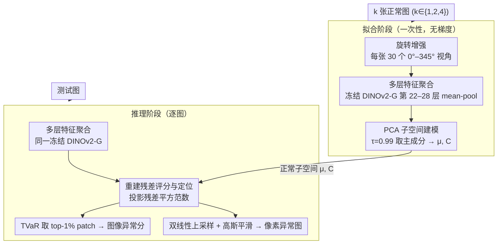

# SubspaceAD: Training-Free Few-Shot Anomaly Detection via Subspace Modeling

**会议**: CVPR 2026  
**arXiv**: [2602.23013](https://arxiv.org/abs/2602.23013)  
**代码**: [https://github.com/CLendering/SubspaceAD](https://github.com/CLendering/SubspaceAD)  
**领域**:目标检测
**关键词**: 少样本异常检测, PCA, DINOv2, 无训练, 子空间建模

## 一句话总结

SubspaceAD 证明了在强视觉基础模型（DINOv2-G）特征上做一次 PCA 拟合就足以超越所有需要训练/记忆库/提示调优的少样本异常检测方法，1-shot 下在 MVTec-AD 上达 98.0% 图像级 AUROC 和 97.6% 像素级 AUROC。

## 研究背景与动机

**领域现状**：工业异常检测的主流方法分三类——重建型（学习重建正常样本）、记忆库型（存储正常特征做最近邻）、VLM 型（用 CLIP 等做文本引导检测）。

**现有痛点**：
   - 重建型需要训练、调参、平衡重建质量和异常敏感度
   - 记忆库型需存储数千至数百万 patch 描述子，推理时做大规模最近邻搜索
   - VLM 型依赖提示调优、辅助数据集或领域特定文本先验
   - 三类方法都越来越复杂（多阶段训练、数据增强、超参数调优），部署困难

**核心矛盾**：视觉基础模型（如 DINOv2）已经产生了足够强的特征表示，还需要这么复杂的下游管道吗？

**切入角度**：经典统计学原理——异常（离群值）表现为偏离正常数据主成分子空间的重建残差

**核心 idea**：用冻结的 DINOv2-G 提特征 + 一次 PCA 拟合正常子空间 = 免训练异常检测

## 方法详解

### 整体框架

SubspaceAD 想回答一个朴素的问题：既然 DINOv2 这类基础模型已经把图像编码成判别力极强的 patch 特征，异常检测还需不需要那一整套训练、记忆库、提示调优？它的答案是不需要——只要把"正常"这件事用一个低维线性子空间描述出来，偏离这个子空间的部分就是异常。整条流程因此只有两步、不含任何可学习参数：拟合阶段从 $k$ 张正常图（$k \in \{1,2,4\}$）经旋转增强后抽取**多层特征**，对它们做一次 **PCA 子空间建模**得到正常子空间（均值 $\mu$ + 主成分矩阵 $C$）；推理阶段把测试图的每个 patch 特征同样做多层聚合、投影回这个子空间，再用**重建残差**评分与定位——投影丢掉的那部分能量就直接当作异常分数。整个"模型"就是 $\mu$ 和 $C$，每类不到 1MB。下图把拟合与推理两阶段、以及三个关键设计在数据流里的位置画出来：

### 关键设计

**1. 多层特征聚合：让协方差估计落在稳定的特征层上**

问题出在用哪一层的特征来拟合 PCA。DINOv2 最深层的特征倾向于把局部细节坍缩成类别级抽象，丢掉了异常检测最需要的纹理和结构线索；只用单层又容易把该层特有的方差混进协方差估计，让主成分抓到的不是"正常外观"而是"层噪声"。SubspaceAD 的做法是从第 22–28 层这段中间层各取 patch 特征再平均，$x_p = \frac{1}{|\mathcal{L}|}\sum_{l \in \mathcal{L}} f_l(p)$（$\mathcal{L}$ 为第 22–28 层）。平均后语义信息和结构信息被同时保留，层特定方差被抵消，于是 PCA 的主成分捕捉到的是正常样本跨层一致的稳定模式——消融里单用最后一层只有约 95%，多层聚合直接拉到 98.0%。

**2. PCA 子空间建模：用一次特征值分解描述"什么叫正常"**

有了稳定特征，正常样本被假设成落在一个低维线性子空间附近：$x = \mu + Cz + \epsilon$，其中 $\mu$ 是均值，$C \in \mathbb{R}^{D \times r}$ 由协方差矩阵 $\Sigma$ 的前 $r$ 个特征向量组成，$z$ 是子空间内的坐标、$\epsilon$ 是子空间外的残差。保留多少主成分不靠手调，而是用解释方差阈值 $\tau = 0.99$ 自动决定——取最小的 $r$ 使

$$\sum_{i=1}^r \lambda_i \geq \tau \sum_{i=1}^D \lambda_i$$

即让子空间覆盖正常特征 99% 的方差。少样本下正常样本太少、协方差估计不稳，作者对每张正常图做 $N_a = 30$ 个随机旋转（0°–345°）来扩充视角，正好覆盖工业检测里常见的摆放角度变化（消融显示去掉增强会掉到约 96%）。拟合完只需存下 $\mu \in \mathbb{R}^D$ 和 $C \in \mathbb{R}^{D \times r}$，所以每类模型不到 1MB，远小于记忆库方法动辄数十上百 MB。

**3. 重建残差评分与定位：异常就是投影丢掉的那部分能量**

既然正常 patch 都贴着子空间，那么一个 patch 离子空间多远就是它有多异常。把它投影回去 $x_\text{proj} = \mu + CC^\top(x_p - \mu)$，再取投影残差的平方范数 $S(x_p) = \|x_p - x_\text{proj}\|_2^2$ 当 patch 级分数——这一项不是随手设计的评分，而正好等于正交于子空间方向上的负对数似然，所以统计上有概率论依据。要得到整图的异常分，作者用尾部风险值（TVaR，取分数最高的 top $\rho = 1\%$ 个 patch 求均值）而非全图平均，避免大量正常背景 patch 把少数异常 patch 的高分稀释掉；像素级异常图则把 patch 分数双线性上采样回原分辨率，再做 $\sigma = 4$ 的高斯平滑得到平滑的定位热力图。

### 损失函数 / 训练策略

**无训练**。整个方法只有一次 PCA 拟合（即一次特征值分解），没有任何梯度更新或调参循环。推理约 300ms/张，其中 DINOv2 前向占 270ms、子空间投影只占 30ms——瓶颈完全在基础模型的特征提取上。

## 实验关键数据

### 主实验 — 1-shot 异常检测

| 数据集 | 指标 | SubspaceAD | AnomalyDINO | PromptAD | WinCLIP |
|--------|------|-----------|-------------|----------|---------|
| MVTec-AD | Image AUROC | **98.0** | 96.6 | 94.6 | 93.1 |
| MVTec-AD | Pixel AUROC | **97.6** | 96.8 | 95.9 | 95.2 |
| MVTec-AD | PRO | **93.7** | 92.7 | 87.9 | 87.1 |
| VisA | Image AUROC | **93.3** | 87.4 | 86.9 | 83.8 |
| VisA | Pixel AUROC | **98.3** | 97.8 | 96.7 | 96.4 |

4-shot 设置下 SubspaceAD 仍全面领先（MVTec 98.4% / VisA 94.5%）。

### 消融实验

| 配置 | MVTec Image AUROC | 说明 |
|------|-------------------|------|
| 单层（最后层） | ~95% | 丢失低层结构信息 |
| 多层聚合 (22-28) | **98.0%** | 平衡语义与结构 |
| $\tau = 0.95$ | ~97% | 保留成分太少 |
| $\tau = 0.99$ | **98.0%** | 最佳阈值 |
| 无数据增强 | ~96% | 旋转增强显著提升 |
| 672px 分辨率 | **98.0%** | 优于 518px |

### 关键发现
- 在 VisA 上 1-shot 图像级 AUROC 超 AnomalyDINO 5.9 个百分点（93.3% vs 87.4%），差距巨大
- 多层特征聚合比仅用最后一层收益显著，因为中间层包含局部纹理/结构信息
- 方法在 batched 0-shot 设置下同样 SOTA（VisA 97.7%），说明 PCA 子空间建模的普适性
- 每类模型不到 1MB 存储，远小于记忆库方法（数十至数百 MB）
- 推理速度 300ms/张，瓶颈完全在 DINOv2 前向传播

## 亮点与洞察
- **"大道至简"的典范**：在所有人都在设计复杂管道的时候，证明了 PCA 这个最经典的方法在强特征上就能碾压一切。发人深省：是否很多任务的复杂度不在下游方法，而在特征表示质量？
- **统计学理论保证**：重建残差 = 正交子空间的负对数似然，异常检测有概率论基础，不是拍脑袋设计的评分函数。
- **极致轻量**：无训练、无记忆库、无提示调优，每类 <1MB 模型，真正可工业部署。
- **旋转增强的巧妙用法**：不是为了"更多数据"，而是为了让协方差估计覆盖工业检测中常见的旋转变化。

## 局限与展望
- 线性子空间假设可能对非线性分布的正常变化建模不足
- 依赖 DINOv2-G（ViT-G），模型本身较重（~1.1B 参数），推理主要瓶颈在特征提取
- 旋转增强的假设不一定适用所有类别（如晶体管，旋转本身就是异常）
- 未验证在领域外数据（如医学图像）的泛化能力
- PCA 阈值 $\tau$ 和分辨率需要根据数据集选择，虽然很稳健但并非完全无参数

## 评分
- 新颖性: ⭐⭐⭐⭐ 不是方法新（PCA 很经典），而是洞察新——证明强特征+简单方法>复杂管道
- 实验充分度: ⭐⭐⭐⭐⭐ MVTec-AD+VisA 全面覆盖，0/1/2/4-shot 全测，消融充分
- 写作质量: ⭐⭐⭐⭐⭐ 论证逻辑清晰，反复强调"为什么简单方法work"
- 价值: ⭐⭐⭐⭐⭐ 工业界可直接部署的方案，审稿即可被论文的简洁性打动

<!-- RELATED:START -->

## 相关论文

- [\[CVPR 2026\] Bidirectional Multimodal Prompt Learning with Scale-Aware Training for Few-Shot Multi-Class Anomaly Detection](bidirectional_multimodal_prompt_learning_with_scale-aware_training_for_few-shot_.md)
- [\[CVPR 2026\] Defect Cue-Preserved Structural Feature Refinement for Few-Shot Anomaly Detection](defect_cue-preserved_structural_feature_refinement_for_few-shot_anomaly_detectio.md)
- [\[CVPR 2025\] UniVAD: A Training-free Unified Model for Few-shot Visual Anomaly Detection](../../CVPR2025/object_detection/univad_a_training-free_unified_model_for_few-shot_visual_anomaly_detection.md)
- [\[CVPR 2026\] VisualAD: Language-Free Zero-Shot Anomaly Detection via Vision Transformer](visualad_language-free_zero-shot_anomaly_detection_via_vision_transformer.md)
- [\[CVPR 2026\] FastRef: Fast Prototype Refinement for Few-shot Industrial Anomaly Detection](fastref_fast_prototype_refinement_for_few-shot_industrial_anomaly_detection.md)

<!-- RELATED:END -->
