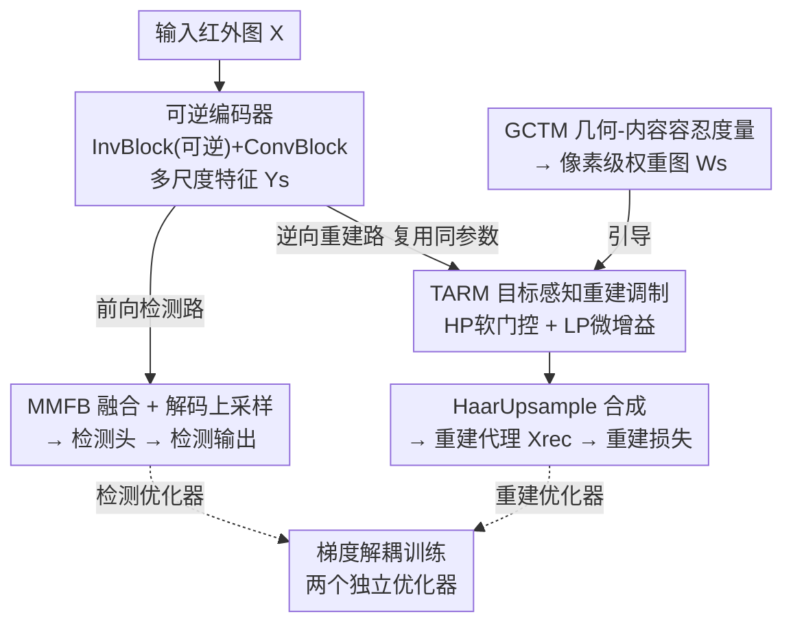

# Target-Aware Invertible Encoder with Reconstruction Guidance for Infrared Small Target Detection

**会议**: CVPR 2026  
**论文**: [CVF Open Access](https://openaccess.thecvf.com/content/CVPR2026/html/Yan_Target-Aware_Invertible_Encoder_with_Reconstruction_Guidance_for_Infrared_Small_Target_CVPR_2026_paper.html)  
**代码**: 无  
**领域**: 目标检测 / 红外小目标检测  
**关键词**: 红外小目标检测, 可逆编码器, 重建引导, 信息保持, 梯度解耦

## 一句话总结
InvDet 用一个可逆编码器把"下采样导致红外小目标信息丢失"这件事变成可观测、可优化的量——前向走检测、逆向重建输入，再用 TARM 把重建焦点收到目标上、用 GCTM 替代 IoU 生成像素级权重图监督重建，在 5 个红外基准上取得有竞争力的精度和很强的跨数据集泛化。

## 研究背景与动机

**领域现状**：红外小目标检测（ISTD）的主流深度检测器沿用通用检测的套路——加深 backbone、堆叠下采样（strided conv / pooling），把特征图压到输入的 1/16 甚至 1/32，以换取大感受野和高层语义。

**现有痛点**：红外小目标本身就是"弱信号 + 极小空间占据"（论文图 1 里第三行是 2×2 像素的点目标）。下采样本质上是低通滤波器，会系统性地衰减、弥散这些微弱线索，把它们淹进背景杂波里。论文可视化显示信息损失随下采样倍率快速累积，16× 之后大多数目标直接"消失"，解码器再怎么上采样也救不回来——这就是 ISTD 的性能瓶颈。

**核心矛盾**：现有缓解手段（密集跳连/注意力、对 IoU 不友好的容忍度量与损失如 TAM、联合低层任务如去非均匀/超分）都是**事后补偿**信息损失，而没有触碰根因——下采样是**非单射（non-injective）**的，信息一旦在前向丢掉就是丢掉了。

**切入角度**：作者借鉴图像缩放里可逆模型（IRN）的思路——把下采样/上采样建模成**双射变换**，逆向可以从低分辨表示 + 一个潜变量精确重建出高分辨图像。这给检测提供了一个全新视角：与其事后补偿，不如让"信息损失"在源头变得**可测量、可直接优化**。

**核心 idea**：用一个可逆编码器把前向特征潜变量逆向重建回输入，使信息损失成为一个显式可优化的量；再用目标感知调制（TARM）和几何-内容容忍度量（GCTM）让重建只服务于"保住目标"，从而把特征提取约束成"对检测友好"的表示。

## 方法详解

### 整体框架

InvDet 在训练时同时跑两条互补的通路：**前向检测路**（实线）和**逆向重建路**（红色虚线）。输入一张红外图 $X \in \mathbb{R}^{H\times W\times 1}$，先经可逆编码器抽出多尺度特征 $\{Y_s\}_{s=1}^{S}$；前向路把这些特征送进 MMFB（多跳多尺度融合）得到 $P_s$，再经带残差的转置卷积逐级上采样 $F_s = P_s + \text{UpSample}(P_{s+1})$，最后 $F_1$ 进检测头输出目标属性。逆向路则用同一套 InvBlock 参数把潜变量解析地反推回 $X_{rec}$——但在合成之前先过 TARM 调制，使 $X_{rec}$ 成为一个"目标感知代理"而非精确逆，重建误差被 GCTM 的权重图 $W_s$ 软约束。关键在于两条路用**两个独立优化器**分别更新，互不污染。推理时逆向路整条关闭，只跑高效的检测路。

### 关键设计

**1. 可逆编码器：把信息损失从"看不见"变成可观测、可优化**

针对"下采样不可逆、信息丢了救不回"这个根因，InvDet 把编码器做成**前 $S_{rev}$ 个可逆阶段 + 后续标准卷积阶段**的混合结构。可逆阶段用正交的 Haar 分析/合成算子（$\mathcal{H}$ 下采样、$\mathcal{H}^{-1}$ 上采样）把输入拆成低频 $x_s^l$ 与高频 $x_s^h$：$(x_s^l, x_s^h)=\mathcal{H}(X_{s-1})$，正交变换在减半分辨率的同时不丢空间信息；再用 InvBlock 做双射耦合，$y_s^l = x_s^l + \phi(x_s^h)$，$y_s^h = x_s^h \odot \exp(\Psi) + \rho(y_s^l)$，其中 $\Psi=\eta(y_s^l)$ 经 clamp 约束以防梯度爆炸。逆向时 $x_s^h=(y_s^h-\rho(y_s^l))\odot\exp(-\Psi)$、$x_s^l=y_s^l-\phi(x_s^h)$ 精确还原。后面 $s>S_{rev}$ 的阶段才用普通 ConvDownsample 扩感受野、抽判别性语义，只参与检测不参与重建。这样早期阶段保住小目标的关键信息用于重建，深层阶段专注检测线索，"信息保持"和"语义抽象"各司其职——而因为逆向能重建，信息损失第一次成了一个可以写进损失函数去优化的量。

**2. 梯度解耦训练：让重建监督特征提取，却不干扰检测专属组件**

如果重建损失和检测损失共用一个优化器回传，重建梯度会窜进 neck 和检测头，扰乱检测本身的学习。InvDet 用**两个独立优化器**：检测优化器只更新 neck 和预测头，重建优化器只基于调制后的重建损失更新可逆编码器。这保证了梯度流"干净"——重建能直接正则化特征提取过程（逼编码器学出对检测友好、信息完整的表示），但不会反过来污染检测专属模块。配合逆向路复用前向 InvBlock 的参数（解析求逆、零额外可训练权重、零推理开销），重建在这里是"对特征的一个直接约束"，而不是一条独立并行的低层任务流——这正是 InvDet 区别于 IA-YOLO/UniCD 那类"低层任务当预处理或并行分支"工作的地方。

**3. TARM：把重建从"处处均等保真"改成"目标严格、背景只保低通"**

逐像素均匀重建整张图（含背景杂波）对检测没好处，反而可能引入噪声。TARM 只作用在逆向路，由两个信号联合决定调制的时空强度：空间上用 GCTM 产出的 stage 对齐权重图 $W_s\in[0,1]$ 聚焦真正有信息的区域；时间上用余弦 ramp-up 因子 $r_s=\tfrac12(1-\cos(\pi\xi))$、$\xi=\text{clip}(\frac{e-e_0}{\Delta e},0,1)$ 让调制随训练平滑增强、避免突变信息损失。具体三个协同操作都被 $W_s$ 和 $r_s$ 逐元素门控：LP 微增益 $\hat{y}_s^l = y_s^l\odot(1+\gamma r_s\sqrt{W_s})$ 温和抬升目标结构；HP 软门控 + high-boost 残差 $\hat{y}_s^h = y_s^h\odot W_s^{\theta r_s} + \delta W_s\odot[\text{HB}(y_s^h)-y_s^h]$ 压背景纹理、保目标边缘。调制后的潜变量只用于重建路，不扰动前向检测分布——也因此 $X_{rec}$ 是"目标感知代理"而非精确逆。

**4. GCTM：替代 IoU、为小目标提供几何 + 外观双线索的容忍度量**

IoU 对极小目标过度敏感（差几个像素就大幅波动），无法稳定监督。GCTM 融合几何一致性与外观一致性：几何项沿用 TAM 思路 $\mathbb{S}_{geo}=\exp(-(d_c/t_{center})^2-(|A_{pr}-A_{gt}|/t_{area})^2)$，用 $t_{center}=\sqrt{w_{gt}^2+h_{gt}^2}$、$t_{area}=A_{gt}$ 做尺度自适应；内容项用辐射度感知的分母 $\mathbb{S}_{gray}=\text{BC}(\mathcal{P}_{gt},\mathcal{P}_{pr})/t_{gray}$，$t_{gray}=\text{LSNR}(\mathcal{P}_{gt})/(1+H_{bg})+\varepsilon$（BC 为 Bhattacharyya 系数，LSNR 为局部信噪比，$H_{bg}$ 为背景熵）；二者由几何驱动的权重融合 $\text{GCTM}=\lambda\mathbb{S}_{geo}+(1-\lambda)\mathbb{S}_{gray}$、$\lambda=\sigma(\mathbb{S}_{geo}/\tau)$。实例级分数经尺度自适应高斯掩膜光栅化成像素图 $W_{full}$，再下采样成多尺度 $W_s$ 喂给 TARM。论文图 3 显示 GCTM 对轻微错位平滑容忍、对外观不一致的预测果断降权。

### 损失函数 / 训练策略

训练目标是检测损失 + 被 $W_s$ 软加权的重建损失，二者由两个独立优化器分别回传（见关键设计 2）。重建调制强度由余弦 ramp-up $r_s$ 随 epoch 平滑放大；可逆深度 $S_{rev}$ 与每阶段 InvBlock 数 $n_s^{block}$ 是核心结构超参。推理时逆向重建路关闭，前向吞吐不受影响。

## 实验关键数据

在 5 个公开红外基准（IRSTD-1K、NUAA-SIRST、NUDT-SIRST、IRSTD、DUAB）上评测，统一官方划分与预处理，报告 Recall / Precision / F1；DUAB 按目标面积事后分层为 point/spot/extended 仅供分析。

### 主实验（与 SOTA 对比，F1 %）

| 数据集 | 本文 InvDet | 次优方法 | 提升 |
|--------|------------|----------|------|
| IRSTD-1K | 84.4 | 80.3 (MA-Net) | +4.1 |
| NUAA-SIRST | 87.4 | 83.9 (DNA-Net) | +3.5 |
| NUDT-SIRST | 86.2 | 84.7 (MA-Net) | +1.5 |
| DUAB-Spot | 93.5 | 91.4 (MA-Net) | +2.1 |
| DUAB-Extended | 98.2 | 96.9 (DNA-Net) | +1.3 |
| IRSTD | 97.8 | 98.3 (MA-Net) | −0.5 ⚠️ |
| DUAB-Point | 93.5 | 98.2 (MA-Net) | −4.7 ⚠️ |

InvDet 在多数基准上取得最佳 F1；在 IRSTD 和 DUAB-Point 上略逊于 MA-Net，作者解释这两个数据集规模大得多（IRSTD 32k+、DUAB 12k+），更利于"数据集特定拟合"，而 InvDet 的优势在于可泛化的表示。

### 跨数据集泛化（F1 % 保留率，无微调）

| 训练→测试 | IRSTD-1K | NUAA-SIRST | NUDT-SIRST |
|-----------|----------|------------|------------|
| IRSTD-1K（域内 84.4） | — | 77.8（89.1%） | 74.3（86.1%） |
| NUAA-SIRST（域内 87.4） | 74.3（88.0%） | — | 75.3（87.4%） |
| NUDT-SIRST（域内 86.2） | 63.7（75.5%） | 72.6（83.1%） | — |

平均跨域 F1 保留率 **84.9%**；真实→真实迁移最强（IRSTD-1K ↔ NUAA-SIRST 之间 88–89% 保留，尽管分辨率差 2×），合成→真实（NUDT-SIRST→IRSTD-1K）保留 75.5%。这支持"优势来自可泛化表示而非数据集拟合"的论点。

### 消融实验：可逆深度 $S_{rev}$ × 每阶段 InvBlock 数

| 配置（$S_{rev}$, $n^{block}$） | IRSTD-1K F1 | E2E FPS | FWD FPS | 说明 |
|------|------|------|------|------|
| $S_{rev}=2$, [2,2,2,2] | 84.40 | 50.30 | 72.72 | 最佳精度配置 |
| $S_{rev}=2$, [1,1,1,1] | 83.18 | 72.06 | 115.24 | block 少→更快但掉点 |
| $S_{rev}=4$, [1,1,1,1] | 84.11 | 78.55 | 126.49 | 大 $S_{rev}$ 主要影响训练期速度 |
| $S_{rev}=4$, [4,4,4,4] | 81.26 | 37.91 | 47.74 | 容量过大反而掉点 |

### 关键发现
- **逆向路推理零开销**：测试时关闭逆向路，前向吞吐（FWD FPS）保持高位；增大 $n_s^{block}$ 主要增 FLOPs/Params，增大 $S_{rev}$ 只影响训练期 E2E FPS——可逆设计的代价集中在训练而非部署。
- **召回涨而精度不掉**：特征演化可视化（图 6）显示 LP 分支在 $W_s$ 高处抬升目标基线、HP 分支经 high-boost 残差压背景纹理并锐化边界；权重图随余弦 ramp-up 逐渐向真目标集中，解释了召回提升却不牺牲精度。
- **精度并非越深越好**：$S_{rev}/n^{block}$ 过大（如 [4,4,4,4]）F1 反降，说明可逆容量需要和任务匹配，盲目加深无益。

## 亮点与洞察
- **把"信息损失"做成可优化量**：最"啊哈"的点是用双射重建把一个原本抽象、事后只能补偿的问题，转化成一个能写进损失、在源头直接优化的显式信号——这是范式层面的重构，而非又一个模块。
- **逆向路零额外参数、零推理开销**：逆向重建复用前向 InvBlock 的同一套参数做解析求逆，等于"免费"拿到一条监督信号，部署时一关了之，对工程落地友好。
- **TARM 的"目标严格、背景低通"思想可迁移**：任何"重建/自监督辅助任务对前景更重要"的场景（如医学小病灶、遥感弱小目标），都可借鉴用任务感知权重图把重建保真度从均匀重分配到目标上。

## 局限与展望
- 论文未公开代码（⚠️ 以官方为准），TARM 内部多个超参（$\gamma,\theta,\delta,\tau$、ramp-up 的 $e_0/\Delta e$）的敏感性主要放在补充材料，正文难以判断调参成本。
- 在大规模数据集（IRSTD、DUAB-Point）上略逊于 MA-Net，作者归因于数据规模利于域内拟合——但这也意味着 InvDet 在数据充足时的上限可能不如专门做大数据拟合的方法，需要更直接的对照实验佐证。
- 可逆约束 + 双优化器训练增加了训练复杂度与显存；$S_{rev}/n^{block}$ 过大反而掉点，说明结构需要谨慎搜索，缺少自适应选择机制。
- GCTM 的内容项依赖 LSNR、背景熵等统计量，在极端噪声或非典型红外成像下是否稳健，正文未充分验证。

## 相关工作与启发
- **vs IRN（可逆图像缩放）**: IRN 把缩放建模成双射、逆向从低分辨 + 先验潜变量重建高分辨图，强项是信息保持；但直接拿 IRN 当检测 backbone 会逼它重建整张含杂波的场景，既低效又与检测目标错位。InvDet 用 TARM 让可逆结构"目标感知"，把表示容量集中到定位/识别关键信息上，才让可逆表示在 ISTD 真正可用。
- **vs IA-YOLO / UniCD（联合低层 + 高层任务）**: 它们把低层任务（去雾、非均匀校正）当独立并行流或预处理，再把输出融进检测 backbone。InvDet 把低层（重建）和高层（检测）做成同一个可逆变换的两个视角，重建不是独立流而是对特征提取过程的直接约束，从设计上保证特征"检测友好"。
- **vs TAM / scale-location-sensitive loss（容忍度量）**: 这些工作改的是评测/损失里 IoU 对小目标不友好的问题，属事后评价层面的修补。GCTM 在几何容忍（沿用 TAM）之外加入辐射度感知的外观一致性，并产出像素级权重图反过来引导重建——把度量从"打分工具"升级成"监督信号源"。

## 评分
- 新颖性: ⭐⭐⭐⭐⭐ 首个把可逆编码器 + 梯度解耦引入红外小目标检测、把信息损失变可优化量的框架，视角层面有原创性。
- 实验充分度: ⭐⭐⭐⭐ 5 基准 + 跨数据集泛化 + 结构消融较扎实，但 TARM 超参敏感性与训练成本主要压在补充材料。
- 写作质量: ⭐⭐⭐⭐ 动机推导清晰、公式完整，可逆/调制部分符号略密集需要细读。
- 价值: ⭐⭐⭐⭐ 推理零额外开销 + 强跨域泛化，对实际部署的红外检测系统有吸引力，思想可迁移到其他弱小目标场景。

<!-- RELATED:START -->

## 相关论文

- [\[CVPR 2026\] CHAL: Causal-guided Hierarchical Anomaly-aware Learning for Moving Infrared Small Target Detection](chal_causal-guided_hierarchical_anomaly-aware_learning_for_moving_infrared_small.md)
- [\[CVPR 2026\] Seeing Through the Noise: Improving Infrared Small Target Detection and Segmentation from Noise Suppression Perspective](seeing_through_the_noise_improving_infrared_small_target_detection_and_segmentat.md)
- [\[NeurIPS 2025\] Rethinking Evaluation of Infrared Small Target Detection](../../NeurIPS2025/object_detection/rethinking_evaluation_of_infrared_small_target_detection.md)
- [\[CVPR 2026\] Geometry-Aligned and Anomaly-Aware Reconstruction for 3D Anomaly Detection](geometry-aligned_and_anomaly-aware_reconstruction_for_3d_anomaly_detection.md)
- [\[ICCV 2025\] From Easy to Hard: Progressive Active Learning Framework for Infrared Small Target Detection with Single Point Supervision](../../ICCV2025/object_detection/from_easy_to_hard_progressive_active_learning_framework_for_infrared_small_targe.md)

<!-- RELATED:END -->
