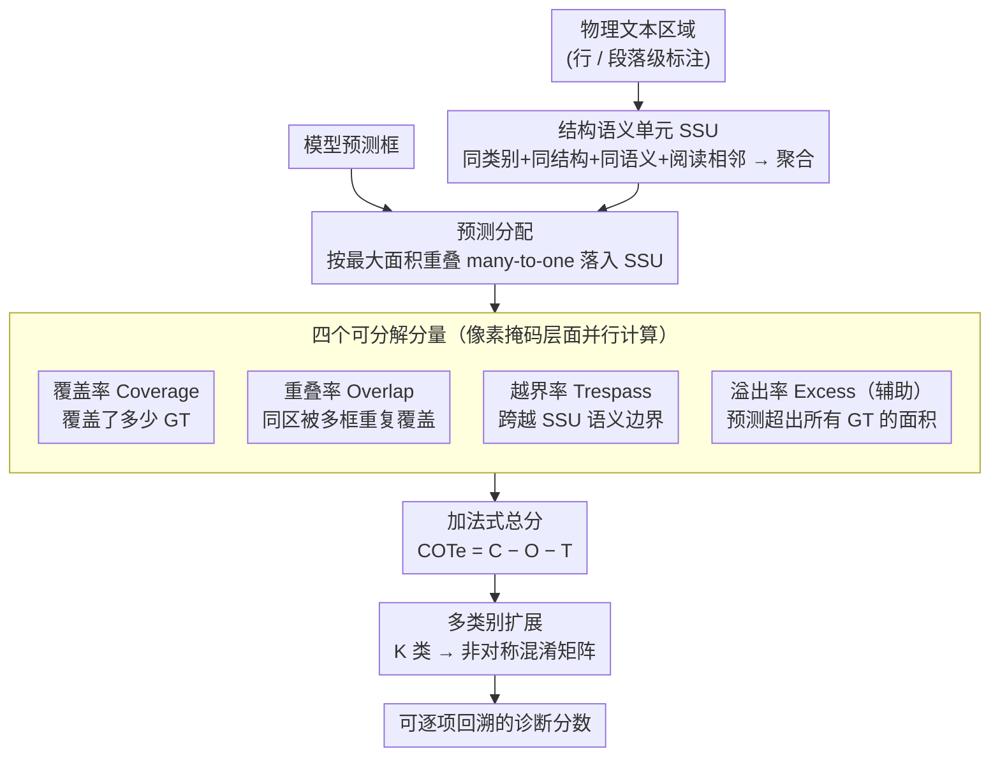

<!-- 由 src/gen_stubs.py 自动生成 -->
# The COTe Score: A Decomposable Framework for Evaluating Document Layout Analysis Models

**会议**: CVPR2026  
**arXiv**: [2603.12718](https://arxiv.org/abs/2603.12718)  
**代码**: [JonnoB/cotescore](https://github.com/JonnoB/cotescore)  
**领域**: 目标检测 / 文档布局分析  
**关键词**: 文档布局分析, 评估指标, 可分解指标, 语义结构单元, 页面解析, 粒度鲁棒性

## 一句话总结

提出面向文档布局分析（DLA）的可分解评估框架 COTe（Coverage, Overlap, Trespass, Excess），以及结构语义单元 SSU，相比传统 IoU/mAP/F1 能更准确地反映页面解析质量，并揭示不同模型的特异性失败模式。

## 背景与动机

1. **评估指标与任务不匹配**: 当前 DLA 普遍使用通用目标检测指标（IoU, F1, mAP），但这些指标是为 3D 空间的 2D 投影（自然图像）设计的，文档是原生 2D 的不规则镶嵌结构，两者存在根本性差异。
2. **粒度敏感性问题**: IoU 对标注粒度（行级 vs 段落级）高度敏感，当预测与标注的粒度不一致时（如模型预测段落级，Ground Truth 为行级），F1 可从 1.0 骤降至 0.32，产生严重误导。
3. **标注方案不可通约**: PAGE、META/ALTO、hOCR、TEI 等主流标注体系存在重叠但不完全互操作的差异，加之各数据集自定义标注方案，导致跨数据集评估缺乏可比性。
4. **失败模式不可区分**: 传统指标将所有错误归为"检测到/未检测到"的二元判断，无法区分重叠预测、越界入侵、覆盖不足等本质不同的页面解析错误。
5. **零样本评估需求**: 在实际应用中常需跨数据集零样本评估模型，而传统指标在此场景下的"实用能力"（pragmatic competence）严重不足。
6. **缺乏语义感知**: 传统指标关注文本的物理位置而非其语义结构，未能反映 DLA 的核心目标——正确保持语义边界。

## 方法详解

### 整体框架

COTe 要解决 DLA 评估指标与任务不匹配、且对标注粒度高度敏感的问题。它先把物理文本区域按语义聚合成「结构语义单元 SSU」作为评估单元，再把每个预测框按最大面积重叠 many-to-one 分配到 SSU，然后用四个可分解分量（Coverage / Overlap / Trespass / Excess）在像素掩码层面并行度量预测与 SSU 的关系，最后把分量相加得到一个仍可逐项回溯的 COTe 分数，并支持向多类别扩展做精细诊断。

### 关键设计

**1. 结构语义单元 SSU：让评估单元对标注粒度免疫**

IoU 对行级 vs 段落级的标注粒度高度敏感——当模型预测段落级而 GT 标注行级时，完美解析的 F1 也会从 1.0 骤降到 0.32。SSU 把满足四个条件（同类别 same_class、同结构单元如同一列、同语义单元如同一篇文章、阅读顺序相邻）的物理区域聚合为一个关系型标注单元。关键在于 many-to-one 分配：多个预测框可按最大面积重叠落进同一个 SSU，于是粒度不一致的多个框不再被逐一判错，从根本上抹平了粒度差异。

**2. COTe 的四个可分解分量：把「对/错」拆成四种页面解析行为**

传统指标把所有错误二元化为「检测到/未检测到」，看不出失败模式。给定页面像素矩阵 $M$（$H \times W$）、SSU 掩码 $M^S$、预测掩码 $M^p$，COTe 定义四个分量各对应一类解析错误：覆盖率 $\mathcal{C} = \frac{\sum M^S \odot M^{p,b}}{A^S}$ 衡量预测覆盖了多少 GT（$[0,1]$，越高越好）；重叠率 $\mathcal{O} = \frac{\sum M^S \odot (M^p - M^{p,b})}{A^S}$ 惩罚同区域被多框重复覆盖（会导致 OCR 文本重复）；越界率 $\mathcal{T} = \sum_j \frac{\sum M^S_{\setminus i} \odot M^p_j}{A^S}$ 惩罚预测跨越 SSU 语义边界（会导致不相关文本混合）；溢出率 $E = \frac{\sum \mathcal{N} \odot M^{p,b}}{A^{\mathcal{N}}}$ 作为辅助指标衡量预测超出所有 GT 区域的面积。因为每个分量都绑定具体错误类型，分数偏低时能直接定位是哪种问题。

**3. 加法式总分：单一分数仍可逐项回溯**

既要一个可排序的总分，又不想丢掉诊断力，COTe 用加法而非乘法把分量组合起来：

$$\text{COTe} = \mathcal{C} - \mathcal{O} - \mathcal{T}$$

这让总分天然落在可解读区间——完美解析为 1（全覆盖、无重叠、无越界），无预测为 0，严重错误时允许为负。和单一 IoU 不同，看到 COTe 偏低可以直接回看是覆盖不足、重叠还是越界在拖累，无需另算。

**4. 多类别扩展：把诊断推广到 K 类**

真实文档含标题、正文、图表等多种版面元素，单类评估不足以反映逐类表现。COTe 支持 $K$ 类扩展，可生成非对称混淆矩阵，分析跨类别的覆盖 / 重叠 / 越界模式，从而做更精细的逐类失败模式诊断。

## 实验关键数据

### 实验设置

- **3 个数据集**: NCSEv2（报纸，31页，有SSU）、HNLA2013（报纸，50页，有SSU）、DocLayNet（多格式，4999页，无SSU）
- **5 个模型**: DocLayout-YOLO (15.4M)、Heron (42.9M)、PP-DocLayout-L/M/S (30.94M/5.65M/1.21M)
- **零样本评估**: 所有模型使用预训练权重，不做微调

### 主要结果

| 数据集 | 最优模型(COTe) | COTe | Coverage | Overlap | Trespass | 最优模型(mAP) | mAP |
|---------|---------------|------|----------|---------|----------|--------------|-----|
| NCSE | PPDoc-L | 0.72 | 0.80 | 0.05 | 0.03 | Heron | 0.56 |
| HNLA2013 | YOLO | **0.86** | 0.96 | 0.06 | 0.05 | Heron | 0.53 |
| DocLayNet | PPDoc-L | 0.47 | 0.67 | 0.02 | 0.18 | PPDoc-L | 0.01 |

**关键发现**: COTe 与传统指标在三个数据集上的最优模型判定全部不一致。

### 粒度鲁棒性对比（Case Study）

| 指标 | GT:行级, Pred:段落级 | GT:段落级, Pred:行级 |
|------|---------------------|---------------------|
| F1 | 0.32 | 0.32 |
| Mean IoU | 0.35 | 0.60 |
| COTe | **1.00** | **0.84** |

完美解析情况下 F1 降至 0.32（误导 68%），COTe 最多下降 16%，相对误解度降低达 **76%**。

### 消融：SSU 的贡献

去掉 SSU 标注后重新评估 NCSE 和 HNLA2013，COTe 仅轻微下降（主要体现为 Trespass 小幅增加）。粒度鲁棒性主要来自 many-to-one 的预测分配机制，而非扩大的语义面积——这降低了使用门槛。

### 失败模式分析

- **DocLayout-YOLO**: 高覆盖但高重叠+高越界，单页示例中 Coverage=0.98 但 COTe=-0.55
- **Heron**: 一致性最低越界，但倾向较高重叠（NCSE 上 Overlap=0.28）
- **PP-DocLayout 系列**: 模型大小与分解误差非线性关系，PPDoc-M 在重叠方面优于 PPDoc-L

## 亮点

- **原创性强**: 首个专为原生 2D 媒体设计的可分解评估框架，从符号学角度（Pierce 三元组）论证传统指标的"实用失败"
- **高度实用**: 即使不做 SSU 标注也能获得大部分粒度鲁棒性收益，显著降低使用门槛
- **诊断能力强**: 单一 COTe 分数可分解为 Coverage/Overlap/Trespass，直接定位模型的具体失败模式
- **开源配套**: 发布 cotescore Python 库 + SSU 标注数据集 + PAGE 格式自动标注器

## 局限与展望

- **松散标注敏感**: 当 GT 区域内存在大量空白（如诗歌、低密度文本）时，Coverage 会被人为压低
- **类别评估未深入**: 虽然定义了多类别扩展和混淆矩阵，但实验中仅使用单类别评估
- **数据规模有限**: NCSE 仅 31 页、HNLA2013 仅 50 页，新闻报纸主导，对现代文档（表格、公式密集型）代表性不足
- **未连接下游任务**: 未直接验证 COTe 与 OCR 准确率或信息提取质量的相关性
- **SSU 定义主观性**: SSU 的语义单元和结构单元定义留给用户，可能引入新的不一致

## 与相关工作的对比

- **vs IoU/F1/mAP**: COTe 是对标注粒度鲁棒的原生 2D 指标，传统指标在粒度不匹配时误导严重（F1 降 68% vs COTe 降 16%）
- **vs PubLayNet/DocLayNet 基准**: 这些基准使用传统 mAP 评估，COTe 与 mAP 的 Spearman 相关性仅 0.27-0.77，说明两者衡量了不同维度
- **vs 解析失败模式基准 [Clausner et al.]**: 已有工作提出失败模式分类但未提供定量指标，COTe 将失败模式量化为连续值
- **vs 数据集偏移/构建效度**: 论文从符号学视角补充了 ML 领域的数据偏移和标注噪声讨论

## 评分

- 新颖性: ⭐⭐⭐⭐ — 首个面向文档镶嵌结构的可分解评估框架，概念设计独到
- 实验充分度: ⭐⭐⭐ — 3 数据集 5 模型覆盖面合理，但数据规模偏小且未连接下游任务
- 写作质量: ⭐⭐⭐⭐ — 从符号学到数学定义再到实验层层递进，案例分析直观
- 价值: ⭐⭐⭐⭐ — 解决 DLA 评估痛点，开源库降低使用门槛，对文档理解社区有实际贡献

<!-- RELATED:START -->

## 相关论文

- [\[ICML 2026\] EARL: Towards a Unified Analysis-Guided Reinforcement Learning Framework for Egocentric Interaction Reasoning and Pixel Grounding](../../ICML2026/object_detection/earl_towards_a_unified_analysis-guided_reinforcement_learning_framework_for_egoc.md)
- [\[CVPR 2026\] Evaluating Few-Shot Pill Recognition Under Visual Domain Shift](evaluating_few-shot_pill_recognition_under_visual_domain_shift.md)
- [\[ICML 2025\] Outlier Gradient Analysis: Efficiently Identifying Detrimental Training Samples for Deep Learning Models](../../ICML2025/object_detection/outlier_gradient_analysis_efficiently_identifying_detrimental_training_samples_f.md)
- [\[ICML 2026\] Testing the Test: Score-Direction Instability in Class-Split Anomaly Detection](../../ICML2026/object_detection/testing_the_test_score-direction_instability_in_class-split_anomaly_detection.md)
- [\[CVPR 2026\] CompAgent: An Agentic Framework for Visual Compliance Verification](compagent_an_agentic_framework_for_visual_compliance_verification.md)

<!-- RELATED:END -->
