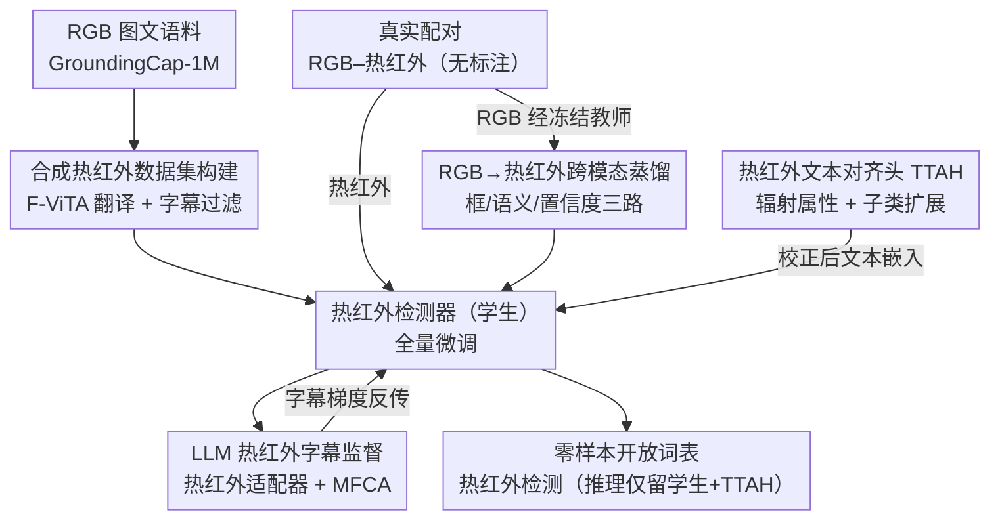

# Thermal-Det: Language-Guided Cross-Modal Distillation for Open-Vocabulary Thermal Object Detection

**会议**: CVPR 2026  
**论文**: [CVF Open Access](https://openaccess.thecvf.com/content/CVPR2026/html/Ranasinghe_Thermal-Det_Language-Guided_Cross-Modal_Distillation_for_Open-Vocabulary_Thermal_Object_Detection_CVPR_2026_paper.html)  
**代码**: 待确认  
**领域**: 目标检测 / 开放词表检测 / 跨模态蒸馏  
**关键词**: 热红外检测, 开放词表, 跨模态蒸馏, 零样本, 合成数据

## 一句话总结
Thermal-Det 用「RGB→热红外」翻译合成百万级带文本标注的热红外数据做预训练，再借助一个冻结的 RGB 开放词表检测器当老师、用框/语义/置信度三路蒸馏把开放词表能力迁到热红外学生，并通过热红外文本对齐头（TTAH）和热红外 LLM 字幕监督校正 CLIP 文本空间，做到**完全无需热红外标注**的零样本开放词表热成像检测，在 7 个红外基准上比 RGB 开放词表检测器提升 2–4% AP。

## 研究背景与动机

**领域现状**：开放词表检测（OVD，如 GLIP、Grounding DINO、OWLv2、LLMDet）靠大规模 RGB 图文配对学到文本条件化的视觉表征，能用自然语言 prompt 检测训练时没见过的类别。但这些能力几乎都局限在可见光谱里。

**现有痛点**：热红外成像在自动驾驶、安防、搜救等安全攸关场景里不可或缺，可热红外检测器普遍是**闭集**的——只能认 KAIST / FLIR / LLVIP 这类小数据集里标过的几类目标（行人、车辆），既缺标注又缺类别多样性。把 RGB 训练好的 OVD 直接搬到热红外上，性能会因为模态鸿沟（低纹理、发射率变化、对比度弱）急剧崩塌；而现有的域适配 / 适配器方法只在像素或特征层面对齐，忽略了开放世界理解真正需要的高层语义对齐，且仍依赖有限的热红外标注，无法泛化到未见类别。

**核心矛盾**：要做开放词表，就需要海量带语言标注的数据；可热红外标注极其昂贵稀缺。两者直接冲突——这是热红外 OVD 一直做不起来的根因。

**本文目标**：构建**第一个完全不用任何热红外标注**的零样本开放词表热成像检测框架，既要内化热红外特有的对比模式，又要保住语言对齐能力。

**切入角度**：既然热红外标注贵，那就（1）用图像翻译把现成的百万级 RGB 图文数据「染成」热红外来获得大规模监督；（2）把 RGB OVD 老师已经学好的开放词表知识蒸馏过来，而不是从零学语义；（3）专门校正一下被 RGB 统计带偏的 CLIP 文本嵌入。

**核心 idea**：用「合成热红外监督 + RGB→热红外跨模态蒸馏 + 热红外文本对齐」三者协同，把开放词表能力**无标注地**迁移到热成像域。

## 方法详解

### 整体框架

Thermal-Det 是一个双流（RGB 教师 + 热红外学生）的开放词表检测器，外挂一个热红外自适应的 LLM 做字幕监督，整个系统端到端联合训练，推理时只保留热红外学生分支和 TTAH（LLM 与 RGB 教师全部丢弃）。

训练数据有两类：① **合成热红外数据**——把 GroundingCap-1M 的百万 RGB 图经 F-ViTA 翻译成热红外，原有的 bounding box / grounding 短语 / 场景字幕直接复用，给检测器一个强初始化；② **真实配对 RGB–热红外数据**（如 M3FD），无标注，只用来跑蒸馏。检测器接收热红外图 $I_{th}$ 和经冻结 CLIP 文本编码器编码的类别查询，通过 transformer 的 query–key–value 解码输出框 $\{B_i\}$ 和相似度分数 $\{s_i\}$；与适配器迁移不同，本文**全量微调**检测器，让卷积层和注意力层都适应热红外线索，同时保持与固定 CLIP 文本空间对齐。

总损失把四路信号拼到一起：

$$L_{total} = L_{det} + L_{KD} + L_{TTAH} + L_{cap}$$

其中 $L_{det}=L_{cls}+L_{box}$ 是合成热红外数据上的标准检测损失（$L_{cls}$ 做区域特征与文本嵌入的余弦对比对齐，$L_{box}$ 是 ℓ1 + GIoU/CIoU 定位损失）。

### 关键设计

**1. 合成热红外数据集构建：把百万 RGB 图文「染」成热红外，解决标注稀缺**

热红外做开放词表的第一道坎是没有大规模带语言标注的数据。本文不去标，而是把 GroundingCap-1M（>100 万条 $(I_{rgb}, T_g, B, T_c)$ 样本，含 grounding 短语、框、Qwen2-VL-72B 生成的密集场景字幕，覆盖 V3Det 等继承来的 13k+ 类）整体翻译进热红外域。具体用 F-ViTA 这个 RGB→红外跨域翻译模型，把每张 $I_{rgb}$ 转成合成热红外图 $I_{th}^{syn}$，由于翻译保持了场景结构与目标几何，原有 bounding box 的空间位置不变，可直接复用所有标注。字幕侧做一步轻量文本过滤，删掉颜色（red/blue/green）、光照（bright/shadowed/sunlit）这类 RGB 专属描述词，让字幕在热红外表征下仍然语义可信、视觉可对应；grounding 短语和框则原样保留。这样得到的合成数据 $(I_{th}^{syn}, T_g, B, T_c)$ 在类别多样性上远超 KAIST/FLIR/LLVIP，给检测器一个几何一致、语言丰富的强初始化，是后续蒸馏与语言适配的地基。

**2. RGB→热红外跨模态蒸馏：让冻结 RGB 老师把开放词表能力无标注地传给热红外学生**

合成数据虽多，但和真实热红外在外观与特征统计上仍有显著域差。本文用一个冻结的 RGB OVD 检测器当老师，热红外检测器当学生，在**真实配对** RGB–热红外帧（空间对齐，如 M3FD）上做蒸馏——老师看 $I_{rgb}$ 产出伪标签（框、类别 logits、目标-文本相似度），学生看对应 $I_{th}$ 产出自己的检测，二者在三个互补维度上对齐：

$$L_{KD} = L_{KD\text{-}box} + L_{KD\text{-}sem} + L_{KD\text{-}conf}$$

空间维度用 GIoU 对齐框，$L_{KD\text{-}box}=1-\text{GIoU}(B_{rgb}, B_{th})$，逼学生在对比度/纹理差异下也复现老师的定位；语义维度用余弦 InfoNCE 对齐区域特征 $L_{KD\text{-}sem}=-\log\frac{\exp(\cos(f_{th},f_{rgb})/\tau)}{\sum_j \exp(\cos(f_{th},f_{rgb}^j)/\tau)}$，让学生继承老师的语义抽象同时保住自己的辐射外观线索；置信度维度用 KL 散度 $L_{KD\text{-}conf}=\text{KL}(p_{rgb}\,\|\,p_{th})$ 对齐类别概率分布，模仿老师的软决策边界以增强低对比度下的鲁棒性。蒸馏只在配对批次上激活，合成批次和纯热红外字幕样本跳过此模块。这一路是开放词表能力**无标注迁移**的核心通道。

**3. 热红外文本对齐头 TTAH：把被 RGB 带偏的 CLIP 文本空间校回热红外，并按辐射属性做子类自适应**

即便视觉侧微调到了热红外，冻结 CLIP 给出的文本嵌入仍偏向 RGB 视觉统计，热红外视觉特征和文本之间存在语义错位。TTAH 是一个轻量模块，只作用在 CLIP 文本分支、对所有热红外-文本相似度计算生效。对每个文本 token $t_c$，它从一个**可学习的辐射属性库**（hot / silhouette / reflective / high-emissivity 等）取属性向量 $a_j$ 拼接后过两层 MLP + LayerNorm：$t_c^* = \text{LN}(\text{MLP}([t_c; a_j]))$。校正后的嵌入替换原始 $t_c$ 用于所有下游相似度。训练用对比损失 $L_{TTAH\text{-}ctr}$ 把热红外视觉特征 $f_{th}$ 拉向校正文本，并加漂移正则 $L_{TTAH\text{-}drift}=\|t_c^*-t_c\|_2^2$ 防止偏离原始 CLIP 流形太远，合起来 $L_{TTAH}=L_{TTAH\text{-}ctr}+\lambda_{drift}L_{TTAH\text{-}drift}$。

更关键的是**子类扩展 + 置信度门控选择**：把每个基类 $c$ 与属性库 $\{a_1,...,a_M\}$ 逐一配对生成 $M$ 个热红外子标签 $t_{c,j}^*$，对热红外区域特征 $f_{th}$ 算与所有子类的相似度 $s_{c,j}=\cos(f_{th}, t_{c,j}^*)$，取最匹配的子类作为该类有效文本表示 $\tilde t_c = t_{c,j^*(c)}$，类得分 $\hat s_c=\max_j s_{c,j}$。这让「person」能自适应成「hot person / silhouette person」而无需额外标注。消融显示这个置信度门控比平均池化（把所有子类等权）和随机采样都好（见下表）。

**4. 热红外 LLM 字幕监督：用 LLM 注入语言推理，靠热红外适配器与双模态交叉注意力做对齐**

纯视觉监督给不了开放词表所需的组合推理与语言理解，而热红外又常常弱纹理、低对比、温度歧义，光看图难分类。本文把检测器和一个 LLM 配对，让 LLM 基于热红外特征生成场景级与目标级字幕。LLM 收到检测器（及训练时可用的 RGB 教师）投影来的特征 token，内部在每个 transformer block 的 FFN 子层插入 **Thermal Adapter**（LoRA 风格的残差 MLP），把 LLM 专门化到热红外语义而不破坏原有语言知识。字幕头里再加一个**模态融合交叉注意力 MFCA**：让 LLM 的文本查询 $Q$ 同时注意热红外和 RGB 教师特征，$K=[\alpha K_{th}; \beta K_{rgb}]$、$V=[\alpha V_{th}; \beta V_{rgb}]$，$\alpha,\beta$ 是可学习门控调节两模态贡献；推理时 RGB 缺席，令 $\beta=0$，MFCA 自动塌缩为纯热红外注意力。字幕损失含场景级与目标级两部分 $L_{cap}=L_{cap\text{-}scene}+L_{cap\text{-}object}$——场景级用合成数据的长描述字幕、且不用 RGB 教师以逼 LLM 完全依赖热红外线索；目标级用 grounding 短语（如「man walking」），对缺字幕的真实配对数据（M3FD）则从 RGB 教师的开放词表预测或类别标签派生伪短语。字幕梯度反传给检测器，强化跨模态对齐。

### 损失函数 / 训练策略

四路损失 $L_{total}=L_{det}+L_{KD}+L_{TTAH}+L_{cap}$ 端到端联合优化。不同批次激活不同分支：合成热红外批次走 $L_{det}+L_{cap\text{-}scene/object}+L_{TTAH}$，真实配对批次额外激活 $L_{KD}$（仅在有空间对齐的 RGB–热红外对上）。推理只保留热红外学生检测器和 TTAH，RGB 教师与 LLM 全部丢弃，因此**不增加推理开销**。

## 实验关键数据

### 主实验：零样本检测迁移（Swin-T backbone，无任何热红外标注）

| 数据集 | 指标 | Thermal-Det | LLMDet (CVPR'25) | G-DINO (ECCV'24) |
|--------|------|-------------|------------------|------------------|
| FLIR-Aligned | AP / AP50 | **0.372 / 0.664** | 0.359 / 0.628 | 0.337 / 0.636 |
| FLIR-V2 | AP / AP50 | **0.096 / 0.173** | 0.048 / 0.075 | 0.081 / 0.144 |
| CAMEL | AP / AP50 | **0.511 / 0.758** | 0.383 / 0.560 | 0.482 / 0.729 |
| Utokyo | AP / AP50 | **0.065 / 0.137** | 0.050 / 0.102 | 0.050 / 0.093 |
| LLVIP（夜景） | AP / AP50 | **0.566 / 0.856** | — | — |

在 7 个真实红外基准上整体对 RGB 开放词表检测器有 2–4% AP 提升，验证「合成监督 + 蒸馏 + 文本对齐」能跨分辨率/传感器/场景做真零样本迁移。

### 跨教师 backbone 评估（FLIR-Aligned / CAMEL，本文相对各 baseline 的增益）

| 教师 backbone | FLIR-Aligned AP（base→ours, Δ%） | CAMEL AP（base→ours, Δ%） |
|---------------|----------------------------------|---------------------------|
| GDINO | 0.200 → 0.261（+30.5%） | 0.547 → 0.585（+6.9%） |
| MM-GDINO | 0.170 → 0.234（**+37.6%**） | 0.492 → 0.567（**+15.2%**） |
| LLMDet | 0.201 → 0.255（+26.8%） | 0.552 → 0.574（+3.9%） |

框架是 backbone 无关的：换任意 RGB OVD 老师都涨。MM-GDINO 相对增益最大（其更广的 O365/GRIT/V3Det 预训练给了更强监督信号），但 GDINO 适配后绝对性能最高，故后续实验都用 GDINO 老师。纯热红外的 FLIR-Aligned 增益更大，说明纹理线索越少、本文的蒸馏与对齐越有用。

### 消融实验：逐组件增量（FLIR-Aligned / CAMEL，AP 增量）

| 配置 | FLIR-Aligned ΔAP | CAMEL ΔAP | 说明 |
|------|------------------|-----------|------|
| Zero-shot 基线 | 0.200 | 0.547 | 起点 |
| + 场景级字幕 $L_{cap\text{-}scene}$ | +0.012 | +0.006 | 全局语义一致性，增益温和 |
| + 目标级字幕 $L_{cap\text{-}object}$ | +0.028 | +0.020 | 局部对齐比全局更有效，尤其低纹理时 |
| + 蒸馏 $L_{KD}$ | +0.021 | +0.012 | 真实配对数据直接传几何/语义知识 |
| **Final（含 TTAH）** | **0.261** | **0.585** | 累计 +6.1% / +3.8% AP |

去掉 $L_{TTAH}$（保留其余）会掉 0.008 AP / 0.019 AP50，说明 TTAH 提供了字幕和蒸馏之外的互补增益。

### TTAH 子类选择策略消融

| 策略 | FLIR-Aligned AP | CAMEL AP | 说明 |
|------|-----------------|----------|------|
| 平均池化 | 0.234 | 0.559 | 等权，弱化判别性子类线索，最差 |
| 随机采样 | 0.248 | 0.573 | 引入多样性但不稳定 |
| **置信度门控** | **0.261** | **0.585** | 按文本-图像相似度加权，最优 |

置信度门控比平均池化高 +2.7 AP、比随机高 +1.3 AP，在纹理稀缺的 FLIR-Aligned 上增益更明显。

### 关键发现
- **目标级字幕 > 场景级字幕**：局部短语对齐（+0.028 AP）远比全局长字幕（+0.012 AP）有效，说明热红外检测瓶颈在「区域-语义」精细 grounding 而非全局理解。
- **失败模式集中在小目标 / 罕见类**：FLIR-V2 上 person（0.366 AP）、car（0.35 AP，APl 0.882）表现强，但 motorcycle（0.006 AP，APs 0.001）、traffic light（0.006 AP）很差；作者指出全监督下也有类似趋势，说明残差来自传感器与尺度的固有限制，而非零样本迁移机制本身的缺陷。
- **纹理越弱，方法越值钱**：纯热红外的 FLIR-Aligned 上各组件增益都比 CAMEL 大，蒸馏与文本对齐在低纹理域贡献最突出。

## 亮点与洞察
- **「翻译数据 + 蒸馏老师」绕开标注困境**：不直接采标热红外，而是把成熟的 RGB 图文语料和 RGB OVD 老师当作两个免费的监督源迁过来——这个「借力」思路可迁移到任何标注稀缺的成像模态（如 SAR、深度、事件相机）。
- **TTAH 的子类扩展很巧**：把「person」按辐射属性展开成「hot person / silhouette person」并用置信度门控自动选最匹配子类，相当于在不加标注的前提下给类别做了热红外条件化，把 CLIP 的 RGB 偏置在文本侧就地校正。
- **训练重、推理轻**：RGB 教师和 LLM 只在训练参与，推理只留学生 + TTAH，工程上很友好——重型语言/教师监督不变成部署负担。
- **MFCA 的门控塌缩设计**：训练时双模态融合、推理时令 $\beta=0$ 自动退化为单模态，是处理「训练有配对、推理无配对」这类不对称场景的可复用模式。

## 局限与展望
- **小目标/罕见类仍弱**：motorcycle、traffic light 等几乎检不出（0.006 AP），受限于热红外小目标定位与弱对比，全监督也救不回来——本文机制对此无解。
- **强依赖 RGB→热红外翻译质量**：整套合成监督建立在 F-ViTA 翻译保真度上，⚠️ 若翻译引入伪影或几何漂移，复用的框标注会失配，这部分论文未给出鲁棒性分析。
- **需要空间对齐的配对数据做蒸馏**：$L_{KD}$ 要求帧/像素级对齐的 RGB–热红外对（如 M3FD），这类数据本身也不易获得，限制了蒸馏的适用范围。
- **改进方向**：可探索无配对蒸馏（如用光流/几何先验放松对齐要求）、或针对小目标的多尺度热红外特征增强来补齐失败模式。

## 相关工作与启发
- **vs RGB 开放词表检测器（GLIP / G-DINO / LLMDet）**：它们在 RGB 上做开放词表，直接迁热红外会因模态鸿沟崩塌；本文用合成热红外监督 + 蒸馏让模型既吸收热红外线索又保住语义结构，在所有热红外基准上反超。
- **vs 热红外域适配 / 适配器方法**：它们多在像素/特征层对齐、且仍依赖有限热红外标注，无法泛化到未见类；本文**全量微调 + 零热红外标注**，并在文本侧（TTAH）做高层语义对齐，真正做到开放词表零样本。
- **vs 闭集热红外检测器（FLIR/LLVIP 上的监督方法）**：它们只能认几类标过的目标；本文继承 13k+ 类的语言监督，支持自然语言 prompt 检测新类乃至位置指代（如「中间靠前的车」）。

## 评分
- 新颖性: ⭐⭐⭐⭐⭐ 首个零标注开放词表热红外检测框架，合成监督+跨模态蒸馏+TTAH 三件套组合扎实。
- 实验充分度: ⭐⭐⭐⭐ 7 个基准 + 跨教师 + 两组消融，但缺翻译质量鲁棒性分析。
- 写作质量: ⭐⭐⭐⭐ 结构清晰、公式完整，方法各模块职责交代明确。
- 价值: ⭐⭐⭐⭐⭐ 给标注稀缺模态的开放词表检测提供了可复用的范式，安全攸关场景应用前景明确。

<!-- RELATED:START -->

## 相关论文

- [\[CVPR 2026\] SRA-Det: Learning Omni-Grained Open-Vocabulary Detection Beyond Category Names](sra-det_learning_omni-grained_open-vocabulary_detection_beyond_category_names.md)
- [\[CVPR 2026\] Incremental Object Detection via Future-Aware Decoupled Cross-Head Distillation](incremental_object_detection_via_future-aware_decoupled_cross-head_distillation.md)
- [\[AAAI 2026\] VK-Det: Visual Knowledge Guided Prototype Learning for Open-Vocabulary Aerial Object Detection](../../AAAI2026/object_detection/vk-det_visual_knowledge_guided_prototype_learning_for_open-vocabulary_aerial_obj.md)
- [\[CVPR 2026\] WeDetect: Fast Open-Vocabulary Object Detection as Retrieval](wedetect_fast_open-vocabulary_object_detection_as_retrieval.md)
- [\[CVPR 2026\] Can a Second-View Image Be a Language? Geometric and Semantic Cross-Modal Reasoning for X-ray Prohibited Item Detection](can_a_second-view_image_be_a_language_geometric_and_semantic_cross-modal_reasoni.md)

<!-- RELATED:END -->
