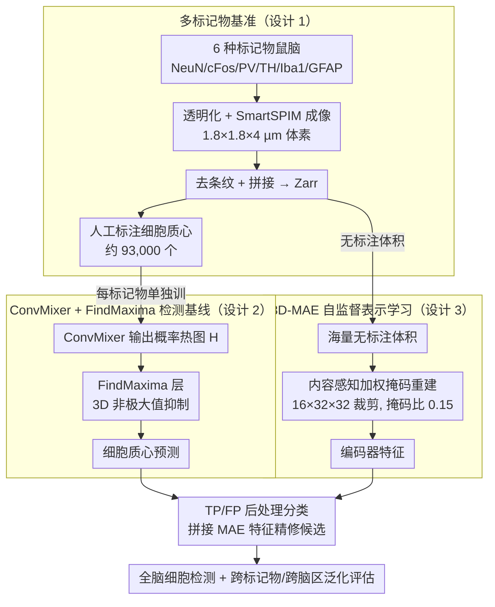

# Toward Generalizable Whole Brain Representations with High-Resolution Light-Sheet Data

**会议**: CVPR 2026  
**arXiv**: [2603.29842](https://arxiv.org/abs/2603.29842)  
**代码**: [https://canvas.lightsheetdata.com](https://canvas.lightsheetdata.com)  
**领域**: 目标检测  
**关键词**: 光片荧光显微镜, 全脑成像, 细胞检测基准, 自监督学习, 基础模型

## 一句话总结

提出 CANVAS——首个大规模亚细胞分辨率光片荧光显微镜（LSFM）全脑基准数据集，涵盖 6 种细胞标记物、约 93,000 个细胞标注和公开排行榜，揭示了现有检测模型在跨标记物和跨脑区泛化上的严重不足，并探索了 3D 掩码自编码器（MAE）的自监督表示学习潜力。

## 研究背景与动机

1. **领域现状**：组织透明化技术和光片荧光显微镜（LSFM）的进步使得以亚细胞分辨率获取完整鼠脑 3D 数据成为可能，单个全脑数据集可达约 100GB（压缩后），包含 1600-1850 层 z-切片，每层约 7000×10000 像素。
2. **现有痛点**：虽然数据获取能力大幅提升，但缺乏针对 PB 级 LSFM 数据的可扩展处理方法和标准化基准。现有 CV 模型（如 U-Net、ResNet、ViT）主要为 CT、fMRI、X-ray 等模态设计，难以直接泛化到 LSFM 数据。
3. **核心矛盾**：不同细胞类型标记物在不同脑区展现出高度异质的形态学特征（如星形胶质细胞 vs 多巴胺能神经元），导致单一模型难以跨标记物和跨区域泛化。同时，LSFM 标注成本极高（167,950 个预测需逐一人工验证）。
4. **本文目标**：提供首个公开的全脑 LSFM 基准数据集，建立细胞检测评估标准，揭示现有模型的泛化瓶颈，并探索自监督方法来应对标注稀缺问题。
5. **切入角度**：构建涵盖 6 种功能不同的细胞标记物（NeuN、cFos、PV、TH、Iba1、GFAP）的综合基准，选择不同脑区的 ROI 进行标注，系统评估基线模型的跨数据集和跨区域泛化能力。
6. **核心idea**：通过提供标准化基准+详细评估来推动领域发展，而非提出新的检测算法。

## 方法详解

### 整体框架

这篇论文不提新检测器，而是把"如何系统评估全脑 LSFM 细胞检测的泛化能力"做成一套可复现的基准。整条链路分三块：**多标记物基准**这一块负责造数据——小鼠脑组织经 SHIELD 保存、脱脂、SmartBatch+ 荧光标记、EasyIndex 透明化，再用 SmartSPIM 光片显微镜以 1.8×1.8×4 µm 体素成像，去条纹拼接后存为 Zarr 并通过 Neuroglancer 可视化标注约 9.3 万个细胞质心；**ConvMixer + FindMaxima 检测基线**这一块在标注数据上训检测器，ConvMixer backbone 输出概率热图，再接一个 FindMaxima 层做 3D 非极大值抑制把热图转成离散质心坐标；**3D-MAE 自监督**这一块从海量无标注体积里学可迁移特征，绕开 LSFM 标注成本极高的瓶颈，学到的编码器特征反过来拼接进检测候选做 TP/FP 后处理精修。三块串起来，就构成"造基准 → 跑检测基线暴露泛化鸿沟 → 用自监督补标注稀缺"的完整评估闭环。

### 关键设计

**1. 多标记物基准：用 6 种细胞标记物逼出"跨标记物泛化"这道难题**

单一标记物的数据集无法暴露模型的泛化短板，因为同一类细胞的形态相对一致。CANVAS 刻意挑了 6 种功能与形态都差异极大的标记物——NeuN（遍布全脑的神经元核蛋白）、cFos（神经元活动标记）、PV（小清蛋白中间神经元）、TH（多巴胺能神经元）、Iba1（小胶质细胞）、GFAP（星形胶质细胞），形态从球形核一路跨到复杂星状结构。每种标记物各取 3 个训练 ROI + 3 个测试 ROI，合计约 93,000 个人工核验的细胞质心（训练 45,745 + 测试 47,301）。正因为覆盖了从神经元到免疫细胞的形态光谱，在这套基准上"一个模型在另一种标记物上崩掉"才会被清楚量化出来，而不是被同质数据掩盖。

**2. ConvMixer + FindMaxima 检测基线：把细胞检测转成"热图预测 + 3D 非极大值抑制"**

直接在 3D 体积上做框检测代价高，论文改用密度/热图范式：ConvMixer backbone 输出 3D 概率热图 $H$，FindMaxima 层再做 3D 非极大值抑制——当某体素 $H(x,y,z)$ 同时是其 $d_{\min}$ 邻域内的最大值、且超过阈值 $\tau$ 时，就判为一个细胞质心。选 ConvMixer 是因为它把 ViT 的 patch embedding 思想嫁接到纯卷积上，结构简单、算得快，适合 100GB 级的全脑体积当基线。评估端用基于 kd-tree 的最近邻匹配，容差取各标记物的平均细胞半径（NeuN/cFos 为 6 像素，TH/PV/GFAP 为 8 像素，Iba1 为 5 像素），保证不同细胞尺寸下匹配口径一致。每种标记物单独训一个模型，这也正是后面跨标记物 F1 骤降能被干净归因的前提。

**3. 3D-MAE 自监督表示学习：针对显微图像"信号稀疏、语义密集"重设掩码与重建**

标注 LSFM 极贵（一次就有 167,950 个预测要逐一人工核验），所以论文把 DINOv2 风格的 ViT 改成 3D MAE，从海量无标注体积里学可迁移特征，做了两处关键改动。其一是裁剪/patch 尺寸要贴合细胞实际大小，搜索后最优为 16×32×32 裁剪、4×8×8 patch；过大的感受野（如 32×64×64）会把噪声卷进来反而变差。其二是内容感知重建加权，让损失偏向真正含细胞的区域：

$$w_i = \alpha + \gamma \cdot \min\!\left(1,\ \mathrm{Var}(\mathbf{x}_i)/\bar{\sigma}^2\right)$$

其中背景 patch 取最低权重 $\alpha=1$，方差足够大的含细胞 patch 拿到 $\alpha+\gamma=10$，即 10 倍权重。配套地，最优掩码比只有 0.15，远低于自然图像 MAE 的 0.75——因为 3D 显微体积里每个 patch 的语义密度很高，掩太多会直接抹掉细胞间的关键空间关系，重建任务反而失去监督信号。

### 损失函数 / 训练策略

- **基线检测模型**：二值 Focal Loss，每种标记物单独训练，NVIDIA RTX 3090/4090 上一天内收敛
- **3D-MAE**：内容感知 MSE 重建损失，AdamW 优化器（$\eta=1.5 \times 10^{-4}$），余弦退火调度，训练 700 epochs
- **全标记物模型**：合并 6 种标记物约 60k patch 联合训练，重建损失在单标记物最优的 15% 以内

## 实验关键数据

### 主实验

| 训练模型 | cFos F1 | NeuN F1 | TH F1 | PV F1 | GFAP F1 | Iba1 F1 |
|---------|---------|---------|-------|-------|---------|---------|
| cFos 模型 | **0.78** | 0.02 | 0.04 | 0.28 | 0.00 | 0.03 |
| NeuN 模型 | 0.76 | **0.81** | 0.41 | **0.89** | 0.05 | 0.43 |
| TH 模型 | 0.74 | 0.21 | **0.57** | 0.68 | 0.04 | 0.56 |
| PV 模型 | 0.29 | 0.73 | 0.20 | 0.63 | 0.01 | 0.06 |
| GFAP 模型 | 0.74 | 0.04 | 0.14 | 0.21 | **0.33** | 0.43 |
| Iba1 模型 | 0.74 | 0.57 | 0.28 | 0.62 | 0.61 | **0.81** |

### 消融实验（3D-MAE 配置）

| 配置 | 最优掩码比 | 重建损失 | 说明 |
|------|-----------|---------|------|
| 16×32×32 / 4×8×8 | 0.15 | **最优** | 5/6 标记物最佳 |
| 24×48×48 / 6×12×12 | 0.15-0.35 | 次优 | 仅 GFAP 最佳 |
| 32×64×64 / 8×16×16 | 0.35-0.55 | 最差 | 感受野过大引入噪声 |
| 全标记物联合 | 0.15 | 0.0070 vs 0.0061 | 在 10x 数据上有效迁移 |

### 关键发现

- **泛化鸿沟严重**：大多数模型仅在自身标记物上表现好，跨数据集 F1 骤降（如 cFos 模型在 NeuN 上仅 0.02）
- **GFAP 检测最难**：即使用自身模型也仅 F1=0.33，Iba1 模型（0.61）反而比 GFAP 模型更好
- **NeuN 模型泛化性最佳**：在 PV 数据集上达 F1=0.89，可能因核信号形态学相似
- **MAE 特征可有效提升检测**：作为后处理分类器，GFAP 的 F1 平均提升 22.9%（region3 提升 86.3%）
- **最优掩码比远低于自然图像**：0.15 vs 0.75，反映 3D 生物图像的高语义密度

## 亮点与洞察

- **首个全脑 LSFM 基准**：CANVAS 填补了生物体积成像领域缺乏标准化基准的空白。6 种标记物覆盖从神经元到免疫细胞的多种类型，系统性评估模型泛化能力。可以作为 3D 基础模型开发的重要资源。
- **内容感知 MAE 加权**：简单但有效的技巧——对稀疏生物信号中含细胞的 patch 施加 10 倍权重。这种"给重要区域加权"的思路对所有处理稀疏数据的自监督方法都有参考价值。
- **跨模态互补视角**：论文清晰定位 LSFM 在 fMRI（宏观）→ LSFM（介观）→ EM（纳米级）光谱中的独特位置，为多模态脑科学研究提供了框架性思考。

## 局限与展望

- 标注量仍然很少（93k 标注 vs 鼠脑约 8700 万细胞），仅覆盖每种标记物的 3 个 ROI
- 未提出新的检测算法，基线模型（ConvMixer）相对简单
- 6 种标记物仅覆盖极小部分细胞类型，未来需要扩展标记物范围
- 3D-MAE 目前仅用于 TP/FP 分类后处理，尚未直接用于端到端检测
- 可探索将预训练 MAE 与检测 backbone 深度融合，而非仅做特征拼接后分类

## 相关工作与启发

- **vs BrainSeg / CellPose 等**：现有方法主要针对特定模态或特定细胞类型；CANVAS 提供了跨标记物泛化评估的系统平台
- **vs 自然图像 MAE**：LSFM 数据的最优掩码比（0.15）远低于自然图像（0.75），说明预训练策略需根据数据特性调整
- **vs fMRI/EM 数据集**：LSFM 在全器官覆盖和亚细胞分辨率之间取得独特平衡，是连接宏观功能成像和纳米级结构成像的关键桥梁

## 评分

- 新颖性: ⭐⭐⭐ 核心贡献是基准数据集而非新方法，技术创新有限（ConvMixer+MAE 都是现有架构）
- 实验充分度: ⭐⭐⭐⭐ 6 种标记物交叉评估非常系统，84 组 MAE 超参搜索很充分，但检测基线偏少
- 写作质量: ⭐⭐⭐⭐ 背景介绍详尽，数据集设计动机清晰，但正文过长（含大量生物学背景）
- 价值: ⭐⭐⭐⭐ 作为基准数据集对 LSFM 社区有重要基础设施价值，跨泛化的发现对设计更好的全脑分析模型具有指导意义

<!-- RELATED:START -->

## 相关论文

- [\[CVPR 2026\] MRD: Multi-resolution Retrieval-Detection Fusion for High-Resolution Image Understanding](mrd_multi-resolution_retrieval-detection_fusion_for_high-resolution_image_unders.md)
- [\[CVPR 2026\] SteelDefectX: A Coarse-to-Fine Vision-Language Dataset and Benchmark for Generalizable Steel Surface Defect Detection](steeldefectx_a_coarse-to-fine_vision-language_dataset_and_benchmark_for_generali.md)
- [\[CVPR 2026\] Online Data Curation for Object Detection via Marginal Contributions to Dataset-level Average Precision](online_data_curation_for_object_detection_via_marginal_contributions_to_dataset-.md)
- [\[CVPR 2026\] Heuristic-inspired Reasoning Priors Facilitate Data-Efficient Referring Object Detection](heuristic-inspired_reasoning_priors_facilitate_data-efficient_referring_object_d.md)
- [\[CVPR 2026\] HeROD: Heuristic-inspired Reasoning Priors Facilitate Data-Efficient Referring Object Detection](herod_heuristic_inspired_reasoning_data_efficient_rod.md)

<!-- RELATED:END -->
