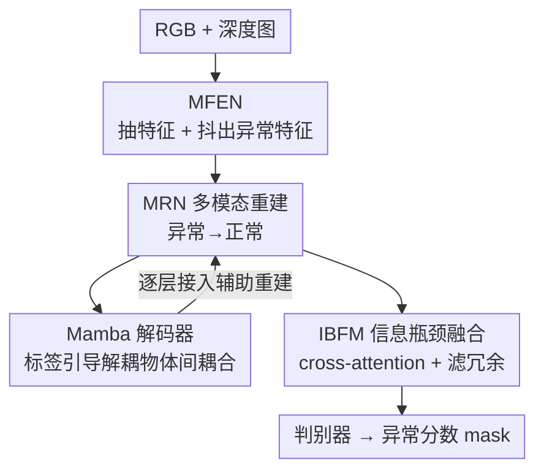

# Towards an Incremental Unified Multimodal Anomaly Detection: Augmenting Multimodal Denoising From an Information Bottleneck Perspective

**会议**: CVPR 2026  
**论文**: [CVF Open Access](https://openaccess.thecvf.com/content/CVPR2026/html/Long_Towards_an_Incremental_Unified_Multimodal_Anomaly_Detection_Augmenting_Multimodal_Denoising_CVPR_2026_paper.html)  
**代码**: https://github.com/longkaifang/IB-IUMAD （有）  
**领域**: 多模态异常检测 / 增量学习  
**关键词**: 工业异常检测, 多模态融合, 增量学习, 信息瓶颈, Mamba

## 一句话总结
本文提出 IB-IUMAD，把工业多模态异常检测（RGB+深度）做成「一个模型增量学新物体」的统一框架，用 Mamba 解码器解耦物体间的虚假特征耦合、用信息瓶颈融合模块滤掉融合特征里的冗余信息，从而显著缓解增量学习里的灾难性遗忘，在 MVTec 3D-AD 和 Eyecandies 上一致超过 SOTA。

## 研究背景与动机
**领域现状**：工业质检里的多模态异常检测（Multimodal Anomaly Detection, MAD）要靠 RGB 图 + 深度图来定位产品表面缺陷。主流做法是 N-objects-N-models——每个物体/品类训一个独立模型；近年转向更省的 N-objects-One-model，即一个模型检测所有品类的异常。

**现有痛点**：真实产线会不断有新物体出现，一个理想的统一模型应当能「增量地」学新物体而不重训。但现有 N-objects-One-model 几乎都只做单模态（如纯 RGB）增量异常检测，没有处理多模态版本（即本文定义的 IUMAD，Incremental Unified Multimodal Anomaly Detection）。更要命的是，模型在 6 个基础物体上训得很好，可一旦增量学新物体，旧物体的性能就急剧崩塌——这就是灾难性遗忘。

**核心矛盾**：以往缓解遗忘的工作（object-aware self-attention、语义压缩损失、梯度投影）都**忽略了虚假特征（spurious）和冗余特征（redundant）对遗忘的推波助澜**。作者通过受控实验发现：往特征里注入背景干扰（虚假特征）和 Berlin 噪声（冗余特征），单模态框架会掉点、遗忘加重；而多模态框架因为跨模态融合的复杂性，更容易吸入这些虚假/冗余特征，掉得**比单模态更狠，甚至直接性能崩溃**。也就是说，融合带来的信息增益，反而成了遗忘的放大器。

**本文目标**：在多模态、增量、统一三个约束同时成立的前提下，把「虚假特征干扰」和「融合特征冗余」这两件坏事分别压下去，从而保住旧知识。

**切入角度**：作者把问题拆成两个互不重叠的子问题——虚假特征主要来自「物体间共享特征空间导致的耦合」，冗余特征来自「跨模态融合后留存的与预测无关的信息」。前者用序列建模去解耦，后者从信息瓶颈（Information Bottleneck, IB）视角去过滤。

**核心 idea**：用「Mamba 解码器解耦物体间特征耦合」+「信息瓶颈融合模块只保留对当前物体有判别力的特征」这一对互补模块，构成去噪框架 IB-IUMAD，从源头削弱虚假与冗余特征对遗忘的影响。

## 方法详解

### 整体框架
IB-IUMAD 是一条「特征抽取 → 异常合成 → 重建去耦 → 瓶颈融合 → 判别」的多模态重建式异常检测流水线。输入是同一物体的 RGB 图和深度图，输出是异常分数图（mask）。

具体地：多模态特征抽取网络（MFEN）用 EfficientNet 分别抽 RGB / 深度特征，并用 feature jittering 把正常特征人为「抖」成异常特征（合成训练样本）；多模态重建网络（MRN）负责把这些异常特征重建回正常特征，重建残差即异常信号。重建过程中，每一层都接入一个 **Mamba 解码器**，借助标签分类器把不同物体的特征解耦开，避免增量学新物体时把旧物体的特征空间污染掉（压制虚假特征）。重建后，多尺度的 RGB / 深度特征送进 **信息瓶颈融合模块（IBFM）**，先 cross-attention 融合，再用信息瓶颈正则把融合特征里与预测无关的冗余信息滤掉，只留判别性特征。最后一个判别器输出异常定位结果。其中 Mamba 解码器和 IBFM 是本文真正的两个核心贡献，其余（MFEN、MRN、判别器）都是统一异常检测里的通用脚手架。

### 关键设计

**1. Mamba 解码器：用标签引导解耦物体间的特征耦合，压制虚假特征**

虚假特征的根源在于不同物体共享同一特征空间、彼此耦合：当模型增量学新物体时，它会不加区分地更新旧物体所在的特征空间，使重建网络在重建旧物体时更容易被「别的物体的特征」干扰，这正是遗忘加剧的机制。为此，作者在 MRN 的每一层重建里都插入一个 Mamba 解码器，并接一个标签分类器。每个 Mamba 解码器由高效状态空间模块（ESSM）、深度可分离卷积（DwConv）和注意力组成：ESSM 先用 DwConv 和 Efficient 2D Scanning（ES2D）对每个视觉 patch 高效采样、抽细粒度信息，再过注意力，得到去耦后的特征：

$$\hat{X}^{i+1}_{R/D} = \mathrm{DwConv}(X^{i}_{R/D}),\quad \tilde{X}^{i+1}_{R/D} = \mathrm{ESSM}(\mathrm{LN}(X^{i}_{R/D}))$$

$$X^{i+1}_{R/D} = \mathrm{Attention}(\mathrm{LN}(\tilde{X}^{i+1}_{R/D})) + \hat{X}^{i+1}_{R/D}$$

其中 $R/D$ 分别指 RGB 和深度，$i\in[0,4]$，$i=0$ 时 $X^{i}_{R/D}$ 是原始图像特征，LN 是层归一化。每个 Mamba 解码器的输出独立接入 MRN 辅助重建，最后一块的输出再喂给分类器做物体标签预测，用交叉熵 $L_{R/D}=\min L_{CE}(Y^{RGB/Depth}_{mab}, Y)$ 监督。让模型显式利用标签信息去区分「这是哪个物体的特征」，等于在特征层面给每个物体划清边界，从而把增量更新对旧物体的污染降到最低。之所以选 Mamba 而非纯注意力，是看中状态空间模型对长序列细粒度信息的高效线性扫描，能在不爆显存的前提下做精细解耦。

**2. 信息瓶颈融合模块（IBFM）：从 IB 视角只留判别信息、滤掉融合冗余**

跨模态融合会把 RGB 和深度里大量与「当前物体是否异常」无关的冗余信息一起带进来，这些冗余在增量学习中会被反复记忆、挤占容量、加重遗忘。IBFM 先用级联 + cross-attention 融合多尺度多模态特征：$F^{1}_{fusion}=f^{rec2}_{R}\oplus f^{rec2}_{D}$，$F^{2}_{fusion}=f^{rec4}_{R}\oplus f^{rec4}_{D}$，$F_{fu}=\mathrm{CrossAtt}(F^{1}_{fusion}, F^{2}_{fusion})$；再用一个由两层线性投影 + dropout + ReLU 组成的瓶颈把 $F_{fu}$ 压缩重投影成更具预测性的 $F^{g}_{fu}$。

关键在于如何度量「该留什么、该丢什么」。作者用互信息 $I(F_{fu};F^{g}_{fu})$ 刻画两者关系，并据互信息链式法则把它拆成两部分：$I(F_{fu};F^{g}_{fu}) = I(F_{fu};F^{g}_{fu}\mid Y) + I(F^{g}_{fu};Y)$，前者 $I(F_{fu};F^{g}_{fu}\mid Y)$ 是冗余信息，后者 $I(F^{g}_{fu};Y)$ 是与当前物体预测相关的信息。因此「去冗余」等价于最大化 $I(F^{g}_{fu};Y)$、最小化 $I(F_{fu};F^{g}_{fu}\mid Y)$。又因为 $F^{g}_{fu}$ 由 $F_{fu}$ 派生、信息量不可能超过它（$I(F^{g}_{fu};Y)\le I(F_{fu};Y)$），整个目标可化简为 $\min\, I(F_{fu};Y) - I(F^{g}_{fu};Y)$。最终用 KL 散度作为可优化的代理损失：

$$L_{IB} = \mathrm{KL}[P(Y\mid F_{fu})\,\|\,P(Y\mid F^{g}_{fu})]$$

论文给出两个推论支撑：推论 1 证明上述链式分解成立；推论 2 证明当该 KL 为 0 时 $P(Y\mid F^{g}_{fu})=P(Y\mid F_{fu})$ 几乎处处成立，即 $F^{g}_{fu}$ 在丢掉冗余的同时完整保留了预测信息——这就从理论上保证「滤冗余不伤判别」。相比直接堆融合模块，IBFM 的妙处是给「该保留多少信息」一个可证明的判据，而不是凭经验调结构。

### 损失函数 / 训练策略
整体损失把重建、分类、瓶颈三类目标合在一起。重建用 MSE 把融合特征拉回正常：$L_{Fusion}=\frac{1}{W\times H}\lVert F^{RGB}_{org}-F^{g}_{fusion}\rVert_{2}^{2}$；RGB / 深度各一个交叉熵分类损失压制虚假特征；再加 IB 的 KL 损失去冗余。总损失为：

$$L_{All} = \lambda_1 L_{CE}(Y^{RGB}_{mab}, Y) + \lambda_2 L_{CE}(Y^{Depth}_{mab}, Y) + \lambda_3 L_{Fusion} + \lambda_4 L_{IB}$$

四个平衡系数 $\lambda_1,\lambda_2,\lambda_3,\lambda_4$ 实验中全设为 1。训练协议上，先在 6 个基础物体上训 1000 epoch，再每个增量步训 800 epoch；增量步只用当前物体数据、不回看旧数据，测试时对至今见过的所有物体打分并用遗忘度量 FM 评估。

## 实验关键数据

数据集为 MVTec 3D-AD（真实场景，10 物体）和 Eyecandies（合成，10 物体）。评估四种增量设定：10-0 with 0 step（一次性统一训，无增量）、9-1 with 1 step、6-4 with 1 step、6-1 with 4 steps（先训 6 个，再分 4 步每步加 1 个，遗忘压力最大）。指标含 I-AUROC、P-AUROC、AUPRO，以及遗忘度量 FM（越低越好，定义为各物体在所有增量步上的最大分数跌幅的均值）。

### 主实验

MVTec 3D-AD（RGB+3D），与增量统一方法 IUF / CDAD 对比（取最有代表性的两端设定）：

| 设定 | 方法 | I-AUROC | AUPRO | FM (⇓) |
|------|------|---------|-------|--------|
| 10-0（无增量） | IUF (ECCV24) | 88.7 | 89.2 | – |
| 10-0（无增量） | CDAD (CVPR25) | 79.1 | 88.1 | – |
| 10-0（无增量） | **IB-IUMAD** | **91.0** | **90.4** | – |
| 6-1 with 4 steps | IUF (ECCV24) | 75.1 | 79.5 | 15.1 / 8.4 |
| 6-1 with 4 steps | CDAD (CVPR25) | 69.5 | 75.7 | 8.9 / 7.7 |
| 6-1 with 4 steps | **IB-IUMAD** | **78.6** | **82.4** | **9.3 / 6.9** |

在遗忘压力最大的 6-1 with 4 steps 上，IB-IUMAD 比 IUF 的 I-AUROC/AUPRO 高 3.5%/2.9%，并把 FM 降 5.8%/1.5%——既检得更准、又忘得更少。值得注意的是 IUF 的 FM 高达 15.1（遗忘极重），而 IB-IUMAD 压到 9.3，说明去噪设计对抗遗忘的作用很实。

与统一 MAD 方法（非增量，setting 1）对比，RGB+3D 平均 I-AUROC：

| 数据集 | DiAD | IUF | CDAD | **IB-IUMAD** |
|--------|------|-----|------|--------------|
| MVTec 3D-AD | 86.7 | 88.7 | 79.1 | **91.0** |
| Eyecandies | 76.9 | 78.4 | 79.2 | **80.6** |

IB-IUMAD 即使在不增量的统一设定下也比 DiAD / IUF 分别高 4.3% / 2.3%（MVTec）。

### 消融实验

MVTec 3D-AD 上拆掉两个核心模块（I-AUROC / FM）：

| Mamba | IBFM | 6-1×4 I-AUROC | 6-1×4 FM | 9-1×1 I-AUROC | 9-1×1 FM | 10-0 I-AUROC |
|:---:|:---:|:---:|:---:|:---:|:---:|:---:|
| ✗ | ✗ | 75.3 | 12.7 | 85.1 | 4.6 | 86.7 |
| ✓ | ✗ | 76.0 | 11.0 | 86.0 | 4.0 | 88.8 |
| ✗ | ✓ | 76.9 | 10.2 | 86.8 | 3.2 | 89.2 |
| ✓ | ✓ | **78.6** | **9.3** | **87.5** | **2.3** | **91.0** |

融合操作消融（IBFM 内部，setting 1）：

| 融合方式 | I-AUROC | P-AUROC | AUPRO |
|----------|---------|---------|-------|
| Addition | 89.8 | 96.7 | 88.6 |
| ConcatFC | 88.2 | 96.4 | 89.5 |
| LinearGLU | 86.7 | 95.8 | 88.3 |
| Cross-attention | **91.0** | **97.6** | **90.4** |

### 关键发现
- **两个模块互补且都有效**：单加 IBFM（去冗余）比单加 Mamba（解耦）涨得多一点（76.9 vs 76.0），但两者同开才最好，6-1×4 上比都不加涨 I-AUROC 3.3%、降 FM 3.4%——说明虚假与冗余确实是两个独立的遗忘来源，必须分开治。
- **遗忘越严重的设定，去噪收益越大**：在 4 步增量（FM 基线 12.7）上提升幅度远大于 1 步增量，印证设计动机——去噪是专门冲着「增量积累的虚假/冗余」去的。
- **cross-attention 是 IBFM 的最佳融合算子**：比简单相加/拼接全面更优，说明信息瓶颈约束要配上足够强的跨模态交互才能发挥。
- **效率惊人**：相比 M3DM，IB-IUMAD 帧率快 41×（21.4 vs 0.51 FPS）、显存省 44×（1483.7 vs 65261.2 MB），而 I-AUROC 仍有竞争力（91.0 vs 94.5），对产线部署友好。

## 亮点与洞察
- **把灾难性遗忘归因到「虚假+冗余特征」是新角度**：以往增量异常检测多在梯度/注意力层面缝补，本文先做受控扰动实验证明这两类特征才是多模态遗忘被放大的元凶，再对症下两味药，因果链条清晰、有说服力。
- **信息瓶颈用得很干净**：把「去冗余不伤判别」化成 $\min I(F_{fu};Y)-I(F^{g}_{fu};Y)$ 并用 KL 代理，还配两个推论给出可证明保证，比单纯堆一个「降噪模块」更有理论底气，这套 IB-KL 推导可迁移到其他需要「压缩特征但保预测力」的融合任务。
- **Mamba 当解码器做「物体解耦」而非单纯提特征**：把状态空间模型 + 标签分类器组合成解耦工具，思路可借给其他「多类共享特征空间、易互相污染」的连续学习场景。
- **效率数据是隐藏王牌**：41×/44× 的速度/显存优势让「一个模型增量学全品类」在真实产线真正可行，而不只是刷点。

## 局限与展望
- **只在两个 10 物体数据集上验证**：MVTec 3D-AD 和 Eyecandies 都只 10 类、增量步数有限，物体数更多、跨域分布更大时是否仍稳健未知。
- **依赖标签做解耦**：Mamba 解码器靠物体标签分类来解耦，若新物体无标签或标签噪声大，解耦效果可能打折；纯无监督增量场景未覆盖。
- **模态固定为 RGB+深度两路**：方法围绕双模态融合设计，扩展到更多模态（如红外、点云原生）或缺模态情形需要重新验证 IBFM 的瓶颈结构。
- **两个核心模块的协同主要靠经验权衡**：四个损失系数全设 1，未深入分析虚假与冗余之间是否存在权衡，调参空间和敏感性分析有限。

## 相关工作与启发
- **vs IUF (ECCV24)**：IUF 是本文选作基线的代表性增量统一框架，用 object-aware self-attention + 语义压缩损失保旧知识，但只做单模态、且忽略虚假/冗余特征。本文在多模态上指出 IUF 的 FM 在 4 步增量飙到 15.1，并用去噪把它压到 9.3，是直接针对其盲点的改进。
- **vs CDAD (CVPR25)**：CDAD 用扩散模型 + 梯度投影做稳定增量，但同样没处理融合冗余；本文在多数设定上 I-AUROC 全面领先（如 MVTec setting 2 的 RGB 高 11.1%）。
- **vs UniAD / DiAD / MambaAD（统一 MAD）**：这些是非增量的 N-objects-One-model 代表（Transformer 重建 / 扩散语义引导 / Mamba 轻量化），本文借鉴 Mamba 的高效，但把它从「提特征」重定位为「跨物体解耦」，并补上增量这一维度。
- **vs N-objects-N-models（如 M3DM）**：传统每物体一模型精度上限高（M3DM I-AUROC 94.5），但显存/速度代价巨大；本文以略低精度换 44× 显存、41× 速度，论证统一增量范式的工程价值。

## 评分
- 新颖性: ⭐⭐⭐⭐⭐ 首次形式化 IUMAD 任务，并把多模态遗忘归因到虚假/冗余特征、对症给出 Mamba 解耦 + IB 去冗余双模块。
- 实验充分度: ⭐⭐⭐⭐ 四设定×两数据集 + 模块/融合消融 + 效率对比都齐，但数据集规模和模态种类偏窄。
- 写作质量: ⭐⭐⭐⭐ 动机由受控实验逐步推出、理论推论支撑 IB，逻辑清晰；公式符号略密集。
- 价值: ⭐⭐⭐⭐⭐ 41×/44× 的效率优势 + 显著降遗忘，对工业产线持续上新品类的统一异常检测很实用。

<!-- RELATED:START -->

## 相关论文

- [\[CVPR 2026\] Complementary Prototype Mapping for Efficient Multimodal Anomaly Detection](complementary_prototype_mapping_for_efficient_multimodal_anomaly_detection.md)
- [\[CVPR 2026\] Distribution-Aligned Multimodal Fusion for Robust Object Detection](distribution-aligned_multimodal_fusion_for_robust_object_detection.md)
- [\[CVPR 2026\] MMR-AD: A Large-Scale Multimodal Dataset for Benchmarking General Anomaly Detection with MLLMs](mmrad_multimodal_anomaly_detection.md)
- [\[CVPR 2026\] Bidirectional Multimodal Prompt Learning with Scale-Aware Training for Few-Shot Multi-Class Anomaly Detection](bidirectional_multimodal_prompt_learning_with_scale-aware_training_for_few-shot_.md)
- [\[CVPR 2026\] DyFCLT: Dynamic Frequency-Decoupled Cross-Modal Learning Transformer for Multimodal Tiny Object Detection](dyfclt_dynamic_frequency-decoupled_cross-modal_learning_transformer_for_multimod.md)

<!-- RELATED:END -->
