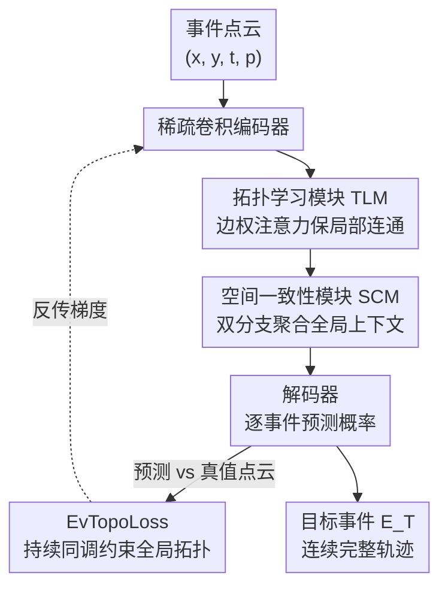

# Towards Persistence: Learning Topological Constraints for Event-based Small Object Detection

**会议**: CVPR 2026  
**论文**: [CVF Open Access](https://openaccess.thecvf.com/content/CVPR2026/html/He_Towards_Persistence_Learning_Topological_Constraints_for_Event-based_Small_Object_Detection_CVPR_2026_paper.html)  
**领域**: 目标检测 / 事件相机 / 小目标检测  
**关键词**: 事件相机、小目标检测、持续同调、拓扑约束、稀疏卷积

## 一句话总结
针对事件相机点云上小目标轨迹容易断裂的问题，本文提出 SpTopoNet，用「拓扑学习模块 + 空间一致性模块」在网络里隐式编码轨迹连通性，再用基于持续同调的 EvTopoLoss 在损失里显式约束轨迹拓扑结构，在 EV-UAV 基准上把 IoU 从 55.18% 拉到 66.62%。

## 研究背景与动机

**领域现状**：小目标检测（SOD）在反无人机等场景里很关键，但传统帧相机受限于 30–60 Hz 的帧率和约 60 dB 动态范围，拍高速小目标会运动模糊、丢时间信息。事件相机（event camera）按像素异步记录亮度变化，时间分辨率高达 $10^6$ Hz、动态范围 120 dB、数据冗余低，天然适合做高速动态感知。当前事件 SOD 的主流是把事件流当成时空点云 $(x, y, t, p)$，用稀疏卷积做逐事件的语义分割来抽取目标。

**现有痛点**：把事件转成稠密帧或体素网格（voxel grid）会破坏事件天生的稀疏性与微秒级时间精度、引入运动模糊和静态背景冗余；而点云类方法虽然保住了稀疏性，却**只做局部邻域特征聚合**，捕捉的是短程模式，忽略了目标运动的**全局轨迹结构**。结果就是检测出来的轨迹断断续续，目标转弯、被遮挡时频繁漏检，时间上不连贯。

**核心矛盾**：小目标外观线索极弱（多数小于 $32\times32$ 像素），运动轨迹又非线性、异步，单靠局部特征根本分不清「真目标的连续轨迹」和「随机散布的背景噪声」。两者在像素层面长得很像，但在拓扑结构上有本质差别。

**切入角度**：作者用**持续同调（persistent homology）**分析发现，目标轨迹在事件点云里是一条连续曲线，对应**稀疏的持久 $H_0$ 特征**（连通分量）和几乎为零的 $H_1$ 特征（环）；而离散无结构的背景噪声对应**密集的 $H_0$ 特征和大量虚假的持久 $H_1$ 环**。也就是说，轨迹的连通性本身就是一个能把目标和噪声区分开的、可量化的结构信号。

**核心 idea**：把拓扑约束同时塞进**网络架构**和**损失函数**两端——架构里用注意力机制隐式保连通性（避免直接算持续同调的高开销），损失里用持续同调显式惩罚断裂和虚假环，逼网络输出连续完整的轨迹。

## 方法详解

### 整体框架

SpTopoNet 接收原始事件点云，输出每个事件的目标/非目标二分类（即逐事件分割）。任务延续事件分割的定义：事件集 $E = E_T \cup E_B \cup E_N$ 分成目标事件 $E_T$（时空连续轨迹）、背景事件 $E_B$（静态背景或相机运动）、噪声 $E_N$（随机散布），目标是从原始流里抽出 $E_T$。

整个网络是 encoder-decoder 范式，核心是两点：一是在编码器各层插入**拓扑学习模块（TLM）**，用边权注意力在局部尺度上保连通性；二是用**空间一致性模块（SCM）**做全局上下文聚合，强化长程轨迹连贯。由于直接在网络里算持续同调代价太高，作者只把持续同调放进损失函数（EvTopoLoss），网络内部则把拓扑「翻译」成高效的图注意力和空间注意力，保证实时推理。

### 关键设计

**1. 拓扑学习模块 TLM：用边权注意力把「谁该和谁相连」写进局部特征**

痛点是非均匀的事件点云上，普通注意力只看特征相似度，分不清空间上紧挨着的真轨迹点和恰好靠近的噪声点。TLM 在标准注意力的打分里额外注入一项**空间边权**：对每个点 $i$ 及其 $k$ 近邻 $N(i)$，注意力权重为

$$\beta_{ij} = \frac{\exp\!\big(Q_i K_j^\top / \sqrt{d_k} + \mathrm{MLP}_{edge}(w_{ij})\big)}{\sum_{k \in N(i)} \exp\!\big(Q_i K_k^\top / \sqrt{d_k} + \mathrm{MLP}_{edge}(w_{ik})\big)}$$

其中 $w_{ij} = 1/\lVert x_i - x_j \rVert_2$ 是反距离编码——越近的点边权越大。把 $\mathrm{MLP}_{edge}(w_{ij})$ 加进 softmax 之前的 logit，等于让模型在算注意力时显式参考「两点的几何邻接强度」，从而沿着轨迹方向优先聚合特征、抑制远处噪声。聚合后接 LayerNorm 和残差连接，再双线性插值上采样回原分辨率。消融显示 TLM 放在浅层（layer 1）增益最大，因为浅层保留了更丰富的空间结构和邻域连通信息，而深层在特征抽象时会丢掉这些细粒度几何细节。

**2. 空间一致性模块 SCM：用全局上下文压住离群点、补长程连贯**

TLM 管的是局部连通，但轨迹的长程一致性（比如目标匀速直线运动这种全局规律）局部注意力管不到，断点和离群仍会出现。SCM 用双分支处理输入特征：上分支做全局平均池化得到全局上下文 $F_{global} = \frac{1}{N}\sum_{i=1}^{N} F_i^{in}$；下分支通过非线性变换生成空间注意力权重，然后用全局上下文去调制每个点的特征：

$$F_i^{out} = F_i^{in} + \lambda \cdot \big(\sigma(W_2 \cdot \mathrm{ReLU}(W_1 F_i^{in})) \odot F_{global}\big)$$

其中 $\sigma$ 是 sigmoid，$\odot$ 是逐元素乘，$\lambda$ 是缩放系数。把全局上下文聚合**以局部特征为条件**（gate 由 $F_i^{in}$ 算出），再用残差加回去，既能保留细节又能抑制离群点。本质是让每个点在做决策时「往全局轨迹分布看一眼」，从而提升时空一致性。消融里 SCM 单独加入也能带来和 TLM 相当的增益，说明全局上下文同样重要。

**3. EvTopoLoss：用持续同调显式惩罚断裂和虚假环**

普通分割用逐像素 BCE 损失 $L_{bce}(p,y) = -[y\log p + (1-y)\log(1-p)]$，它只看逐点分类对不对，**完全感知不到连通性、空洞、聚类这些全局拓扑**。论文用一个很说明问题的例子：单处断裂（b1）和多处断裂（b2）的轨迹，BCE 给出的值完全一样，可它们的拓扑结构天差地别。于是作者基于持续同调构造 EvTopoLoss。先按阈值把预测和真值二值化成点云 $P_{pred} = \{e_i \mid p_i > \tau_{pred}\}$、$P_{true} = \{e_j \mid y_j > \tau_{true}\}$，损失含两个互补项 $L_{evtopo} = L_{betti}^{(d)} + L_{wasserstein}^{(d)}$，$d \in \{0,1\}$ 分别对应连通分量和环。

**Betti 数损失**约束各维拓扑特征的数量对：$L_{betti}^{(d)} = 0.5|\Delta\beta_d|^2$（当 $|\Delta\beta_d| \le 1$）或 $|\Delta\beta_d| - 0.5$（当 $|\Delta\beta_d| > 1$），其中 $\Delta\beta_d = \beta_d(P_{pred}) - \beta_d(P_{true})$，$\beta_d$ 是持续度超过阈值 $\varepsilon$ 的 $d$ 维拓扑特征计数。它一边压住噪声引入的虚假碎片和环（高 $\beta_0$、$\beta_1$），一边惩罚漏检导致的轨迹缺段（低 $\beta_0$）。**Wasserstein 距离损失**则进一步要求这些特征的「显著性分布」也对，通过比较持续图（persistence diagram）：$L_{wasserstein}^{(d)} = \sqrt{\frac{1}{K}\sum_{i=1}^{K} w_i \cdot (\mathrm{pers}_1^{(i)} - \mathrm{pers}_2^{(i)})^2}$，其中 $\mathrm{pers} = \text{death} - \text{birth}$ 衡量每个特征的结构重要性，只保留 top-$K$ 个最持久的特征并用指数衰减权 $w_i$ 偏向显著结构。Betti 管数量对、Wasserstein 管「数量对了但显著性分布也得对」，防止预测出对的连通分量数却结构强度错位。最终 $L_{total} = L_{bce} + \lambda_{topo} L_{evtopo}$，$\lambda_{topo}$ 选 0.05。

**4. 几何感知的主动区域梯度：让持续同调损失既可微又算得起**

持续同调损失天然有两个麻烦：预测点和真值点一一匹配求 Wasserstein 是 $O(n^3)$ 复杂度，而且不可微，没法做梯度优化。作者的观察是**全局最优匹配并不必要，局部梯度分配就够训了**。于是绕过显式匹配，直接给每个预测点分配梯度 $\nabla_\pi L_{evtopo} = \sum_{p \in C(P_f)} \frac{\partial L_{evtopo}}{\partial \pi(p)}$，$C(P_f)$ 是滤波点云里的临界点集。但对大规模点云算所有临界点仍然太贵，于是引入**主动区域机制**：只在决策阈值附近的窄带 $A = \{p_i \mid \tau_{pred} - \delta < \pi(p_i) < \tau_{pred} + \delta\}$ 里算梯度，$\delta$ 是边界宽度。带内每个点的梯度由几何距离决定：

$$\frac{\partial L_{evtopo}}{\partial \pi(p_i)} = \tanh\!\big(2 \cdot (d_{min}^P(p_i) - d_{min}^T(p_i))\big) \cdot \eta$$

其中 $d_{min}^P$、$d_{min}^T$ 分别是 $p_i$ 到预测点云、真值点云的最近距离。含义很直观：离真值近的活跃点得到正梯度被「鼓励保留」，离预测近却远离真值的点被负梯度「抑制剔除」。再对主动区域分批处理（每批 $\le B$）。这样既把计算集中在边界、又用几何距离把梯度导向持久特征及其临界点，避开了完全匹配的高开销和不可微问题。

### 损失函数 / 训练策略
总损失 $L_{total} = L_{bce} + \lambda_{topo} L_{evtopo}$，$\lambda_{topo} = 0.05$。网络训练 50 epoch、batch size 1、Adam 优化器，学习率初始 0.001、每 10 epoch 衰减 0.1。$\tau_{pred} = \tau_{true} = 0.5$ 作为标准二值化阈值，持续同调特征用 Ripser 提取到 $H_1$。单卡 RTX 3090，取验证集最优模型评估。

## 实验关键数据

### 主实验
EV-UAV 基准（147 段序列、2030 万事件，UAV 多种机动 + 多光照多背景，多数目标 $<32\times32$ 像素）。指标：IoU、ACC、检测概率 $P_d$、虚警率 $F_a$。

| 方法 | 表示 | IoU(%)↑ | ACC(%)↑ | $P_d$(%)↑ | $F_a$($10^{-4}$)↓ | 参数 | 运行(ms) |
|------|------|---------|---------|-----------|-------------------|------|----------|
| RVT (CVPR23) | Voxel | 43.21 | 51.38 | 60.35 | 55.68 | 9.9M | 1737 |
| Spike-YOLO (ECCV24) | SNN | 43.94 | 48.26 | 59.62 | 55.38 | 69.0M | 1883 |
| COSeg (CVPR24) | Points | 51.89 | 60.93 | 71.32 | 9.21 | 23.4M | 364 |
| Ev-SpSegNet (ICCV25) | Points | 55.18 | 65.02 | 77.53 | 1.63 | 4.0M | 35.9 |
| **Ours** | Points | **66.62** | **74.43** | **83.36** | **1.29** | 4.4M | 56.5 |

相比此前 SOTA Ev-SpSegNet，IoU 提升 11.44 个点、$P_d$ 提升约 5.83 个点，同时虚警率更低。点云类方法整体在精度和效率上都碾压稠密帧/体素/SNN 方法，本文在点云阵营内再上一个台阶；代价是运行时间从 35.9ms 升到 56.5ms（拓扑模块的额外开销），但仍远快于稠密方法（动辄 1000–3000ms）。

### 消融实验
组件消融（TLM / SCM / $L_{evtopo}$ 逐项叠加）：

| 配置 | IoU(%) | ACC(%) | $P_d$(%) | $F_a$($10^{-4}$) | 说明 |
|------|--------|--------|----------|------------------|------|
| Baseline | 52.77 | 58.41 | 75.15 | 2.31 | 裸骨干 |
| + TLM | 63.32 | 69.50 | 81.01 | 1.73 | 局部拓扑 +10.55 IoU |
| + SCM | 62.50 | 68.98 | 81.68 | 1.49 | 全局上下文，单独也强 |
| + $L_{evtopo}$ | 61.47 | 66.55 | 77.23 | 1.44 | 仅损失也涨 8.7 IoU |
| Full | **66.62** | **74.44** | **83.37** | **1.29** | 三者互补 |

TLM 层位消融：只用 layer 1 即 64.80 IoU（浅层增益最大），layer 1,2,3 组合达 66.62，说明浅层保局部拓扑、深层编码语义，两者互补。$\lambda_{topo}$ 在 0.05 时验证集最优（IoU 67.17），过小（0.01）增益微弱、过大（0.1）收敛困难掉到 54.19。

### 关键发现
- **三个组件各自独立有效**：TLM、SCM、$L_{evtopo}$ 单独加到 baseline 上都能涨 8–11 个 IoU 点，且都能降虚警率，说明「局部连通 + 全局一致 + 损失级拓扑约束」是三条互补的路径，而非冗余。
- **EvTopoLoss 是即插即用的**：把它接到 Ev-SpSegNet、3D-UNet、PointNet++ 三个不同骨干上都有提升（Ev-SpSegNet 上 IoU +8.49、$P_d$ +4.91、$F_a$ 降 21.76%），证明拓扑损失不依赖特定架构，是一个通用的轨迹完整性正则。
- **拓扑约束最大的收益在复杂噪声和多目标场景**：可视化显示 baseline 轨迹严重碎裂，加入拓扑约束后转弯点和遮挡处的连续性明显改善，虚警显著减少。

## 亮点与洞察
- **把「持续同调能区分轨迹和噪声」这个观察落地成了可训练的损失**：$H_0$ 稀疏持久 + $H_1$ 近零是真轨迹的拓扑签名，密集 $H_0$ + 虚假持久 $H_1$ 是噪声签名——这个洞察既直观又能直接转成 Betti + Wasserstein 双损失，是全文最漂亮的「啊哈」点。
- **网络和损失分工很务实**：持续同调算起来贵，作者没有硬塞进网络前向，而是网络里用便宜的边权注意力/全局注意力做「隐式拓扑」、只在损失里用真持续同调做「显式约束」，兼顾了实时推理和拓扑监督。
- **主动区域 + tanh 几何梯度**解决了持续同调损失「$O(n^3)$ 不可微」这个老大难：放弃全局最优匹配、只在阈值边界窄带按到真值/预测的最近距离分配梯度，这套近似可迁移到其他「持续同调当损失」的点云/分割任务。
- **边权注意力里 $1/\lVert x_i - x_j\rVert_2$ 的反距离编码**是个轻量好用的 trick，能把几何邻接强度直接注进 attention logit，适合任何需要「沿结构聚合、压远处噪声」的点云任务。

## 局限与展望
- **数据集单一**：只在 EV-UAV 一个基准上评，作者也承认这是目前唯一的大规模 EVSOD 基准。跨场景（非 UAV、不同传感器）泛化性未验证。
- **拓扑假设依赖「目标轨迹连续」**：方法吃的是「目标在 $(x,y,t)$ 里形成连通流形」这个先验，对于运动极其断续、或多目标轨迹交叉缠绕导致拓扑混叠的情形，Betti/Wasserstein 约束可能反噬，论文未深入讨论。
- **额外开销**：运行时间从 35.9ms 涨到 56.5ms（约 +57%），虽然仍快但对极端实时场景是成本；$\lambda_{topo}$ 对结果敏感（0.05 是甜点，偏一点就掉），调参成本不低。
- **batch size 只能为 1**：受点云规模和持续同调计算限制，训练 batch 很小，可能影响 BN 类统计和训练稳定性，扩展到更大场景时是潜在瓶颈。

## 相关工作与启发
- **vs Ev-SpSegNet（ICCV25，点云 SOTA）**：两者都用稀疏卷积做逐事件分割，Ev-SpSegNet 聚焦局部邻域聚合，本文在它之上补了「全局轨迹拓扑」这一层——网络里加 TLM/SCM、损失里加持续同调约束，把 IoU 从 55.18 提到 66.62，核心区别是从「局部特征」升级到「局部+全局拓扑结构」。
- **vs 稠密/体素方法（RVT、Spike-YOLO 等）**：它们把事件 densify 成帧或体素后套用 CNN/SNN/Transformer，牺牲了微秒级时间精度且引入运动模糊和背景冗余；本文走纯稀疏点云路线，精度和效率都更优。
- **vs 图像域拓扑分割损失（TopoLoss、TopoSeg、Betti matching 等）**：以往拓扑损失只用特征的 birth-death 时间做匹配、忽略空间几何位置，在自带空间坐标的事件点云上会产生严重匹配歧义，且持续同调本身复杂度高；本文用**几何感知梯度 + 主动区域机制**专门解决这两个痛点，把拓扑损失真正用到了大规模事件点云上。

## 评分
- 新颖性: ⭐⭐⭐⭐⭐ 首次把持续同调同时用进事件 SOD 的网络架构和损失，且解决了拓扑损失在事件点云上的可微与效率问题
- 实验充分度: ⭐⭐⭐⭐ 对比/消融/层位/权重/跨骨干都做了，但只在单一基准 EV-UAV 上评测
- 写作质量: ⭐⭐⭐⭐ 动机用持续同调可视化讲得很清楚，公式完整，方法逻辑顺；个别符号略密
- 价值: ⭐⭐⭐⭐⭐ EvTopoLoss 即插即用对多骨干都涨点，反 UAV 等高速小目标场景实用价值高

<!-- RELATED:START -->

## 相关论文

- [\[CVPR 2026\] Spike-driven Discrete Aggregation for Event-based Object Detection](spike-driven_discrete_aggregation_for_event-based_object_detection.md)
- [\[CVPR 2026\] BDNet: Bio-Inspired Dual-Backbone Small Object Detection Network](bdnetbio-inspired_dual-backbone_small_object_detection_network.md)
- [\[CVPR 2026\] CHAL: Causal-guided Hierarchical Anomaly-aware Learning for Moving Infrared Small Target Detection](chal_causal-guided_hierarchical_anomaly-aware_learning_for_moving_infrared_small.md)
- [\[CVPR 2026\] Beyond Duality: A Hybrid Framework of Leveraging Shared and Private Features for RGB-Event Object Detection](beyond_duality_a_hybrid_framework_of_leveraging_shared_and_private_features_for_.md)
- [\[CVPR 2026\] From Detection to Association: Learning Discriminative Object Embeddings for Multi-Object Tracking](from_detection_to_association_learning_discriminative_object_embeddings_for_mult.md)

<!-- RELATED:END -->
